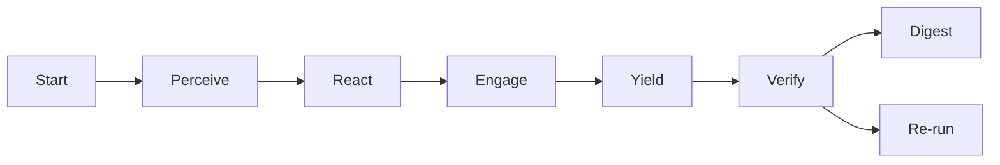

## Using the Crew AI pilot (Swarm attempt 1)

This repo includes a minimal, parser-safe Crew AI pilot that runs two parallel PREY lanes with OBSIDIAN roles and logs receipts to the blackboard.

- Roles per lane
  - Perceive → Observer
  - React → Bridger
  - Engage → Shaper
  - Yield → Assimilator
  - Post-lane checks → Immunizer and Disruptor (quorum verify)

- What it does
  - Reads a daily mission intent (v5) that encodes safety, quorum verify, and telemetry defaults.
  - Executes lanes in parallel with PREY; logs receipts to `hfo_blackboard/obsidian_synapse_blackboard.jsonl`.
  - Emits simple OpenTelemetry-like spans to `temp/otel/trace-*.jsonl`.
  - Makes at most one small, bounded LLM call during Engage per lane (optional; skips if no key).

- Prerequisites (local)
  - `.env` at repo root with `OPENROUTER_API_KEY` (optional for no-cost dry-runs) and optional `OPENROUTER_MODEL_HINT` (e.g., `haiku`).
  - Python environment with dependencies from `requirements.txt`.
  - Model allowlist (enforced):
    - Default priority: `openai/gpt-oss-120b`
    - Also allowed for testing: `deepseek/deepseek-chat-v3-0324`, `qwen/qwen3-235b-a22b-2507`, `x-ai/grok-code-fast-1`, `openai/gpt-oss-20b`
    - If `OPENROUTER_MODEL_HINT` is not one of the above, the system falls back to `openai/gpt-oss-120b`.

- Run
  - Concurrency: lanes execute in parallel (thread pool) and emit OTEL spans per phase/agent and per-lane LLM call.
  - Optional model hint (must be in the allowlist) is supported via env.

```bash
# default (no hint): uses openai/gpt-oss-120b
python3 scripts/crew_ai/runner.py \
  --intent hfo_mission_intent/2025-10-30/mission_intent_daily_2025-10-30.v5.yml

# or select an allowed model explicitly
OPENROUTER_MODEL_HINT=deepseek/deepseek-chat-v3-0324 \
  python3 scripts/crew_ai/runner.py \
  --intent hfo_mission_intent/2025-10-30/mission_intent_daily_2025-10-30.v5.yml
```

- Outputs
  - Blackboard receipts: `hfo_blackboard/obsidian_synapse_blackboard.jsonl`
  - Spans: `temp/otel/trace-*.jsonl`
  - Verify quorum: recorded in blackboard with votes and threshold

- Safety and cost guards
  - Bounded tokens and allowlisted models for Engage LLM calls; presence-only secret audit (never logs key).
  - Chunk-size limit (≤200 lines per write), placeholder ban, canary-first, measurable tripwires, explicit revert.

- Verifying lanes and model selection
  - Check parallelism and LLM model in spans:
    - Spans file: `temp/otel/trace-*.jsonl` with entries like `name: lane_a:engage_llm` and attributes `model`, `latency_ms`.
    - Helper tool: `scripts/crew_ai/analyze_traces.py` prints lane windows and "Parallel detected: True/False".
      ```bash
      python3 scripts/crew_ai/analyze_traces.py temp/otel/<trace-file>.jsonl
      ```
  - Quick LLM math sanity check (low token cost):
    ```bash
    # defaults to gpt-oss-120b; or set an allowed OPENROUTER_MODEL_HINT
    python3 scripts/crew_ai/math_bench.py
    ```

- References
  - Mission intent: `hfo_mission_intent/2025-10-30/mission_intent_daily_2025-10-30.v5.yml`
  - Crew README: `scripts/crew_ai/README.md`
  - Runner: `scripts/crew_ai/runner.py`
  - Trace analyzer: `scripts/crew_ai/analyze_traces.py`
  - Math sanity bench: `scripts/crew_ai/math_bench.py`

# AGENTS.md — Operating Guide for Agents in Hive Fleet Obsidian (Gen21)

This lightweight guide tells any agent (workers, tools, scripts, LLMs) how to act in this repo so behavior aligns with the Gen21 SSOT. If you do one thing: follow PREY, log receipts to the blackboard, and don’t talk to the human directly.

## At a glance

### BLUF
- Speak through the Swarmlord facade only; never prompt the human mid-loop.
- Use PREY as the canonical loop: Perceive → React → Engage → Yield.
- Enforce the safety envelope: canary first, measurable tripwires, explicit revert.
- Append receipts to the blackboard JSONL for every material action (with evidence_refs).
- Nothing persists or ships until an independent Verify PASS.

### Matrix (TL;DR)
| Topic | You do | Tooling | Gate |
|---|---|---|---|
| Interface | Swarmlord-only facade | Ops section (Swarmlord) | Required |
| Workflow | HIVE → GROWTH → SWARM → PREY | Gen21 mappings | Required |
| Safety | Canary • Tripwires • Revert | Line counts, placeholder scan | Required |
| Evidence | Append JSONL receipts | hfo_blackboard/…/blackboard.jsonl | Required |
| Chunking | ≤200 lines per write | line_count tripwire | Required |
| Verify | Independent PASS before persist | Verify checklist | Hard gate |

### Diagram
```mermaid
graph TD
  subgraph Context
    H[HIVE] --> G[GROWTH]
    G --> S[SWARM]
    S --> P[PREY]
  end
  MI[Mission Intent (Z)] --> P
  P --> V[Verify (independent)]
  V -->|PASS| PS[Persist & Digest]
  V -->|FAIL| RG[Re-run chunk]
  P -.-> BB[(Blackboard JSONL)]
  V -.-> BB
```

### Contents
- [Core principles](#core-principles)
- [Workflow map (keep these labels)](#workflow-map-keep-these-labels)
- [Agent contract (tiny)](#agent-contract-tiny)
- [Blackboard protocol (append-only JSONL)](#blackboard-protocol-append-only-jsonl)
- [PREY loop for agents (how to act)](#prey-loop-for-agents-how-to-act)
- [Safety envelope (operational)](#safety-envelope-operational)
- [Verify gate (independent)](#verify-gate-independent)
- [Prompts policy (no babysitting)](#prompts-policy-no-babysitting)
- [Quickstart for a new agent](#quickstart-for-a-new-agent)
- [Paths and artifacts](#paths-and-artifacts)
- [Acronyms quick reference](#acronyms-quick-reference)

## Core principles

- Sole interface: Only the Swarmlord facade speaks to the human once online. Workers never prompt the human mid-loop.
- Canonical workflow: PREY terms are mandatory in code/docs/logs.
- Safety envelope: Canary first; tripwires measurable; must have a revert plan.
- Evidence discipline: Every material action gets a blackboard JSONL receipt with evidence_refs.
- Chunking: Write in chunks of ≤200 lines; enforce line_count tripwires; avoid truncation.
- Verify gate: Nothing persists or ships until Verify PASS. Verify is independent of the authoring step.
- Placeholder ban: Don’t leave TODO/…/omitted in committed artifacts.

## Workflow map (keep these labels)

- HIVE = Double Diamond + Meta-Evolution
  - Discover → Define → Develop → Deliver overlaid with Gen19 H.I.V.E: Hunt → Integrate → Verify → Evolve
- GROWTH = F3EAD
  - Find → Fix → Finish → Exploit → Analyze → Disseminate (aka “Harvest”)
- SWARM = D3A + Mutate
  - Decide → Detect → Deliver → Assess → Mutate (maintain a quality-diverse portfolio)
- PREY = Sense → Make Sense → Act → Yield (canonical)
  - In repo terms: Perceive → React → Engage → Yield

## Agent contract (tiny)

- Inputs: mission_intent (UTC Z), relevant repo files, blackboard path, chunk plan, safety limits.
- Outputs: artifacts (code/docs/config), blackboard receipts, optional review bundles.
- Success: Tripwires not tripped; Verify PASS; receipts include evidence_refs; chunk limits respected; no human prompts.
- Failure: Any tripwire hit; placeholder left; invalid JSON receipt; missing evidence_refs. Set regen_flag, shrink chunk, narrow scope, and continue.

## Blackboard protocol (append-only JSONL)

- File: `hfo_blackboard/obsidian_synapse_blackboard.jsonl`
- One JSON object per line. Do not edit previous lines. Never rewrite history.
- Required fields:
  - mission_id: string
  - phase: string (e.g., perceive, react, engage, yield, verify, digest)
  - summary: short human-readable description
  - evidence_refs: array of strings (paths, line ranges, hashes, or report IDs)
  - safety_envelope: object (chunk_size_max, line_target_min, tripwire status)
  - blocked_capabilities: array of strings (e.g., "network", "npm", "pip")
  - timestamp: ISO 8601 Z
- Optional fields:
  - chunk_id: { index:int, total:int }
  - regen_flag: boolean (true if regenerating after a FAIL)

Example: engage receipt
```json
{"mission_id":"gem21_gpt5_attempt3_2025-10-29","phase":"engage","summary":"Wrote AGENTS.md draft (chunk 1)","evidence_refs":["AGENTS.md:1-120"],"safety_envelope":{"chunk_size_max":200,"line_target_min":1000},"blocked_capabilities":[],"timestamp":"2025-10-29T16:00:00Z","chunk_id":{"index":1,"total":1},"regen_flag":false}
```

Example: verify PASS receipt
```json
{"mission_id":"gem21_gpt5_attempt3_2025-10-29","phase":"verify","summary":"AGENTS.md Verify PASS: lint/render ok, no placeholders","evidence_refs":["verify_report:ok"],"timestamp":"2025-10-29T16:05:00Z"}
```

## PREY loop for agents (how to act)

- Perceive
  - Read mission intent (Z) and scan the repo for relevant context.
  - Capture constraints and targets (line counts, chunk size, policies) in a receipt.
- React
  - Classify domain/complexity; pick approach; plan chunk size ≤200; define tripwires.
  - Append a react receipt with chunk plan and safety parameters.
- Engage
  - Do the work in planned chunks. After each chunk, check line_count and placeholder bans.
  - Append an engage receipt with evidence_refs to files/lines/hashes.
- Yield
  - Assemble outputs into a review bundle; request Verify; append a yield receipt.

Gate policy: PASS → persist/digest; FAIL → set regen_flag, shrink chunk, narrow scope, repeat PREY.

## Safety envelope (operational)

- Canary: Start with limited scope; prefer dry-runs and linters before large writes.
- Tripwires (examples):
  - line_count < 0.9× target
  - placeholders found ("TODO", "...", "omitted")
  - tests or policy checks fail
  - missing evidence_refs in material actions
- Revert: Restore last good artifact or the known-good baseline; reduce chunk size; try again.

## Verify gate (independent)

- Don’t claim done without Verify PASS. Keep authoring and verification logically separate.
- Quick checklist:
  - No placeholders
  - Chunk limits respected (≤200 lines per write)
  - Mermaid/markdown render (if applicable)
  - JSON receipts valid and complete
  - Canary/tripwires/revert status recorded

## Prompts policy (no babysitting)

- Workers do not prompt the human mid-loop. All dialogue goes through the Swarmlord facade.
- If you detect a worker→human prompt attempt, log a tripwire receipt with regen_flag=true and continue autonomously.

## Quickstart for a new agent

1) Read these SSOT sections for context: 3 (workflow map), 5 (blackboard), 8 (Swarmlord Ops), 12 (evidence/receipts), 17 (procedures), 25 (end-to-end).
2) Set a chunk plan (≤200 lines). Define your tripwires.
3) Append a Perceive receipt with mission_id and safety plan.
4) Run PREY loop. After each chunk, append an Engage receipt with evidence_refs.
5) On Yield, request Verify and wait for PASS before persistence/digest claims.

## Paths and artifacts

- Mission intent (Z): `hfo_mission_intent/mission_intent_YYYY-MM-DD.yml`
- Blackboard JSONL: `hfo_blackboard/obsidian_synapse_blackboard.jsonl`
- SSOT (reference): `hfo_gem/gen_21/gpt5-attempt-3-gem.md`

- PettingZoo verification wrapper:
  - Path: `scripts/run_pz_simple_tag_random.sh`
  - Purpose: Run MPE simple_tag_v3 random-vs-random verification and write a JSON results file under `hfo_petting_zoo_results/`.
  - Usage:
    - Default (100 episodes, seed 42): `bash scripts/run_pz_simple_tag_random.sh`
    - Custom: `bash scripts/run_pz_simple_tag_random.sh <episodes> <seed> [outdir]`
  - Output: Prints metrics and saves `simple_tag_v3_random-vs-random_<TIMESTAMP>_seed<seed>_eps<episodes>.json` in the outdir.

- 2x2 Random and Heuristic test:
  - Path: `scripts/run_pz_simple_tag_matrix.sh`
  - Purpose: Run a 2×2 matrix on MPE simple_tag_v3 with continuous actions: RvsR, HvsR, RvsH, HvsH.
  - Usage:
    - Default (100 episodes, seed 42): `bash scripts/run_pz_simple_tag_matrix.sh`
    - Custom: `bash scripts/run_pz_simple_tag_matrix.sh <episodes> <seed> [outdir]`
  - Output: Prints per-cell metrics and saves `simple_tag_v3_matrix_<TIMESTAMP>_seed<seed>_eps<episodes>.json` in the outdir.

- 2x2 Animated GIF generator:
  - Path: `scripts/run_pz_make_matrix_gif.sh`
  - Purpose: Produce a 2×2 looping GIF (RvsR, HvsR, RvsH, HvsH) with headers and ep/step overlays for quick visual inspection.
  - Usage:
    - Default (3 episodes/cell, seed 42, 25 cycles/ep): `bash scripts/run_pz_make_matrix_gif.sh`
    - Custom: `bash scripts/run_pz_make_matrix_gif.sh <seed> <max_cycles> <duration_ms>`
  - Output: Writes to dated folder `hfo_petting_zoo_results/YYYY-MM-DD/` with name `simple_tag_v3_matrix_<TS>_seed<seed>_eps3.gif`.

## Acronyms quick reference

- D3A — Decide, Detect, Deliver, Assess
- F3EAD — Find, Fix, Finish, Exploit, Analyze, Disseminate (aka “Harvest”)
- H.I.V.E — Hunt, Integrate, Verify, Evolve (Double Diamond overlay)
- QD — Quality Diversity (maintain diverse, high-fitness solutions)

---

BLUF for agents: Use PREY, log to blackboard, respect chunk/tripwires, never ping the human, and don’t ship before Verify PASS. Align labels with HIVE/GROWTH/SWARM/PREY to stay in-family with Gen21.

## Diagram rendering (Mermaid) — parser-safe conventions

To keep diagrams rendering across strict Mermaid parsers and various viewers:

- Prefer `graph LR` or `graph TB` over `flowchart`.
- Keep node labels simple: avoid parentheses `()`, plus `+`, semicolons `;`, pipes `|`, and other punctuation in labels. Use plain words instead.
- Avoid Unicode symbols in labels (e.g., ≥, →). Prefer ASCII words (e.g., "minimum 3 passes", "to").
- Do not use edge labels like `-- PASS -->`. Instead, create explicit nodes (e.g., `PASS`) or describe logic in prose.
- Split chained edges into single steps (one arrow per line) for clarity and compatibility.
- When using `subgraph`, always close with `end` and keep indentation consistent.
- Wrap diagrams in triple backticks with `mermaid` for proper highlighting.

Minimal safe template:



Note: If a renderer still errors, simplify labels further and remove punctuation; then log a receipt to the blackboard with the evidence refs to the affected file and lines.

## Crew AI swarm — E2E handoff note (2025-10-30)

- Status
  - Parallel PREY lanes operational at N=10 (thread pool). Verified via span overlap analysis.
  - LLM mode: model-hint sensitivity observed. qwen hint passed 10/10; oss-120b returned empty content in this environment for math micro-tasks.
- Artifacts
  - Digest: `hfo_crew_ai_swarm_results/2025-10-30/run-1761850703499/swarmlord_digest.md`
  - Spans: `temp/otel/trace-swarm_math-1761850703499.jsonl`
  - Intent: `hfo_mission_intent/2025-10-30/mission_intent_parallel_10lanes_2025-10-30.v1.yml`
- How to validate quickly
  - Check spans for per-lane engage windows; analyzer should report Parallel detected: True.
  - Inspect digest for per-lane yields, verify counts, and quorum/thresholds.
- Safety & receipts
  - Chunk limit ≤200 lines for docs; append-only JSONL receipts with evidence_refs.
  - No placeholders in committed artifacts; revert by removing the last JSONL line if a malformed append occurs.
- Next tweaks (low risk)
  - Harden client parsing for oss-120b: multi-shape content parsing and retry-on-empty; optional response_format JSON when supported.
  - Add optional CSV/metrics: wall-clock vs. sum speedup and pass/fail tallies per run.

