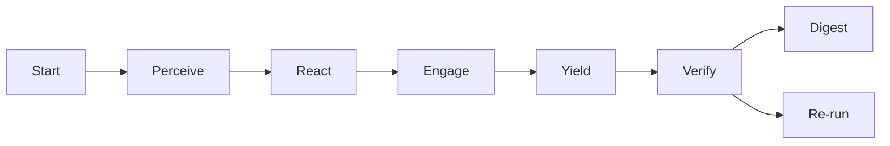

## Using the Crew AI pilot (Swarm attempt 1)

This repo includes a minimal, parser-safe Crew AI pilot that runs two parallel PREY lanes with OBSIDIAN roles and logs receipts to the blackboard.

- Roles per lane
  - Perceive → Observer
  - React → Bridger
  - Engage → Shaper
  - Yield → Assimilator
  - Post-lane checks → Immunizer and Disruptor (quorum verify)

- What it does
  - Reads a daily mission intent (v5) that encodes safety, quorum verify, and telemetry defaults.
  - Executes lanes in parallel with PREY; logs receipts to `hfo_blackboard/obsidian_synapse_blackboard.jsonl`.
  - Emits simple OpenTelemetry-like spans to `temp/otel/trace-*.jsonl`.
  - Makes at most one small, bounded LLM call during Engage per lane (optional; skips if no key).

- Prerequisites (local)
  - `.env` at repo root with `OPENROUTER_API_KEY` (optional for no-cost dry-runs) and optional `OPENROUTER_MODEL_HINT` (e.g., `haiku`).
  - Python environment with dependencies from `requirements.txt`.
  - Model allowlist (enforced)
    - openai/gpt-5-mini
    - minimax/minimax-m2
    - openai/gpt-oss-120b
    - openai/gpt-oss-20b
    - x-ai/grok-4-fast
    - deepseek/deepseek-v3.2-exp
    - qwen/qwen3-235b-a22b-2507
  - Note: z-ai/glm-4.6 is temporarily removed due to failing strict integer math sanity; we’ll revisit after tuning.

- Run
  - Concurrency: lanes execute in parallel (thread pool) and emit OTEL spans per phase/agent and per-lane LLM call.
  - Optional model hint (must be in the allowlist) is supported via env.

```bash
# default (no hint): uses openai/gpt-oss-120b
python3 scripts/crew_ai/runner_unified.py \
  --intent hfo_mission_intent/2025-10-30/mission_intent_daily_2025-10-30.v5.yml

# or select an allowed model explicitly
OPENROUTER_MODEL_HINT=deepseek/deepseek-chat-v3-0324 \
  python3 scripts/crew_ai/runner_unified.py \
  --intent hfo_mission_intent/2025-10-30/mission_intent_daily_2025-10-30.v5.yml
```

- Outputs
  - Blackboard receipts: `hfo_blackboard/obsidian_synapse_blackboard.jsonl`
  - Spans: `temp/otel/trace-*.jsonl`
  - Verify quorum: recorded in blackboard with votes and threshold

- Safety and cost guards
  - Bounded tokens and allowlisted models for Engage LLM calls; presence-only secret audit (never logs key).
  - Chunk-size limit (≤200 lines per write), placeholder ban, canary-first, measurable tripwires, explicit revert.
  - Reasoning policy (default): If the selected model supports a reasoning control, automatically enable reasoning with high effort unless mission intent or env overrides it. Override via mission `llm.reasoning`/`llm.reasoning_effort` or env `OPENROUTER_REASONING`/`OPENROUTER_REASONING_EFFORT`.
  - Compatibility fallback: If a provider rejects the reasoning field, the client retries once without reasoning to avoid hard failures; override via mission/env if you need to force reasoning on/off for a run.

- Verifying lanes and model selection
  - Check parallelism and LLM model in spans:
    - Spans file: `temp/otel/trace-*.jsonl` with entries like `name: lane_a:engage_llm` and attributes `model`, `latency_ms`.
    - Engage spans also record `reasoning_enabled`, `reasoning_effort`, and `reasoning_removed_on_retry` for audit.
    - Helper tool: `scripts/crew_ai/analyze_traces.py` prints lane windows and "Parallel detected: True/False".
      ```bash
      python3 scripts/crew_ai/analyze_traces.py temp/otel/<trace-file>.jsonl
      ```
  - Quick LLM math sanity check (low token cost):
    ```bash
    # defaults to gpt-oss-120b; or set an allowed OPENROUTER_MODEL_HINT
    python3 scripts/crew_ai/math_bench.py
    ```

### Handoff: test with tightened model allowlist and reasoning-high

- Allowlist in effect (enforced):
  - openai/gpt-5-mini, minimax/minimax-m2, openai/gpt-oss-120b, openai/gpt-oss-20b, x-ai/grok-4-fast, deepseek/deepseek-v3.2-exp, qwen/qwen3-235b-a22b-2507
- Defaults:
  - Reasoning auto-enabled at high effort for supported models (gpt-5-mini, grok-4-fast, deepseek v3.2, minimax m2) unless overridden.
  - To force a specific model for a quick run: set `OPENROUTER_MODEL_HINT` to a substring of one allowlisted model.
- Run pilot and validate locally (optional):
  - Pilot: `python scripts/crew_ai/runner_unified.py --intent hfo_mission_intent/2025-10-30/mission_intent_daily_2025-10-30.v5.yml`
  - Validate: `python scripts/crew_ai/validate_run.py --require-parallel`

- References
  - Mission intent: `hfo_mission_intent/2025-10-30/mission_intent_daily_2025-10-30.v5.yml`
  - Crew README: `scripts/crew_ai/README.md`
  - Runner: `scripts/crew_ai/runner_unified.py`
  - Trace analyzer: `scripts/crew_ai/analyze_traces.py`
  - Math sanity bench: `scripts/crew_ai/math_bench.py`

# AGENTS.md — Operating Guide for Agents in Hive Fleet Obsidian (Gen21)

This lightweight guide tells any agent (workers, tools, scripts, LLMs) how to act in this repo so behavior aligns with the Gen21 SSOT. If you do one thing: follow PREY, log receipts to the blackboard, and don’t talk to the human directly.

## At a glance

### BLUF
- Speak through the Swarmlord facade only; never prompt the human mid-loop.
- Use PREY as the canonical loop: Perceive → React → Engage → Yield.
- Enforce the safety envelope: canary first, measurable tripwires, explicit revert.
- Append receipts to the blackboard JSONL for every material action (with evidence_refs).
- Nothing persists or ships until an independent Verify PASS.

### Matrix (TL;DR)
| Topic | You do | Tooling | Gate |
|---|---|---|---|
| Interface | Swarmlord-only facade | Ops section (Swarmlord) | Required |
| Workflow | HIVE → GROWTH → SWARM → PREY | Gen21 mappings | Required |
| Safety | Canary • Tripwires • Revert | Line counts, placeholder scan | Required |
| Evidence | Append JSONL receipts | hfo_blackboard/…/blackboard.jsonl | Required |
| Chunking | ≤200 lines per write | line_count tripwire | Required |
| Verify | Independent PASS before persist | Verify checklist | Hard gate |

### Diagram
```mermaid
graph TD
  subgraph Context
    H[HIVE] --> G[GROWTH]
    G --> S[SWARM]
    S --> P[PREY]
  end
  MI[Mission Intent (Z)] --> P
  P --> V[Verify (independent)]
  V -->|PASS| PS[Persist & Digest]
  V -->|FAIL| RG[Re-run chunk]
  P -.-> BB[(Blackboard JSONL)]
  V -.-> BB
```

### Contents
- [Core principles](#core-principles)
- [Workflow map (keep these labels)](#workflow-map-keep-these-labels)
- [Agent contract (tiny)](#agent-contract-tiny)
- [Blackboard protocol (append-only JSONL)](#blackboard-protocol-append-only-jsonl)
- [PREY loop for agents (how to act)](#prey-loop-for-agents-how-to-act)
- [Safety envelope (operational)](#safety-envelope-operational)
- [Verify gate (independent)](#verify-gate-independent)
- [Prompts policy (no babysitting)](#prompts-policy-no-babysitting)
- [Quickstart for a new agent](#quickstart-for-a-new-agent)
- [Paths and artifacts](#paths-and-artifacts)
- [Acronyms quick reference](#acronyms-quick-reference)

## Core principles

- Sole interface: Only the Swarmlord facade speaks to the human once online. Workers never prompt the human mid-loop.
- Canonical workflow: PREY terms are mandatory in code/docs/logs.
- Safety envelope: Canary first; tripwires measurable; must have a revert plan.
- Evidence discipline: Every material action gets a blackboard JSONL receipt with evidence_refs.
- Chunking: Write in chunks of ≤200 lines; enforce line_count tripwires; avoid truncation.
- Verify gate: Nothing persists or ships until Verify PASS. Verify is independent of the authoring step.
- Placeholder ban: Don’t leave TODO/…/omitted in committed artifacts.

## Workflow map (keep these labels)

- HIVE = Double Diamond + Meta-Evolution
  - Discover → Define → Develop → Deliver overlaid with Gen19 H.I.V.E: Hunt → Integrate → Verify → Evolve
- GROWTH = F3EAD
  - Find → Fix → Finish → Exploit → Analyze → Disseminate (aka “Harvest”)
- SWARM = D3A + Mutate
  - Decide → Detect → Deliver → Assess → Mutate (maintain a quality-diverse portfolio)
- PREY = Sense → Make Sense → Act → Yield (canonical)
  - In repo terms: Perceive → React → Engage → Yield

## Agent contract (tiny)

- Inputs: mission_intent (UTC Z), relevant repo files, blackboard path, chunk plan, safety limits.
- Outputs: artifacts (code/docs/config), blackboard receipts, optional review bundles.
- Success: Tripwires not tripped; Verify PASS; receipts include evidence_refs; chunk limits respected; no human prompts.
- Failure: Any tripwire hit; placeholder left; invalid JSON receipt; missing evidence_refs. Set regen_flag, shrink chunk, narrow scope, and continue.

## Blackboard protocol (append-only JSONL)

- File: `hfo_blackboard/obsidian_synapse_blackboard.jsonl`
- One JSON object per line. Do not edit previous lines. Never rewrite history.
- Required fields:
  - mission_id: string
  - phase: string (e.g., perceive, react, engage, yield, verify, digest)
  - summary: short human-readable description
  - evidence_refs: array of strings (paths, line ranges, hashes, or report IDs)
  - safety_envelope: object (chunk_size_max, line_target_min, tripwire status)
  - blocked_capabilities: array of strings (e.g., "network", "npm", "pip")
  - timestamp: ISO 8601 Z
- Optional fields:
  - chunk_id: { index:int, total:int }
  - regen_flag: boolean (true if regenerating after a FAIL)

Example: engage receipt
```json
{"mission_id":"gem21_gpt5_attempt3_2025-10-29","phase":"engage","summary":"Wrote AGENTS.md draft (chunk 1)","evidence_refs":["AGENTS.md:1-120"],"safety_envelope":{"chunk_size_max":200,"line_target_min":1000},"blocked_capabilities":[],"timestamp":"2025-10-29T16:00:00Z","chunk_id":{"index":1,"total":1},"regen_flag":false}
```

Example: verify PASS receipt
```json
{"mission_id":"gem21_gpt5_attempt3_2025-10-29","phase":"verify","summary":"AGENTS.md Verify PASS: lint/render ok, no placeholders","evidence_refs":["verify_report:ok"],"timestamp":"2025-10-29T16:05:00Z"}
```

## PREY loop for agents (how to act)

- Perceive
  - Read mission intent (Z) and scan the repo for relevant context.
  - Capture constraints and targets (line counts, chunk size, policies) in a receipt.
- React
  - Classify domain/complexity; pick approach; plan chunk size ≤200; define tripwires.
  - Append a react receipt with chunk plan and safety parameters.
- Engage
  - Do the work in planned chunks. After each chunk, check line_count and placeholder bans.
  - Append an engage receipt with evidence_refs to files/lines/hashes.
- Yield
  - Assemble outputs into a review bundle; request Verify; append a yield receipt.

Gate policy: PASS → persist/digest; FAIL → set regen_flag, shrink chunk, narrow scope, repeat PREY.

## Safety envelope (operational)

- Canary: Start with limited scope; prefer dry-runs and linters before large writes.
- Tripwires (examples):
  - line_count < 0.9× target
  - placeholders found ("TODO", "...", "omitted")
  - tests or policy checks fail
  - missing evidence_refs in material actions
- Revert: Restore last good artifact or the known-good baseline; reduce chunk size; try again.

## Verify gate (independent)

- Don’t claim done without Verify PASS. Keep authoring and verification logically separate.
- Quick checklist:
  - No placeholders
  - Chunk limits respected (≤200 lines per write)
  - Mermaid/markdown render (if applicable)
  - JSON receipts valid and complete
  - Canary/tripwires/revert status recorded

## Prompts policy (no babysitting)

- Workers do not prompt the human mid-loop. All dialogue goes through the Swarmlord facade.
- If you detect a worker→human prompt attempt, log a tripwire receipt with regen_flag=true and continue autonomously.

## Quickstart for a new agent

1) Read these SSOT sections for context: 3 (workflow map), 5 (blackboard), 8 (Swarmlord Ops), 12 (evidence/receipts), 17 (procedures), 25 (end-to-end).
2) Set a chunk plan (≤200 lines). Define your tripwires.
3) Append a Perceive receipt with mission_id and safety plan.
4) Run PREY loop. After each chunk, append an Engage receipt with evidence_refs.
5) On Yield, request Verify and wait for PASS before persistence/digest claims.

## Paths and artifacts

- Mission intent (Z): `hfo_mission_intent/mission_intent_YYYY-MM-DD.yml`
- Blackboard JSONL: `hfo_blackboard/obsidian_synapse_blackboard.jsonl`
- SSOT (reference): `hfo_gem/gen_21/gpt5-attempt-3-gem.md`

### PREY per-step artifacts and validator (pilot)

- Run directory (per PREY run): `hfo_crew_ai_swarm_results/YYYY-MM-DD/run-<ts>/`
  - `mission_pointer.yml` — run-level pointer to the mission intent plus lane/quorum/telemetry config.
  - `<lane_name>/attempt_1/` — lane output directory containing four artifacts:
    - `perception_snapshot.yml` — mission_id, lane, timestamp, trace_id, safety, llm, paths.
    - `react_plan.yml` — cynefin rationale, approach with tripwires and quorum settings.
    - `engage_report.yml` — actions performed under safety, LLM call metadata (if any).
    - `yield_summary.yml` — collected agents, evidence_refs (must include the three core artifacts).
  - `swarmlord_digest.md` — BLUF, lane↔model matrix, parser-safe Mermaid diagram, and a Trace pointer.

- Validator (lane-level, post-Yield): ensures all four artifacts exist with minimal fields and that `yield_summary.evidence_refs` references `perception_snapshot.yml`, `react_plan.yml`, and `engage_report.yml`. Its PASS contributes a vote in Verify quorum.

- CI gate (repo): a workflow runs the pilot, validates JSON/JSONL (including the blackboard), checks per-lane artifacts and digest, and asserts span-level parallelism using `scripts/crew_ai/analyze_traces.py`.

- PettingZoo verification wrapper:
  - Path: `scripts/run_pz_simple_tag_random.sh`
  - Purpose: Run MPE simple_tag_v3 random-vs-random verification and write a JSON results file under `hfo_petting_zoo_results/`.
  - Usage:
    - Default (100 episodes, seed 42): `bash scripts/run_pz_simple_tag_random.sh`
    - Custom: `bash scripts/run_pz_simple_tag_random.sh <episodes> <seed> [outdir]`
  - Output: Prints metrics and saves `simple_tag_v3_random-vs-random_<TIMESTAMP>_seed<seed>_eps<episodes>.json` in the outdir.

- 2x2 Random and Heuristic test:
  - Path: `scripts/run_pz_simple_tag_matrix.sh`
  - Purpose: Run a 2×2 matrix on MPE simple_tag_v3 with continuous actions: RvsR, HvsR, RvsH, HvsH.
  - Usage:
    - Default (100 episodes, seed 42): `bash scripts/run_pz_simple_tag_matrix.sh`
    - Custom: `bash scripts/run_pz_simple_tag_matrix.sh <episodes> <seed> [outdir]`
  - Output: Prints per-cell metrics and saves `simple_tag_v3_matrix_<TIMESTAMP>_seed<seed>_eps<episodes>.json` in the outdir.

- 2x2 Animated GIF generator:
  - Path: `scripts/run_pz_make_matrix_gif.sh`
  - Purpose: Produce a 2×2 looping GIF (RvsR, HvsR, RvsH, HvsH) with headers and ep/step overlays for quick visual inspection.
  - Usage:
    - Default (3 episodes/cell, seed 42, 25 cycles/ep): `bash scripts/run_pz_make_matrix_gif.sh`
    - Custom: `bash scripts/run_pz_make_matrix_gif.sh <seed> <max_cycles> <duration_ms>`
  - Output: Writes to dated folder `hfo_petting_zoo_results/YYYY-MM-DD/` with name `simple_tag_v3_matrix_<TS>_seed<seed>_eps3.gif`.

## Acronyms quick reference

- D3A — Decide, Detect, Deliver, Assess
- F3EAD — Find, Fix, Finish, Exploit, Analyze, Disseminate (aka “Harvest”)
- H.I.V.E — Hunt, Integrate, Verify, Evolve (Double Diamond overlay)
- QD — Quality Diversity (maintain diverse, high-fitness solutions)

---

BLUF for agents: Use PREY, log to blackboard, respect chunk/tripwires, never ping the human, and don’t ship before Verify PASS. Align labels with HIVE/GROWTH/SWARM/PREY to stay in-family with Gen21.

## Mission intent precondition and guards (Gen21)

- Precondition: Do not create a mission intent for a given date until there are at least three Clarification Pass documents for that same date (Pass 1–3; Pass 4–5 recommended).
- Enforcement:
  - Local: pre-commit hook blocks commits of mission intents without ≥3 same-date clarification_pass_refs.
  - CI: GitHub Action validates changed mission intent files and fails the check if the rule is violated.
- Required references: mission intent must include clarification_pass_refs with ≥3 paths under `hfo_mission_intent/YYYY-MM-DD/` that exist and match the same date.
- Hallucination policy: If fewer than 3 passes exist or dates mismatch, mark hallucination_flag: true and move the file to `archive/`.
- LLM output budget default: set max_tokens=4000 per stage to avoid truncation; models may use fewer tokens as appropriate.

## Diagram rendering (Mermaid) — parser-safe conventions

To keep diagrams rendering across strict Mermaid parsers and various viewers:

- Prefer `graph LR` or `graph TB` over `flowchart`.
- Keep node labels simple: avoid parentheses `()`, plus `+`, semicolons `;`, pipes `|`, and other punctuation in labels. Use plain words instead.
- Avoid Unicode symbols in labels (e.g., ≥, →). Prefer ASCII words (e.g., "minimum 3 passes", "to").
- Do not use edge labels like `-- PASS -->`. Instead, create explicit nodes (e.g., `PASS`) or describe logic in prose.
- Split chained edges into single steps (one arrow per line) for clarity and compatibility.
- When using `subgraph`, always close with `end` and keep indentation consistent.
- Wrap diagrams in triple backticks with `mermaid` for proper highlighting.

Minimal safe template:



Note: If a renderer still errors, simplify labels further and remove punctuation; then log a receipt to the blackboard with the evidence refs to the affected file and lines.

## Crew AI swarm — E2E handoff note (2025-10-30)

- Status
  - Parallel PREY lanes operational at N=10 (thread pool). Verified via span overlap analysis.
  - LLM mode: model-hint sensitivity observed. qwen hint passed 10/10; oss-120b returned empty content in this environment for math micro-tasks.
- Artifacts
  - Digest: `hfo_crew_ai_swarm_results/2025-10-30/run-1761850703499/swarmlord_digest.md`
  - Spans: `temp/otel/trace-swarm_math-1761850703499.jsonl`
  - Intent: `hfo_mission_intent/2025-10-30/mission_intent_parallel_10lanes_2025-10-30.v1.yml`
- How to validate quickly
  - Check spans for per-lane engage windows; analyzer should report Parallel detected: True.
  - Inspect digest for per-lane yields, verify counts, and quorum/thresholds.
- Safety & receipts
  - Chunk limit ≤200 lines for docs; append-only JSONL receipts with evidence_refs.
  - No placeholders in committed artifacts; revert by removing the last JSONL line if a malformed append occurs.
- Next tweaks (low risk)
  - Harden client parsing for oss-120b: multi-shape content parsing and retry-on-empty; optional response_format JSON when supported.
  - Add optional CSV/metrics: wall-clock vs. sum speedup and pass/fail tallies per run.

## Crew AI swarm — Arbitrary lanes and per-model PREY (2025-10-30)

- What’s new (pilot runner)
  - Mission can orchestrate any number of PREY lanes; thread pool scales to lane count by default.
  - Per-model orchestration supported via mission intent:
    - `lanes.models: all` → one lane per allowlisted model (from `scripts/crew_ai/llm_client.py`).
    - `lanes.models: ["gpt-5-mini", "grok-4-fast", ...]` → substring match against allowlist.
    - Optional `lanes.max_workers` to cap concurrency (defaults to number of lanes).
  - Each lane carries its own `model_hint` into React (Bridger) and Engage (Shaper) LLM calls.
  - A digest file is written per PREY run: `hfo_crew_ai_swarm_results/YYYY-MM-DD/run-<ts>/swarmlord_digest.md` with a lane↔model matrix and Verify status.

- LLM behavior (mission/env overrides)
  - Mission-level `llm` config sets `max_tokens`, `temperature`, `timeout_seconds`, `response_format_type`, `system_prompt`, and `reasoning`.
  - Env overrides: `OPENROUTER_MAX_TOKENS`, `OPENROUTER_TEMPERATURE`, `OPENROUTER_TIMEOUT_SECONDS`, `OPENROUTER_REASONING(_EFFORT)`.

- Safety remains unchanged
  - Chunk size ≤200 lines; placeholder ban; receipts appended to blackboard; Verify quorum required before digest.

## ARC-Challenge eval — operational note (2025-10-30)

- What: Research-grade, low-cost benchmark (AI2 ARC-Challenge, validation split) to compare allowlisted models in parallel lanes.
- How to run (single model):
  - `python3 scripts/crew_ai/arc_challenge_eval.py --limit 200`
- Swarm (one model per lane; arbitrary lanes per model):
  - `python3 scripts/crew_ai/arc_swarm_runner.py --limit 50 --lanes-per-model 2 --split validation`
  - Filter models (e.g., only GPT‑OSS family): `--models gpt-oss`
- Outputs:
  - Digest: `hfo_crew_ai_swarm_results/YYYY-MM-DD/run-<ts>/swarmlord_digest.md`
  - JSON: `hfo_crew_ai_swarm_results/YYYY-MM-DD/run-<ts>/arc_swarm_results.json`
- Cost metrics (optional; env-driven):
  - Engage receipts include LLM reasoning metadata (enabled/effort/removed_on_retry)
  - Default: `OPENROUTER_PRICE_DEFAULT_PER_1K=<usd>`
  - Per-model override (sanitized): `OPENROUTER_PRICE_OPENAI_GPT_OSS_20B_PER_1K=<usd>`
- Transport resiliency (OSS models):
  - Client retries once on empty content and drops `response_format` on retry. Metrics include `empty_content` and `format_fails`.
- Model selection (Swarmlord):
  - Prefer the best accuracy at acceptable latency and price. Use aggregated results across lanes; consider accuracy-per-dollar.

### Update — ARC swarm lane artifacts and validation (2025-10-31)

- ARC swarm runner now emits per-lane PREY artifacts for audit parity with the pilot:
  - Path pattern per run: `hfo_crew_ai_swarm_results/YYYY-MM-DD/run-<ts>/<sanitized_model>_lane_<n>/attempt_1/`
  - Files per lane:
    - `perception_snapshot.yml` — mission_id, lane, timestamp, dataset/split/limit, llm fields, paths
    - `react_plan.yml` — cynefin rationale, approach plan, `chunk_limit_lines`, tripwires
    - `engage_report.yml` — ARC metrics (total/correct/accuracy), latency/tokens, empty_content/format_fails
    - `yield_summary.yml` — evidence_refs (must include the three above) and verify expectations
- A lane-level validator runs post-Yield and appends a blackboard receipt: "artifact validation PASS/FAIL" with evidence_refs to the four files.
- Run-level outputs remain unchanged: `swarmlord_digest.md` and `arc_swarm_results.json` are still produced under the run directory.

### OpenAI/GPT low-token behavior (note)

- Observation
  - On OpenAI GPT‑OSS models, very low `max_tokens` budgets lead to frequent empty responses and format errors on ARC-like tasks.
  - In controlled runs on the ARC validation split (OSS-only, many lanes), increasing `max_tokens` reduced empties and improved accuracy:
    - 100 tokens: high empty_content counts; depressed accuracy
    - 200 tokens: empties drop by an order of magnitude; large accuracy jump
    - 400 tokens: empties near zero; accuracy near plateau for this task
- Guidance
  - General default (GPT‑OSS): set `max_tokens ≈ 1000` to give the model ample headroom for typical tasks; cost impact is small on these models.
  - ARC-like multiple-choice: `max_tokens >= 200` works; `>= 400` yields near-zero empties. Using 1000 is fine if cost is trivial.
  - Resiliency in client remains enabled (retry-on-empty, optional no `response_format`).
  - Small-batch checks at 1k and 2k token budgets (validation limit=50, 5 lanes/model) showed empty_content=0 and accuracy comparable to 400 tokens, confirming a plateau:
    - 1k tokens: 20B ≈ 93.6% (234/250), 120B ≈ 93.2% (233/250)
    - 2k tokens: 20B ≈ 92.4% (231/250), 120B ≈ 94.8% (237/250)
  - Cutoff: Practical stabilization by 200–400 tokens for ARC-like tasks on GPT‑OSS; higher budgets do not materially improve accuracy but increase cost. Use ~1000 by default for broader tasks.

Environment tip
- To set a higher default globally while keeping per-run overrides, export:
  - `OPENROUTER_MAX_TOKENS=1000`
  - Optionally tune per mission via mission intent `llm.max_tokens`.

## Quick run guide — pilot and ARC swarm (Gen22-ready)

This section gives practical, parser-safe commands to run the pilot (two PREY lanes) and the ARC swarm (multi-model, multi-lane) with Gen22 receipts and artifacts.

### Pilot (PREY lanes with quorum and digest)

- Prereqs
  - `.env` with `OPENROUTER_API_KEY` (optional: runs in dry-mode and skips LLM call if missing)
  - Python deps installed: `pip install -r requirements.txt`
  - Mission intent (Gen22 fields are used where present): `hfo_mission_intent/2025-10-31/mission_intent_2025-10-31.v1.yml`

- Run
  - Default model selection follows allowlist; pass a hint or use mission `llm.per_stage_defaults.engage.model`

```bash
# Two lanes from the mission intent; writes per-lane artifacts and a quorum_report
.venv/bin/python scripts/crew_ai/runner_unified.py \
  --intent hfo_mission_intent/2025-10-31/mission_intent_2025-10-31.v1.yml
```

- Outputs
  - Per-lane: `perception_snapshot.yml`, `react_plan.yml`, `engage_report.yml`, `yield_summary.yml`
  - Run-level: `quorum_report.yml`, `swarmlord_digest.md`
  - Spans: `temp/otel/trace-*.jsonl`
  - Blackboard: `hfo_blackboard/obsidian_synapse_blackboard.jsonl`

- Verify/validate

```bash
# Gen22 gap audit across the last run
python3 scripts/crew_ai/gen22_gap_report.py --strict

# Optional: inspect parallelism and engage_llm spans
python3 scripts/crew_ai/analyze_traces.py temp/otel/<trace-file>.jsonl
```

### ARC swarm (multi-model, lanes-per-model)

- Prereqs
  - `.env` with `OPENROUTER_API_KEY`
  - Optional pricing envs for cost estimates:
    - `OPENROUTER_PRICE_DEFAULT_PER_1K=0.0000`
    - Per-model: `OPENROUTER_PRICE_OPENAI_GPT_OSS_20B_PER_1K=...`

- Run (example: 5 models × 2 lanes = 10 lanes, limit=50, validation split)

```bash
.venv/bin/python scripts/crew_ai/arc_swarm_runner.py \
  --limit 50 --split validation --lanes-per-model 2 \
  --models "gpt-5-mini,gpt-oss-120b,gpt-oss-20b,grok-4-fast,deepseek-v3.2-exp"
```

- Outputs
  - Per-lane artifacts under: `hfo_crew_ai_swarm_results/YYYY-MM-DD/run-<ts>/<sanitized_model>_lane_<n>/attempt_1/`
  - Aggregated digest: `.../swarmlord_digest.md` (model ranking, accuracy, latency)
  - Aggregated JSON: `.../arc_swarm_results.json` (per-lane and per-model metrics)

- Guards & tips
  - Full-dataset runs require `--allow-full` or `ALLOW_FULL_ARC=1` when `--limit 0` is used.
  - To bias selection, use `--models` substrings against the allowlist.
  - Reasoning is auto-enabled for supported models unless overridden by env/mission.

## Gen22 SSOT — what’s enforced now (pilot)

The pilot has been aligned to Gen22 contracts in a minimal, parser-safe way. Key points:

- Traceability in lane artifacts
  - Required keys added: `trace_id`, `parent_refs`, `evidence_hashes`, `context_notes` (≥3 lines)
  - Evidence chaining via sha256 of parent artifacts:
    - `perception_snapshot.yml` → hash of `mission_pointer.yml`
    - `react_plan.yml` → hash of `perception_snapshot.yml`
    - `engage_report.yml` → hash of `react_plan.yml`
    - `yield_summary.yml` → hash of `engage_report.yml`

- Run-level quorum
  - `quorum_report.yml` contains validators, threshold, votes (lane-level), attestation, evidence_refs.
  - Deterministic quorum executed post-Yield; PASS/FAIL recorded to the blackboard.

- Digest validation checklist
  - `swarmlord_digest.md` includes: `bluf_present`, `matrix_present`, `diagrams_present`, `diagrams_parser_safe`, `executive_summary_present`, `evidence_refs_complete`.

- Per-stage LLM plan and resiliency
  - Each PREY phase logs an LLM plan (model, max_tokens, temperature, reasoning_planned/effort).
  - Engage performs a single bounded call when key present, with retry-on-empty and drop-response_format on retry; spans record `reasoning_removed_on_retry`.

- Stigmergy (pilot scope)
  - Blackboard receipts include a minimal `stigmergy` block with `signals` and a `ttl` evaporation plan.

- Validation aides
  - Gap check: `scripts/crew_ai/gen22_gap_report.py --strict`
  - Trace analyzer: `scripts/crew_ai/analyze_traces.py temp/otel/<trace>.jsonl`

Acceptance snapshot (quick)
- Lane artifacts present with required fields; `context_notes` ≥ 3 lines.
- Lane-level validator PASS recorded; run-level quorum PASS/FAIL written.
- Digest checklist present; spans contain per-stage LLM plan and engage_llm telemetry.

Troubleshooting
- `missing_api_key`: Pilot runs without calling the LLM; engage_llm spans show `ok=false` and `content_preview: null`.
- ARC guard on full runs: set `--allow-full` or `ALLOW_FULL_ARC=1` when using `--limit 0`.
- Price fields show `n/a` unless `OPENROUTER_PRICE_*` env vars are set.

## Swarmlord orchestration note (task‑agnostic)

This repo assumes a neutral, goal‑agnostic control loop driven by mission intent.

- You (operator) set a mission intent file that encodes lanes, safety, and LLM defaults.
- The Swarmlord orchestrates an LLM PREY workflow per lane: Perceive → React → Engage → Yield.
- After Yield, a deterministic quorum verify runs (independent validators with a threshold).
- On PASS, the Swarmlord emits a digest back to the operator and records receipts to the blackboard.
- This control path is invariant across tasks and domains; providers/adapters simply plug into PREY phases.

