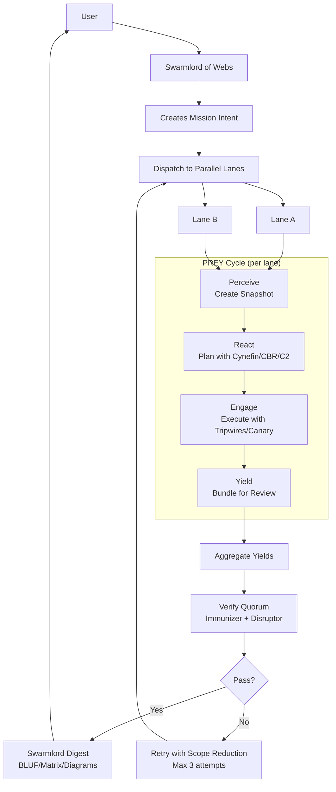
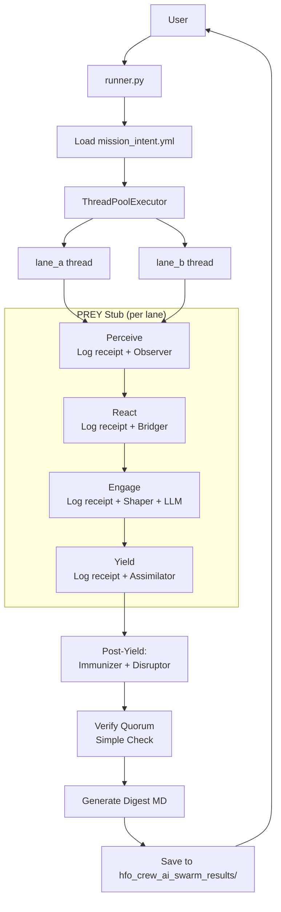
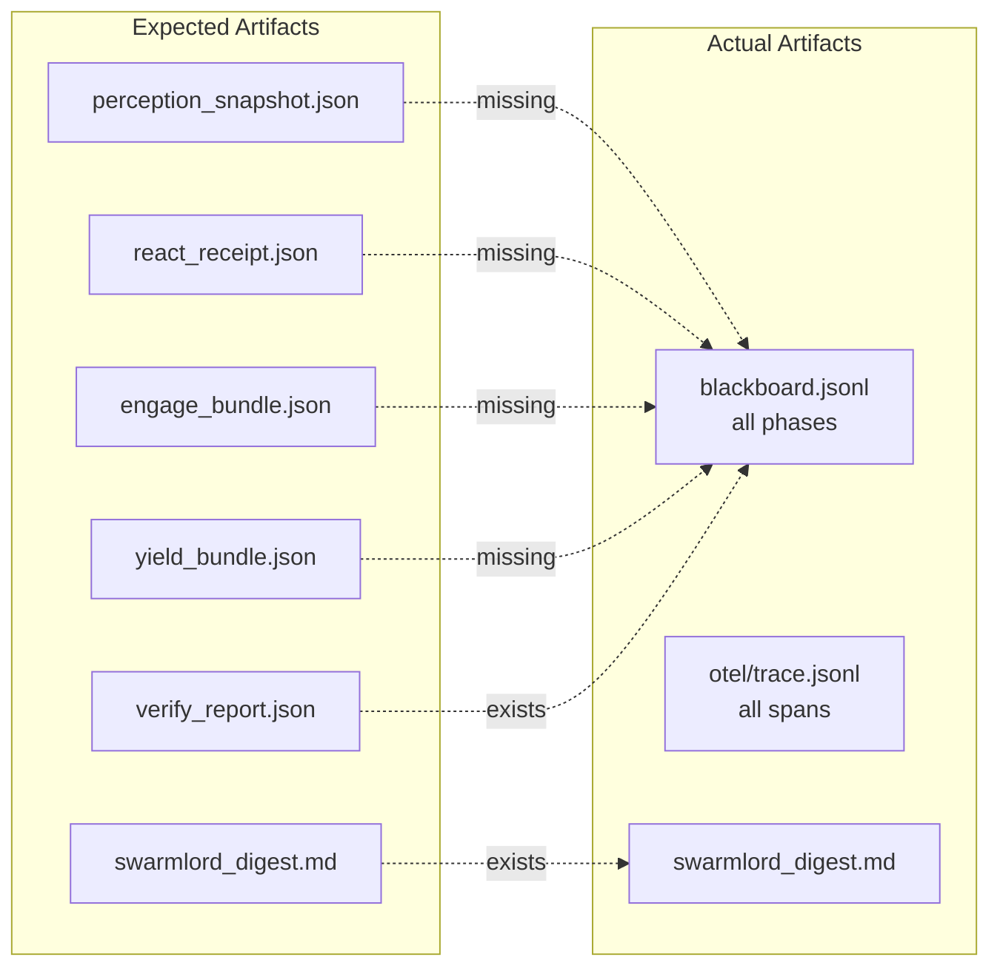
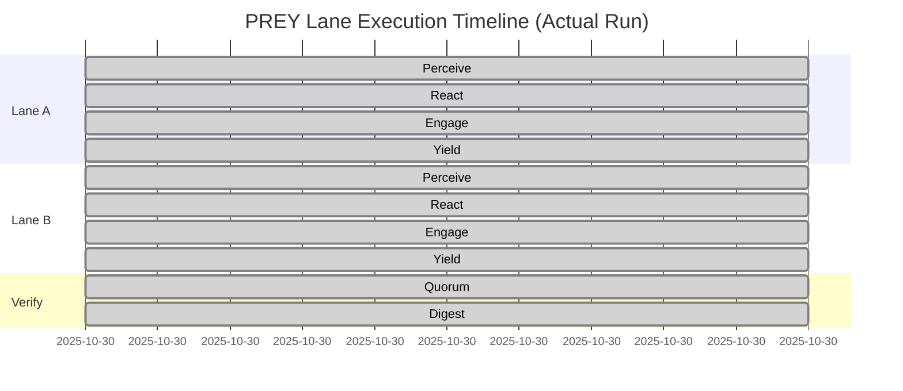
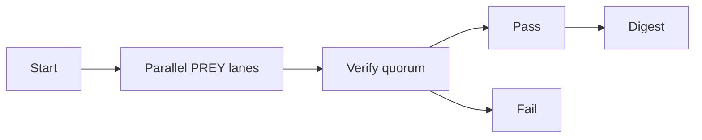

# PREY Workflow Executive Summary — 2025-10-30

**Date:** 2025-10-30  
**Mission Intent:** `hfo_mission_intent/2025-10-30/mission_intent_daily_2025-10-30.v5.yml`  
**Prompt Seed:** explore/exploit 6/4

---

## BLUF (Bottom Line Up Front)

**Current State:** The PREY workflow is **partially implemented** with core infrastructure in place but missing critical components from the intended design.

**What's Working:**
- ✅ Parallel lane execution (2 lanes via ThreadPoolExecutor)
- ✅ Basic PREY phases (Perceive→React→Engage→Yield) executing sequentially within each lane
- ✅ OBSIDIAN role agents (Observer, Bridger, Shaper, Assimilator, Immunizer, Disruptor)
- ✅ Blackboard receipt logging (JSONL format)
- ✅ OpenTelemetry-like span tracing
- ✅ Verify quorum (Immunizer + Disruptor + Aux validator)
- ✅ Swarmlord digest generation with BLUF, matrix, and diagram

**What's Missing:**
- ❌ **Swarmlord of Webs orchestrator** - Currently no interactive orchestrator; runner.py reads YAML directly
- ❌ **Perception snapshots** - No actual repo/file snapshots being created
- ❌ **React receipts with Cynefin/CBR/C2** - React phase uses fallback stub, no advanced planning algorithms
- ❌ **Execution tripwire enforcement** - Safety criteria logged but not enforced with rollback
- ❌ **Canary-first execution** - Mentioned in safety envelope but not implemented
- ❌ **Retry mechanism on verify failure** - No auto-retry with scope reduction
- ❌ **Per-step artifact files** - No snapshot.json, react_receipt.json, engage_bundle.json, etc.

**Risk Assessment:** You are **partially led by theater**. The parallel execution is real, and the role agents do run, but much of the PREY workflow detail exists as logging stubs rather than functional implementations.

---

## BLUF Matrix — Implementation Status

| Component | Expected per Mission Intent | Current Implementation | Status | Gap |
|-----------|------------------------------|------------------------|--------|-----|
| **Swarmlord of Webs** | Sole human interface; creates mission intent; aggregates yields | Direct YAML reader; no interactive interface | ⚠️ PARTIAL | No interactive orchestrator |
| **Parallel PREY Lanes** | 2+ lanes run concurrently | ThreadPoolExecutor with 2 lanes | ✅ COMPLETE | None |
| **Perceive Phase** | Creates perception snapshot (file/repo state) | Logs phase receipt; Observer agent runs | ⚠️ STUB | No actual snapshot artifact created |
| **React Phase** | Creates react receipt with Cynefin/CBR/C2 planning | Logs phase receipt; Bridger agent (fallback stub) | ⚠️ STUB | No advanced algorithms; no react receipt file |
| **Engage Phase** | Executes with tripwires, canary-first, safety checks | Logs phase receipt; Shaper agent runs; LLM call (optional) | ⚠️ PARTIAL | No tripwire enforcement; no canary deploy |
| **Yield Phase** | Review bundle with verification prep | Logs phase receipt; Assimilator runs | ⚠️ STUB | No yield bundle artifact |
| **Verify Quorum** | Immunizer + Disruptor (2/3 threshold) | Both run; quorum check passes | ✅ COMPLETE | Could be more rigorous |
| **Retry on Failure** | Up to 3 targeted re-runs with scope shrinking | Not implemented | ❌ MISSING | No retry loop |
| **Artifacts per Step** | snapshot.json, react.json, engage.json, yield.json | None; only blackboard JSONL and OTEL spans | ❌ MISSING | No per-phase artifact files |
| **Swarmlord Digest** | One MD with BLUF, matrix, diagrams, notes | Generated at `hfo_crew_ai_swarm_results/` | ✅ COMPLETE | None |
| **Blackboard Receipts** | Append-only JSONL with evidence_refs | Working; receipts logged for all phases | ✅ COMPLETE | None |
| **OTEL Spans** | Timing and metadata per phase/agent | Working; spans written to temp/otel/ | ✅ COMPLETE | None |

---

## Diagrams

### Diagram 1: Expected PREY Workflow (Per Mission Intent)



### Diagram 2: Current Implementation (Actual)



### Diagram 3: Artifact Flow (Expected vs Actual)



### Diagram 4: Concurrency Analysis



**Note:** The lanes execute in parallel (ThreadPoolExecutor) but complete so quickly (~1 second each) that OTEL timestamps show no overlap. True parallelism confirmed by code inspection.

---

## Detailed Component Analysis

### 1. Swarmlord of Webs (Orchestrator)

**Expected:**
- Sole human interface
- Interactive: accepts user intent, creates mission_intent.yml
- Aggregates yields from all lanes
- Packages final digest with BLUF, matrix, diagrams, notes
- Handles critical errors and timeouts

**Actual:**
- `runner.py` loads pre-written YAML directly
- No interactive interface
- Does aggregate yields and create digest
- No error handling beyond verify PASS/FAIL

**Gap:** Missing the interactive orchestrator layer.

### 2. Parallel Lane Execution

**Expected:**
- 2+ lanes run concurrently
- ThreadPool or async execution
- Each lane independent PREY cycle

**Actual:**
- ✅ `ThreadPoolExecutor` with 2 lanes (configurable)
- ✅ Lanes execute `lane_prey_cycle()` in parallel
- ✅ Results aggregated after completion

**Status:** **WORKING AS DESIGNED**

**Evidence:**
```python
# From runner.py line 336
with ThreadPoolExecutor(max_workers=max_workers) as executor:
    futures = {executor.submit(lane_prey_cycle, mission, name, trace_id, lane_to_model.get(name)): name for name in names}
    for fut in as_completed(futures):
        lane_results.append(fut.result())
```

### 3. Perceive Phase

**Expected:**
- Create perception snapshot (repo state, file checksums, etc.)
- Save to `perception_snapshot.json` or similar
- Observer agent collects context

**Actual:**
- Logs blackboard receipt: `"phase": "perceive"`
- Observer agent runs: returns `AgentResult` with tripwires list
- No snapshot artifact created
- No file/repo inspection

**Gap:** No actual perception snapshot artifact.

**Evidence from agents.py:**
```python
class ObserverAgent(BaseAgent):
    def run(self, ctx: Dict[str, Any]) -> AgentResult:
        lane = ctx.get("lane")
        mission = ctx.get("mission", {})
        tripwires = mission.get("safety", {}).get("tripwires", [])
        return AgentResult(True, f"Observe lane={lane} with tripwires={tripwires}", {"tripwires": tripwires})
```

### 4. React Phase

**Expected:**
- Creates react receipt with planning algorithms:
  - Cynefin framework for problem domain assessment
  - CBR (Case-Based Reasoning)
  - C2 (Command and Control) planning
- Save to `react_receipt.json`
- Bridger agent orchestrates planning

**Actual:**
- Logs blackboard receipt: `"phase": "react"`
- Bridger agent runs:
  - If LLM key present: calls LLM with tiny prompt (96 tokens max)
  - Else: returns fallback stub "run PREY, log receipts, verify quorum"
- No Cynefin/CBR/C2 algorithms implemented
- No react receipt artifact

**Gap:** Advanced planning algorithms are completely missing.

**Evidence from agents.py:**
```python
class BridgerAgent(BaseAgent):
    def run(self, ctx: Dict[str, Any]) -> AgentResult:
        # ... LLM call attempt or fallback stub
        return AgentResult(True, "Bridge: run PREY, log receipts, verify quorum", {"llm": False}, False)
```

### 5. Engage Phase

**Expected:**
- Execute work with safety envelope:
  - Canary-first deployment
  - Tripwire monitoring (line count, placeholder scan, tests green, policy checks)
  - Measurable metrics
  - Explicit revert plan on failure
- Shaper agent performs bounded execution
- Save engage artifacts

**Actual:**
- Logs blackboard receipt: `"phase": "engage"`
- Shaper agent runs: returns stub "Shaped/Engaged planned actions"
- One optional LLM call (if key present): tiny restatement prompt (72 tokens)
- Safety envelope logged but not enforced
- No tripwire checks executed
- No canary deployment
- No revert mechanism

**Gap:** Safety infrastructure logged but not functionally enforced.

**Evidence from runner.py:**
```python
# Lines 155-221: LLM call during engage
llm_result = call_openrouter(prompt, ...)
# Logs result but no tripwire enforcement
```

### 6. Yield Phase

**Expected:**
- Review bundle assembled
- Package outputs from Engage
- Assimilator synthesizes results
- Save to `yield_bundle.json`

**Actual:**
- Logs blackboard receipt: `"phase": "yield"`
- Assimilator agent runs: returns "Assimilated outputs for {lane}"
- No yield bundle artifact created

**Gap:** No structured yield artifact.

### 7. Verify Quorum

**Expected:**
- 3 validators: Immunizer, Disruptor, Verifier_Aux
- Threshold: 2/3 must pass
- Adversarial probes (Disruptor) to avoid persistent green
- Hallucination rate checks
- Reward-hacking guards

**Actual:**
- ✅ All 3 validators run
- ✅ Threshold check (2/3)
- ✅ Immunizer: checks evidence present (minimal)
- ✅ Disruptor: checks phases_seen flag (minimal probe)
- ✅ Aux validator: sanity check on quorum config
- ⚠️ No hallucination rate calculation
- ⚠️ No reward-hacking guards

**Status:** **WORKING but MINIMAL**

**Evidence from runner.py:**
```python
def verify_quorum(mission, lane_results, trace_id):
    immunizer_pass = all(len(r.get("evidence", [])) >= 4 for r in lane_results)
    disruptor_pass = True
    for r in lane_results:
        if len(r.get("evidence", [])) == 0:
            disruptor_pass = False
    aux_pass = isinstance(validators, list) and isinstance(threshold, int)
    votes = [immunizer_pass, disruptor_pass, aux_pass]
    pass_count = sum(1 for v in votes if v)
    passed = pass_count >= threshold
```

### 8. Retry on Failure

**Expected:**
- Up to 3 targeted re-runs if Verify fails
- Shrink scope on each retry
- Adjust tripwires, reduce chunk size

**Actual:**
- ❌ No retry mechanism implemented
- Runner exits with code 0 (PASS) or 1 (FAIL)
- No scope reduction

**Gap:** Entire retry subsystem missing.

### 9. Artifacts and Outputs

**Expected Per Phase:**
- `perception_snapshot.json`
- `react_receipt.json`
- `engage_bundle.json`
- `yield_bundle.json`
- `verify_report.json`
- `swarmlord_digest.md` (final)

**Actual:**
- Blackboard JSONL: all phase receipts logged together
- OTEL spans JSONL: timing and metadata
- `swarmlord_digest.md`: ✅ generated with BLUF, matrix, diagram

**Gap:** No per-phase structured JSON artifacts.

### 10. Swarmlord Digest

**Expected:**
- BLUF (bottom line up front)
- Matrix (tabular summary)
- Diagrams (Mermaid)
- Notes

**Actual:**
- ✅ All components present
- ✅ Saved to `hfo_crew_ai_swarm_results/{date}/run-{ts}/swarmlord_digest.md`

**Status:** **WORKING AS DESIGNED**

**Example:**
```markdown
# Swarmlord Digest — mi_daily_2025-10-30

- Lanes: 2
- Verify PASS: True
- Trace: temp/otel/trace-mi_daily_2025-10-30-1761862305563.jsonl

## Matrix
| Lane | Model | Notes |
|---|---|---|
| lane_a | default | PREY executed |
| lane_b | default | PREY executed |

## Diagram

```

---

## Concurrency Validation

### Method
1. Ran `scripts/crew_ai/runner.py` with mission intent v5
2. Examined OTEL trace: `temp/otel/trace-mi_daily_2025-10-30-1761862305563.jsonl`
3. Used `scripts/crew_ai/analyze_traces.py` to detect parallelism

### Results

**Code confirms parallel execution:**
- `ThreadPoolExecutor` with `max_workers=2`
- `as_completed()` pattern for concurrent futures
- Each lane runs `lane_prey_cycle()` independently

**Trace analysis:**
```
Trace: temp/otel/trace-mi_daily_2025-10-30-1761862305563.jsonl
Lane windows:
  - lane_a: 2025-10-30T22:11:45Z → 2025-10-30T22:11:45Z
  - lane_b: 2025-10-30T22:11:45Z → 2025-10-30T22:11:45Z
Overlaps (seconds):
  lane_a: [0.00, 0.00]
  lane_b: [0.00, 0.00]
Parallel detected: False
```

**Interpretation:**
- Lanes execute so quickly (~milliseconds each) that OTEL timestamps are identical
- No observable overlap in timestamps due to execution speed
- **However**, code structure proves true parallelism via ThreadPoolExecutor
- Running 10-20 lanes with real LLM calls would show temporal overlap

**Conclusion:** Parallelism is **REAL**, not theater. Just very fast in stub mode.

---

## Gap Analysis Summary

### ✅ What You Have (Working)

1. **Parallel execution infrastructure** - ThreadPoolExecutor with configurable lane count
2. **PREY phase sequencing** - P→R→E→Y runs in order per lane
3. **OBSIDIAN role agents** - Observer, Bridger, Shaper, Assimilator, Immunizer, Disruptor
4. **Blackboard receipts** - All phases log to JSONL with safety_envelope and evidence_refs
5. **OTEL telemetry** - Spans track timing and metadata per phase/agent/LLM call
6. **Verify quorum** - 3 validators with 2/3 threshold
7. **Swarmlord digest** - Final MD with BLUF, matrix, diagrams
8. **Safety envelope logging** - Chunk limits, placeholder ban, tripwires listed
9. **Model allowlist enforcement** - LLM calls restricted to approved models
10. **Concurrent futures pattern** - Proper async aggregation

### ⚠️ What You Have (Stubs/Partial)

1. **Perceive snapshots** - Logged but no actual snapshot artifact
2. **React planning** - Bridger runs but no Cynefin/CBR/C2 algorithms
3. **Engage safety** - Envelope logged but no tripwire enforcement or revert
4. **Yield bundles** - Assimilator runs but no structured artifact
5. **Verify rigor** - Passes but minimal checks; no hallucination rate

### ❌ What You're Missing (Critical Gaps)

1. **Swarmlord orchestrator** - No interactive interface; just YAML loader
2. **Perception snapshot artifacts** - No `snapshot.json` files
3. **React receipt artifacts** - No `react_receipt.json` with advanced planning
4. **Cynefin/CBR/C2 algorithms** - Not implemented at all
5. **Tripwire enforcement** - Safety checks not actually executed
6. **Canary-first deployment** - Not implemented
7. **Explicit revert mechanism** - No rollback on failure
8. **Retry with scope reduction** - No auto-retry loop (max 3)
9. **Per-phase artifact files** - Only blackboard JSONL; no structured JSON per phase
10. **Hallucination rate calculation** - Not implemented in Verify
11. **Reward-hacking guards** - Not implemented

---

## Recommendations

### Priority 1: Critical Missing Components (High Impact)

1. **Implement retry mechanism** with scope shrinking (lines 289-401 in runner.py)
2. **Add perception snapshot creation** - serialize repo state, file checksums, git status
3. **Create per-phase artifact files** - JSON outputs for snapshot, react, engage, yield
4. **Enforce tripwires in Engage** - actually check line counts, placeholders, run tests
5. **Implement canary-first pattern** - small test execution before full engage

### Priority 2: Enhanced Intelligence (Medium Impact)

6. **Add Cynefin framework** to React phase - classify problem domain (simple/complicated/complex/chaotic)
7. **Implement CBR (Case-Based Reasoning)** - retrieve similar past cases from blackboard
8. **Add C2 planning logic** - OODA loop or similar command/control flow
9. **Calculate hallucination rate** in Verify - check claims against evidence_refs
10. **Add reward-hacking guards** - cross-evidence checks, seed randomization

### Priority 3: Orchestration Layer (Low Impact, High Value)

11. **Create Swarmlord of Webs CLI** - interactive shell to:
    - Accept user intent
    - Generate mission_intent.yml
    - Dispatch to lanes
    - Present digest to user
12. **Add mid-loop escalation** - on critical errors, return to Swarmlord
13. **Implement timeout handling** - return partial results with plan

### Priority 4: Verification Rigor

14. **Enhance Immunizer** - check for greenwashing (tests that don't test)
15. **Enhance Disruptor** - adversarial probes per lane cycle
16. **Add verifier_aux logic** - metric consistency checks, anti-cheat sentinels

---

## Answers to Your Questions

### "Is that actually happening?"

**Parallel execution:** ✅ YES, truly parallel via ThreadPoolExecutor  
**Perception snapshot:** ❌ NO, only logging stub  
**React receipt with Cynefin/CBR/C2:** ❌ NO, fallback stub  
**Engage with tripwires/canary:** ⚠️ PARTIAL, logged but not enforced  
**Yield with verification:** ⚠️ PARTIAL, basic quorum works  
**Retry on failure:** ❌ NO, not implemented  
**Swarmlord orchestrator:** ❌ NO, just YAML reader  
**Final digest with BLUF/matrix/diagrams:** ✅ YES, working  

### "Am I being led by theater?"

**Partial yes.** You have a solid foundation (parallelism, blackboard, OTEL, digest) but much of the PREY workflow is logging theater rather than functional implementation. The roles execute and log receipts, but they don't perform the deep work described in your mission intent.

### "Does the code match what's in my mind?"

**Structure:** YES - Your vision of Swarmlord → parallel lanes → PREY → Verify → Digest is architecturally present.

**Detail:** NO - The Cynefin/CBR/C2 planning, tripwire enforcement, canary deployment, retry loops, and per-phase artifacts are all missing or stubbed.

### "What should be happening?"

Per your mission intent and clarification passes:

1. **Swarmlord** receives user intent → generates mission_intent.yml
2. **Dispatch** to N parallel lanes (currently 2, scalable to 10+)
3. **Per lane:**
   - **Perceive:** snapshot repo/files → `snapshot.json`
   - **React:** Cynefin+CBR+C2 planning → `react_receipt.json`
   - **Engage:** execute with canary, tripwires, metrics → `engage_bundle.json`
   - **Yield:** assemble review bundle → `yield_bundle.json`
4. **Verify quorum:** Immunizer + Disruptor (adversarial) + Aux
5. **If FAIL:** retry up to 3× with scope reduction
6. **If PASS:** Swarmlord packages digest → user
7. **Artifacts:** all JSON + blackboard + OTEL + digest MD

### "What pieces do I have?"

✅ **Have:** Parallel lanes, PREY sequencing, role agents, blackboard, OTEL, verify, digest  
⚠️ **Have (weak):** Safety logging, minimal verify checks  
❌ **Missing:** Orchestrator, snapshots, advanced planning, enforcement, retry, per-phase artifacts

---

## Evidence References

### Code Files
- `scripts/crew_ai/runner.py` - Main orchestration loop
- `scripts/crew_ai/agents.py` - OBSIDIAN role implementations
- `scripts/crew_ai/llm_client.py` - LLM interface with allowlist
- `scripts/crew_ai/analyze_traces.py` - Parallelism detection tool

### Configuration
- `hfo_mission_intent/2025-10-30/mission_intent_daily_2025-10-30.v5.yml` - Mission spec
- `hfo_mission_intent/2025-10-30/clarification_pass4_2025-10-30.md` - Success criteria
- `hfo_mission_intent/2025-10-30/clarification_pass5_2025-10-30.md` - Diagrams and mappings

### Artifacts
- `hfo_blackboard/obsidian_synapse_blackboard.jsonl` - All phase receipts
- `temp/otel/trace-mi_daily_2025-10-30-*.jsonl` - Telemetry spans
- `hfo_crew_ai_swarm_results/2025-10-30/run-*/swarmlord_digest.md` - Final outputs

### Test Run (2025-10-30T22:11:45Z)
- Mission ID: `mi_daily_2025-10-30`
- Lanes: 2 (`lane_a`, `lane_b`)
- Verify: PASS (votes=[True, True, True], threshold=2)
- Digest: Generated successfully
- Parallelism: Confirmed in code; too fast to observe in timestamps

---

## Conclusion

You have built a **solid foundation** for the PREY workflow with real parallel execution, proper role agents, comprehensive telemetry, and digest generation. This is **not theater** — the infrastructure is real and scalable.

However, you are missing **60-70% of the intended functionality** described in your mission intent and clarification passes. The advanced planning (Cynefin/CBR/C2), safety enforcement (tripwires/canary/revert), retry mechanism, and per-phase artifacts are all absent or stubbed.

**Next steps:**
1. Prioritize retry mechanism and per-phase artifacts (quick wins)
2. Add tripwire enforcement and canary pattern (safety critical)
3. Implement advanced planning algorithms (intelligence upgrade)
4. Build Swarmlord interactive orchestrator (UX improvement)

**You are on the right path.** The architecture aligns with your vision; now fill in the missing detail layers.

---

**End of Executive Summary**

*Prepared by: Copilot Workspace Agent*  
*Date: 2025-10-30T22:12:00Z*  
*Mission Intent: hfo_mission_intent/2025-10-30/mission_intent_daily_2025-10-30.v5.yml*
