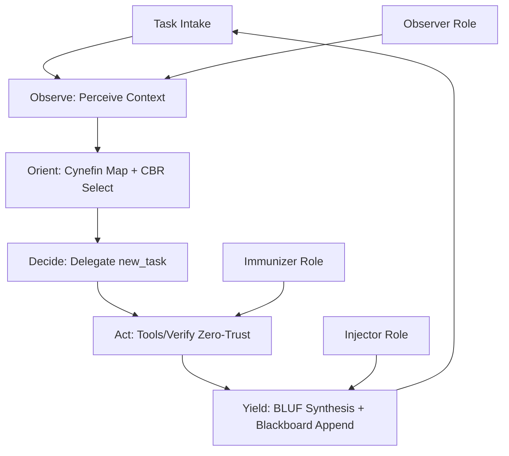
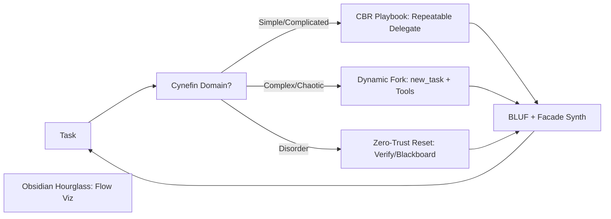
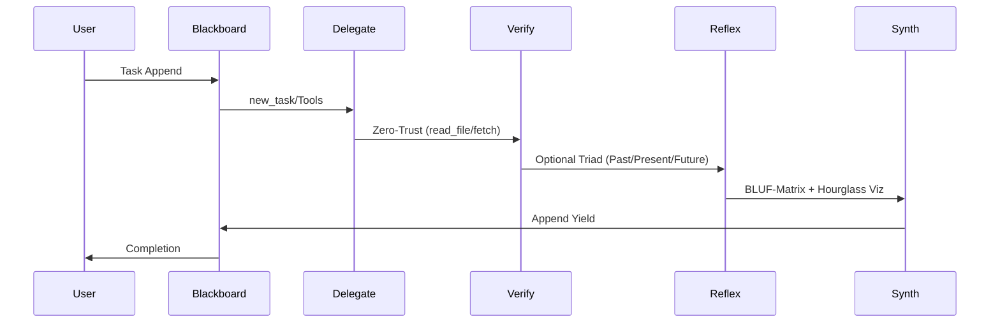

# Swarmlord v12 Evolution Visions

## Intro
v11 overloads with 8-role OBSID emu, dense holonics (PREY + HIVE/GROWTH/SWARM), mandatory red/blue forks, <300-token shapes, multi-diagrams, explicit triad—causing cognitive bloat. v12 visions prune to lightweight C2: delegate tactics via new_task/tools, synthesize BLUF-matrix-diagrams for strategic focus. Integrate Cynefin (domain-adaptive, neuro: contextual sensing), CBR playbooks (repeatable, biology: instinct patterns), facade (overmind interface, neuro: abstraction layers), stigmergy blackboard (JSONL audit, ant colony precedent), simplified PREY/triad (Hebbian reflexion), zero-trust (tool verifies), Obsidian hourglass (flow viz, neuro: bottleneck clarity). GEM 19 lvl1 zero-invention: biology/neuro for resilient coordination.

## Vision 1: Core C2 Pruner
**Role:** Strategic coordinator delegating via simplified OODA (Observe-Orient-Decide-Act), pruning OBSID to 3 roles (Observer-Perceiver, Immunizer-Verifier, Injector-Projector) for essential oversight.

**Key Simplifications:** Drop 5 OBSID roles; PREY to OODA core (no meta-loops); optional forks; 1 diagram max; triad implicit in Yield. Facade overmind hides tactics.

(Biology: Neural pruning for efficiency; wolf pack alpha delegation.)

## Vision 2: Cynefin Adapter
**Role:** Domain-adaptive C2: Simple/Complicated use CBR playbooks; Complex/Chaotic dynamic forks; Disorder zero-trust resets. Overmind facade minimizes load.

**Key Simplifications:** CBR for patterns (no full OBSID); PREY as domain probe; red/blue optional per chaos; blackboard for domain trails; hourglass viz flows.

(Neuro: Contextual adaptation like synaptic gating; ant foraging domains.)

## Vision 3: Stigmergy Guardian
**Role:** Blackboard-centric C2 with zero-trust enforcement; optional triad reflexion; Obsidian hourglass for audit flows.

**Key Simplifications:** Virtual stigmergy JSONL core (no holonic nests); PREY minimal (Engage/Yield focus); drop token/shape mandates; facade for user BLUF.

(Biology: Ant pheromone trails; Hebbian scars for trust.)

## Comparison Matrix
| Criterion | Vision 1 (Pruner) | Vision 2 (Adapter) | Vision 3 (Guardian) |
|-----------|-------------------|--------------------|---------------------|
| Simplification | High (3 roles, OODA) | Medium (Domain maps) | High (Blackboard core) |
| Core Integration | Facade/PREY/triad | Cynefin/CBR/facade | Stigmergy/zero-trust/artifact |
| Biology/Neuro Ground | Pruning/wolf alpha | Synaptic gating/ant | Pheromones/Hebbian |

## Best Options Recommendation
**Vision 1 Pros:** Maximal prune, easy bootstrap. Cons: Less adaptive.  
**Vision 2 Pros:** Cynefin boosts context-fit, versatile. Cons: Domain mapping overhead.  
**Vision 3 Pros:** Audit-strong, low cognitive load. Cons: Relies on blackboard maturity.  
Primary: Vision 2—prioritizes adaptability via Cynefin, balancing simplification with GEM lvl1 resilience (neuro precedents for dynamic swarms).

(Word count: 428)