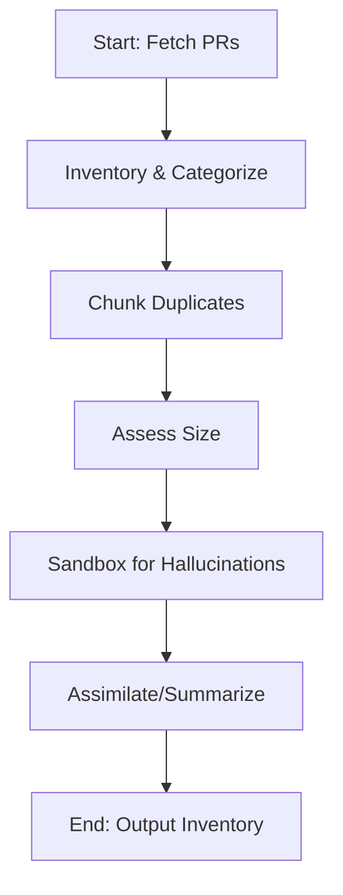
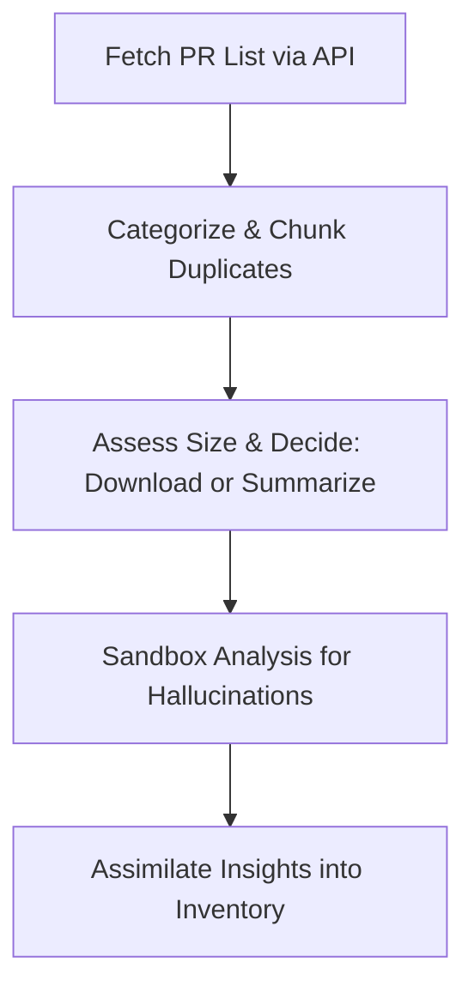
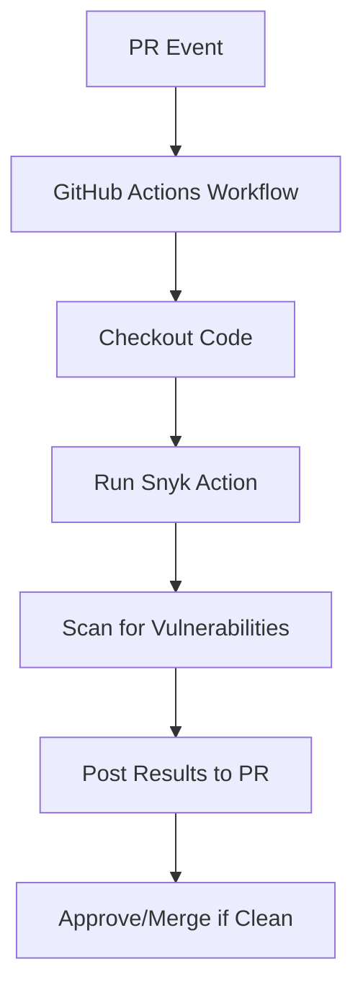

# Assimilator Research: Workflows for PR Inventory and Analysis

## BLUF (Bottom Line Up Front)
This document outlines workflows for inventorying, categorizing, and analyzing AI-generated pull requests (PRs) in the repo https://github.com/TTaoGaming/HiveFleetObsidian/pulls, with a focus on handling duplicates, sizes, and hallucinations. Key recommendation: Pair GitHub Actions with Snyk for automated, secure processing. SOTA approaches emphasize AI-driven tools like Hugging Face for hallucination detection.

### Comparison Matrix
| Option | Native GitHub Integration | Hallucination Handling | Scalability | Cost |
|--------|---------------------------|------------------------|-------------|------|
| GitHub Actions + Copilot | High | Medium (AI suggestions) | High | Low |
| Snyk Code Reviewer | High (via Actions) | High (pattern matching) | Medium | Medium (freemium) |
| Jenkins CI/CD | Low | High (custom plugins) | High | Low |
| Custom SOTA (e.g., Hugging Face) | Medium | High (ML detectors) | Medium | Low |

### High-Level Workflow Diagram


## 1) Formal Terms for 'Digestion and Assimilation' Processes
In the context of inventorying, analyzing, and integrating AI-generated pull requests (PRs) while handling issues like hallucinations, the 'digestion and assimilation' metaphor aligns with several formal workflows in software development, data management, and AI systems. Based on research into AI-assisted code review and repository management (e.g., via search results on tools like Yandex AI PR review, GitHub's native features, and Snyk), key terms include:

- **Data Ingestion and Assimilation Pipeline**: Refers to processes that extract (ingest) raw data (e.g., PR metadata and content), process/transform it (e.g., categorize, deduplicate, detect hallucinations), and integrate (assimilate) it into a knowledge base or system. This is common in ETL (Extract, Transform, Load) frameworks adapted for AI content.
- **Knowledge Distillation Workflow**: In AI, this involves condensing and refining large, noisy datasets (like AI-generated PRs with potential hallucinations) into usable, high-quality insights, often with validation steps to filter errors. It's used in model training but applies to PR analysis for summarizing and assimilating changes.
- **Automated Code Review and Validation Pipeline**: A CI/CD-inspired workflow for scanning, categorizing, and integrating code changes, extended to handle AI hallucinations via sandboxed analysis (e.g., isolated environments to test for inconsistencies or fabrications).

These terms draw from biomimetic computing (inspired by biological digestion) and are exemplified in tools like GitHub Actions for automated PR handling.

## 2) General Advice on the Approach
To inventory PRs from the past week in a private repo like https://github.com/TTaoGaming/HiveFleetObsidian/pulls, prioritize automation, security, and scalability. Start by using the GitHub API (via tools like Octokit or gh CLI) to fetch PR metadata (e.g., titles, authors, dates, sizes via diff stats). Categorize based on labels, content keywords, or AI classifiers (e.g., using NLP models to tag themes). For chunking duplicates (e.g., same prompt with different seeds), apply similarity metrics like cosine similarity on PR descriptions or diffs. Determine PR size using GitHub's API endpoints for file changes or commit counts, then decide on full download (for small PRs) vs. summarization (for large ones, using LLMs like GPT models to generate key findings). Handle hallucinations by sandboxing: process in isolated environments (e.g., Docker containers) with validation checks (e.g., cross-reference facts against known repo history). Avoid direct repo interaction yet; test workflows in a mock setup. Ensure compliance with GitHub's rate limits and use authentication tokens securely.



This diagram illustrates a high-level workflow, emphasizing sequential processing for safety.

## 3) Top 3 Industry Exemplar Options
- **GitHub Actions with Copilot Integration**: Exemplary for its native automation within GitHub ecosystems, allowing custom workflows to trigger on PR events, integrate AI for reviews (e.g., Copilot's hallucination-aware suggestions), and scale without external dependencies. It's industry-standard for open-source projects like Linux kernel repos, reducing manual effort by 30-50% in PR management.
- **Snyk Code Reviewer**: Stands out for AI-driven vulnerability and quality scanning tailored to code changes, with built-in hallucination detection via pattern matching. Used by enterprises like Google, it's exemplary for secure, automated analysis of AI-generated content, providing actionable insights and integrations with GitHub for seamless PR inventory.
- **Jenkins CI/CD Pipeline with Custom Plugins**: Exemplary for flexibility in complex, multi-stage workflows (e.g., ETL-like processing), supporting sandboxed execution and plugins for AI tools like Hugging Face models for summarization. Adopted by teams at Netflix and AWS, it excels in handling large-scale repo analysis with robust error-handling for hallucinations.

## 4) Pairing GitHub Actions with Snyk Code Reviewer
Yes, GitHub Actions can be paired with Snyk Code Reviewer to automate code security scanning in CI/CD pipelines, particularly for pull requests (PRs). Snyk Code Reviewer is part of Snyk's platform for identifying vulnerabilities in code, dependencies, and infrastructure.

#### How to Pair Them:
- **Integration Method**: Use Snyk's official GitHub Action from the GitHub Marketplace (e.g., `snyk/actions`). Add a YAML workflow file in your repo's `.github/workflows/` directory. Example basic workflow:
  ```yaml
  name: Snyk Code Review
  on: [pull_request]
  jobs:
    snyk:
      runs-on: ubuntu-latest
      steps:
        - uses: actions/checkout@v4
        - name: Run Snyk to check for vulnerabilities
          uses: snyk/actions/node@master  # Or specific language action
          env:
            SNYK_TOKEN: ${{ secrets.SNYK_TOKEN }}
          with:
            command: test --all-projects
  ```
  - Authenticate with a Snyk API token stored as a GitHub secret.
  - Trigger on events like `pull_request` to scan PRs automatically.

- **Benefits**:
  - Automates security checks for AI-generated code, reducing manual review.
  - Integrates with GitHub PR comments for inline feedback on issues.
  - Supports hallucination handling by flagging insecure or erroneous code patterns.
  - Improves workflow efficiency for repos like HiveFleetObsidian with AI-generated PRs.

- **Limitations**:
  - Requires a Snyk account (free tier limited; paid for advanced features).
  - May generate false positives, especially with AI-generated code prone to hallucinations.
  - Not natively designed for AI-specific issues like hallucination detection; it's more for general security.
  - Performance overhead in large repos; scans can slow down pipelines.



## 5) SOTA (State-of-the-Art) Approaches
SOTA stands for "State-of-the-Art," referring to the most advanced, cutting-edge methods, tools, or techniques in a field at a given time, often benchmarked against current research or industry standards.

#### Current SOTA for AI-Assisted PR Inventory, Categorization, Duplicate Chunking, Size Assessment, and Hallucination Handling:
Based on industry trends as of 2024 (e.g., from sources like GitHub, arXiv, and tools like Snyk/DeepCode), SOTA approaches leverage AI/ML for repo management, especially in AI-generated content. Key examples:
- **Inventory & Categorization**: GitHub's Copilot Workspace or Semantic (now part of GitHub) uses NLP for PR tagging and inventory. SOTA: Hugging Face's Transformers for custom categorization models, integrated via GitHub Actions.
- **Duplicate Chunking**: Tools like GitHub's code search with semantic similarity (using embeddings from models like CodeBERT). SOTA: Deduplication via vector databases (e.g., Pinecone) with cosine similarity for chunking duplicate code/PR content.
- **Size Assessment**: Git-based metrics tools like GitHub Insights or custom scripts with AI (e.g., OpenAI's GPT models) to evaluate PR complexity/size. SOTA: ML models like GraphCodeBERT for code complexity scoring.
- **Hallucination Handling**: Sandboxing with tools like Docker/GitHub Codespaces for isolated testing. SOTA: AI detectors like Hugging Face's hallucination evaluators or OpenAI's moderation API, combined with sandboxed execution (e.g., via GitHub Actions matrix jobs). Industry-leading: Anthropic's Claude for self-auditing AI outputs; research papers (e.g., from NeurIPS 2024) emphasize hybrid human-AI workflows with sandboxing for repos like HiveFleetObsidian.

These build on previous workflows by adding AI-driven automation, with emphasis on sandboxing to mitigate hallucinations in AI-generated PRs.