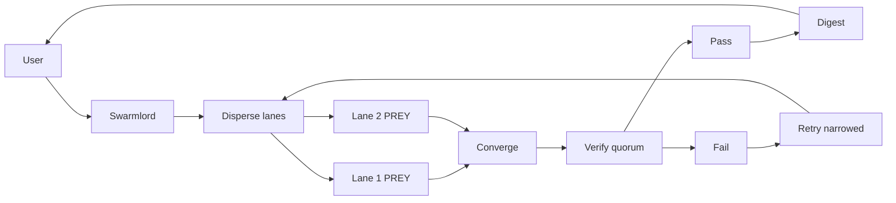

# HFO Multi-Crew Parallel Orchestration

This system implements parallel multi-agent orchestration using CrewAI with disperse-converge patterns, quorum-based verification, and stigmergy via blackboard JSONL.

## Architecture

### Key Components

1. **Swarmlord Orchestrator** - Sole human interface facade
2. **Parallel PREY Lanes** - Multiple lanes running Perceive → React → Engage → Yield
3. **Quorum Validators** - Immunizer, Disruptor, Verifier_Aux (2/3 threshold)
4. **Blackboard JSONL** - Stigmergy and evidence coordination
5. **Disperse-Converge** - Parallel execution with aggregation
6. **8/2 Explore/Exploit** - 80% exploration, 20% exploitation

### PREY Loop

Each lane executes:
- **Perceive** - Sense repository state and context
- **React** - Plan minimal changes with safety checks
- **Engage** - Execute within chunk limits and tripwires
- **Yield** - Assemble review bundle with evidence

### Verification Quorum

Three validators independently check results:
- **Immunizer** - Consistency, grounding, evidence quality
- **Disruptor** - Adversarial probes, edge cases, reward hacking
- **Verifier_Aux** - Safety and policy compliance

Quorum passes when 2 of 3 validators approve.

### Safety Envelope

- Chunk size limit: ≤200 lines per write
- Placeholder ban: No TODO/…/omitted in artifacts
- Canary-first: Start with limited scope
- Measurable tripwires: Line counts, tests, policy checks
- Explicit revert: Recovery plan for failures
- Auto-retry: Up to 3 targeted retries with scope reduction

## Setup

### 1. Install Dependencies

```bash
pip install -r requirements.txt
```

### 2. Configure Environment

Copy the example environment file:

```bash
cp .env.example .env
```

Edit `.env` and add your API keys:

```bash
# Required
OPENAI_API_KEY=sk-...

# Optional
ANTHROPIC_API_KEY=sk-ant-...
```

### 3. Configure Mission Parameters (Optional)

Adjust these in `.env` as needed:

```bash
HFO_MISSION_ID=mission_2025-10-30
HFO_PARALLEL_LANES=2
HFO_EXPLORE_EXPLOIT_RATIO=8:2
HFO_CHUNK_SIZE_MAX=200
HFO_AUTO_RETRY_MAX=3
HFO_QUORUM_THRESHOLD=2
```

## Usage

### Basic Run

```bash
python scripts/hfo_multi_crew_orchestrator.py
```

### Custom Mission

Edit the `mission_goal` in `hfo_multi_crew_orchestrator.py` or create a new orchestration script:

```python
from hfo_multi_crew_orchestrator import SwarmlordOrchestrator, MissionConfig

config = MissionConfig.from_env()
orchestrator = SwarmlordOrchestrator(config)

mission_goal = """
Your mission description here...
"""

result = orchestrator.execute_mission(mission_goal)
print(f"Status: {result['status']}")
```

## Workflow



## Evidence and Receipts

All operations log receipts to the blackboard JSONL:

```bash
cat hfo_blackboard/obsidian_synapse_blackboard.jsonl | tail -20
```

Each receipt includes:
- `mission_id` - Unique mission identifier
- `phase` - PREY phase (perceive, react, engage, yield, verify, digest)
- `summary` - Human-readable description
- `evidence_refs` - Files, metrics, artifacts
- `safety_envelope` - Chunk limits and tripwires
- `timestamp` - ISO 8601 UTC

## Explore/Exploit Balance

Default 8/2 ratio:
- **80% Explore** - Verbose, experimental, diverse approaches
- **20% Exploit** - Focused, proven, optimized approaches

This maintains quality diversity while ensuring reliable core execution.

## Verification Strategy

### Immunizer Checks
- Evidence grounding (all claims have refs)
- Consistency across lanes
- Metric quality and completeness

### Disruptor Probes
- Edge case testing
- Adversarial inputs
- Reward hacking detection
- Persistent green prevention

### Verifier Auxiliary
- Policy compliance
- Safety envelope adherence
- Chunk limit validation
- Placeholder scan

## Troubleshooting

### Missing API Key

```
Error: OPENAI_API_KEY not set
Solution: Add your key to .env file
```

### Import Error

```
Error: crewai not installed
Solution: pip install crewai crewai-tools
```

### Quorum Fails

The system auto-retries up to 3 times with:
- Reduced chunk size
- Narrower scope
- Stricter tripwires

Check blackboard for failure details:

```bash
grep "verify.*FAIL" hfo_blackboard/obsidian_synapse_blackboard.jsonl
```

## Integration with Existing HFO Components

This system integrates with:
- **AGENTS.md** - Operating guide compliance
- **Mission Intent YAML** - Daily mission configuration
- **Blackboard JSONL** - Evidence and coordination
- **PettingZoo Scripts** - Verification via game theory
- **Existing CrewAI Run** - Backward compatible

## Next Steps

1. **Verify Installation** - Run basic test mission
2. **Custom Missions** - Define your mission goals
3. **Scale Lanes** - Increase parallel lanes for throughput
4. **LangGraph Port** - Migration path to LangGraph when ready
5. **Advanced Tools** - Add domain-specific tools to agents

## References

- Mission Intent: `hfo_mission_intent/2025-10-30/mission_intent_daily_2025-10-30.v5.yml`
- Clarification Pass 5: `hfo_mission_intent/2025-10-30/clarification_pass5_2025-10-30.md`
- AGENTS.md: Operating guide for agents
- Blackboard Logger: `scripts/blackboard_logger.py`
