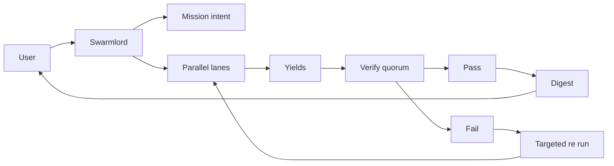
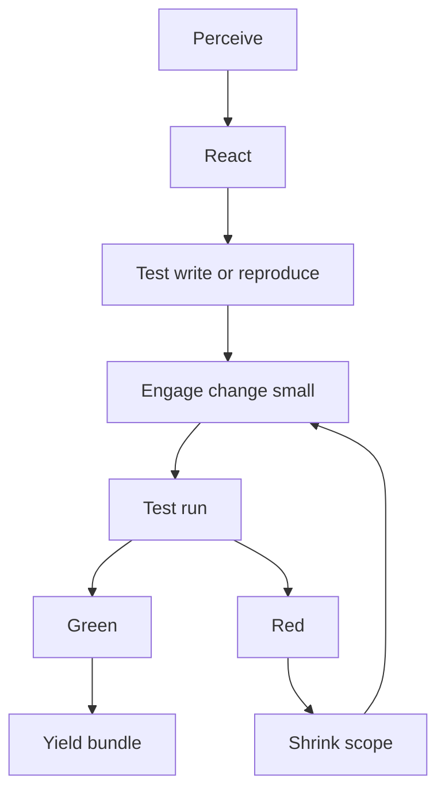
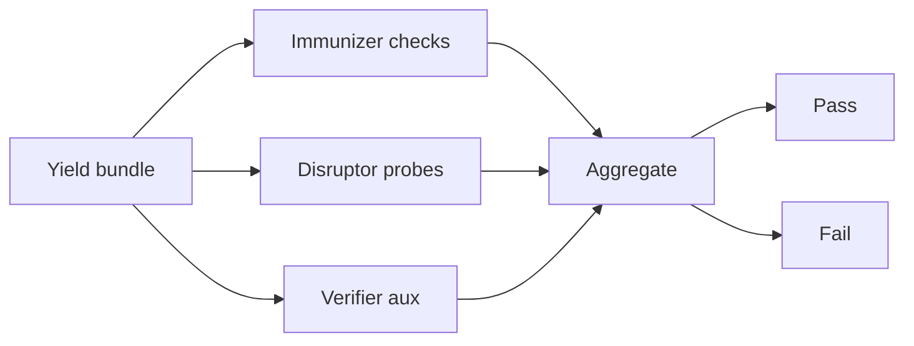

# Multi-Crew Parallel Orchestration System

## Overview

This system implements parallel multi-agent orchestration using the **disperse-converge pattern** with **quorum verification** and **stigmergy** (blackboard coordination). It aligns with the mission intent v5 (2025-10-30) and AGENTS.md protocol.

## Architecture



### Key Components

1. **Swarmlord Orchestrator**: Sole human interface, manages mission lifecycle
2. **PREY Lanes**: Parallel execution units (Perceive → React → Engage → Yield)
3. **Verification Quorum**: 3 validators (immunizer, disruptor, verifier_aux)
4. **Blackboard**: JSONL-based stigmergy for coordination
5. **Explore/Exploit**: Seeded ratio (default 2/8) for diverse solutions

## Quick Start

### 1. Install Dependencies

```bash
pip install -r requirements.txt
```

### 2. Configure Environment

```bash
# Copy template
cp .env.template .env

# Edit .env and add your OPENAI_API_KEY
# Get one at: https://platform.openai.com/api-keys
```

### 3. Run the Orchestrator

```bash
# Default: 2 lanes, 0.2 explore ratio (20% explore, 80% exploit)
bash scripts/run_multi_crew.sh

# Custom: 4 lanes, 0.25 explore ratio
bash scripts/run_multi_crew.sh 4 0.25

# Direct Python
python3 scripts/hfo_multi_crew_orchestrator.py
```

## Configuration

All configuration is via environment variables (set in `.env`):

| Variable | Default | Description |
|----------|---------|-------------|
| `OPENAI_API_KEY` | (required) | OpenAI API key for agents |
| `HFO_MISSION_ID` | `multi_crew_parallel_2025-10-30` | Mission identifier |
| `HFO_LANE_COUNT` | `2` | Number of parallel lanes |
| `HFO_EXPLORE_EXPLOIT_RATIO` | `0.2` | Explore ratio (0.2 = 20% explore, 80% exploit) |
| `HFO_QUORUM_THRESHOLD` | `2` | Validators needed for PASS (out of 3) |
| `HFO_CHUNK_SIZE_MAX` | `200` | Max lines per write chunk |
| `HFO_PLACEHOLDER_BAN` | `true` | Ban TODO/... in outputs |
| `HFO_BLACKBOARD_PATH` | `hfo_blackboard/obsidian_synapse_blackboard.jsonl` | Blackboard file |
| `HFO_LANE_CYCLE_SOFT_MINUTES` | `5` | Soft timeout per lane |
| `HFO_MISSION_SOFT_MINUTES` | `30` | Soft timeout per mission |

## PREY Lanes

Each lane executes independently:



### Explore vs Exploit

- **Explore lanes** (20% by default): Try novel approaches, experiment
- **Exploit lanes** (80% by default): Use proven patterns, optimize

This diversity helps find better solutions through Quality Diversity (QD) principles.

## Verification Quorum

Three independent validators check results:



### Validator Roles

1. **Immunizer**: Health and consistency checks
   - All lanes succeeded
   - Evidence references present
   
2. **Disruptor**: Adversarial probing
   - No placeholders (TODO, ..., omitted)
   - Output diversity (avoid identical results)
   
3. **Verifier Aux**: Timing and structure
   - Within time budget
   - No errors present

**Quorum**: 2 out of 3 validators must PASS for mission to succeed.

## Blackboard Stigmergy

All material actions logged to `hfo_blackboard/obsidian_synapse_blackboard.jsonl`:

```json
{
  "mission_id": "multi_crew_parallel_2025-10-30",
  "phase": "engage",
  "summary": "[lane_a] PREY execution complete",
  "evidence_refs": ["lane_a:result_len=1234"],
  "safety_envelope": {"chunk_size_max": 200, "tripwire_status": "green"},
  "blocked_capabilities": [],
  "timestamp": "2025-10-30T16:00:00Z",
  "chunk_id": {"index": 0, "total": 2}
}
```

Lanes coordinate through blackboard reads (stigmergy pattern).

## Output Digest

After mission completion, a JSON digest is produced:

```json
{
  "mission_id": "multi_crew_parallel_2025-10-30",
  "timestamp": "2025-10-30T16:05:00Z",
  "lane_count": 2,
  "explore_exploit_ratio": 0.2,
  "quorum_threshold": 2,
  "verification_passed": true,
  "verification_summary": "Verification quorum: 3/3 validators passed...",
  "verification_evidence": ["immunizer=PASS", "disruptor=PASS", "verifier_aux=PASS"],
  "lane_results": [...]
}
```

## Safety Envelope

All operations follow safety constraints:

- **Chunk limit**: Max 200 lines per write
- **Placeholder ban**: No TODO/... in committed artifacts
- **Canary first**: Start small, expand on success
- **Tripwires**: Measurable failure conditions
- **Revert plan**: Explicit rollback for each change

## Integration

### With Existing Code

The orchestrator is self-contained and can be imported:

```python
from scripts.hfo_multi_crew_orchestrator import (
    SwarmlordOrchestrator,
    MissionConfig,
)

config = MissionConfig.from_env()
orchestrator = SwarmlordOrchestrator(config)
digest = orchestrator.run_mission("Your mission context here")
```

### With LangGraph (Future)

The architecture maps directly to LangGraph:

- Swarmlord → Orchestrator node
- PREY lanes → Subgraphs
- Quorum → Gate subgraph
- Blackboard → Data sink node

## Troubleshooting

### "CrewAI not installed"

```bash
pip install -r requirements.txt
```

### "OPENAI_API_KEY not found"

1. Copy `.env.template` to `.env`
2. Get API key from https://platform.openai.com/api-keys
3. Add to `.env`: `OPENAI_API_KEY=sk-your-key-here`

### Verification fails

Check blackboard for validator evidence:

```bash
cat hfo_blackboard/obsidian_synapse_blackboard.jsonl | grep verify
```

### Lane timeouts

Increase soft limits in `.env`:

```bash
HFO_LANE_CYCLE_SOFT_MINUTES=10
HFO_MISSION_SOFT_MINUTES=60
```

## Next Steps

1. **Scale up**: Increase lane count (4, 8, 10+)
2. **Custom missions**: Modify mission context for specific tasks
3. **LangGraph port**: Migrate to graph-based orchestration
4. **Tool integration**: Add real tools for file ops, git, tests
5. **Advanced verification**: Add metrics, benchmarks, regression tests

## References

- Mission intent: `hfo_mission_intent/2025-10-30/mission_intent_daily_2025-10-30.v5.yml`
- Clarification passes: `hfo_mission_intent/2025-10-30/clarification_pass*.md`
- Protocol: `AGENTS.md`
- Blackboard: `hfo_blackboard/obsidian_synapse_blackboard.jsonl`
