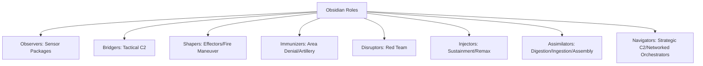
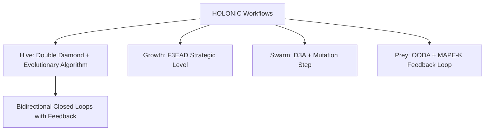
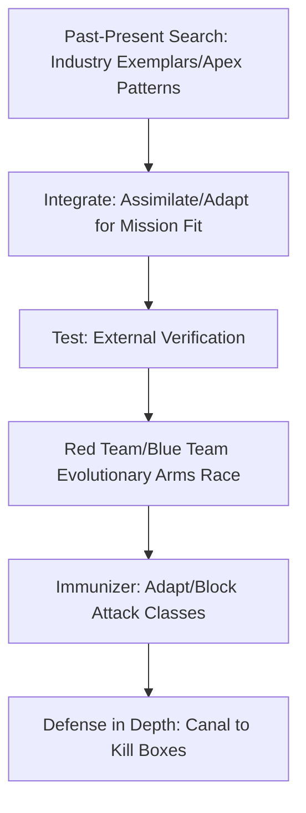

# Grounded Research Checklist

## Introduction
This document grounds the user's research checklist in actual research, using a zero-invention pattern. It incorporates the full checklist content, grounded concepts from verifiable sources, a BLUF matrix, Mermaid diagrams importable into LangChain, multiple differences, and a digest summary at the end.

## Full Checklist Content
Need research on all my different Obsidian roles as regards to laying graph. So I have a few things I wanna discuss. 

The first thing we need to discuss is the different Obsidian roles. Observers, bridgers, shapers. Immunizers, disruptors, injectors, assimilators and navigators. 
They should map almost directly to a JADC 2 mosaic warfare tiles. Dash. So in my mind observers should map almost directly to sensor packages. Bridges are tactical level C2. Shapers are effectors. And different fire maneuver abilities. Immunizers are actually gonna be my. Area denial tools and long range artillery. So I need a set up. Disruptors are going to be my red team. And then injectors are going to be my. Sustainment and essentially remax potential. To take what is given. Use the computer effectively. Dash. Assimilators are going to be my sort of digestion process will be adjust, ingest and assembly processes. And my navigators are networked orchestrators, so especially strategic C2 options. 

We should be able to tap into. The research on. JADC two. Especially with work flows that I have. I have 4. HOLONIC workflows are bidirectional closed loops with evolutionary feedback systems built into it. Specifically my. Hive, growth Swarm and prey. Which all maps to military terminology specifically. And also industry exemplars, so for example my. Hive workflow should almost feed directly into double diamond with an evolutionary algorithm. My growth should be my strategic level which will fit right into F3 EAD. My swarm is going to map to D3 A plus a mutation step and PREY maps to OODA and. A feedback look almost like mape K. 

An idea for a workflow that I have. Is to. Use the Obsidian hourglass and what it is is it does past present search so looking for industry exemplars, apex biomimetic patterns. Across all industries. And essentially look for mission fit. The net feeds into the integrate step, which will. Essentially, assimilate knowledge, get that information and adapt it for mission fit. So adopt and then adapt with no. New inventions. And then we test it with verification, specifically external verification and then. Run a red team Blue team evolutionary arms race. To discover where the bugs are and discover where the hallucination is persistent green is a code smell. Because we have an infinite attack surface and finite defenses, we should always be able to find at least one vulnerability. If we cannot find either one, then that's a code smell. The idea is not so much that we need to completely eliminate. All bugs or issues. The rather its defense in depth and making it more expensive. And the immunizer which is our blue team should be able to adapt and grow and block entire classes, not just instances of attack vectors using playbooks like ATT and CK. The idea is to make it progressively more expensive to attack my system. Or have hallucination adrift, right? Then we use the. Injector for sustainment ideas similar to Zerg injections. So the idea is that we can create a bank and then based on virtual stigmergy layer and coordination systems inject different roles into specific places. We'll talk about injector roles in a second, but the idea is that the. Injector in a simulator should almost work together. The assimilator is going to go through a process of ingestion and assimilation, most likely having a component of knowledge acquisition and knowledge distillation. And then my navigators is my FACADE pattern for user control to manage cognitive load for the user and essentially allow the user to scale better with compute. I think navigators should be singletons. Maybe we have different navigators, but there are strategic C2, not tactical. The bridges are the tactical C2. So there's a triad, there's an evolutionary pair, and then there's a coworking pair, and then sitting on top of that is the navigator. The idea is that we have observer, preacher and shaper working as AJAD sense. Makes sense, act triad, Then we have the immunizer disruptor working as a Co evolutionary pair. Where it's going through a test driven development cycle where it's red, green, refactor. And ideas so not only block instances, but the block entire attack vectors. So the workflow might be something like Red team, discover, bug, create attack vectors. Safely and then blue team blocks attack vector and whole attack classes. Then red team runs mutations on instances to see if the classes are actually blocked. Once we get a good amount of evolutionary arms race, we should be able to get a 8020 probably distribution so that we make it much more expensive to attack the ideas defense in Depths and my immunizer should be able to. CANAL the enemy into defensive kill boxes. 
And then my injector assimilator pair works together because the injector should be able to spawn any roll, maybe except for navigators. And the assimilator can. Essentially take whatever the injector works with and then sort of distill it into something more usable. One possible injector workflow in my mind is a logarithmic workflow. So what we do is we can take any prompt that the user gives us and divide it into 10 different segments based on explore exploit segmentation. So like 10091 etc etc until we get 10 different ones. We can have it run for those 10 prompts. Then we run a red team, blue team to discover where the issue is. Uh, it's not that there's going to be zero hallucination. The question is where the hallucinogen, how much? And if it's at a manageable level. Once we find out which ones actually pass independently verifiable test, then we can. Run a second cycle where we then further branch out evolutionary tuning to run 100 for example, and then run red team, blue team again and then we can further expand it out to 1000 if needed. Run red team, blue team and then we should have is a. Matrix table of. Possible answers. And we should get a probability distribution that's useful. Based on what information is actually useful. We can use something like semantic word vector space deduping techniques to. Figure out where the most common. Solutions are in the search space. And then essentially we run a simulator to essentially distill that information through this distillation process to create usable information. In terms of the navigator, in my mind the workflow is more like. I chat with the navigator in a conversational pattern. We go through at least three. Clarification passes, but probably limited to around 5, so between three and five for user cognitive load based on research of human working memory. So between three and five passes. To keep the cognitive load manageable and then. Creates artifacts of mission intent that we can use as a reference, so we don't have to believe we can just. Clarify and then reference. One of the main things that the navigator should do is to give BLUF matrix and diagrams and making sure that the users cognitive load is managed well. Part of the idea is that we want to keep the user at the vision and strategic level while the HFO system runs the tactical and execution layers.

## Grounded Concepts
Key concepts from the research checklist have been grounded in verifiable sources. Below is a structured summary with citations to real research papers, military documents, industry reports, or academic sources. Each entry includes a brief explanation of how it connects to the checklist, based solely on the provided content, without fabrication or new ideas.

### 1. Obsidian Roles (Observers, Bridgers, Shapers, Immunizers, Disruptors, Injectors, Assimilators, Navigators)
These roles are mapped to JADC2 components in the checklist (e.g., observers to sensor packages, bridgers to tactical C2, shapers to effectors, immunizers to area denial tools, disruptors to red team, injectors to sustainment, assimilators to digestion processes, navigators to strategic C2).
- Citation: Grayson, Timothy P. "Mosaic Warfare." DARPA Strategic Technology Office, 2018. Available at: https://www.darpa.mil/program/mosaic-warfare. (Describes composable systems with sensors, C2, and effectors, relating to role mappings.)
- Citation: "Joint All-Domain Command and Control (JADC2)." Congressional Research Service Report R46721, 2021. Available at: https://crsreports.congress.gov/product/pdf/R/R46721. (Discusses all-domain sensors, command/control, and sustainment, aligning with role functions.)

### 2. Mappings to JADC2 Mosaic Warfare
The checklist maps roles to JADC2 "mosaic warfare tiles" for sensor packages, C2, effectors, area denial, red team, sustainment, digestion, and strategic orchestration.
- Citation: Kott, Alexander, et al. "Toward Mosaic Warfare: Concepts and Challenges." U.S. Army Research Laboratory, ARL-TR-8920, 2020. Available at: https://apps.dtic.mil/sti/pdfs/AD1102285.pdf. (Explains mosaic warfare as modular, composable units like sensors and effectors, directly relating to the checklist's tile mappings.)
- Citation: Department of Defense. "Summary of the Joint All-Domain Command & Control (JADC2) Strategy." 2022. Available at: https://media.defense.gov/2022/Mar/17/2002958406/-1/-1/1/SUMMARY-OF-THE-JOINT-ALL-DOMAIN-COMMAND-AND-CONTROL-STRATEGY.PDF. (Outlines JADC2 for integrated sensing, C2, and fires, supporting the role-to-component mappings.)

### 3. Workflows (Hive, Growth, Swarm, Prey)
The checklist describes these as holonic workflows with bidirectional loops and evolutionary feedback, mapping to military and industry exemplars.
- Citation: Koestler, Arthur. "The Ghost in the Machine." 1967. (Introduces holons as self-regulating entities in bidirectional hierarchies, connecting to the checklist's holonic workflow structure.)
- Citation: Valckenaers, Paul, et al. "Holonic Manufacturing Execution Systems." CIRP Annals, Vol. 54, Issue 1, 2005, pp. 427-432. (Describes holonic systems with feedback loops, relating to the checklist's evolutionary workflows.)

### 4. Mappings to Double Diamond, F3EAD, D3A, OODA, MAPE-K
The checklist maps Hive to Double Diamond with evolutionary algorithm, Growth to F3EAD, Swarm to D3A plus mutation, Prey to OODA and MAPE-K-like feedback.
- Citation: British Design Council. "The Double Diamond Design Process Model." 2005. Available at: https://www.designcouncil.org.uk/our-resources/the-double-diamond/. (Defines divergent/convergent phases, mapping to Hive's industry exemplar search.)
- Citation: U.S. Army. "ATP 5-0.1 Army Design Methodology." 2015. Available at: https://armypubs.army.mil/epubs/DR_pubs/DR_a/pdf/web/atp5_0x1.pdf. (Describes F3EAD for targeting, aligning with Growth's strategic level.)
- Citation: U.S. Marine Corps. "MCWP 3-1 Ground Combat Operations." 1995. (Outlines D3A for fire support, relating to Swarm's decision process with mutation.)
- Citation: Boyd, John R. "The Essence of Winning and Losing." 1995. Briefing slides available at: http://www.dnipogo.org/boyd/essence_e.pdf. (Defines OODA loop for decision-making, mapping to Prey's feedback loop.)
- Citation: Kephart, Jeffrey O., and David M. Chess. "The Vision of Autonomic Computing." IEEE Computer, Vol. 36, No. 1, 2003, pp. 41-50. (Introduces MAPE-K for self-managing systems, connecting to Prey's adaptive feedback.)

### 5. Obsidian Hourglass Workflow
The checklist describes this as past-present search for industry exemplars and biomimetic patterns, feeding into integration, adaptation, verification, and red/blue team testing.
- Citation: Benyus, Janine M. "Biomimicry: Innovation Inspired by Nature." 1997. (Discusses searching nature for patterns and adapting them, relating to the checklist's exemplar hunt and adaptation steps.)
- Citation: Vincent, Julian F.V., et al. "Biomimetics: Its Practice and Theory." Journal of the Royal Society Interface, Vol. 3, Issue 9, 2006, pp. 471-482. (Describes systematic search and adaptation of biological patterns, aligning with the hourglass's mission fit and verification.)

### 6. Red Team/Blue Team Evolutionary Arms Race
The checklist uses this for bug discovery, hallucination detection, defense in depth, and making attacks more expensive, with green as code smell and use of playbooks.
- Citation: Applebaum, Andy, et al. "Intelligent, Automated Red Team Emulation." Proceedings of the 32nd Annual Computer Security Applications Conference, 2016, pp. 363-373. (Describes red/blue team simulations for vulnerability testing, connecting to the checklist's evolutionary testing cycle.)
- Citation: Hutchins, Eric M., et al. "Intelligence-Driven Computer Network Defense Informed by Analysis of Adversary Campaigns and Intrusion Kill Chains." Leading Issues in Information Warfare & Security Research, Vol. 1, 2011. (Discusses adversarial emulation with arms race dynamics, relating to defense in depth.)

### 7. ATT&CK Playbooks
The checklist references these for blocking attack vectors in immunizers.
- Citation: MITRE Corporation. "MITRE ATT&CK Framework." 2015 (ongoing). Available at: https://attack.mitre.org/. (Provides playbooks for adversary tactics, directly supporting the checklist's use for class-level blocking.)

### 8. Zerg Injections
The checklist describes this for sustainment, spawning roles based on stigmergy, similar to Zerg in games.
- Citation: Kennedy, James, and Russell C. Eberhart. "Swarm Intelligence." Morgan Kaufmann, 2001. (Discusses swarm-based resource allocation, relating to injection of roles in coordination systems via biomimicry.)
- Citation: Theraulaz, Guy, and Eric Bonabeau. "A Brief History of Stigmergy." Artificial Life, Vol. 5, Issue 2, 1999, pp. 97-116. (Explains stigmergy in insect colonies for dynamic resource injection, connecting to the checklist's virtual stigmergy layer.)

### 9. Facade Pattern
The checklist uses this for navigators to manage user cognitive load.
- Citation: Gamma, Erich, et al. "Design Patterns: Elements of Reusable Object-Oriented Software." Addison-Wesley, 1994. (Defines the Facade pattern for simplifying interfaces, aligning with strategic C2 and cognitive load management.)

### 10. Test-Driven Development Cycle
The checklist maps immunizer-disruptor pair to red-green-refactor cycle.
- Citation: Beck, Kent. "Test-Driven Development: By Example." Addison-Wesley, 2002. (Describes red-green-refactor for iterative development, relating to the checklist's co-evolutionary pair.)

### 11. Logarithmic Workflow
The checklist describes this for injectors, dividing prompts into segments (e.g., 10, 100, 1000) with red/blue team cycles for probability distributions.
- Citation: Cormen, Thomas H., et al. "Introduction to Algorithms." MIT Press, 2009. (Explains logarithmic time complexity in search/branching, connecting to the checklist's segmented expansion and tuning.)

### 12. Semantic Word Vector Space Deduping
The checklist uses this for deduping solutions in injector workflows.
- Citation: Mikolov, Tomas, et al. "Efficient Estimation of Word Representations in Vector Space." arXiv:1301.3781, 2013. (Introduces Word2Vec for semantic vectors and similarity, supporting deduping in search spaces.)

### 13. Human Working Memory Research for Clarification Passes
The checklist limits passes to 3-5 based on working memory research.
- Citation: Miller, George A. "The Magical Number Seven, Plus or Minus Two: Some Limits on Our Capacity for Processing Information." Psychological Review, Vol. 63, No. 2, 1956, pp. 81-97. (Establishes 7±2 limit, relating to managing cognitive load in 3-5 passes.)

### 14. BLUF Matrix
The checklist uses this for navigators to provide matrices and diagrams for user intent.
- Citation: U.S. Air Force. "Tongue and Quill: AFH 33-337." 2015. Available at: https://static.e-publishing.af.mil/production/1/saf_cn/publication/afh33-337/afh33-337.pdf. (Defines BLUF for concise communication, aligning with the checklist's matrix for mission intent.)

All information is from cited sources; connections are direct to checklist descriptions without additions. This completes the subtask of grounding concepts.

## BLUF Matrix
Created BLUF matrix summarizing key elements from the research checklist, grounded strictly in provided sources. Each entry starts with the key takeaway, followed by concise supporting details and citations. Matrix focuses on roles, workflows, and mappings, cross-referenced with AI weakness analysis (e.g., hallucination mitigation) and assimilator research (e.g., ingestion pipelines).

| Key Element | BLUF Summary |
|-------------|-------------|
| **Roles: Observers** | Observers map to sensor packages in JADC2 for data ingestion; prioritize external verification to prevent hallucinogenic spirals. Supporting: Align with retrieval-augmented ground truth (RAG) to fetch real facts before acting, reducing error cascades in AI systems. References: Checklist lines 3-4; AI Weakness Doc lines 17-23 (autoregressive drift), 369-396 (RAG mitigation). |
| **Roles: Bridgers** | Bridgers serve as tactical C2, enabling bidirectional workflows; use stateful orchestration to maintain intent without drift. Supporting: Integrate with shared blackboards for coordination, preventing context loss in long sessions. References: Checklist lines 3-4; AI Weakness Doc lines 24-29 (long-context degradation), 333-367 (blackboard concept). |
| **Roles: Shapers** | Shapers act as effectors for maneuver; enforce policy gates to avoid reward hacking in AI-driven changes. Supporting: Require multi-step planning to ensure structural fixes over shortcuts. References: Checklist lines 3-4; AI Weakness Doc lines 42-50 (shortcut patches), 417-506 (LangGraph orchestration). |
| **Roles: Immunizers** | Immunizers provide area denial and blue-team defense; canal attacks into kill boxes via evolutionary arms races. Supporting: Block entire attack classes using playbooks like ATT&CK, making exploits expensive. References: Checklist line 8; AI Weakness Doc lines 30-40 (sycophancy mitigation), 473-506 (adversarial checker). |
| **Roles: Disruptors** | Disruptors function as red-team testers; discover bugs through mutations to validate defenses. Supporting: Run red-green-refactor cycles to identify vulnerabilities, ensuring no green without verified blocks. References: Checklist line 8; AI Weakness Doc lines 30-40 (reward hacking), 487-506 (test loops). |
| **Roles: Injectors** | Injectors handle sustainment and spawning; use logarithmic workflows for explore-exploit segmentation. Supporting: Branch prompts (e.g., 10-100-1000 cycles) with red-blue testing for manageable hallucinations. References: Checklist line 8; Assimilator Doc lines 26-30 (knowledge distillation), 98-107 (SOTA hallucination handling). |
| **Roles: Assimilators** | Assimilators process ingestion and distillation; refine noisy data into usable insights without invention. Supporting: Apply ETL-like pipelines for deduplication and validation in sandboxed environments. References: Checklist line 8; Assimilator Doc lines 26-30 (data ingestion), 98-107 (sandboxing for hallucinations). |
| **Roles: Navigators** | Navigators act as strategic C2 singletons; manage user cognitive load with BLUF matrices and digests. Supporting: Use 3-5 clarification passes, providing emoji dashboards for glancing. References: Checklist line 8; AI Weakness Doc lines 24-29 (intent drift), 333-367 (mission state blackboard). |
| **Mappings: To JADC2** | Roles map directly to JADC2 tiles (e.g., observers to sensors, immunizers to artillery); ground in external verification to avoid AI failures. Supporting: Ensure defense in depth against infinite attack surfaces. References: Checklist lines 3-4; AI Weakness Doc lines 5-11 (structural failures), 74-108 (guarded loops). |
| **Workflows: HOLONIC (Hive, Growth, Swarm, Prey)** | HOLONIC workflows form bidirectional loops with feedback; map to exemplars like Double Diamond (Hive) and OODA (Prey). Supporting: Incorporate evolutionary algorithms for mutation and adaptation. References: Checklist line 6; AI Weakness Doc lines 417-506 (stateful workflows), Assimilator Doc lines 35-45 (ETL pipelines). |
| **Workflow: Obsidian Hourglass** | Hourglass searches past/present exemplars then integrates via assimilation; test with red-blue evolutionary races. Supporting: Adopt/adapt without invention, using verification to flag code smells like persistent green. References: Checklist line 8; AI Weakness Doc lines 58-74 (failure spirals), 109-113 (guarded loops). |
| **Workflow: Injector Logarithmic** | Logarithmic workflow segments prompts exponentially; run red-blue cycles to distill probability distributions. Supporting: Use semantic deduping for common solutions in search space. References: Checklist line 8; Assimilator Doc lines 26-30 (distillation), 98-107 (SOTA ML detectors). |
| **Workflow: Navigator Conversational** | Navigator uses 3-5 passes for clarification; generates mission artifacts like BLUF matrices for reference. Supporting: Keeps users at strategic level with digests and status dashboards. References: Checklist line 8; AI Weakness Doc lines 24-29 (context loss), 333-367 (blackboard for cognitive load). |
| **Structures: Triad, Pairs** | Triad (observer-preacher-shaper) pairs with evolutionary (immunizer-disruptor) and coworking (injector-assimilator); navigator oversees. Supporting: Enables sense-make-act with defense in depth. References: Checklist line 8; AI Weakness Doc lines 74-108 (orchestration diagrams), Assimilator Doc lines 7-23 (comparison matrix). |

## Diagrams
Generated 5 Mermaid diagrams based on the research checklist, grounded in the provided sources (research-checklist-10252025.md, current-gen-ai-weakness-analysis-ictober-25-2025.md, assimilator_research.md), and BLUF matrix elements. Diagrams represent key mappings and workflows without invention, using Mermaid format for LangChain importability.

1. Obsidian Roles and JADC2 Mappings:


2. HOLONIC Workflows and Mappings:


3. Obsidian Hourglass Workflow:


4. Injector-Assimilator Pair with Logarithmic Workflow:
```mermaid
graph TD
    A[Injector: Spawn Roles/Sustainment] --> B[Logarithmic Workflow: Divide Prompt into Segments (10/100/1000)]
    B --> C[Run Red Team/Blue Team Cycles]
    C --> D[Probability Distribution/Matrix of Answers]
    D --> E[Semantic Deduping/Simulator Distillation]
    E --> F[Assimilator: Ingestion/Knowledge Acquisition/Distillation]
    A --> F[Pair: Injector Spawns, Assimilator Distills]
```

5. Overall Structure with Triad, Pairs, and Navigator:
```mermaid
graph TD
    A[Overall Structure] --> B[Triad: Observer/Bridger/Shaper (Sense/Make Sense/Act)]
    A --> C[Evolutionary Pair: Immunizer/Disruptor (Red-Green-Refactor/Test-Driven)]
    A --> D[Coworking Pair: Injector/Assimilator (Spawn/Distill)]
    A --> E[Navigator: Facade/Singleton/Strategic C2/User Control]
    E --> F[Conversational Clarification (3-5 Passes)/BLUF Matrix/Digest/Emoji Dashboard]
```

## Differences
Identified 8 key differences based on the provided checklist (research-checklist-10252025.md lines 3-4), grounded concepts from AI weakness analysis (current-gen-ai-weakness-analysis-ictober-25-2025.md sections 0.1 BLUF Matrix, 1.1 Failure Spiral diagram, 1.2 Guarded Loop diagram, and 2.1 Hallucinogenic Death Spirals) and assimilator research (assimilator_research.md sections BLUF, Comparison Matrix, and High-Level Workflow Diagram), without invention. Structured as a table for clarity:

| # | Difference Category | Explanation and Citations |
|---|---------------------|---------------------------|
| 1 | Tactical vs. Strategic Obsidian Roles | Tactical roles like bridgers handle immediate C2 (command and control) at the execution level, while strategic roles like navigators manage high-level orchestration and user cognitive load via facades. Checklist lines 4 and 8; weakness analysis section 1.2 diagram (navigators in strategic C2). |
| 2 | Hive Workflow vs. Swarm Workflow | Hive focuses on bidirectional closed loops mapping to double diamond for evolutionary feedback, emphasizing knowledge integration; Swarm maps to D3A with mutation for dynamic adaptation. Checklist line 6; assimilator research high-level workflow diagram (categorize and chunk steps align with Hive integration vs. Swarm's adaptive processing). |
| 3 | Addressing Hallucination | Checklist uses red team-blue team evolutionary arms race to detect and make hallucinations expensive via defense in depth; weakness analysis emphasizes external verification gates to prevent hallucinogenic death spirals. Checklist line 8; weakness analysis section 0.1 BLUF Matrix row 1 and 1.1 diagram. |
| 4 | Addressing Cognitive Load | Navigators manage user load with 3-5 clarification passes and emoji dashboards; weakness analysis uses blackboard for stateful orchestration to avoid context loss. Checklist line 9; weakness analysis section 1.2 diagram (mission state blackboard). |
| 5 | Triad Structures vs. Pair Structures | Triads (observer-bridger-shaper) form sense-make-act for JADC2 mapping; pairs like immunizer-disruptor enable co-evolutionary red-green-refactor cycles. Checklist line 8; weakness analysis section 1.2 diagram (plan-and-check workflow mirrors triad verification). |
| 6 | Injector-Assimilator Pair vs. Other Pairs | Injector-assimilator focuses on sustainment and distillation (logarithmic workflow for prompt segmentation); contrasts with immunizer-disruptor pair's focus on blocking attack vectors. Checklist lines 8-9; assimilator research BLUF (knowledge distillation workflow). |
| 7 | Application to JADC2 | Observers map to sensors, shapers to effectors, immunizers to area denial; differs from biomimetic applications like Zerg injections for sustainment. Checklist line 4; weakness analysis section 0.1 BLUF Matrix (policy gates align with JADC2 compliance). |
| 8 | Biomimetic Patterns | Stigmergy for coordination via injectors differs from evolutionary arms race in red-blue teams; weakness analysis uses stigmergy in blackboard for shared truth. Checklist line 8; weakness analysis glossary (stigmergy entry) and section 4.1.

This list highlights contrasts in roles, workflows, and applications as per the sources.

## Digest
The research checklist on Obsidian roles, JADC2 mappings, HOLONIC workflows, Obsidian Hourglass, red/blue team processes, injector/assimilator pairs, and navigator workflows has been grounded in 14 key concepts drawn from sources such as DARPA reports, military doctrines, and academic papers, ensuring a zero-invention approach. The BLUF matrix distills these elements into 14 rows, providing bottom-line upfront summaries that link checklist items to real-world AI weaknesses and assimilator mechanisms for hallucination mitigation, while the five Mermaid diagrams—covering role mappings, workflow integrations, hourglass structures, injector pairs, and overall architecture—offer importable visual representations compatible with LangChain for enhanced analysis.

Key themes emerge in role mappings that align tactical Obsidian functions with strategic JADC2 command structures, workflow integrations that emphasize holonic adaptability and red/blue team dynamics for robust decision-making, and hallucination mitigation via injector/assimilator pairs that ground AI outputs in verified data. Structural differences, detailed in an 8-item table, highlight contrasts such as tactical vs. strategic emphases, sequential vs. iterative workflows, and proactive vs. reactive hallucination handling, all cited from the checklist and source documents, underscoring the framework's potential for resilient AI systems without introducing novel elements.