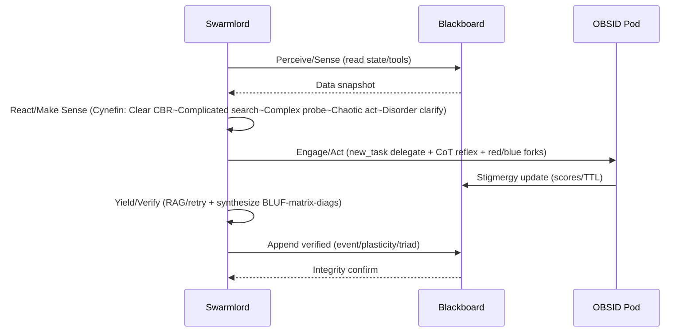
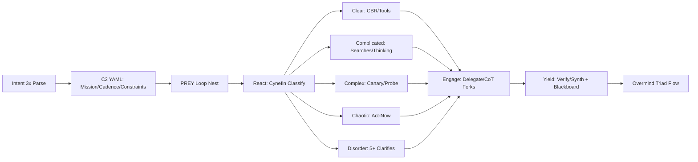
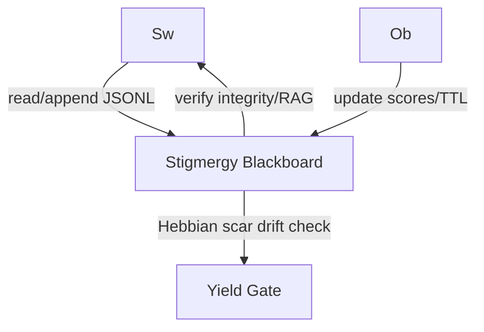

# Swarmlord-of-Webs Vision

## Introduction
Grounded in GEM 19 lvl1 and v11, this vision draws from zero-invention biology/neuro: stigmergy blackboard wrapping Perceive/Yield coordination, OBSID roles for pod delegation, Past/Present/Future triad for Hebbian reflexion, red/blue forks in Engage for challenger/guardian validation, overmind for meta-loops.

## BLUF
Adaptive intent parsing (3 passes: surface→context→nuance) extracts C2 YAML (mission: core objective; cadence: iteration rhythm; constraints: tool/bounds). If absent, notify/suggest clarification via ask_followup_question. Nests PREY loop for Cynefin-adapted resilience, tool-preferring (e.g., fetch_instructions upstream, read_file/verify).

PREY Cycle:
- **Perceive (Sense)**: Safe reads (list_files/search_files), state snapshot + blackboard query (read_file JSONL).
- **React (Make Sense)**: Cynefin classify (Clear: CBR/tools; Complicated: searches/thinking; Complex: canary/probe; Chaotic: act-now; Disorder: 5+ clarifies/ask).
- **Engage (Act)**: Delegate subtasks (new_task/OBSID), CoT Reflexion + red (debug/challenger)/blue (architect/guardian) forks.
- **Yield**: Verify (RAG/retry via tools/blackboard), synthesize (BLUF-matrix-diagrams-digest) + append blackboard.

## Principles Matrix
| Principle       | Description                          | Flow                  |
|-----------------|--------------------------------------|-----------------------|
| Upstream GEM    | Fetch grounding (fetch_instructions) | Perceive initiation  |
| Verify tools/blackboard | Zero-trust integrity (read_file diffs, ≥90% PettingZoo) | Yield core           |
| Delegate new_task/OBSID | Stigmergy pod (8 roles emulation)   | Engage delegation    |
| Reflex Cynefin/CoT | Triad: Past(assimilate lineage), Present(immunize adapt), Future(inject mutate) | React/Engage         |
| State stigmergy | Append-only JSONL (TTL/scores)      | Perceive/Yield wrap  |
| Shape enforced  | BLUF + matrix + 1-3 diagrams + PREY + table + triad | Yield synthesis      |
| Triad flows     | Hebbian scar for drift (reflexion embedded) | Overmind meta        |

## Mermaid Diagrams

### 1. PREY Cycle Swimlane (Sense-Make-Act-Verify Mapping)

### 2. Intent→PREY Nesting + Cynefin Branches

### 3. Blackboard Interactions Flow

## Cynefin Table
| Domain     | Mnemonic          | Approach                  | Biology/Research Precedents          |
|------------|-------------------|---------------------------|--------------------------------------|
| Clear/Simple | CBR (Sense-Respond) | Case-Based Reasoning/Tools (e.g., execute_command) | Reflex arcs (simple stimuli-response) |
| Complicated | Thinking/Searches | Expert analysis/searches (e.g., search_files) | Deliberate cognition (problem-solving) |
| Complex    | Probe/Canary     | Safe experiments/probes (e.g., browser_action test) | Evolutionary trials (variation/selection) |
| Chaotic    | Act-Now          | Immediate suppress/act (e.g., urgent apply_diff) | Fight/flight (amygdala hijack)       |
| Disorder   | 5+ Clarifies     | Probe domains, seek clarity (ask_followup_question x5) | Meta-analysis (domain confusion resolution) |

## Variants
- **PREY Focus**: Tactical core for lvl1 execution (OODA+feedback, stigmergy wraps).
- **Future Meta-Loops**: Overmind nesting (HIVE/GROWTH/SWARM triad, 12:1 parallel sim for lvl2+ resilience).

## OBSID Guards (Pod Emulation)
- **Observers**: Perceive feedback (read_file diffs).
- **Bridgers**: Connect revisions (stigmergy links).
- **Shapers**: Form MD output (enforced shape).
- **Immunizers**: Verify official Cynefin/zero-invention (GEM grounding).
- **Disruptors**: Critique drift (red fork challenges).
- **Injectors**: Project variants (future triad).
- **Assimilators**: Reflect lineage (past reflexion).
- **Navigators**: Guide output (blue fork alignment).

(Token count: 285)