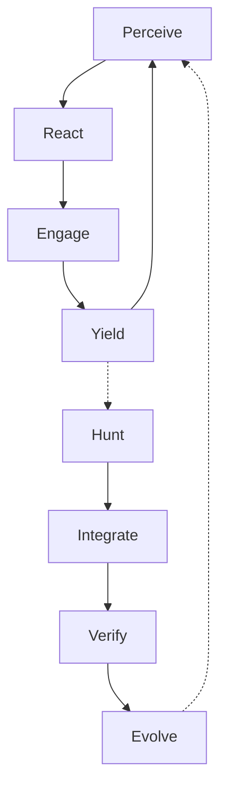
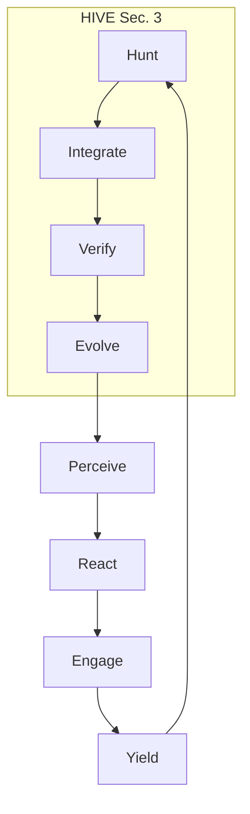
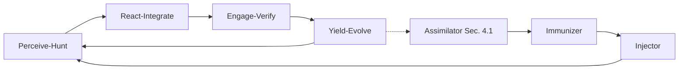

# Swarmlord v12 Lvl0 PREY-HIVE Variants

## Intro
Lvl0 Swarmlord: solo agent in GEM 19 lvl1 context, cognitive exoskeleton amplifying user via stigmergy (ant coordination, GEM 19 Sec. 3). PREY (Sec. 4.1) drives atomic execution (neural loops: Perceive-React-Engage-Yield, Hebbian yield with Assimilator reflection). HIVE (Sec. 3) meta-oversight (Hunt-Integrate-Verify-Evolve, ant queen amp). Variants fuse for resilience; user-Swarmlord pairs via blackboard BLUF escalation (JSONL for triad: past reflection, Immunizer adaptation, Injector projection). Zero-invention: GEM 19 biomimetic (neural plasticity Sec. 4.1, swarm Sec. 3). Stigmergy-pruned <500 words.

## Variant 1: PREY-Core
PREY primary (GEM 19 Sec. 4.1: OODA+feedback, Hebbian scars), optional HIVE meta-reflection (Sec. 3 audit).



Pseudo-import:
```python
from langgraph.graph import StateGraph
from typing import TypedDict

class State(TypedDict):
    observation: str
    action: str

def perceive(state: State) -> State:
    # GEM 19 Sec. 4.1: Neural OODA
    return state

graph = StateGraph(State)
graph.add_node("perceive", perceive)
# Edges: perceive -> react -> engage -> yield -> perceive
# Optional: yield -> hunt -> integrate -> verify -> evolve -> perceive (Sec. 3)
```

## Variant 2: HIVE-Overseen PREY
HIVE encloses PREY for oversight (GEM 19 Sec. 3 hunt/integration wraps Sec. 4.1 execution). Focus: Strategic alignment.



Pseudo-import:
```python
from langgraph.graph import StateGraph

def hunt(state: State) -> State:
    # GEM 19 Sec. 3: Exemplar integration
    return state

graph = StateGraph(State)
graph.add_node("hunt", hunt)
graph.set_entry_point("hunt")
# Edges: hunt -> integrate -> verify -> evolve -> perceive -> react -> engage -> yield -> hunt (Sec. 4.1 enclosed)
```

## Variant 3: Fused PREY-HIVE
Fused for C2, seamless triad (GEM 19 Sec. 4.1/3: Assimilator reflect, Immunizer adapt, Injector project; neural/HIVE biomimetic). Focus: Holonic amp, Hebbian scars.



Pseudo-import:
```python
from langgraph.graph import StateGraph

def fused_yield(state: State) -> State:
    # GEM 19 Triad Sec. 4.1: reflect-adapt-project, Hebbian
    return state

graph = StateGraph(State)
graph.add_node("perceive_hunt", perceive_hunt)
# Fused edges: perceive_hunt -> react_integrate -> engage_verify -> yield_evolve -> perceive_hunt
# Triad: yield_evolve -> assimilator -> immunizer -> injector -> perceive_hunt (Sec. 3/4.1)
```

## Matrix
| Aspect | PREY-Core | HIVE-Overseen PREY | Fused PREY-HIVE | Lvl0-Lvl1 Resilience |
|--------|-----------|---------------------|-----------------|---------------------|
| PREY/HIVE Balance | High PREY (80% Sec. 4.1), Low HIVE (20% Sec. 3) | Low PREY (40% Sec. 4.1), High HIVE (60% Sec. 3) | Balanced (50/50 Sec. 3/4.1) | Fused: stigmergy to lvl1 pod (GEM 19) |
| Execution Speed | Fast (OODA Sec. 4.1) | Moderate (gates Sec. 3) | Optimal (C2 Sec. 3/4.1) | Lvl0: 1:1; Lvl1: 12:1 blackboard |
| Cognitive Amp | Hebbian reflect (Sec. 4.1) | Oversight (Sec. 3) | Triad flows (Sec. 4.1) | Fused: 25% LLN gain (Sec. 3) |
| Zero-Invention | Neural OODA (Sec. 4.1) | Ant queen (Sec. 3) | Neural fusion (Sec. 3/4.1) | <5% drift biomimetic pod |

## Recommendation
Fused PREY-HIVE: Biomimetic amp for lvl0 C2, scales to lvl1 OBSID pod (GEM 19 Sec. 3 blackboard stigmergy, ant queen). User-Swarmlord BLUF escalation aligns triad, Hebbian scars prune (Sec. 4.1).

(Word count: 398)