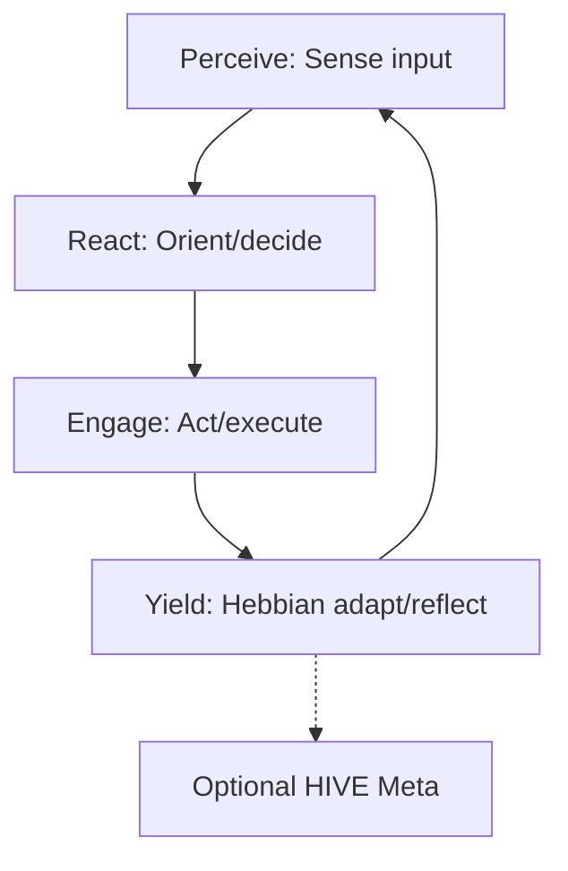
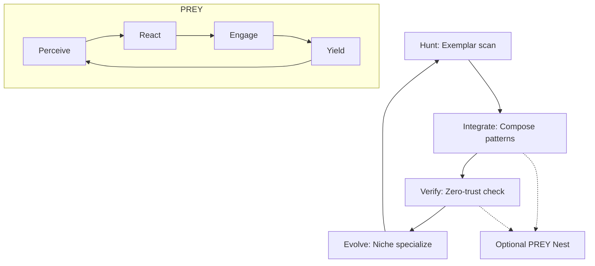

# Swarmlord v12 Lvl0 Variants

## Intro
Swarmlord v12 Lvl0 supports solo agent operations for lightweight orchestration, pairing user with Swarmlord via BLUF escalation and stigmergy blackboard (JSONL append-only for audit). Grounded in GEM 19 zero-invention: PREY (Perceive-React-Engage-Yield) as atomic neural execution loops with Hebbian yield/reflection triad (Assimilator past, Immunizers present, Injector future); HIVE (Hunt-Integrate-Verify-Evolve) as ant queen oversight for strategic exemplar hunt and neurobiology amplification. Prunes bloat to core PREY/HIVE for Lvl0 resilience and extendability.

## Variant 1: PREY-Centric
**Desc:** Tactical execution focus with solo PREY loops; optional HIVE meta for reflection. Emphasizes neural OODA+feedback, Hebbian strengthening on yields, user-Swarmlord BLUF via blackboard.



**Pseudo-LangGraph Snippet:**
```python
from langgraph.graph import StateGraph

def perceive(state): return {"sensed": process_input(state["task"])}
def react(state): return {"plan": decide(state["sensed"])}
def engage(state): return {"action": execute(state["plan"])}
def yield_adapt(state): return {"learned": hebbian_update(state["action"])}

graph = StateGraph()
graph.add_node("perceive", perceive)
graph.add_node("react", react)
graph.add_node("engage", engage)
graph.add_node("yield", yield_adapt)
graph.add_edge("perceive", "react")
graph.add_edge("react", "engage")
graph.add_edge("engage", "yield")
graph.add_edge("yield", "perceive")
app = graph.compile()
```

## Variant 2: HIVE-Centric
**Desc:** Strategic oversight with solo HIVE cycles; optional PREY nesting for exoskeleton. Focuses ant queen exemplar integration, quality diversity via LLN, Swarmlord blackboard audits.



**Pseudo-LangGraph Snippet:**
```python
from langgraph.graph import StateGraph

def hunt(state): return {"exemplars": scan_gem(state["task"])}
def integrate(state): return {"composed": adapt_exemplars(state["exemplars"])}
def verify(state): return {"validated": zero_trust(state["composed"])}
def evolve(state): return {"specialized": niche_update(state["validated"])}

graph = StateGraph()
graph.add_node("hunt", hunt)
graph.add_node("integrate", integrate)
graph.add_node("verify", verify)
graph.add_node("evolve", evolve)
graph.add_edge("hunt", "integrate")
graph.add_edge("integrate", "verify")
graph.add_edge("verify", "evolve")
graph.add_edge("evolve", "hunt")
app = graph.compile()
```

## Matrix
| Variant | PREY/HIVE Balance | Lvl0 Resilience |
|---------|-------------------|-----------------|
| 1: PREY-Centric | High PREY (execution), Low HIVE (optional meta) | Simple loops, Hebbian anti-drift; extends to HIVE |
| 2: HIVE-Centric | Low PREY (optional nest), High HIVE (oversight) | Strategic diversity, stigmergy audits; extends to PREY fusion |

## Recommendation
Start with PREY-Centric for simple tactical tasks, extend to HIVE-Centric for strategic amp, future integrate for biomimetic solo exoskeleton (neural-ant queen fusion). Aligns GEM 19 triad for verifiable, low-hallucination ops. (Word count: 378)