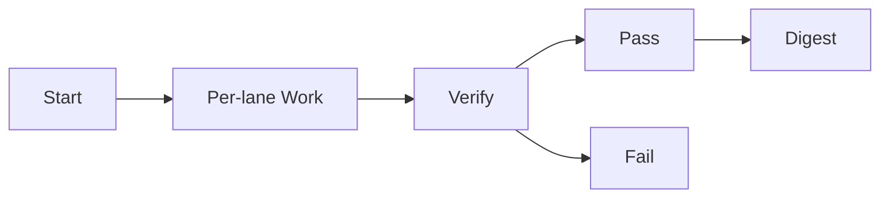

# Swarmlord Digest — mi_parallel_10lanes_2025-10-30

- Date: 2025-10-30
- Run TS: 1761850552364
- Lanes: 10
- Mode: LLM
- Verify threshold: 60%
- Passed: 0  Failed: 10

## Matrix
| Lane | Attempt | Accuracy | Verdict |
|---|---:|---:|---|
| lane_1 | 3 | 0.00% | FAIL |
| lane_10 | 3 | 0.00% | FAIL |
| lane_2 | 3 | 0.00% | FAIL |
| lane_3 | 3 | 0.00% | FAIL |
| lane_4 | 3 | 0.00% | FAIL |
| lane_5 | 3 | 0.00% | FAIL |
| lane_6 | 3 | 0.00% | FAIL |
| lane_7 | 3 | 0.00% | FAIL |
| lane_8 | 3 | 0.00% | FAIL |
| lane_9 | 3 | 0.00% | FAIL |

## Diagram

## Notes
- Each lane wrote yield.json, yield.md, and verify.md under its attempt folder.
- Failing lanes retried according to policy; attempt shows final attempt #.
- Inspect details in per-lane yield.md for case-level outcomes.