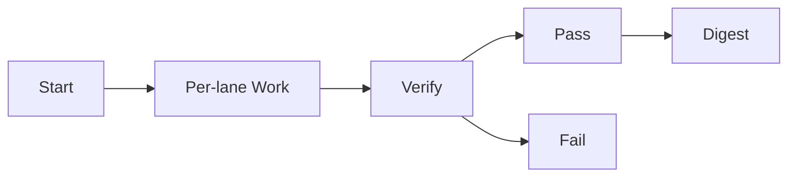

# Swarmlord Digest — mi_parallel_10lanes_2025-10-30

- Date: 2025-10-30
- Run TS: 1761850703499
- Lanes: 10
- Mode: LLM
- Verify threshold: 60%
- Passed: 10  Failed: 0

## Matrix
| Lane | Attempt | Accuracy | Verdict |
|---|---:|---:|---|
| lane_1 | 1 | 100.00% | PASS |
| lane_10 | 1 | 100.00% | PASS |
| lane_2 | 1 | 100.00% | PASS |
| lane_3 | 1 | 100.00% | PASS |
| lane_4 | 1 | 100.00% | PASS |
| lane_5 | 1 | 100.00% | PASS |
| lane_6 | 1 | 100.00% | PASS |
| lane_7 | 1 | 100.00% | PASS |
| lane_8 | 1 | 100.00% | PASS |
| lane_9 | 1 | 100.00% | PASS |

## Diagram

## Notes
- Each lane wrote yield.json, yield.md, and verify.md under its attempt folder.
- Failing lanes retried according to policy; attempt shows final attempt #.
- Inspect details in per-lane yield.md for case-level outcomes.