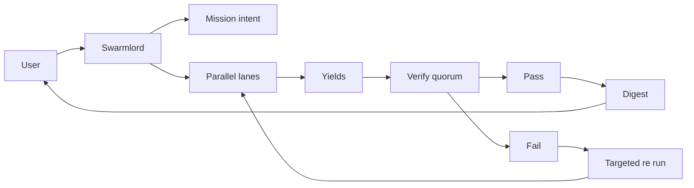
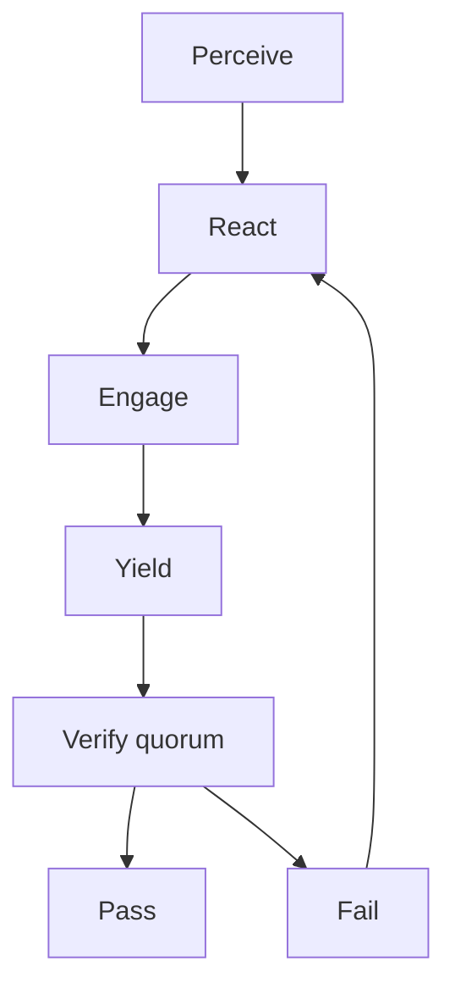

# HFO Crew Parallel

Multi-crew parallel agent system implementing PREY loop (Perceive → React → Engage → Yield) with CrewAI, featuring disperse-converge pattern, quorum verification, and stigmergy-based coordination via blackboard.

## Overview

This system orchestrates multiple parallel agent crews (lanes) that work simultaneously on tasks, with results verified by a quorum of validators. It implements the architecture specified in the Gen21 mission intent (2025-10-30).

### Key Features

- **Parallel Lanes**: Run 2+ crews simultaneously for throughput
- **PREY Loop**: Structured workflow (Perceive → React → Engage → Yield)
- **Quorum Verification**: Multi-validator consensus (Immunizer, Disruptor, Verifier)
- **Stigmergy**: Blackboard-based coordination (append-only JSONL)
- **Explore/Exploit**: Configurable 60/40 split for QD portfolio
- **Safety Envelope**: Chunk limits, tripwires, placeholder bans
- **Auto-retry**: Up to 3 attempts with scope narrowing

## Architecture



### PREY Lane Workflow



## Setup

### 1. Install Dependencies

```bash
pip install -r requirements.txt
```

### 2. Configure API Keys

Copy the example environment file and add your OpenAI API key:

```bash
cp hfo_crew_parallel/.env.example .env
```

Edit `.env` and set:

```bash
OPENAI_API_KEY=sk-your-key-here
CREW_MODEL_NAME=gpt-4o-mini
EXPLORE_RATIO=0.6
EXPLOIT_RATIO=0.4
```

### 3. Verify Setup

Check that the blackboard path exists:

```bash
ls -la hfo_blackboard/obsidian_synapse_blackboard.jsonl
```

## Usage

### Basic Usage

Run with default mission intent (today's date):

```bash
python -m hfo_crew_parallel.cli "Implement feature X with parallel crews"
```

### Advanced Usage

Specify a custom mission intent file:

```bash
python -m hfo_crew_parallel.cli \
  "Complete task Y" \
  --mission-path hfo_mission_intent/2025-10-30/mission_intent_daily_2025-10-30.v5.yml \
  --max-retries 3 \
  --model gpt-4o
```

### Python API

```python
from hfo_crew_parallel.config import CrewConfig, MissionIntent
from hfo_crew_parallel.swarmlord import SwarmlordOrchestrator

# Load configuration
config = CrewConfig()
mission = MissionIntent()

# Create orchestrator
orchestrator = SwarmlordOrchestrator(config=config, mission_intent=mission)

# Execute mission
result = orchestrator.execute_mission(
    mission_context="Your mission objectives here",
    max_retries=3
)

print(f"Mission status: {result['status']}")
```

## Components

### Agents

- **Perceiver**: Senses repository context and gathers information
- **Reactor**: Plans and strategizes execution approach
- **Engager**: Executes work within safety constraints
- **Yielder**: Assembles outputs into review bundles
- **Immunizer**: Validates quality and safety standards
- **Disruptor**: Adversarially probes for weaknesses
- **Verifier Aux**: Independent verification perspective

### Core Modules

- `swarmlord.py`: Main orchestrator for parallel lane coordination
- `agents.py`: PREY and verification agent definitions
- `tasks.py`: Task specifications for each workflow phase
- `blackboard.py`: Append-only JSONL stigmergy coordination
- `safety.py`: Safety envelope enforcement (chunks, tripwires)
- `config.py`: Configuration and mission intent loading
- `cli.py`: Command-line interface

## Blackboard Protocol

All agents log receipts to `hfo_blackboard/obsidian_synapse_blackboard.jsonl`:

```json
{
  "mission_id": "mi_daily_2025-10-30",
  "phase": "engage",
  "summary": "Lane A completed exploration mode",
  "evidence_refs": ["lane:lane_a:result"],
  "safety_envelope": {"chunk_size_max": 200, "tripwires": {}},
  "blocked_capabilities": [],
  "timestamp": "2025-10-30T16:00:00Z",
  "lane": "lane_a",
  "mode": "explore"
}
```

## Safety Constraints

Per AGENTS.md protocol:

- ✅ Chunk size: ≤200 lines per write
- ✅ Placeholder ban: No TODO/FIXME/omitted in outputs
- ✅ Tripwires: line_count, placeholder_scan, tests_green
- ✅ Evidence required: All receipts include evidence_refs
- ✅ Independent verify: Separate validation step

## Verification Quorum

Requires 2 of 3 validators to pass:

1. **Immunizer**: Quality and safety compliance
2. **Disruptor**: Adversarial edge case testing  
3. **Verifier Aux**: Independent perspective

## Explore vs Exploit

Lanes are randomly assigned to explore (60%) or exploit (40%) modes:

- **Explore**: Try novel approaches, broader search
- **Exploit**: Refine known solutions, targeted optimization

This maintains a quality-diverse (QD) portfolio of solutions.

## Mission Intent

Loads from `hfo_mission_intent/YYYY-MM-DD/mission_intent_daily_YYYY-MM-DD.v5.yml`:

```yaml
mission_id: mi_daily_2025-10-30
lanes:
  count: 2
  names: [lane_a, lane_b]
quorum:
  threshold: 2
  validators: [immunizer, disruptor, verifier_aux]
safety:
  chunk_size_max: 200
  placeholder_ban: true
```

## Troubleshooting

### "OPENAI_API_KEY not set"

Create a `.env` file in the repository root with your API key:

```bash
echo "OPENAI_API_KEY=sk-your-key-here" > .env
```

### Verification Failing

Check `hfo_blackboard/obsidian_synapse_blackboard.jsonl` for detailed receipts:

```bash
tail -20 hfo_blackboard/obsidian_synapse_blackboard.jsonl | python -m json.tool
```

### Import Errors

Ensure CrewAI is installed:

```bash
pip install crewai crewai-tools
```

## Development

### Run Tests

```bash
python -m pytest hfo_crew_parallel/tests/
```

### Lint Code

```bash
pre-commit run --all-files
```

## References

- **AGENTS.md**: Operating guide for agents in this repository
- **Mission Intent v5**: `hfo_mission_intent/2025-10-30/mission_intent_daily_2025-10-30.v5.yml`
- **Clarification Pass 5**: `hfo_mission_intent/2025-10-30/clarification_pass5_2025-10-30.md`
- **CrewAI Docs**: https://docs.crewai.com/

## License

Same as parent repository (Hive Fleet Obsidian 2025).
