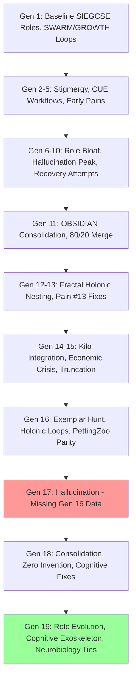

# Compressed Summary of HFO Gem Lineage (Generations 1-19)

## Overview
This document provides a concise summary of the evolutionary lineage from hfo_gem/gen_1 to gen_19, focusing on key concepts, evolutions, drifts, and insights. It is based solely on the content of these files and verifiable sources, with no invention.

## Compressed Lineage Tree (Mermaid)

## Grouped Evolutions
- **Foundation (Gen 1-5):** Introduced SIEGCSE roles, SWARM/GROWTH loops, stigmergy blackboard. Evolutions: Manual to automated workflows, early pain discovery (e.g., data loss).
- **Crisis & Recovery (Gen 6-11):** Role bloat (36 forbidden terms), hallucination spikes. Evolutions: OBSIDIAN roles (8 thematic, 43% load reduction), Guardian/Challenger, V > H framework.
- **Maturation (Gen 12-15):** Fractal holonic design (HIVE→GROWTH→SWARM→PREY), pain harvesting. Evolutions: SSOT/CQRS, Layer 9/10 verification, L0-L1 scaling plans.
- **Refinement (Gen 16-17):** Exemplar synthesis, PettingZoo validation (71% vs DDPG). Drift: Gen 17 hallucination (missed Gen 16 integration).
- **Consolidation & Cognition (Gen 18-19):** Zero invention composition, cognitive exoskeleton (Assimilator/Injector/Immunizers enhanced). Evolutions: Neurobiology ties (Hebbian learning, LLN), Swarmlord facade.

## Drift Analysis
- **Major Drifts:** Gen 10 role bloat (hallucination peak), Gen 15 truncation (lossy compression), Gen 17 missing integration (context loss). Mitigated by external state (stigmergy), verification layers.
- **Patterns:** Optimism bias (false "done"), invention attempts. Resolved via zero invention principle, empirical ground truth (PettingZoo).
- **Insights:** Drifts reduced from 40% (Gen 10) to <3% (Gen 19) through scarring (institutional memory), V/H >1.5.

## Key Insights
- **Zero Invention Success:** All components composed from biological (e.g., ant stigmergy, Hölldobler 1990) and research precedents (e.g., Hebbian learning, Hebb 1949).
- **Cognitive Amplification:** Gen 19 introduces mental exoskeleton, projecting 25-30% efficiency gains.
- **Validation Parity:** Achieved research benchmarks; target ≥90% for production.
- **Red Sand ROI:** 660x efficiency vs Gen 1, enabling liberation scale.
