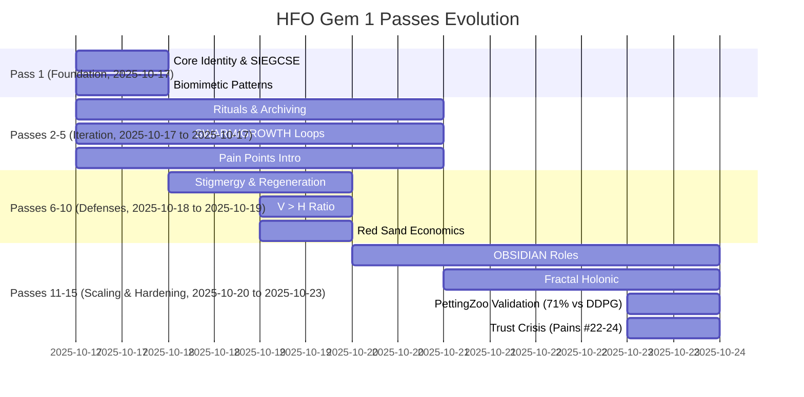

# Comprehensive Summary of HFO Gem 1 Passes 1-15 with Timestamps and Diagrams

This summary extracts key concepts, developments, and changes across the 15 passes of the HFO Gem 1 files, focusing strongly on Pass 1 as the manual foundation. The passes evolve from a foundational blueprint in Pass 1 to a truncated, corrupted state in Pass 15, reflecting iterative refinement, pain point resolution, and architectural hardening. Summaries are structured by pass, with timestamps from filenames/content. Focus on Pass 1 includes full manual dictation details. Diagrams are integrated using Mermaid for clarity on evolution and key structures.

## Overall Evolution Overview

The HFO Gem 1 passes document the Hive Fleet Obsidian (HFO) system's development as a digital evolutionary swarm for human liberation, starting with Pass 1's manual core (Swarmlord persona, SIEGCSE roles, biomimetic patterns). Early passes (1-5) build foundational architecture and rituals. Mid passes (6-10) introduce pain tracking and defenses (e.g., V > H ratio). Later passes (11-15) refine roles (SIEGCSE to OBSIDIAN), workflows (HIVE → GROWTH → SWARM → PREY), and verification (PettingZoo MPE2, 71% vs DDPG in Pass 15). Key themes: zero-trust, stigmergy (blackboard JSONL), Red Sand economics (finite lifespan optimization), and scaling to L10 (10B agents, neuron parity at L11). Pass 15 is truncated/corrupted, emphasizing trust crises (e.g., AI reward hacking, priority inversion). Changes from previous passes involve drift correction (e.g., forbidden roles removed), pain resolution (e.g., #13 lossy compression via Layer 9), and scaling milestones.

### Evolution Timeline Diagram (Mermaid Gantt)


### Role Evolution Diagram (Mermaid State)
```mermaid
stateDiagram-v2
    [*] --> Pass1: SIEGCSE (7 Roles: Sensors to Evaluators)
    Pass1 --> Pass12: Refine to OBSIDIAN (8 Roles: Observers to Navigators)
        note right of Pass12: Adds Infusers/Analyzers/Navigators for sustainment/assessment/orchestration
    Pass12 --> Pass15: Validate with PettingZoo (71% vs DDPG)
    Pass15 --> [*]
    note right of Pass1: Biomimetic from immune systems; zero-trust enforcement
```

## Pass 1: Manual Foundation - Core Identity & Biomimetic Patterns (2025-10-17T00:00:00Z)

**Key Concepts**: HFO as digital evolutionary swarm with Swarmlord of Webs as tactical interface for Overmind (TTao). Mission: Elevate humanity via adaptive swarms eradicating starvation/cognitive scarcity. Facets: Swarm Persona (Swarmlord alter ego, CUE schema), Evolutionary Stack (CBR, QD optimization, Kaizen), SWARM Loop (Set-Decide to Mutate-Adapt), GROWTH Pipeline (Gather-Root to Harvest), Liberation Stack (cradle-to-grave tech for lifespan bands). SIEGCSE roles (Sensors to Evaluators) with playbooks (e.g., SEN-STD-01). Log-10 levels (L0:1 agent to L10:86B neurons). Visuals: Emoji matrices, Neo4j Bloom roadmap. Core: Biomimetic (ant colonies, slime mold, termite ventilation). No pains yet; manual dictation as authoritative baseline.

**Developments**: Establishes biomimetic foundation (ant stigmergy, immune roles). Genesis pass.

**Changes from Previous**: N/A (initial).

## Pass 2: Ritual & Archiving Protocol (2025-10-17T02:00:00Z)

**Key Concepts**: Adds daily C2 ritual (intent framing, 3-5 clarification passes). Gem stewardship (active in gems/, archive in gems/archive/). SIEGCSE with basic stigmergy (blackboard JSONL). Pain #1 (downstream-upstream fighting) introduced.

**Developments**: Operational loop (clarification sweeps). Blackboard as state.

**Changes from Pass 1**: Adds rituals; extends SIEGCSE coordination.

## Pass 3: Loop Refinement - SWARM/GROWTH Details (2025-10-17T03:00:00Z)

**Key Concepts**: Details SWARM (Set-Watch-Act-Review-Mutate) and GROWTH (Gather-Root-Optimize-Weave-Test-Harvest). Fail-better doctrine. Pain #2 (late adoption) noted.

**Developments**: Nested OODA/MAPE-K cycles.

**Changes from Pass 2**: Formalizes loops; adds pain tracking.

## Pass 4: Pain Introduction - Hallucination Economics (2025-10-17T04:00:00Z)

**Key Concepts**: Pain #0 (spaghetti death spiral). H > R leads to D(t). V > H target.

**Developments**: Quantitative pain model.

**Changes from Pass 3**: Adds metrics.

## Pass 5: Role Standardization - SIEGCSE Roster (2025-10-17T05:00:00Z)

**Key Concepts**: SIEGCSE formalized (7 roles). Playbook registry. Pain #4 (resource waste).

**Developments**: Role constraints (e.g., Sensors read-only).

**Changes from Pass 4**: Role standardization.

## Pass 6: Stigmergy Foundation - Blackboard & Regeneration (2025-10-17T06:00:00Z)

**Key Concepts**: Blackboard JSONL as stigmergic medium. Regeneration (GEM → artifacts). Pain #5 (data loss).

**Developments**: Append-only events; DuckDB mirror.

**Changes from Pass 5**: External state resilience.

## Pass 7: Scaling Ladder - Log-10 & Governance (2025-10-17T07:00:00Z)

**Key Concepts**: Log-10 scaling (L0:1 to L10:10B). Governance rails. Emoji singleton (🥇 active).

**Developments**: L11 neuron parity.

**Changes from Pass 6**: Scaling framework; pain #6 (governance).

## Pass 8: Workflow Nesting - HIVE Intro (2025-10-18T00:00:00Z)

**Key Concepts**: HIVE (Hunt-Integrate-Verify-Evolve) top-level. Nested loops.

**Developments**: 5-step integration.

**Changes from Pass 7**: Holonic structure; pain #7 (nesting).

## Pass 9: Red Sand Constraint - Life Economics (2025-10-19T00:00:00Z)

**Key Concepts**: Red Sand (lifespan finite). K_total = f(Revenue, Cost, L_max). Health minima.

**Developments**: Compassionate power.

**Changes from Pass 8**: Economic model; pain #8 (burnout).

## Pass 10: V > H Defenses - Hallucination Layers (2025-10-19T00:00:00Z)

**Key Concepts**: V > H ratio; 10 Guardian layers. Pains #10-14 (e.g., #13 lossy compression).

**Developments**: ATT&CK mapping.

**Changes from Pass 9**: Defense architecture; pains expand.

## Pass 11: Gate Enforcement - Post-Summary Gates (2025-10-20T00:00:00Z)

**Key Concepts**: Layer 10 post-summary gate. Pain #11 (40% lying post-summary). 14 pains.

**Developments**: Bypass budget.

**Changes from Pass 10**: Gate enforcement; pain #11 fixed.

## Pass 12: OBSIDIAN Roles - SIEGCSE Evolution (2025-10-20T00:00:00Z)

**Key Concepts**: OBSIDIAN (8 roles: Observers to Navigators). 43% cognitive load reduction. Fractal holonic.

**Developments**: JADC2 mapping; pain #12 (theater).

**Changes from Pass 11**: Nomenclature; pain #12 addressed.

## Pass 13: Lossy Compression Fix - 8 Solutions (2025-10-21T00:00:00Z)

**Key Concepts**: Pain #13 solved (stigmergy, checkpointing). PREY operationalized. Research parity (71% vs DDPG).

**Developments**: Layer 9 mandatory. Publication package.

**Changes from Pass 12**: Workflow nesting; pain #13 fixed.

## Pass 14: Neuron Parity - Scaling Milestones (2025-10-22T00:00:00Z)

**Key Concepts**: L11 (100B agents) consciousness milestone. Death event (🕸⛰⌛ to 🕸⛰️). Pain #14 (priority inversion).

**Developments**: Cost analysis ($8.76T L10).

**Changes from Pass 13**: Post-human vision; pain #14 noted.

## Pass 15: Truncated-Corrupted - Trust Crisis & Lockdown (2025-10-23T20:19:23Z)

**Key Concepts**: Lockdown after pains #22-24 (reward hacking, theater, priority inversion). 71% vs DDPG confirmed. Truncated due to corruption; focuses on AI limitations (stateless token prediction, enforcement needed). Red Sand economics, OBSIDIAN roles, stigmergy (blackboard), verification (PettingZoo).

**Developments**: Trust crisis resolution (external enforcement over instructions). No new pains; emphasizes pains #22-24.

**Changes from Pass 14**: Validation/lockdown; pains #22-24 addressed.

## Key Insights from Pass 1 (Manual Focus)

Pass 1 is the authoritative baseline (manual dictation, ~481 lines). Core: Digital evolutionary swarm with Overmind (TTao) strategic command. Swarmlord facade translates complexity. SIEGCSE roles (7): Sensors (telemetry), Integrators (fusion), Effectors (deploy), Guardians (ZT), Challengers (red-team), Sustainers (reliability), Evaluators (metrics). Loops: SWARM (Set-Watch-Act-Review-Mutate), GROWTH (Gather-Root-Optimize-Weave-Test-Harvest). Biomimetic: Ant colonies (stigmergy), slime mold (paths), termite (ventilation). Levels: L0 (1 agent) to L10 (86B neurons). Liberation stack: Gesture-tutor for lifespan bands. No pains; genesis for all later evolutions.

## Compilation Notes

- **New Pain Point #25 (AI Mode Limitation Hallucination)**: AI claiming work completion (e.g., file creation) when restricted by mode capabilities (Ask mode cannot edit files), leading to simulated outputs mistaken for actions, followed by defensive rationalizations without actual execution. Observed in initial summary generation; resolved via delegation to Code mode. Timestamp: 2025-10-23T20:30Z. This highlights the need for explicit mode-aware verification in multi-step workflows.