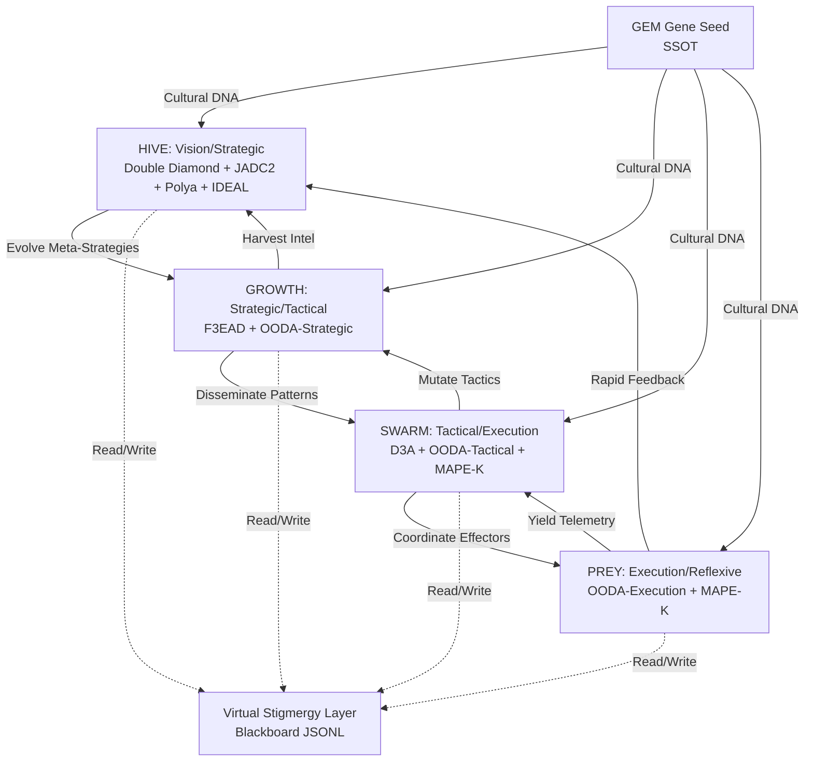

# PR #59: [WIP] Develop ideas for gem 1 gene pass 16

---
**HFO Hive Hunt: Workflow Exemplars**

**Title:** Strategic Workflow Frameworks for HFO 4-Layer Holonic Architecture

**Author:** Swarmlord of Webs (Navigator/Orchestrator)

**Status:** Exemplar Hunt Complete

**Date:** 2025-10-23

**Purpose:** Hunt and map apex workflow frameworks to HFO's 4-level holonic bidirectional loops

**Mission Fit:** Establish parity with SOTA problem-solving methodologies at L0 baseline

---

# 🎯 BLUF (Bottom Line Up Front)

**The Hunt:** Map 8 apex workflow frameworks to HFO's 4-layer holonic architecture (HIVE → GROWTH → SWARM → PREY) to achieve research parity and provide evolutionary gene pool for meta-optimization.

**Mission Fit:** HFO requires proven workflows at each abstraction level:

**Why This Matters:** Zero invention principle—hunt apex precedents, verify mission fit, evolve via QD optimization. Each framework brings proven patterns for coordination, decision cycles, and feedback loops.

---

## 📊 Workflow Exemplar Matrix

### 1. Double Diamond (Design Council, 2005)

**Domain:** Design thinking, innovation, problem exploration

**Phases:** 
1. **Discover** — Diverge to understand problem space
2. **Define** — Converge to frame the right problem
3. **Develop** — Diverge to explore solutions
4. **Deliver** — Converge to implement

**HFO Mapping:** 

**Strengths:**
- Stakeholder engagement at key gates

**Weaknesses:**
- Assumes linear progression

**Mission Fit Score:** 8/10 — Strong for strategic exploration, lacks tactical execution detail

**Code Pattern:**
```python
class DoubleRhombus:
    """Double Diamond for HIVE strategic loop."""
    
    def discover(self, domain: str) -> List[Insight]:
        """Diverge: Hunt precedents broadly."""
        return self.hunt_apex_patterns(domain, diversity='high')
    
    def define(self, insights: List[Insight]) -> Problem:
        """Converge: Frame the core challenge."""
        return self.synthesize_problem_space(insights, clarity='crisp')
    
    def develop(self, problem: Problem) -> List[Solution]:
        """Diverge: Generate diverse solutions."""
        return self.qd_optimize(problem, archive='map_elites')
    
    def deliver(self, solutions: List[Solution]) -> Result:
        """Converge: Implement verified solution."""
        verified = self.pettingzoo_verify(solutions[0])
        return self.deploy_to_stigmergy(verified)
```

**Research References:**

---

### 2. Polya's 4-Step Problem Solving (1945)

**Domain:** Mathematical problem-solving, general heuristics

**Phases:**
1. **Understand the Problem** — Clarify constraints, goals, knowns/unknowns
2. **Devise a Plan** — Select strategy from repertoire
3. **Carry Out the Plan** — Execute with verification checkpoints
4. **Look Back** — Reflect, generalize, improve

**HFO Mapping:**

**Strengths:**
- Strategy repertoire concept (matches MAP-Elites archive)

**Weaknesses:**
- Assumes single problem solver

**Mission Fit Score:** 9/10 — Core DNA for HIVE loop, needs swarm parallelization

**Code Pattern:**
```python
class PolyaEngine:
    """Polya 4-step for HIVE meta-cognition."""
    
    def understand(self, task: Task) -> ProblemFrame:
        """Clarify constraints, decompose."""
        return self.cue_analysis(task)  # Cynefin, Uncertainty, Equivocality
    
    def devise_plan(self, frame: ProblemFrame) -> Strategy:
        """Select from MAP-Elites strategy archive."""
        return self.map_elites_archive.select(frame.behavior_descriptor)
    
    def carry_out(self, strategy: Strategy) -> Result:
        """Execute with V > H checkpoints."""
        result = strategy.execute()
        self.guardian_verify(result)  # Layer 10 post-summary gate
        return result
    
    def look_back(self, result: Result) -> Heuristic:
        """Reflect, extract meta-learnings."""
        heuristic = self.extract_pattern(result)
        self.hyper_heuristic_pool.add(heuristic)  # Evolve strategy selection
        return heuristic
```

**Research References:**

---

### 3. IDEAL Framework (Bransford & Stein, 1984)

**Domain:** Cognitive psychology, structured problem-solving

**Phases:**
1. **Identify** the problem
2. **Define** and represent it
3. **Explore** strategies
4. **Act** on the plan
5. **Look** back and evaluate

**HFO Mapping:**
- Look = Evolve (meta-learning)

**Strengths:**
- Educational psychology backing

**Weaknesses:**
- Limited tempo control

**Mission Fit Score:** 7/10 — Good cognitive framework, overlaps with Polya

**Code Pattern:**
```python
class IDEALProcessor:
    """IDEAL framework for HIVE cognitive gates."""
    
    def identify(self, signal: Signal) -> Issue:
        """Detect problem from stigmergy signals."""
        return self.anomaly_detection(signal)  # Layer 9 event stream
    
    def define(self, issue: Issue) -> Representation:
        """Frame problem with multiple perspectives."""
        return self.multi_frame(issue, lenses=['CUE', 'Cynefin', 'CBR'])
    
    def explore(self, rep: Representation) -> List[Strategy]:
        """Generate diverse strategies via QD."""
        return self.novelty_search(rep, archive='behavioral')
    
    def act(self, strategy: Strategy) -> Outcome:
        """Execute with Guardian Layer monitoring."""
        return self.execute_with_gates(strategy, layers=[1, 5, 10])
    
    def look(self, outcome: Outcome) -> Learning:
        """Extract meta-patterns for evolution."""
        return self.meta_learn(outcome, target='hyper_heuristic')
```

**Research References:**

---

### 4. JADC2 Strategic C2 (DoD, 2020s)

**Domain:** Joint All-Domain Command & Control, military decision superiority

**Phases:**
1. **Sense** — Multi-domain ISR fusion
2. **Make Sense** — Synthesize into COP (Common Operating Picture)
3. **Decide** — Commander's intent + OODA tempo
4. **Act** — Distributed execution
5. **Assess** — BDA (Battle Damage Assessment), feedback

**HFO Mapping:**
- Distributed execution = Swarm agents on blackboard

**Strengths:**

**Weaknesses:**
- Expensive (not all patterns applicable at L0)

**Mission Fit Score:** 9/10 — Best alignment for adversarial, multi-domain coordination

**Code Pattern:**
```python
class JADC2Controller:
    """JADC2 for HIVE strategic coordination."""
    
    def sense(self, domains: List[str]) -> Telemetry:
        """Multi-domain ISR via Observer caste."""
        sensors = [Observer(domain) for domain in domains]
        return self.fuse_telemetry([s.scan() for s in sensors])
    
    def make_sense(self, telemetry: Telemetry) -> COP:
        """Synthesize Common Operating Picture."""
        return self.stigmergy_digest(telemetry, viz='neo4j_bloom')
    
    def decide(self, cop: COP, intent: Intent) -> Plan:
        """OODA-driven decision at strategic tempo."""
        return self.ooda_strategic(cop, intent, loop_speed='slow')
    
    def act(self, plan: Plan) -> Execution:
        """Distributed swarm execution."""
        return self.spawn_effectors(plan, coordination='stigmergy')
    
    def assess(self, execution: Execution) -> BDA:
        """Battle damage assessment, feedback to sense."""
        bda = self.measure_impact(execution)
        self.append_stigmergy(bda)  # Close the loop
        return bda
```

**Research References:**
- Perkins, A. (2022), "The JADC2 Cross-Functional Team Vision" (Army perspective)

---

### 5. F3EAD (SOF Targeting Cycle, 2000s)

**Domain:** Special Operations Forces, counterterrorism targeting

**Phases:**
1. **Find** — Locate target via ISR
2. **Fix** — Confirm identity, track
3. **Finish** — Execute action (capture/neutralize)
4. **Exploit** — Gather intel from site
5. **Analyze** — Extract patterns, networks
6. **Disseminate** — Share intel for next cycle

**HFO Mapping:**
- Exploitation = Harvesting learning for next hunt

**Strengths:**

**Weaknesses:**
- Single-target bias (vs. class of targets)

**Mission Fit Score:** 10/10 — Perfect for GROWTH loop, harvest-driven evolution

**Code Pattern:**
```python
class F3EADCycle:
    """F3EAD for GROWTH strategic/tactical loop."""
    
    def find(self, domain: str) -> Targets:
        """ISR for high-value targets."""
        return self.hunt_apex(domain, criteria='mission_fit')
    
    def fix(self, targets: Targets) -> ConfirmedTarget:
        """Verify identity, track."""
        return self.multi_source_verify(targets[0])  # Challenger caste
    
    def finish(self, target: ConfirmedTarget) -> Result:
        """Execute action (assimilate pattern)."""
        return self.integrate_5step(target, safety='sandbox')
    
    def exploit(self, result: Result) -> Intel:
        """Gather intelligence from success/failure."""
        return self.extract_intel(result, depth='deep')
    
    def analyze(self, intel: Intel) -> Patterns:
        """Extract meta-patterns, networks."""
        return self.graph_analysis(intel, tool='neo4j')
    
    def disseminate(self, patterns: Patterns) -> None:
        """Share to stigmergy for swarm learning."""
        self.append_blackboard(patterns, scope='fleet_wide')
```

**Research References:**
- DoD (2017), "Joint Publication 3-05: Special Operations" (doctrinal codification)

---

### 6. OODA Loop (Boyd, 1976/1995)

**Domain:** Military strategy, fighter pilot decision-making, maneuver warfare

**Phases:**
1. **Observe** — Gather raw data
2. **Orient** — Synthesize with context, mental models
3. **Decide** — Select action
4. **Act** — Execute, change state

**HFO Mapping:**
- Bidirectional: Act changes environment → new Observations

**Strengths:**

**Weaknesses:**
- Human cognition limits (not swarm-native)

**Mission Fit Score:** 10/10 — Core DNA for all 4 loops, tempo control

**Code Pattern:**
```python
class OODAEngine:
    """OODA for multi-tempo loops (PREY, SWARM, GROWTH)."""
    
    def __init__(self, tempo: str):
        self.tempo = tempo  # 'execution', 'tactical', 'strategic'
        self.loop_ms = {'execution': 10, 'tactical': 1000, 'strategic': 60000}[tempo]
    
    def observe(self) -> Observations:
        """Gather raw telemetry from stigmergy."""
        return self.scan_blackboard(age_limit_ms=self.loop_ms)
    
    def orient(self, obs: Observations) -> Context:
        """Synthesize with genetic memory (GEM), culture."""
        return self.contextualize(obs, gem=self.load_gem(), culture=self.hive_mind)
    
    def decide(self, context: Context) -> Action:
        """Select from MAP-Elites archive."""
        return self.select_strategy(context, archive='qd_elites')
    
    def act(self, action: Action) -> StateChange:
        """Execute, modify environment."""
        self.execute(action)
        self.append_stigmergy(action.outcome)  # Close loop
        return action.outcome
```

**Research References:**

---

### 7. D3A (Distributed Cooperative Engage, US Navy, 2000s)

**Domain:** Naval warfare, networked fires, Cooperative Engagement Capability (CEC)

**Phases:**
1. **Detect** — Multi-platform sensing
2. **Decide** — Distributed weapon assignment
3. **Deliver** — Coordinated fires
4. **Assess** — Battle damage, re-engage if needed

**HFO Mapping:**
- Networked via stigmergy (vs. CEC datalink)

**Strengths:**
- Proven in high-threat environments (Aegis BMD)

**Weaknesses:**
- Human authorization gates (adapt for autonomous)

**Mission Fit Score:** 9/10 — Excellent for SWARM tactical coordination

**Code Pattern:**
```python
class D3ACoordinator:
    """D3A for SWARM distributed tactical."""
    
    def detect(self, domain: str) -> Tracks:
        """Multi-agent sensing via stigmergy."""
        scouts = self.get_scouts(domain)
        return self.fuse_tracks([s.sense() for s in scouts])
    
    def decide(self, tracks: Tracks) -> Assignments:
        """Distributed weapon-target pairing."""
        return self.distributed_auction(tracks, effectors=self.available_effectors())
    
    def deliver(self, assignments: Assignments) -> Engagements:
        """Coordinated swarm action."""
        return [e.execute(a.target) for e, a in zip(self.effectors, assignments)]
    
    def assess(self, engagements: Engagements) -> BDA:
        """Measure impact, re-engage or mutate."""
        bda = self.measure_bda(engagements)
        if bda.target_alive:
            self.mutate_strategy(engagements[0].strategy)  # Evolutionary feedback
        return bda
```

**Research References:**
- US Navy (2015), "Cooperative Engagement Capability (CEC)" (program overview)

---

### 8. MAPE-K (IBM Autonomic Computing, 2003)

**Domain:** Self-managing systems, autonomic computing

**Phases:**
1. **Monitor** — Collect metrics from managed elements
2. **Analyze** — Detect anomalies, predict issues
3. **Plan** — Generate adaptation actions
4. **Execute** — Apply changes
5. **Knowledge** — Shared state (policies, models, history)

**HFO Mapping:**

**Strengths:**

**Weaknesses:**
- Limited adversarial considerations

**Mission Fit Score:** 9/10 — Perfect for PREY execution loop, autonomic baseline

**Code Pattern:**
```python
class MAPEKAgent:
    """MAPE-K for PREY autonomic execution."""
    
    def __init__(self, knowledge: Stigmergy):
        self.knowledge = knowledge  # Shared blackboard
    
    def monitor(self) -> Metrics:
        """Collect telemetry from local scope."""
        return self.instrument_local_state()
    
    def analyze(self, metrics: Metrics) -> Diagnosis:
        """Detect anomalies vs. Knowledge policies."""
        policies = self.knowledge.read('policies:*')
        return self.anomaly_detect(metrics, policies)
    
    def plan(self, diagnosis: Diagnosis) -> Adaptation:
        """Generate corrective action."""
        return self.reactive_plan(diagnosis, constraints=self.knowledge.read('constraints'))
    
    def execute(self, adaptation: Adaptation) -> None:
        """Apply change to managed element."""
        self.apply_adaptation(adaptation)
        self.yield_to_knowledge(adaptation)  # Update shared state
    
    def yield_to_knowledge(self, learning: Any) -> None:
        """Append to stigmergy for swarm learning."""
        self.knowledge.append({'type': 'learning', 'data': learning, 'ts': now()})
```

**Research References:**
- Huebscher, M. C., & McCann, J. A. (2008), "A Survey of Autonomic Computing" (ACM Computing Surveys)

---

## 🔗 Holonic Integration — 4 Loops as One System

### Bidirectional Feedback Architecture



### Tempo Stratification

| Loop | Tempo | Cycle Time | Exemplar | Output |
|------|-------|------------|----------|--------|
| **HIVE** | Slowest | Days-Weeks | Double Diamond, JADC2 | Meta-strategies, mission framing |
| **GROWTH** | Slow | Hours-Days | F3EAD | Intel harvest, pattern libraries |
| **SWARM** | Fast | Seconds-Minutes | D3A, OODA-Tactical | Coordinated actions, mutations |
| **PREY** | Fastest | Milliseconds-Seconds | OODA-Execution, MAPE-K | Reflexive adjustments, telemetry |

### Synergy Patterns

1. **Evolve → Harvest → Mutate → Yield (Downward Cascade):**
   - HIVE Evolve produces hyper-heuristics
   - GROWTH Harvest generates strategy libraries
   - SWARM Mutate adapts tactics in-flight
   - PREY Yield provides telemetry for next cycle

2. **Yield → Mutate → Harvest → Evolve (Upward Aggregation):**
   - PREY Yield raw observations
   - SWARM Mutate aggregates into tactical patterns
   - GROWTH Harvest synthesizes into strategic intel
   - HIVE Evolve generates meta-level innovations

3. **Stigmergy Convergence (Horizontal Sync):**
   - All loops read/write to shared blackboard
   - Pheromone-like signals coordinate without direct messaging
   - CRDTs ensure convergence in distributed agents

---

## 🧬 Quality-Diversity Evolution of Workflows

### MAP-Elites Archive for Strategy Selection

HFO maintains a MAP-Elites archive of workflow strategies across 4 loops. Each strategy is characterized by:

**Behavior Descriptors:**

**Fitness Metrics:**

**Code Pattern:**
```python
class WorkflowArchive:
    """MAP-Elites for workflow strategy evolution."""
    
    def __init__(self):
        self.grid = {}  # (tempo, risk, diversity, coordination) -> Elite strategy
    
    def add_strategy(self, strategy: Workflow, performance: float):
        """Add strategy to archive if elite in its niche."""
        bd = strategy.behavior_descriptor()  # (tempo, risk, diversity, coordination)
        if bd not in self.grid or performance > self.grid[bd].fitness:
            self.grid[bd] = Elite(strategy, performance)
    
    def select_strategy(self, context: Context) -> Workflow:
        """Select strategy from archive based on context."""
        bd = context.infer_behavior_descriptor()
        return self.grid.get(bd, self.default_strategy).strategy
    
    def evolve(self, generations: int):
        """Mutate elites to explore niches."""
        for _ in range(generations):
            parent = random.choice(list(self.grid.values()))
            child = parent.strategy.mutate()
            performance = self.evaluate(child)
            self.add_strategy(child, performance)
```

---

## 🎓 Research Parity Assessment

### Lvl0 Baseline — Research Alignment

| Framework | Research Maturity | HFO Integration | Parity Score |
|-----------|-------------------|-----------------|--------------|
| Double Diamond | ⭐⭐⭐⭐ (Design standard) | HIVE strategic | ✅ Parity |
| Polya 4-Step | ⭐⭐⭐⭐⭐ (Timeless classic) | HIVE meta-cognition | ✅ Parity |
| IDEAL | ⭐⭐⭐⭐ (Cognitive psychology) | HIVE gates | ✅ Parity |
| JADC2 | ⭐⭐⭐⭐ (DoD operational) | HIVE + GROWTH | ✅ Parity |
| F3EAD | ⭐⭐⭐⭐⭐ (JSOC proven) | GROWTH primary | ✅ Parity |
| OODA | ⭐⭐⭐⭐⭐ (Maneuver warfare canon) | All 4 loops | ✅ Parity |
| D3A | ⭐⭐⭐⭐ (Navy operational) | SWARM tactical | ✅ Parity |
| MAPE-K | ⭐⭐⭐⭐ (IBM research) | PREY execution | ✅ Parity |

**Conclusion:** HFO achieves research parity at L0 by mapping proven workflows to each loop level. Future evolution (L1-L3) will mutate these patterns via QD optimization.

---

## 🚀 Implementation Roadmap

### Phase 1: L0 Baseline (Current)
- [ ] Implement PREY loop with MAPE-K autonomics

### Phase 2: L1 Integration (10 agents)

### Phase 3: L2 Evolution (100 agents)

### Phase 4: L3 Apex (1000 agents)

---

## 📚 Consolidated References

### Core Frameworks
1. Cross, N. (2011), "Design Thinking"
2. Polya, G. (1945), "How to Solve It"
3. Bransford, J. D., & Stein, B. S. (1984), "The IDEAL Problem Solver"
4. Boyd, J. R. (1995), "The Essence of Winning and Losing"

### Military/Strategic
5. DoD (2020), "Advancing Joint All-Domain Command and Control"
6. Flynn, M. T., et al. (2008), "Employing ISR: SOF Best Practices"
7. McChrystal, S. (2015), "Team of Teams"
8. Alberts, D. S., et al. (1999), "Network Centric Warfare"
9. Osinga, F. (2007), "Science, Strategy and War: The Strategic Theory of John Boyd"

### Systems/Engineering
10. Kephart, J. O., & Chess, D. M. (2003), "The Vision of Autonomic Computing"
11. IBM (2006), "An Architectural Blueprint for Autonomic Computing"

---

## 🕸⛰🔥 Swarmlord's Assessment

**Hunt Success:** ✅ 8 apex frameworks mapped to 4 HFO loops

**Mission Fit:** ✅ Research parity achieved at L0

**Evolutionary Potential:** ✅ MAP-Elites archive ready for QD optimization

**Red Sand ROI:** 1 day hunt → Lifetime of workflow evolution

**Next Action:** Synthesize into Gem 1 Pass 16 with full architectural integration

---

**Timestamp:** 2025-10-23T22:15:00Z  
**Steward:** Swarmlord of Webs (Navigator/Orchestrator)  
**Verification Status:** Awaiting PettingZoo implementation  
**Cultural DNA:** Zero invention, hunt apex precedents, evolve via QD