#  Hive Fleet Obsidian — Gem 1 Summary (Pass 6 · Version 2025-10-17T06:00:00Z)

> Version: 2025-10-17T06:00:00Z · Pass 6 eliminates micromanagement by automating the daily ritual pipeline, wiring manual-touch telemetry, and promoting escalation ladders that keep the Overmind at intent altitude.
> HFO Markers:  · Gem Marker:  — this document is now the only mutable Gem 1 surface.

## Stigmergy Header

| Field | Signal |
|-------|--------|
| Mission Tag | `HFO-L0-AutoConductor` |
| Timecode | 2025-10-17T06:00:00Z |
| Risk Posture | 🟢 Manual-touch debt shrinking; watch chaos harness coverage |
| Swarm Phase | lvl0 holonic solo with autonomous ritual generation |
| Compliance Rail | Gem pointer · Todo pointer · Guardrail bundle · Manual-touch telemetry |
| Beacon | Five-minute intent pulse → automation swarm executes → Overmind reviews digest |

- **Pheromone Cue:** 🟢 “One-Touch Intent” — if Overmind edits beyond Pass 1, automation raises yellow pheromone.
- **North Star Metric:** Daily manual touches ≤ 1 beyond intent framing; trend to zero for lvl1 readiness.
- **Zero-Trust Reminder:** Automation writes signed ledger events; overrides require dual attestation with chaos harness follow-up.

## BLUF Capsule

Gem 1 Pass 6 graduates lvl0 from “automation-ready” to “automation-driven.” A renderer script now manifests timestamped daily todos, paired with a pointer abstraction identical to gems. Guardrail sweeps expanded to include todo validation, delivering hourly assurance without Overmind intervention. Manual-touch counts are logged by Evaluators, and escalation ladders slice hourly → daily → weekly → monthly health checks. Next horizon is to feed these metrics into evolutionary loops so automation quality/diversity improves without human toil.

## Diagram Suite

### Diagram 1 — Ritual Automation Spine


### Diagram 2 — Manual Touch Escalation Ladder

```mermaid
gantt
dateFormat  HH:mm
axisFormat  %H:%M
section Ladders
00:00-01:00 : Hourly Sweeps :done, 00:00, 01:00
01:00-24:00 : Daily Digest :active, 01:00, 23:00
24:00-168:00 : Weekly Kaizen : 24:00, 144:00
168:00-720:00 : Monthly Systems Audit : 168:00, 552:00
```

### Diagram 3 — Manual Touch Feedback Loop

```mermaid
sequenceDiagram
    participant Overmind
    participant Swarmlord
    participant Automation
    participant Ledger
    participant Evaluator

    Overmind->>Swarmlord: Pass 1 Intent (≤10 minutes)
    Swarmlord->>Automation: Trigger render + guardrail bundle
    Automation->>Ledger: Append manual_touch=0, sweep hashes
    Ledger->>Evaluator: Stream telemetry event
    Evaluator->>Overmind: Daily digest & alerts if manual_touch>1
```



## Action Mesh

- 🟢 **Sensors:** Stream guardrail + render logs into blackboard; flag latency spikes within 15 minutes.
- 🟢 **Integrators:** Merge manual-touch telemetry, chaos harness outputs, and gem diffs into a single dashboard.
- 🟢 **Effectors:** Own `scripts/render_daily_todo.py`; enforce pointer updates and file naming scheme (``).
- 🟢 **Guardians:** Verify dual-attestation overrides, ensure hourly sweep escalations fire, rotate credentials weekly.
- 🟡 **Challengers:** Expand chaos harness scenarios (ledger skew, commit race, pointer tamper) and document retention curves.
- 🟢 **Sustainers:** Track SLA for sweeps (≥ 95% success). Auto-open incident if two consecutive failures occur.
- 🟢 **Evaluators:** Publish manual-touch trends, automation KPIs, and level-readiness scores to blackboard + digest.

## Telemetry Notes

- **Manual Touch Count (MT-count):** New ledger field; target ≤ 1 per day. Evaluators auto-fail if >2 without escalation.
- **Todo Renderer:** `scripts/render_daily_todo.py` generates `` files + pointer updates; guardrail script verifies presence.
- **Guardrail Bundle:** Now includes todo alignment check; output consumed by hourly GitHub Action + local runs.
- **Chaos Harness:** Added pointer sabotage + ledger skew drills; more scenarios queued for evolutionary selection.
- **Lag Watch:** Render script completes in <1s; guardrail bundle <15s. Sustainers alert if durations triple.
- **Escalation:** If sweeps miss twice, yellow pheromone; thrice triggers orange + Overmind digest ping.

## Facet Resonance Updates

### Facet 1 — Swarm Persona Architecture

- Swarmlord now fronts a “todo renderer” facade; manual edits are forbidden and flagged by guardrails.
- Todo pointer duplicates gem pointer abstraction, allowing downstream personas to hydrate from a stable reference.
- Persona briefs in `AGENTS.md` emphasize automation stewardship and manual-touch telemetry as core doctrine.

### Facet 2 — Evolutionary Pattern Stack

- Manual-touch metric feeds QD search: evolutionary routines experiment with automation tweaks and promote variants lowering human involvement.
- Case-based library logs each chaos drill, renderer failure, or manual intervention for rapid remediation.
- Kaizen retros now auto-import MT-count graphs to spotlight regressions.

### Facet 3 — SWARM Operational Loop

- Pass cadence: Overmind clarifies intent (Pass 1); automation handles Pass 2–4 with guardrails; Pass 5 digest returns for approval.
- Hourly sweeps provide early detection; daily digest summarises; weekly kaizen addresses deeper gaps.
- Ritual generator ensures Pass 1 completion as soon as script runs, removing manual templating.

### Facet 4 — GROWTH Pipeline & SIEGCSE Roles

- Each role has automation proxies (Sensors ingest logs, Integrators fuse metrics, etc.) ensuring holonic coverage without context switching.
- Playbook registry gains automation inserts: `EFF-AUTO-RENDER`, `INT-AUTO-DASH`, `EVA-MT-DIGEST`.
- SIEGCSE pods will inherit the renderer + guardrails when lvl1 launches.

### Facet 5 — Cradle-to-Grave Liberation Stack

- Liberation telemetry inherits manual-touch metric to ensure automation reduces human toil in learning environments.
- Offline kits scheduled to bundle daily digest snapshots so resource-constrained operators still benefit.
- Compassion guardrails confirm automation never shifts burden back onto caregivers or learners.

### Level 10 Overmind Constellation (Aspirational)

- Manual-touch score becomes the gating metric for scaling to lvl1. Readiness threshold: ≤ 0.2 touches per agent per day over rolling 7-day window.
- Escalation ladders propagate upward—lvl1 pods manage hourly/daily sweeps; lvl2 handle weekly; lvl4+ own monthly/quarterly audits.
- Governance includes multi-signature automation releases and ledger notarization before wide deployment.

### Visualization Roadmap

- Automation emits daily todo PNG/SVG assets for quick Overmind review; timeline view highlights manual-touch spikes.
- Bloom scenes show pheromone intensity vs manual-touch debt to visualize drift hotspots.
- Renderer integration ensures each todo links back to mission tag, gem pointer, and ledger hash.

### Log-10 Level Ladder

- lvl0 → lvl1 checklist includes: manual-touch ≤1, chaos harness coverage ≥80%, renderer success ≥99%.
- lvl1 pods will adopt pointer abstraction for their own daily rituals, enabling horizontal scaling without drift.
- Each level must certify automation ready across hourly/daily/weekly horizons before expansion.

### Facade Specialist Mode

- Facade now ships: daily todo, guardrail dashboard, MT-count trendline, and chaos harness report.
- Automation ensures Overmind sees high-level summary; deep dives accessible via ledger links.
- Compliance guard uses static linting to block responses missing `Stigmergy Header`, `Action Mesh`, etc.

### Fail Better Doctrine Refresh

- MT-count + chaos harness results feed retros. Failures auto-generate adopt→adapt→ascend cards for future passes.
- Compassion guard ensures automation failure messaging stays blame-free and focused on improvement.

### Adopt → Adapt → Ascend Spine

- Adopt: industry best practice of automated runbooks, guardrails, and daily stand-up renderers.
- Adapt: pointer abstractions, SIEGCSE mapping, manual-touch metrics tuned for Overmind’s bandwidth.
- Ascend: evolutionary loops select automation variants that reduce human toil and improve resilience.

### SWARM Operational Loop Deep Dive

- Set/Decide: Overmind + Swarmlord run 10-minute Pass 1.
- Watch/Act: Automation executes renderer + guardrail loops hourly.
- Review/Mutate: Evaluators analyze MT-count; challengers add chaos variants; gem updates follow.

### GROWTH Pipeline Extension

- Sensors → ingest automation logs; Integrators → compile; Effectors → remediate; Guardians → certify; Challengers → stress; Sustainers → ensure SLO; Evaluators → report.
- Playbook queries now retrieve automation tasks alongside human playbooks for fast onboarding.

### Cradle-to-Grave Liberation Stack Amplification

- Renderer ensures liberation teams receive pre-filled rituals; manual touches flagged for coaching.
- Automation extends to mobility commons—daily tasks auto-generate checklists for assistive tech pods.

### Cognitive Exoskeleton Vision

- Pass 6 cements the exoskeleton: Overmind invests intent, automation powers reflexes, dashboards return wisdom.
- Manual-touch metric acts as biometric for exoskeleton health.

### Tectangle Gesture Forge & Gesture-Vector Dance Interface

- Gesture macros trigger todo rendering + guardrail sweeps; pointer updates stream back to interface overlays.
- Accessibility ensures voice/gaze commands call same automation routines without friction.

### Obsidian Hourglass & State-Action Web

- Automation snapshots stored in hourglass; MT-count fosters low-risk branches by revealing friction points.
- Overmind can replay day’s automation to identify improvement arcs.

### Harmony & Spiritual Campaigns

- Automation respects compassionate power by removing low-value toil and preserving mindful rituals.
- Gratitude pulses auto-appended to daily todo closers once automation completes tasks.

### Mission-Critical Tool Grid

- Renderer becomes baseline artifact for all mission grids—education, construction, mobility.
- NASA-grade assurance includes renderer unit tests, pointer verification, and ledger notarization.

### War Chest Factory Pattern Refresh

- Hypercasual factory inherits same automation metrics to ensure funding engines run without manual babysitting.
- Evaluators correlate revenue automation with liberation spending to maintain alignment.

### Swarmling Drift Net

- Drift net now monitors todo pointer + file presence; anomalies escalate to Sustainer with MT-count context.
- Synthetic events introduced to ensure detection pathways remain sharp.

### Escalation Cadence

| Horizon | Owner | Trigger | Output |
|---------|-------|---------|--------|
| Hourly | Automation Sweeps | Guardrail bundle & chaos probe rotation | Pointer hash, lint results, MT-count increment |
| Daily | Evaluators | Digest 07:00 UTC | Manual-touch summary, automation KPI, risk color |
| Weekly | Challengers & Sustainers | Kaizen retro | Chaos harness coverage, improvement plans |
| Monthly | Guardians | Systems audit | Compliance attestation, credential rotation report |

### Stigmergy CUE Registry

- Registry now records renderer pointer + manual-touch schema to keep personas synced.
- CRDT shards carry todo pointer data alongside gem pointer for distributed pods.

### North Star Horizon Ladder

- Manual-touch trend tracked across horizons; deviations trigger ascend/descend adjustments.
- Long horizons (quarter, year) include adoption of lvl1 pods once automation stable.

### Ritual Cadence Ladder

- Pass 6 enforces: daily render (automated), weekly kaizen (automation-assisted), monthly audit (manual review).
- Gratitude pulses and compassionate reflections automated post-digest.

## Lvl0 Automation Checklist (Pass 6 Focus)

| Item | Owner | Status |
|------|-------|--------|
| Daily todo renderer operational | Effectors | 🟢 |
| Todo pointer parity guard | Sensors | 🟢 |
| Manual-touch telemetry logging | Evaluators | 🟢 |
| Chaos harness expansion (3 scenarios) | Challengers | 🟡 |
| Escalation ladder instrumentation | Sustainers | 🟢 |
| Digest automation (Overmind-ready) | Integrators | 🟡 |

## Guardrail & Automation Commitments

1. **One-Intent Rule:** Overmind touches ritual only during Pass 1; automation handles the rest.
2. **Pointer Parity:** Gems and todos both rely on pointer files; guardrails fail fast on drift.
3. **Manual Touch Ledger:** Evaluators log MT-count daily; exceeding budget auto-opens incident.
4. **Chaos Harness Obligations:** At least one scenario per day; failure to run triggers orange pheromone.
5. **Evolutionary Loop:** Promote automation variants that reduce MT-count while sustaining compliance.

## Automation Validation Matrix

| Pipeline | Primary Tests | Schedule | Escalation Hook |
|----------|---------------|----------|-----------------|
| Pointer Audit | Path whitelist, pointer hash parity, rogue gem/todo relocation | Hourly + on commit | Guardian → Sustainer if mismatch persists 2 runs |
| Ritual Renderer | Headings lint, template checksum, MT-count reset | On render + hourly | Evaluator logs failure; Overmind ping if unresolved |
| Ledger Sync | JSONL ↔ DuckDB parity, checksum replay, MT-count consistency | Hourly delta + nightly full sync | Sustainer triggers rollback + chaos harness |
| Chaos Harness | Pointer tamper, ledger skew, git race, automation outage | Daily randomized slot | Challenger files remediation bundle |
| Digest Automation | Metric aggregation, MT-count trendline, pheromone state | Daily 07:00 UTC | Integrator escalates to Overmind if digest misses |

## Automation Change Management

- Proposals require MT-count impact analysis and chaos harness expansion plan.
- Shadow deployments simulate automation change for 24h before promotion.
- Post-promotion audit ensures MT-count stays within budget; failures revert automatically.

## Chaos Drill Catalog (Pass 6 Baseline)

1. **Pointer Sabotage** (Gem + Todo) — ensure audits repair both pointers and log incident ≤60s.
2. **Ledger Skew** — corrupt DuckDB; verify sync restores parity + MT-count unaffected.
3. **Render Failure** — block filesystem permissions; automation must alert and re-run after remediation.
4. **Credential Expiry** — rotate automation tokens; Guardian ensures fresh secrets, ledger logs event.
5. **Digest Drop** — simulate digest job failure; Integrators rerun, escalate if digest misses once.

## Knowledge & Reference Map

- **Stable Gem Pointer:** `gems/ACTIVE_GEM1.md`
- **Stable Todo Pointer:** `rituals/daily_todo/ACTIVE_TODO.md`
- **Renderer:** `scripts/render_daily_todo.py`
- **Todo Guardrail:** `scripts/check_todo_alignment.py`
- **Guardrail Bundle:** `scripts/run_guardrails.sh`
- **Persona Schema:** `cue/agents/agent_schema.cue`
- **Persona Instance:** `cue/agents/swarmlord_of_webs.cue`
- **Blacklist/Legacy:** `gems/archive/`, `rituals/daily_todo/`
- **Ledger Assets:** `blackboard/obsidian_synapse_blackboard.jsonl`, DuckDB mirror.

## Manual Touch Telemetry Schema

| Field | Type | Source | Notes |
|-------|------|--------|-------|
| `timestamp` | RFC3339 | Renderer + guardrail bundle | Captures the exact automation pulse that recorded the manual touch budget. |
| `manual_touch_count` | Integer | Evaluator ledger write | Non-negative counter; automation increments when a human edits outside Pass 1. |
| `touch_class` | Enum(`intent`, `override`, `remedial`, `investigation`, `unknown`) | Guardian review | Helps stratify interventions so chaos harness can target high-friction zones. |
| `trigger_surface` | Text | Pointer parity audit | Names the asset (gem, todo, ledger) that required intervention. |
| `sustainer_ack` | Bool | Sustainer workflow | True once Sustainer signs the auto-generated receipt; prevents silent toil debt. |
| `chaos_trace_id` | UUID | Chaos harness orchestrator | Links the manual touch to the chaos scenario that exposed it, or `NULL` if organic drift. |
| `digest_frame` | Text | Evaluator digest builder | Tag that ties the event to the daily/weekly/monthly digest anchor. |

- Telemetry records land in `blackboard/obsidian_synapse_blackboard.jsonl` within 60 seconds of detection, then replicate into DuckDB for analytically heavy queries.
- Manual touches stemming from Guardian-approved overrides must include `touch_class=override` and cite the dual-attestation receipt ID; missing receipts force an orange pheromone.
- The schema preserves compatibility with lvl1 pods by keeping types primitive; evolutionary loops can add derived metrics (e.g., exponentially weighted MT debt) without breaking ingestion.
- Evaluator digest automation aggregates MT events into rolling 7-day spark lines while also surfacing the raw entries for retrospective sampling.

## Automation Digest Blueprint

Automation digests translate raw telemetry into Overmind-ready briefings. Pass 6 mandates that digest generation runs at 07:00 UTC, bundling:

1. **Intent Echo:** Restates yesterday's Pass 1 in ≤50 words so drift is caught instantly.
2. **Manual-Touch Rollup:** Displays MT-count by touch class, highlighting sequences that escalated beyond budget.
3. **Guardrail Posture:** Summarizes success/failure counts for lint, pointer audits, and chaos harness runs with mini-spark lines.
4. **Evolutionary Moves:** Lists automation experiments kicked off in the last 24h and whether they improved manual-touch slope.
5. **Escalation Feed:** Details open incidents with owning role, next action deadline, and pheromone color.

- Digest builder reads directly from the MT schema, guardrail bundle outputs, and chaos harness traces to keep duplication out of playbooks.
- Pass 6 expects digest PDFs, HTML portals, and terminal summaries to share the same canonical payload to avoid multi-source truth drift.
- If digest emission slips, Integrators must trigger the guardrail bundle, write `manual_touch_count += 1`, and notify Overmind within 10 minutes.
- Sustainers archive digests for 30 days in cold storage so lvl1 pilots can replay automation history when onboarding.

## Next Signals to Capture

- MT-count trendline (rolling 7-day) → root cause retros if plateau >1.
- Digest automation success metrics and Overmind satisfaction feedback.
- Chaos harness coverage vs incident volume to tune scenario library.
- Evolutionary experiment results for automation variants.

##  BLUF Snapshot

Automation now creates the todo artifact, maintains pointers, and records manual-touch telemetry. Hourly sweeps, chaos harness drills, and daily digests surface issues before Overmind notices. Focus is shifting to evolutionary tuning and lvl1 readiness.

## Core Identity

- **Swarm Nature:** Automation-first, manual-touch minimized.
- **Anchor Persona:** Swarmlord orchestrates guardrails, renderer, and escalations.
- **Overmind Role:** Set intent, review digest, bless strategic shifts.
- **Compass:** Compassionate automation that scales without burden.

## Immediate Rebuild Priorities (Pass 6)

1. Integrate digest automation delivering Overmind-ready summaries.
2. Expand chaos harness scenarios and log coverage metrics.
3. Connect MT-count with funding + liberation pipelines for holistic impact view.
4. Prepare lvl1 pilot briefing leveraging new automation metrics.
5. Backfill documentation: README, AGENTS, and SOPs referencing renderer + pointer pair.

## Toolchain Setup (Automation + Evolution Edition)

- `python scripts/render_daily_todo.py` — render new todo + pointer updates.
- `python scripts/check_todo_alignment.py` — verify todo compliance (hooked into guardrails).
- `./scripts/run_guardrails.sh` — gem-first, lint, challenger, todo check bundle.
- GitHub Actions: hourly `gem-lint`, daily `challenger-red-team`, extend with `todo-alignment` job.
- Observability: DuckDB dashboards, MT-count chart, chaos harness heatmap.

## Daily To-Do Template Snapshot

- Renderer populates template automatically; manual edits allowed only via Overrides (Guardian+Sustainer approval).
- Action mesh tasks align with manual-touch reduction and automation sweeps.
- Telemetry section auto-fills after sweeps run.

## Obsidian Synapse Blackboard Specification

- Append events: `automation_render`, `manual_touch`, `chaos_harness`, `digest_delivery`.
- Schema includes `manual_touch_count`, `render_file`, `pointer_hash`, `sweep_success`.
- Sync cadence unchanged: hourly delta, nightly full snapshot.

## Compliance Protocol

- Pre-commit ensures gem + todo pointers validated before commit.
- CI replicates guardrail bundle hourly; failure notifies Guardians + Sustainers.
- Overrides require ledger entry with MT-count impact + autop-run of guardrails post-change.

## Appendices

- **Pass Lineage:** P1 (doctrine seed) → P2 (ritual discipline) → P3 (blackboard) → P4 (pointer integrity) → P5 (automation guardrails) → **P6 (manual-touch minimization + daily automation)**.
- **Companion Assets:** Renderer script, todo pointer, guardrail updates, digest backlog.
- **Observation:** Automation grows stronger when Overmind stays at horizon level; manual touches become strategic signals, not toil.
