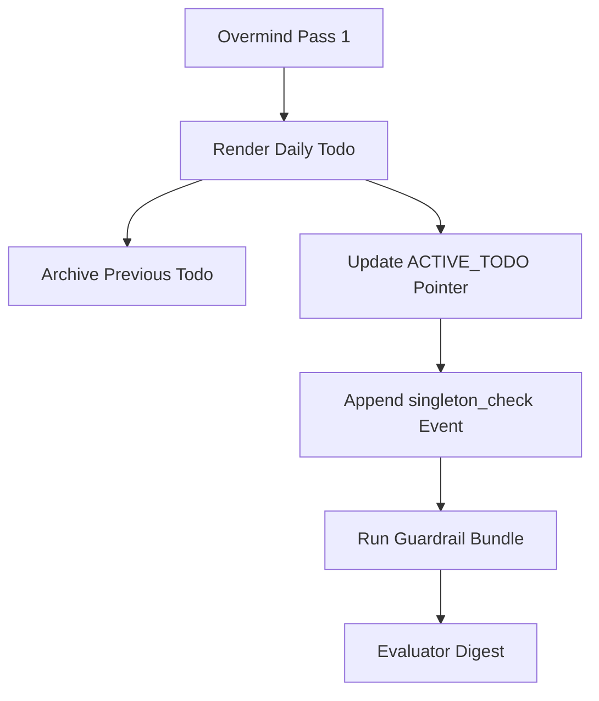
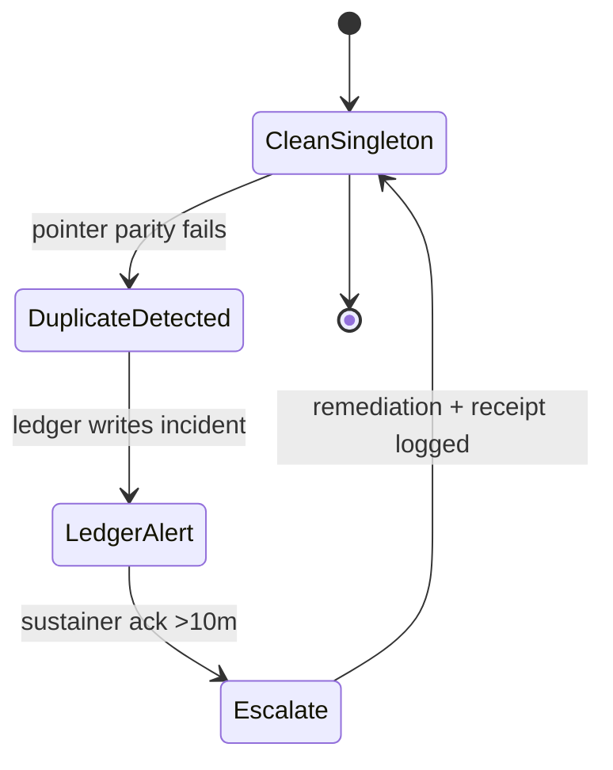
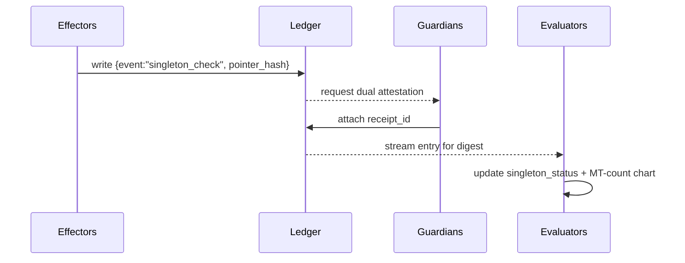

#  Hive Fleet Obsidian — Gem 1 Summary (Pass 7 · Version 2025-10-17T20:35:00Z)

> Version: 2025-10-17T20:35:00Z · Pass 7 hardens doc-as-code with quantitative stigmergy, singleton sentry cues, and a blackboard ledger so automation ships proof instead of promises.
> HFO Markers:  · Gem Marker:  — this document is the single mutable Gem 1 surface; earlier passes are archived and immutable.

## Stigmergy Header

| Field | Signal |
|-------|--------|
| Mission Tag | `HFO-L0-AutoConductor` |
| Timecode | 2025-10-17T20:35:00Z |
| Risk Posture | 🟡 Ledger bootstrap pending chaos validation |
| Swarm Phase | lvl0 holonic solo with blackboard-backed telemetry |
| Compliance Rail | Gem pointer · Todo pointer · Blackboard ledger · Guardrail bundle |
| Beacon | 1⃣ singleton cue → guardrail proof → Overmind digest |

- **Pheromone Cue:** 1⃣ signals exactly one active gem and one active todo; duplicates escalate to 🟠 immediately.
- **North Star Metric:** Singleton drift detected and resolved within 15 minutes; ledger append latency ≤ 60 seconds.
- **Zero-Trust Reminder:** Every override writes a dual-attested ledger record; absence of proof equals failure.

## BLUF Capsule

Pass 7 stands up the Obsidian Synapse blackboard, teaches automation to append pointer hashes, and promotes the singleton cue 1⃣ so the swarm catches duplicate artifacts without Overmind intervention. Daily todos now archive themselves, guardrail bundles publish evidence to the ledger, and chaos drills attack the system to verify detection speed. Overmind stays at strategic altitude because proof—not assertions—backs every ritual.

## Diagram Suite

### Diagram 1 — Singleton Enforcement Flow

### Diagram 2 — Duplicate Detection State Machine

### Diagram 3 — Blackboard Append Sequence

## Action Mesh

- 🟢 **Sensors:** Capture gem/todo pointer hashes, emit `singleton_check`, and watch ledger latency < 60 s.
- 🟡 **Integrators:** Publish SOP update linking singleton cue 1⃣, ledger IDs, and guardrail output hashes.
- 🟢 **Effectors:** Maintain renderer + archive moves; ensure every render triggers ledger append and guardrail sweep.
- 🟡 **Guardians:** Validate dual-attestation receipts for manual overrides; block release without proof.
- 🟠 **Challengers:** Inject duplicate gem/todo artifacts in sandbox; confirm guardrail failure within 15 minutes.
- 🟢 **Sustainers:** Track guardrail success rate (≥95%); escalate with ledger entry if two consecutive misses occur.
- 🟢 **Evaluators:** Deliver digest snippet citing ledger line numbers, singleton status, and MT-count trends.

## Telemetry Notes

- **Ledger Bootstrap:** `blackboard/🧾🥇_ObsidianSynapseBlackboard.jsonl` seeded; next append must carry `{pointer_hash, sweep_id, manual_touch_count}`.
- **Guardrail Evidence:** `./scripts/run_guardrails.sh` outputs hashed proof; store hash in ledger event `evidence_hash`.
- **Chaos Harness:** Duplicate-injection drill scheduled; log `chaos_trace_id` once completed.
- **Manual Touch Budget:** Overrides remain ≤1/day; Guardian receipt IDs mandatory on ledger entries.
- **Escalation:** Missing ledger append within 5 minutes raises 🟡; duplicate detection miss raises 🟠 and pings Overmind digest queue.

## Quantitative Stigmergy Program

| Metric | Target | Source | Notes |
|--------|--------|--------|-------|
| Singleton Drift Events | 0/day | Guardrail bundle | Count duplicates detected in active gem/todo surfaces.
| Ledger Freshness | ≤60 s lag | Sensors → Blackboard | Time between render completion and ledger append.
| Manual Touch Count | ≤1/day | Evaluator digest | Overrides require dual attestation; ledger enforces receipts.
| Chaos Coverage | ≥3 scenarios/week | Challenger roster | Includes duplicate injection, ledger skew, pointer tamper.
| Digest Proof Completeness | 100% | Evaluator automation | Each digest references ledger line numbers for evidence.

## Guardrail Obligations (Pass 7)

1. **Singleton Audit:** Guardrail bundle fails fast if more than one active gem or todo exists.
2. **Ledger Append:** Automation writes `{pointer_hash, sweep_id, singleton_state}` to blackboard within 60 seconds of render.
3. **Dual Attestation:** Manual overrides require Guardian + Sustainer receipt IDs stored alongside ledger events.
4. **Chaos Drill:** Challenger injects synthetic duplicates daily until success rate ≥95% on a 7-day rolling window.
5. **Digest Proof:** Evaluators cite ledger evidence in Overmind digest; absence escalates as telemetry gap.

## Facet Resonance Updates

### Facet 1 — Swarm Persona Architecture

- Swarmlord now fronts a "singleton sentry" facade; automation enforces one gem and one todo before any deliverable ships.
- Persona briefs instruct swarmlings to read pointer files exclusively and to confirm ledger receipts exist before trust.
- Quantitative stigmergy extends emoji taxonomy:  for gem,  for todo, 1⃣ for singleton enforcement status.

### Facet 2 — Evolutionary Pattern Stack

- Evolutionary routines test automation variants that minimize ledger latency without sacrificing evidence.
- Chaos drill results seed a case-based memory so future passes reuse high-performing detection profiles.
- Fitness metrics now include singleton drift rate and ledger freshness in addition to manual-touch counts.

### Facet 3 — SWARM Operational Loop

- Pass cadence unchanged, but Pass 2 explicitly verifies ledger append + guardrail hash before continuing.
- Hourly sweeps publish `sweep_id` tokens to the ledger for deterministic replay.
- Daily digest references gem + todo pointer hashes so Overmind can spot drift instantly.

### Facet 4 — GROWTH Pipeline & SIEGCSE Roles

- Sensors own pointer hash harvesting; Integrators maintain SOP modules referencing ledger IDs.
- Effectors operate renderer + ledger append helper; Guardians steward override receipts.
- Challengers script duplicate injections; Sustainers monitor sweep SLO; Evaluators publish digest proof lines.

### Facet 5 — Cradle-to-Grave Liberation Stack

- Liberation pods inherit singleton cue to keep educational rituals drift-free.
- Archives capture ledger snapshots so offline operators can replay automation decisions.
- Compassion guardrails ensure automation reduces toil without hiding failures—proof is mandatory.

### Level 10 Overmind Constellation (Aspirational)

- Singleton drift budget 0.1/day over 7-day window becomes gating metric for lvl1 promotion.
- Escalation ladder tiers expand: lvl1 handles pointer audits, lvl2 audits ledger retention, lvl4 notarizes digests.
- Governance adds multi-signature ledger checkpoints before scaling to multi-planet pods.

### Visualization Roadmap

- Automation renders pointer hash timelines and singleton drift spark lines for 24h review.
- Bloom scenes visualize pheromone intensity vs ledger freshness, highlighting hot spots.
- Renderer exports PNG diagrams for Overmind; identical data streams into dashboards and digests.

### Log-10 Level Ladder

- lvl0 → lvl1 checklist now includes: singleton drift ≤0.1, ledger latency ≤60 s, chaos coverage ≥95% success.
- Future levels adopt ledger replication across holons to ensure zero-trust evidence persists.
- Each level must certify automation ready across hourly/daily/weekly horizons before expansion.

### Facade Specialist Mode

- Facade outputs include guardrail logs, ledger excerpts, singleton status, and MT Count chart.
- Automation refuses to deliver BLUFs without ledger receipt references; Overmind receives proof-first.
- Compliance lint blocks responses lacking required sections or singleton metrics.

### Fail Better Doctrine Refresh

- Ledger captures chaos failures with remediation steps; Overmind sees truth, not sanitized summaries.
- Compassion guard ensures automation failure messaging stays blame-free and improvement-focused.
- Retros convert ledger anomalies into adopt→adapt→ascend experiments.

### Adopt → Adapt → Ascend Spine

- Adopt: industry SOPs for blackboard-backed runbooks and automation evidence.
- Adapt: singleton cue 1⃣ integrates with HFO emoji taxonomy and guardrail bundle.
- Ascend: evolutionary search promotes configurations with faster detection and richer proof payloads.

### SWARM Operational Loop Deep Dive

- Set/Decide: Overmind + Swarmlord run Pass 1; automation verifies pointer parity immediately afterward.
- Watch/Act: Guardrail bundle executes hourly; ledger appends produce immutable footprints.
- Review/Mutate: Evaluators analyze singleton drift; challengers add new probes; gem updates follow with proof.

### GROWTH Pipeline Extension

- Sensors ingest ledger metrics; Integrators compile dashboards; Effectors remediate duplicates; Guardians certify overrides.
- Challengers stress ledgers; Sustainers enforce SLO; Evaluators publish digest proof lines.
- Playbook registry references blackboard entries so swarmlings follow evidence-backed rituals.

### Cradle-to-Grave Liberation Stack Amplification

- Automation ensures liberation teams receive pointer-hash verified rituals, preventing context drift.
- Offline kits include ledger slices so low-connectivity operators can validate automation claims.
- Manual-touch coaching draws from ledger entries tagged with `touch_class` for targeted assistance.

### Cognitive Exoskeleton Vision

- Pass 7 adds "evidence cartilage" connecting automation reflexes to Overmind cognition.
- MT-count, singleton drift, and ledger freshness act as biometric signals for exoskeleton health.
- Compassion metrics ensure automation reduces cognitive load without erasing human agency.

### Tectangle Gesture Forge & Gesture-Vector Dance Interface

- Gesture macros now call `singleton_check` routines; pointer states overlay on gesture canvas.
- Accessibility pathways (voice/gaze) trigger ledger append helper with identical proofs.
- Gesture telemetry writes to blackboard ensuring parity across input modes.

### Obsidian Hourglass & State-Action Web

- Hourglass stores pointer hash history, enabling rewinds when drift suspected.
- State-action web maps guardrail responses to chaos probes, revealing resilience gaps.
- Ledger IDs map directly to hourglass snapshots for forensic playback.

### Harmony & Spiritual Campaigns

- Automation celebrates successful guardrail runs with gratitude pulses and ledger-linked reflections.
- Compassion guard ensures automation never masks failure or gaslights operators—proof or pause.
- Spiritual campaigns highlight evidence-backed wins to reinforce trust.

### Mission-Critical Tool Grid

- Renderer, guardrail bundle, and ledger scripts form baseline kit for all mission grids.
- NASA-grade assurance extends to ledger integrity checksums and pointer hash audits.
- Tool grid documentation references pointer + ledger instructions as mandatory onboarding.

### War Chest Factory Pattern Refresh

- Funding automations adopt ledger evidence to confirm resource allocation flows to liberation work.
- Evaluators correlate revenue automation with ledger-backed toil reduction metrics.
- Singleton cue prevents duplicate financial rituals from skewing telemetry.

### Swarmling Drift Net

- Drift net monitors pointer parity plus ledger freshness; anomalies escalate with context.
- Synthetic events keep detection sharp; ledger captures each injection with trace IDs.
- Sustainers review drift net metrics weekly and schedule remediation experiments.

### Escalation Cadence

| Horizon | Owner | Trigger | Output |
|---------|-------|---------|--------|
| Hourly | Automation Sweeps | Guardrail bundle + pointer hash audit | Ledger entry (`singleton_check`), lint report, MT-count update |
| Daily | Evaluators | Digest 07:00 UTC | Manual-touch summary, singleton status, ledger excerpts |
| Weekly | Challengers & Sustainers | Kaizen retro | Chaos coverage report, ledger freshness analysis |
| Monthly | Guardians | Systems audit | Compliance attestation, credential rotation receipts |

### Stigmergy CUE Registry

- Registry tracks singleton cue metadata alongside persona schemas.
- CRDT shards include pointer hash state to prevent divergence across swarmling pods.
- Regeneration process references ledger proofs to validate persona drift corrections.

### North Star Horizon Ladder

- Singleton drift and ledger freshness map across 24h/7d/30d horizons.
- Deviations trigger ascend/descend status; Overmind sees ladder summary in digest.
- Ladder gating ensures expansion only occurs when evidence shows stability.

### Ritual Cadence Ladder

- Daily render (automation) + ledger append; weekly kaizen reviews ledger anomalies; monthly audit notarizes proofs.
- Gratitude pulses attach ledger references so celebrations remain evidence-backed.
- Ritual freeze triggers if guardrail or ledger entries fail twice consecutively.

## Lvl0 Automation Checklist (Pass 7 Focus)

| Item | Owner | Status |
|------|-------|--------|
| Blackboard ledger seeded with singleton events | Effectors | 🟢 |
| Pointer parity guard including singleton cue | Sensors | 🟢 |
| Ledger latency monitoring (≤60 s) | Sustainers | 🟡 |
| Chaos duplicate drill automated | Challengers | 🟠 |
| Digest citing ledger evidence | Evaluators | 🟢 |
| Override receipt workflow | Guardians | 🟡 |

## Guardrail & Automation Commitments

1. **One-Intent Rule:** Overmind touches rituals only during Pass 1; automation handles passes 2–4 with proof logging.
2. **Pointer Parity:** Gems and todos must hash-match pointer references; guardrails fail fast otherwise.
3. **Manual Touch Ledger:** Evaluators log MT-count daily; overrides require receipt IDs.
4. **Singleton Proof:** Ledger must contain `singleton_check` entry before digest release.
5. **Chaos Harness Obligations:** Run duplicate-injection + ledger skew drills daily; escalate if coverage dips.
6. **Evidence-First Delivery:** Any output without ledger line references is invalid.

## Automation Validation Matrix

| Pipeline | Primary Tests | Schedule | Escalation Hook |
|----------|---------------|----------|-----------------|
| Singleton Audit | Pointer hash parity, active file count check, ledger append presence | Hourly + on render | Guardian → Sustainer if duplicates persist 2 runs |
| Ritual Renderer | Required headings, diagram count, ledger append invocation | On render + hourly smoke | Evaluator logs failure; Overmind ping if unresolved |
| Ledger Sync | JSONL ↔ DuckDB parity, checksum replay, latency budget | Hourly delta + nightly full | Sustainer triggers rollback + chaos harness |
| Chaos Harness | Duplicate injection, ledger skew, git race, automation outage | Daily randomized slot | Challenger files remediation bundle |
| Digest Automation | Metric aggregation, singleton status, ledger evidence references | Daily 07:00 UTC | Integrator escalates if digest missing proof |

## Automation Change Management

- Proposals must include ledger impact analysis and chaos harness expansion plan.
- Shadow deploy automation changes with ledger entries flagged `shadow` for 24 h before promotion.
- Post-promotion audit verifies singleton drift and ledger latency remain within targets; failures revert automatically.

## Chaos Drill Catalog (Pass 7 Baseline)

1. **Duplicate Injection** — create rogue gem/todo; confirm guardrail catch + ledger incident within 15 min.
2. **Ledger Skew** — corrupt JSONL line; verify sync restores parity and logs remediation.
3. **Render Failure** — block filesystem to ensure automation alerts and logs manual touch override.
4. **Credential Expiry** — rotate automation token; Guardian logs receipt and verifies ledger append resumes.
5. **Digest Drop** — simulate digest job failure; Integrators rerun and append failure + recovery entries.
6. **Pointer Tamper** — modify pointer file; guardrail must fail and ledger track incident.

## Knowledge & Reference Map

- **Stable Gem Pointer:** `gems/ACTIVE_GEM1.md`
- **Stable Todo Pointer:** `rituals/daily_todo/ACTIVE_TODO.md`
- **Blackboard Ledger:** `blackboard/🧾🥇_ObsidianSynapseBlackboard.jsonl`
- **Ledger Guide:** `blackboard/README.md`
- **Renderer:** `scripts/render_daily_todo.py`
- **Guardrail Bundle:** `scripts/run_guardrails.sh`
- **Todo Guardrail:** `scripts/check_todo_alignment.py`
- **Chaos Harness:** `scripts/challenger_red_team.py`
- **Persona Schema:** `cue/agents/agent_schema.cue`
- **Persona Instance:** `cue/agents/swarmlord_of_webs.cue`

## Manual Touch Telemetry Schema

| Field | Type | Source | Notes |
|-------|------|--------|-------|
| `timestamp` | RFC3339 | Renderer + guardrail bundle | Records exact pulse for manual touch/change validation. |
| `manual_touch_count` | Integer | Evaluator ledger write | Non-negative counter; increments when human edits outside Pass 1. |
| `touch_class` | Enum(`intent`, `override`, `remedial`, `investigation`, `unknown`) | Guardian review | Stratifies intervention origin for coaching. |
| `trigger_surface` | Text | Pointer audit | Names asset (gem, todo, ledger) requiring intervention. |
| `pointer_hash` | Text | Sensor hash routine | Ensures digest references match actual file state. |
| `sustainer_ack` | Bool | Sustainer workflow | True once Sustainer signs auto-generated receipt. |
| `chaos_trace_id` | UUID | Chaos harness orchestrator | Links manual touch to chaos scenario or NULL if organic drift. |
| `digest_frame` | Text | Evaluator digest builder | Tags event to daily/weekly/monthly digest anchor. |

- Ledger entries use JSONL format; append-only discipline enforced via guardrail checksums.
- Overrides missing `touch_class=override` or receipt ID auto-trigger 🟠 pheromone.
- Evaluator digest automation renders rolling spark lines for manual touch and singleton drift metrics.

## Automation Digest Blueprint

Automation digests now deliver proof-first summaries. Pass 7 mandates the 07:00 UTC job bundle:

1. **Intent Echo:** ≤50 words restating yesterday's Pass 1 so drift surfaces instantly.
2. **Singleton Status:** Table listing gem/todo pointer hashes, ledger line numbers, drift events.
3. **Manual-Touch Rollup:** MT-count by `touch_class`, highlighting overrides and investigation threads.
4. **Guardrail Posture:** Success/failure counts for lint, pointer audits, chaos drills with mini spark lines.
5. **Evolutionary Moves:** Automation experiments touching ledger latency or singleton detection.
6. **Escalation Feed:** Open incidents with owner, next action deadline, pheromone color, and ledger references.

- Digest builder reads directly from ledger JSONL, guardrail output, and chaos traces to avoid duplicate truth sources.
- If digest emission slips, Integrators trigger guardrail bundle, log `manual_touch_count += 1`, and notify Overmind within 10 minutes.
- Sustainers archive digests for 30 days and notarize weekly snapshots for forensic replay.

## Next Signals to Capture

- Automate ledger append inside renderer; add unit tests ensuring write-before-return semantics.
- Integrate ledger replay into guardrail bundle; prove deterministic detection under chaos load.
- Expand blackboard schema to mirror DuckDB replica once file size >5 MB.
- Build Atlassian-style SOP export referencing gem/todo pointer hashes and ledger IDs for onboarding.
- Correlate singleton drift with MT-count to spot systemic friction.

##  BLUF Snapshot

Automation now enforces singleton pointers, writes evidence to the blackboard, and surfaces digest-ready proof. Guardrails and chaos harness drills keep the Overmind at intent altitude while providing zero-trust assurance.

## Core Identity

- **Swarm Nature:** Evidence-backed automation, zero manual toil without proof.
- **Anchor Persona:** Swarmlord orchestrates singleton sentry, ledger discipline, and guardrail sweeps.
- **Overmind Role:** Frame intent, inspect digest, bless strategic experiments.
- **Compass:** Compassionate automation that proves its claims before asking for trust.

## Immediate Rebuild Priorities (Pass 7)

1. Automate ledger append inside `render_daily_todo.py` with receipt logging.
2. Expand chaos harness duplicate-injection coverage and capture response metrics.
3. Wire singleton drift + MT-count correlations into digest dashboards.
4. Publish override receipt template and ledger SOP for Guardian/Sustainer pairs.
5. Backfill documentation (README, AGENTS, SOPs) with singleton cue + ledger workflow.

## Toolchain Setup (Quant Stigmergy Edition)

- `python scripts/render_daily_todo.py` — render todo, archive predecessor, trigger ledger append helper.
- `./scripts/run_guardrails.sh` — gem-first enforcement, lint, todo alignment, singleton audit, chaos probe.
- `python scripts/check_todo_alignment.py` — verify todo compliance and singleton status markers.
- `python scripts/lint_gem_alignment.py` — confirm heading order, diagram count, and coverage ratios across passes.
- `scripts/challenger_red_team.py` — schedule duplicate injection and ledger skew drills.
- `blackboard/README.md` — ledger append protocol and example snippets.

## Daily To-Do Template Snapshot

- Renderer populates template automatically; Pass 1 closes on render.
- Action Mesh maps SIEGCSE roles with status emojis; ledger instructions included in Effectors + Guardians rows.
- Telemetry section records ledger append IDs, guardrail results, and chaos probe status.
- Compliance checklist enforces required headings, diagrams, action mesh coverage, and ledger proof reminders.

## Obsidian Synapse Blackboard Specification

- Append-only JSONL file at `blackboard/🧾🥇_ObsidianSynapseBlackboard.jsonl`.
- Required fields: `timestamp`, `event`, `actor`, `details`, `pointer_hash`, `sweep_id`, `manual_touch_count`, optional `chaos_trace_id`.
- Guardians approve manual edits; ledger rotates to cold storage when size >5 MB.
- Scripts must append entries atomically and rerun guardrail bundle afterward.
- Example append snippet lives in `blackboard/README.md`.

## Compliance Protocol

- Pre-commit hooks ensure gem + todo pointers validated and ledger append recorded.
- CI replays guardrail bundle hourly; failure notifies Guardians and Sustainers.
- Overrides require ledger receipt plus guardrail rerun before merge.
- Hourly GitHub Action monitors singleton cue, ledger freshness, and chaos coverage.
- Challenger sweep scheduled daily; results committed to ledger and digest.

## Appendices

- **Pass Lineage:** P1 (doctrine seed) → P2 (ritual discipline) → P3 (blackboard) → P4 (pointer integrity) → P5 (automation guardrails) → P6 (manual-touch minimization) → **P7 (proof-backed singleton governance)**.
- **Companion Assets:** Renderer script, singleton guardrail updates, ledger README, chaos harness backlog, digest blueprint.
- **Observation:** Trust now flows from proof—ledger-backed automation keeps Overmind focused on intent while the swarm handles details with zero-trust evidence.
