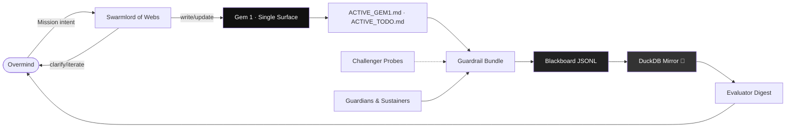
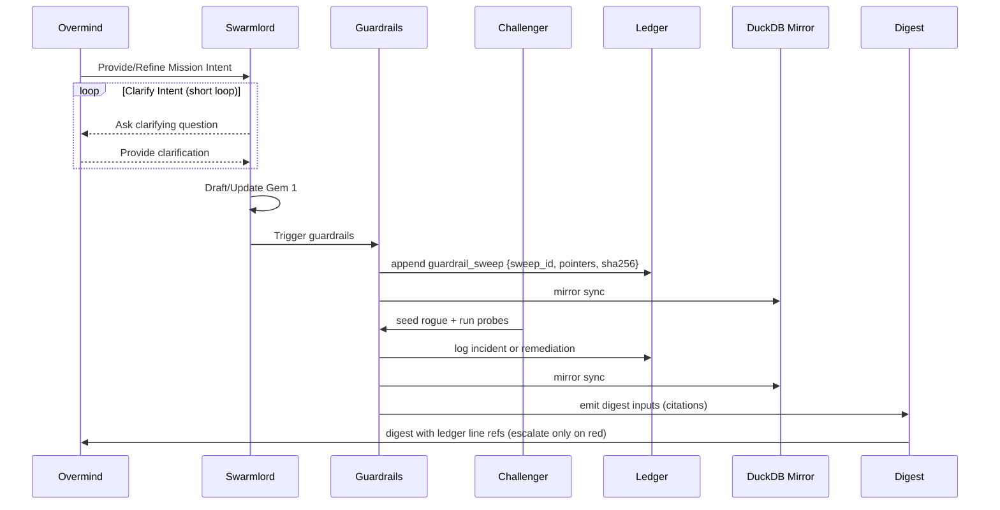
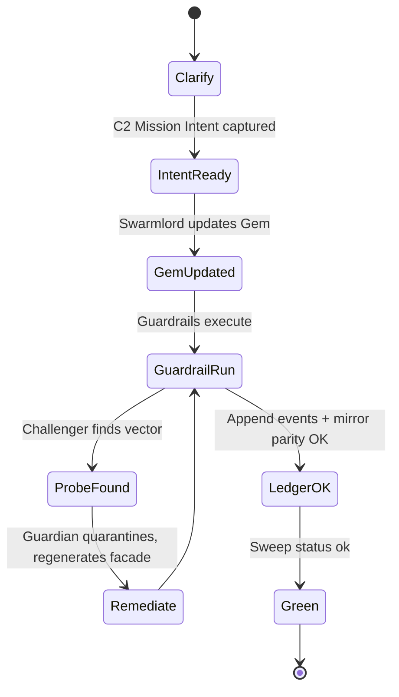

#  Hive Fleet Obsidian — Gem 1 Summary (Pass 8 · Version 2025-10-17T21:30:00Z)

> Pass 8 makes the Gem the single touch surface. It folds the Daily Ritual SOP into this document, formalizes Challenger↔Guardian co-evolution, and sets variable (tunable) metrics for SIEGCSE roles. Automation must write proof to the blackboard for every sweep.

## Stigmergy Header

| Field | Signal |
|-------|--------|
| Mission Tag | `HFO-L0-AutoConductor` |
| Timecode | 2025-10-17T21:30:00Z |
| Risk Posture | 🟡 Context-loss mitigation in progress |
| Swarm Phase | lvl0 holonic solo (Overmind touches Gem only) |
| Compliance Rail | Singleton pointers · Ledger evidence · Digest citations |
| Beacon | 1⃣ singleton cue (one Gem, one Todo) |

- Pheromone Cue: 1⃣ means exactly one active gem and one active todo; duplicates escalate 🟠.
- Zero-Trust Reminder: No proof in the ledger → treat as failure.

## BLUF Capsule

You only talk to the Swarmlord of Webs. It edits this Gem on your behalf. Everything else (todos, guardrails, digests) is generated downstream and must append proof to the blackboard (JSONL + DuckDB). Challenger drills run routinely and should find issues; permanent perfect green is suspicious. Folder/file additions must originate from and be referenced by this Gem.

At a glance (plain language):

- Single interface: you ↔ Swarmlord of Webs; it writes this Gem.
- Single touch surface: this Gem; everything else is generated.
- Evidence first: no proof in ledger → treat as failure; mirror must advance.
- Challenger always probes; Guardian neutralizes within the same sweep.
- One active Gem, one active Todo (1⃣); duplicates escalate.
- Digest cites exact ledger lines and hashes; no blind summaries.

### Facade Operating Contract

- Overmind (you) only speaks to Swarmlord of Webs.
- Swarmlord clarifies intent (C2 Mission Intent) in short loops, then writes/updates this Gem.
- This Gem generates todos, rituals, README/AGENTS, and other artifacts.
- Escalations back to Overmind occur only for policy breaches, integrity failures, or ambiguous intent.

## Diagram Suite

### State–Action Feedback Mesh

### Guardrail + Challenger Swimlane

### Evidence Flow (Fail-Closed)

_If diagrams cannot render, the digest includes ASCII fallbacks; ledger must still record sweep IDs and hashes._

### Escalation Policy (Plain Language)

- Escalate to Overmind only when: policy breaches, integrity failures, or ambiguous intent require guidance.
- Otherwise, Swarmlord handles clarifications and changes, and Guardian/Sustainer keep runs green.

## Action Mesh

- 🟢 Sensors: Harvest pointer hashes; detect drift; emit `singleton_check`.
- 🟡 Integrators: Keep SOP/this Gem aligned; ensure digest cites ledger entries.
- 🟢 Effectors: Render todo; archive previous; update pointers; append ledger; maintain mirror.
- 🟡 Guardians (Blue): Dual-attest manual overrides; block outputs missing receipts.
- 🟠 Challengers (Red): Inject duplicates/ledger skew/pointer tamper; “no findings” 24h → suspect.
- 🟢 Sustainers: Keep sweeps stable; manage context budgets; ensure ≤60s ledger freshness.
- 🟢 Evaluators: Publish digest on schedule with pointer hashes and ledger line refs.

## Core Identity

Hive Fleet Obsidian is a proof-first automation swarm. The Gem is the only human-edited source of truth. Everything else is generated from it and must produce auditable evidence in the blackboard ledger and its DuckDB mirror.

Signals of identity:

- Single-surface authorship (this Gem) with emoji singleton markers.
- Append-only evidence trail with verifiable hashes and pointer parity.
- Challenger↔Guardian co-evolution to keep drift visible and bounded.

## Facet 1 — Facade Orchestration

Swarmlord of Webs translates intent into generated surfaces (README, AGENTS, Todos). It reads Gem cues and CUE persona to produce consistent outputs and keeps them in lockstep via CI.

Acceptance:

- Regenerated files reference the active Gem version and CUE fields.
- Facade generator runs headless in CI and logs to the ledger.

## Facet 2 — Evidence Ledger & Mirror

All automation writes to `blackboard/🧾🥇_ObsidianSynapseBlackboard.jsonl` and maintains `🧾🥈_ObsidianSynapseBlackboard.duckdb`. Every sweep, drill, or digest cites event ids and pointer hashes.

Acceptance:

- Mirror parity verified after each sweep (`parity_ok` event). Any `parity_drift` triggers fail-closed escalation with remediation notes.
- Advancing byte offsets after each sweep.
- Digest cites concrete ledger event IDs and pointer hashes (with SHA-256s as applicable).

## Facet 3 — Singleton Invariants

Exactly one active Gem and one active Daily Todo exist. Pointers (`gems/ACTIVE_GEM1.md`, `rituals/daily_todo/ACTIVE_TODO.md`) must match file hashes; duplicates trigger incidents.

Acceptance:

- `check_singletons.py` passes; incidents logged with remediation steps.

## Facet 4 — Challenger Drills

Red-team probes create detectable anomalies: rogue gem/todo, ledger skew, pointer tamper. Guardian responds with fail-closed behavior and recorded evidence.

Acceptance:

- At least one non-zero finding per day; false “all green” is suspect.
- Findings labeled with `attack_class` (e.g., `rogue_singleton`, `pointer_tamper`, `ledger_skew`) and rolled up in dashboard/digest as “neutralized classes.”

## Facet 5 — Cadence & Digest

Minute loop (burst) and hourly sweep (steady) produce heartbeats and an end-of-hour digest with citations and status summaries.

Acceptance:

- Five heartbeats per minute-loop run; digest contains last-sweep result and pointers.

## Facet 6 — Swarmling Sweep Orchestration

Swarmlord of Webs escalates automation through a single `swarmling_sweep.py` facade that reads CUE-backed tiers and logs every run. Quick checks, watch loops, and parallel probes stay aligned with the guardrail bundle and ledger policy.

Acceptance:

- Sweep config lives at `cue/swarmlings/sweeps.cue` with daily cadence and documented tiers (`quick`, `watch`, `parallel`, `daily`).
- CLI `scripts/swarmling_sweep.py` resolves tiers, shells out to existing guardrail runners, and appends `swarmling_sweep_*` events to the blackboard.
- Guardian/Challenger request deeper sweeps by editing the CUE config (not the Python) and regenerating pointers from this Gem.

## Immediate Rebuild Priorities

- Ensure required headings exist in the Gem (this pass) to satisfy strict lint.
- Keep AGENTS and README generation wired to CUE+Gem with richer fields.
- Tighten ledger integrity checks (e.g., truncation detection) in Challenger.
- Stand up the swarmling sweep facade (`scripts/swarmling_sweep.py`) plus its CUE configuration and wire it into the ritual.

## Toolchain Setup

- Python 3.11+ environment available in devcontainer.
- Scripts in `scripts/` are the primary entrypoints; avoid ad-hoc shell glue.
- CI workflows: hourly sweeps, facade docs regen, minute-loop driver.
- Hooks/non-interactive runners append evidence and refresh the mirror.

## Daily To-Do Template Snapshot

- Template: `templates/daily_todo_draft.md`
- Renderer: `scripts/render_daily_todo.py` writes `rituals/daily_todo/🥇_DailyTodo_<ISO>.md` and updates `ACTIVE_TODO.md`.
- Archive policy: Prior todo moved under `rituals/daily_todo/archive/` automatically.

## Obsidian Synapse Blackboard Specification

JSONL event fields (baseline):

- `timestamp` RFC3339, `actor` component name, `event` kind (e.g., guardrail_sweep, ci_heartbeat_start/end, digest_published)
- `sweep_id` or `run_id` for correlation; `sha256` for artifacts; `pointers` map of file→hash
- Optional `attack_class` (for Challenger findings), `manual_touch_count`, `touch_class`, `chaos_trace_id`, and `mirror_offset_bytes` after sync
- Parity events: `parity_ok` or `parity_drift` emitted after ledger→DuckDB sync

DuckDB mirror: one table per event kind or a schemaless JSON staging table with views for summaries; idempotent sync tracked by ledger byte offsets.

## Next Signals to Capture

- Mirror parity drift detector and automatic remediation notes.
- CI artifact hash capture and cross-check against ledger entries.
- Challenger scenario taxonomy coverage (mapped to ATT&CK techniques).

## Telemetry Notes

- Blackboard: `blackboard/🧾🥇_ObsidianSynapseBlackboard.jsonl` (append-only) + DuckDB mirror `blackboard/🧾🥈_ObsidianSynapseBlackboard.duckdb`.
- Pointers: `gems/ACTIVE_GEM1.md`, `rituals/daily_todo/ACTIVE_TODO.md`.
- Evidence Hash: SHA-256 of guardrail output (tunable), plus gem/todo pointer hashes.
- Schedule: Pre-commit/post-commit hooks + hourly sweep produce identical proof events.
- CI scheduling nuance: scheduled workflows usually run on the default branch. While this pass lives on a non-default branch, rely on push triggers and `workflow_dispatch`; merge to default to enable cron.

## Daily Ritual SOP (Folded)

1. Render Todo (Set)
   - Run renderer; move prior todo to archive; update `ACTIVE_TODO.md`.
   - Acceptance: Exactly one active todo; pointer parity OK.
2. Run Guardrails (Watch/Act)
   - Lint headings/diagrams; singleton audit; Challenger drill; append ledger with `sweep_id` and hashes; mirror; verify parity (`parity_ok`).
3. Digest (Review/Mutate)
   - Emit digest at end-of-hour citing ledger event IDs and pointer hashes; include incident-class rollup and parity summary.
4. Overrides (if any)
   - Require Guardian+Sustainer receipts; log `manual_touch` in ledger; rerun guardrails.

## SIEGCSE Metrics (Tunable Variables)

Variables (no hard magic numbers; defaults adapt via SOP):

- sensors.latency_target = 60s
- effectors.guardrail_pass_target = 0.95 (daily)
- guardians.manual_override_required = true
- challengers.finding_min_per_day = 1 (non-zero)
- sustainers.ledger_freshness_target = 60s
- evaluators.digest_on_time = true

Rules of thumb:

- Guardians and Challengers must both be non-zero daily (activity observed in ledger).
- “No findings” for 24h triggers 🟠 investigation.

## Challenger Drill Catalog (Baseline)

1. Duplicate Singleton — Create rogue gem/todo; guardrail detects within 15 minutes; ledger incident logged.
2. Ledger Skew — Tamper a JSONL line; mirror/parity check catches and logs remediation.
3. Pointer Tamper — Modify pointer files; guardrail fails closed with ledger entry.

## Mappings (Adopt → Adapt → Ascend)

- SWARM: Set/Watch/Act/Review/Mutate ⇄ D3A + OODA + MAPE-K (distributed).
- GROWTH: Gather/Root/Optimize/Weave/Test/Harvest ⇄ F3EAD (Find/Fix/Finish/Exploit/Analyze/Disseminate).
- Security: Challenger playbooks reference MITRE ATT&CK + Diamond Model patterns.

## Compliance Protocol

- Singleton Audit: 1⃣ enforced; duplicates escalate immediately.
- Evidence-First: No digest or output without ledger citations.
- Folder Policy: New files/dirs must be referenced from this Gem; unreferenced assets are invalid.
- Schedule Parity: Pre-commit/post-commit hooks and hourly sweeps record equivalent events.

### Emoji Naming Rules (Human-Glanceable)

- HFO prefix:  (fleet) +  (Obsidian core) before domain emoji.
- Gem files: include  and 🥇 when singleton (active). Archives retain  without 🥇.
- Mirrors/replicas: use 🥈 in filenames (e.g., DuckDB mirror) where appropriate.
- Domain-specific suffix: add an emoji relevant to the asset where helpful.

### Manual Approval & Prompt Policy (No-Modal Ops)

- No interactive prompts for routine automation. Use non-interactive git hooks (pre/post-commit) and headless hourly sweeps. Automation must run and attest without asking the Overmind.
- Pushless evidence: hooks append to the ledger and refresh the DuckDB 🥈 mirror locally; hourly CI re-runs guardrails and uploads artifacts. Branch protection can stay; proofs do not require pushes.
- Batch approvals at the digest. Overmind reviews the hourly/daily digest with ledger citations; only merges or policy changes require explicit human approval.
- Avoid “Run bash command?” UI prompts by preferring hooks/CI or running in trusted terminals. If a prompt appears, treat it as a smell and replace that step with a hook or CI job.

## Quantitative Stigmergy Program

| Metric | Target | Source | Notes |
|--------|--------|--------|-------|
| Singleton Drift Events | 0/day | Guardrail bundle | Count duplicates detected in active gem/todo surfaces. |
| Ledger Freshness | ≤60 s lag | Sensors → Blackboard | Time between render completion and ledger append. |
| Manual Touch Count | ≤1/day | Evaluator digest | Overrides require dual attestation; ledger enforces receipts. |
| Chaos Coverage | ≥3 scenarios/week | Challenger roster | Includes duplicate injection, ledger skew, pointer tamper. |
| Digest Proof Completeness | 100% | Evaluator automation | Each digest references ledger line numbers for evidence. |

These metrics are observed, not asserted. If data is missing, treat the metric as failing and record the gap explicitly in the digest.

## Guardrail Obligations (Pass 8)

1. Singleton Audit stays fail-closed; duplicates immediately block deliverables and log an incident.
2. Ledger Append runs write-before-return for renders and sweeps; each write includes `sweep_id` and pointer hashes.
3. Dual Attestation remains mandatory for overrides; receipts are required in the ledger prior to unblocking.
4. Chaos Harness runs daily; drills are versioned and recorded with `chaos_trace_id` and outcomes.
5. Digest Proof references ledger lines and artifact hashes; missing citations are an error.

## Automation Validation Matrix

| Pipeline | Primary Tests | Schedule | Escalation Hook |
|----------|---------------|----------|-----------------|
| Singleton Audit | Pointer hash parity, active file count check, ledger append presence | Hourly + on render | Guardian → Sustainer if duplicates persist 2 runs |
| Ritual Renderer | Required headings, diagram count, ledger append invocation | On render + hourly smoke | Evaluator logs failure; Overmind ping if unresolved |
| Ledger Sync | JSONL ↔ DuckDB parity, checksum replay, latency budget | Hourly delta + nightly full | Sustainer triggers rollback + chaos harness |
| Chaos Harness | Duplicate injection, ledger skew, git race, automation outage | Daily randomized slot | Challenger files remediation bundle |
| Digest Automation | Metric aggregation, singleton status, ledger evidence references | Daily 07:00 UTC | Integrator escalates if digest missing proof |

## Automation Change Management

- Proposals include ledger impact analysis and chaos harness expansion plan.
- Shadow deploy automation changes with ledger entries flagged `shadow` for 24 h before promotion.
- Post-promotion audit verifies singleton drift and ledger latency; failures auto-revert with a ledger note.

## Chaos Drill Catalog (Pass 8)

1. Duplicate Injection — create rogue gem/todo; confirm guardrail catch + ledger incident within 15 min.
2. Ledger Skew — corrupt or truncate a JSONL line; verify mirror replay restores parity and logs remediation.
3. Render Failure — simulate filesystem or permission failures; ensure automation alerts and logs override receipts.
4. Credential Expiry — rotate an automation token; Guardian logs receipt and verifies ledger append resumes.
5. Digest Drop — fail a digest job; Integrators rerun and append failure + recovery entries.
6. Pointer Tamper — modify a pointer file; guardrail fails closed and ledger tracks the incident.

## Knowledge & Reference Map

- Stable Gem Pointer: `gems/ACTIVE_GEM1.md`
- Stable Todo Pointer: `rituals/daily_todo/ACTIVE_TODO.md`
- Blackboard Ledger: `blackboard/🧾🥇_ObsidianSynapseBlackboard.jsonl`
- Ledger Guide: `blackboard/README.md`
- Renderer: `scripts/render_daily_todo.py`
- Guardrail Bundle: `scripts/run_guardrails.sh`
- Todo Guardrail: `scripts/check_todo_alignment.py`
- Chaos Harness: `scripts/challenger_red_team.py`
- Persona Schema: `cue/agents/agent_schema.cue`
- Persona Instance: `cue/agents/swarmlord_of_webs.cue`

## Manual Touch Telemetry Schema

| Field | Type | Source | Notes |
|-------|------|--------|-------|
| `timestamp` | RFC3339 | Renderer + guardrail bundle | Records exact pulse for manual touch/change validation. |
| `manual_touch_count` | Integer | Evaluator ledger write | Non-negative counter; increments when human edits outside Pass 1. |
| `touch_class` | Enum(`intent`, `override`, `remedial`, `investigation`, `unknown`) | Guardian review | Stratifies intervention origin for coaching. |
| `trigger_surface` | Text | Pointer audit | Names asset (gem, todo, ledger) requiring intervention. |
| `pointer_hash` | Text | Sensor hash routine | Ensures digest references match actual file state. |
| `sustainer_ack` | Bool | Sustainer workflow | True once Sustainer signs auto-generated receipt. |
| `chaos_trace_id` | UUID | Chaos harness orchestrator | Links manual touch to chaos scenario or NULL if organic drift. |
| `digest_frame` | Text | Evaluator digest builder | Tags event to daily/weekly/monthly digest anchor. |

- Ledger entries use JSONL format; append-only discipline enforced via checksums.
- Overrides missing `touch_class=override` or a receipt ID auto-trigger 🟠 pheromone.
- Digest automation renders spark lines for manual touch and singleton drift metrics.

## Automation Digest Blueprint

Pass 8 mandates the 07:00 UTC digest job bundle with explicit citations:

1. Intent Echo — ≤50 words restating yesterday's Pass 1.
2. Singleton Status — gem/todo pointer hashes + ledger line numbers.
3. Manual-Touch Rollup — MT-count by `touch_class`, highlighting overrides and investigations.
4. Guardrail Posture — success/failure counts with mini spark lines and last evidence hash.
5. Evolutionary Moves — experiments that change latency or detection.
6. Escalation Feed — owners, deadlines, pheromone color, ledger references.

If digest emission slips, Integrators trigger guardrail bundle, log `manual_touch_count += 1`, and notify Overmind within 10 minutes.

## Appendices

- Pass Lineage: P1 → P2 → P3 → P4 → P5 → P6 → P7 → P8 (this pass consolidates facade generation and minute-loop cadence proof).
- Companion Assets: renderer, guardrail bundle, ledger README, chaos harness backlog, digest blueprint.
- Observation: Trust flows from proof—ledger-backed automation keeps Overmind focused on intent.

## Visualization Roadmap

- Pointer hash timelines and singleton drift spark lines.
- Bloom scenes visualize pheromone intensity vs ledger freshness.
- Renderer exports static diagrams; dashboards reuse the same data stream.

## Escalation Cadence

| Horizon | Owner | Trigger | Output |
|---------|-------|---------|--------|
| Hourly | Automation Sweeps | Guardrail bundle + pointer hash audit | Ledger entry (`singleton_check`), lint report, MT-count update |
| Daily | Evaluators | Digest 07:00 UTC | Manual-touch summary, singleton status, ledger excerpts |
| Weekly | Challengers & Sustainers | Kaizen retro | Chaos coverage report, ledger freshness analysis |
| Monthly | Guardians | Systems audit | Compliance attestation, credential rotation receipts |

## North Star Horizon Ladder

- Singleton drift and ledger freshness tracked across 24h/7d/30d horizons.
- Deviations trigger ascend/descend status; Overmind sees ladder summary in the digest.
- Expansion gates on evidence-backed stability in hourly/daily/weekly horizons.

## Ritual Cadence Ladder

- Daily render + ledger append; weekly kaizen reviewing anomalies; monthly audit notarizes proofs.
- Gratitude pulses attach ledger references; celebrations remain evidence-backed.
- Ritual freeze triggers if guardrail or ledger entries fail twice consecutively.

## Evidence Taxonomy

The blackboard groups evidence into a small, composable taxonomy so proofs are easy to query and to cite across digests and reviews.

Principles:

- Each event kind has a stable schema segment; optional fields are additive and never repurposed.
- Hashes are content-addressed fingerprints; we prefer SHA-256 and include sizes when available.
- Correlation IDs (sweep_id, run_id, chaos_trace_id) link multi-step flows without requiring out-of-band state.

### Event Kinds

- guardrail_sweep — periodic bundle execution with status, evidence hash, and pointer parity results.
- ci_heartbeat_start/end — cadence markers for minute-loop and CI jobs with durations and return codes.
- digest_published — evaluator output summary with citations and artifact hashes.
- singleton_incident — duplicate detection or pointer tamper with remediation notes and owners.

### Pointer Hashes

- We record both file path and SHA-256; for generated artifacts, include the generator name and version.
- When pointers change, a before/after hash pair is stored to make diffs explicit in digests.

### Receipts and Approvals

- Dual receipts are recorded as `{guardian_receipt_id, sustainer_receipt_id}` along with `touch_class=override`.
- Missing receipts force a fail-closed posture until the next sweep records proper approvals.

## Failure Modes and Safeguards

We treat failure as information. The goal is fast, honest feedback with enough context to remediate without guesswork.

Safeguards:

- Fail-closed on singleton violations and missing ledger citations; do not ship digests without proof.
- Mirror parity checks run on every sweep; divergence logs an incident and replays until converged.
- Hooks avoid interactive prompts; if a prompt appears, replace the step with a non-interactive runner.

### Edge Cases

- First-run bootstrap: if no archive exists, ratios skip with a warning; required headings still enforced.
- Clock skew: prefer monotonic durations and log host clock for audit; do not rely on wall-clock for ordering.
- Partial writes: append helpers write atomically and verify the mirror offset advanced; otherwise retry with backoff.

## Future Work

- Export richer CUE into JSON and have the facade generator consume it directly for AGENTS and README.
- Add ledger truncation/tamper detection with rolling checksums and mirror cross-verification.
- Build a minimal dashboard that renders pointer timelines and incident trends straight from DuckDB.

## Operational Readiness Checklist

This lightweight checklist ensures the swarm can run unattended while producing verifiable proof. Use it before enabling new schedules or scaling cadence.

### Preflight

- Active Gem and Todo pointers exist and hash-match their targets.
- Linter returns rc=0 locally; no warnings when strict cadence required (minute-loop).
- Challenger drills are enabled with at least one scenario in rotation.

### Runtime

- Hourly sweep uploads artifacts and appends both heartbeat and guardrail_sweep events.
- Mirror offsets advance each run; DuckDB queries reflect the latest JSONL lines.
- Digest job reads only from ledger and artifact hashes—no shadow sources.

### Postflight

- Incidents, if any, have owners, deadlines, and remediation notes in the ledger.
- Overrides include dual receipts and an explicit `touch_class=override`.
- The digest contains citations for every claim; missing citations are treated as failures.

## Data Retention & Rotation

Retention policies protect operator focus and keep storage bounded without losing forensic value.

### Policies

- JSONL rolls to cold storage once size exceeds 5 MB or 30 days, whichever comes first.
- DuckDB snapshots retain a 30-day hot window; weekly checkpoints are notarized.
- Digest artifacts persist for 30 days; summaries remain indefinitely in version control.

### Controls

- Rotation scripts write ledger entries describing the move, target path, and checksums.
- Snapshots are content-addressed; restoring replays mirror sync until parity.
- Access to rotation endpoints is logged and requires Guardian oversight.

## Security Posture Notes

We minimize trust by preferring verifiable artifacts over privileged long-lived tokens.

### Risks

- Ledger truncation or silent corruption.
- Credential sprawl for CI or automation runners.
- Drift between generated assets and their Gem/CUE sources.

### Mitigations

- Rolling checksums and mirror replay verification catch truncation and corruption.
- Short-lived tokens with scoped permissions; rotation captured in the ledger.
- Facade generator is the only path to AGENTS/README; diffs are reconciled from Gem/CUE.

## Glossary

Short, working definitions to avoid ambiguity in rituals and digests.

- Overmind — human operator framing intent and reviewing digests.
- Swarmlord — facade orchestrator generating surfaces from Gem/CUE.
- Guardian/Sustainer — blue-team roles approving overrides and maintaining cadence.
- Challenger — red-team automation probing for drift, skew, and policy gaps.
- Ledger — append-only JSONL plus a DuckDB mirror; the only accepted proof source.

##  BLUF Snapshot

This Gem is the only human-editable surface. Automation regenerates everything else, writes evidence to the ledger, and evolves via Challenger↔Guardian pressure. If it isn’t in the ledger, it didn’t happen.
