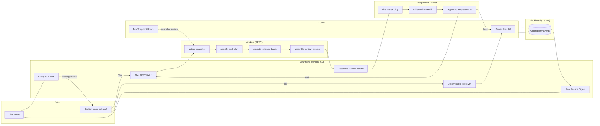
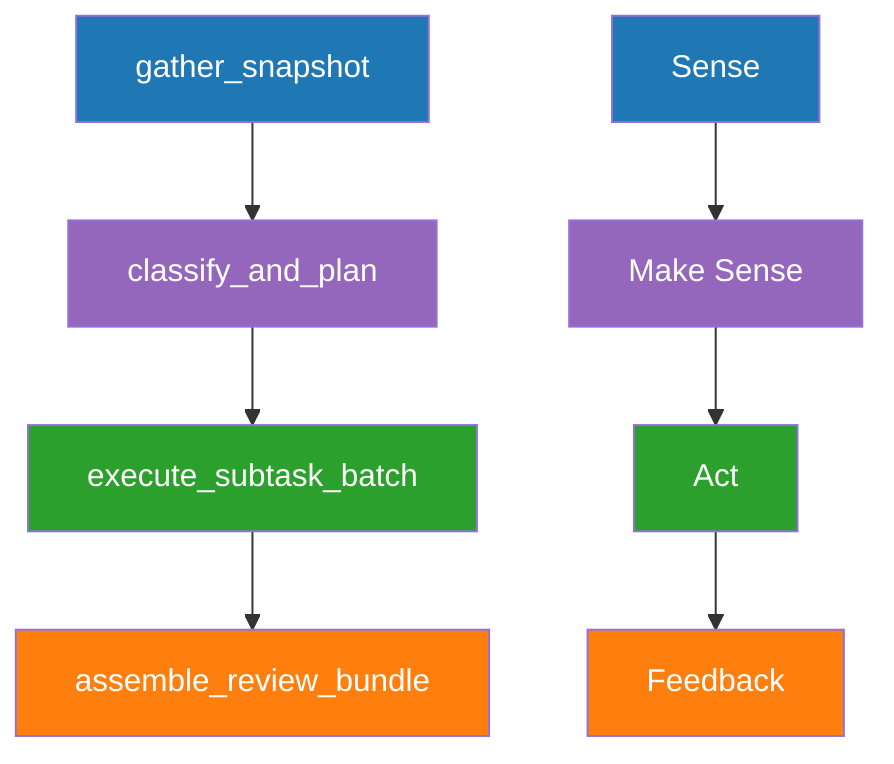
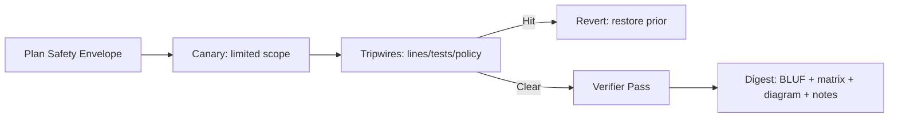

# Mission Intent — Clarification Pass 1 (TEMP)

created_at: 2025-10-29T13:52:00Z
mission_id: gem21_gpt5_attempt3_2025-10-29
status: pass1-draft
owner: TTao
orchestrator: Swarmlord of Webs (C2 facade)
timebox: 30m (minimal babysitting/manual interventions)

---

## BLUF
- Goal: Draft a Gen21 SSOT markdown (GPT5 attempt 3) that cold-starts Swarmlord and regenerates the full HFO system with minimal babysitting.
- Process: Clarify intent (≥3 passes if new), then PREY mapped to JADC2 (Sense → Make Sense → Act → Feedback), then independent Verify, then final digest (BLUF/matrix/diagram/notes).
- Scope today: Lock mission intent via Clarification Passes; do NOT write code or SSOT yet.
- Target: Reuse ≥95% of Gen19, remove hallucinations/truncation, prepare for Swarmlord Kilo mode v20 regeneration.
 - Tools stance: Actively use real tools/services (internet, MCP servers, VS Code extensions) as needed; avoid simulated or hallucinated tools.

---

## Artifacts (proposed)
- SSOT (today: not created): `hfo_gem/gen_21/gpt5-attempt-3-gem.md`
- Mission intent YAML (later): `hfo_mission_intent/mission_intent_2025-10-29.yml`
- Blackboard (append-only JSONL): `hfo_blackboard/obsidian_synapse_blackboard.jsonl`

Confirm/adjust paths during Pass 1.

---

## Swim lanes overview (Pass 1)

---

## PREY ↔ JADC2 mapping

---

## Safety envelope and verify gate

---

## Acceptance criteria (SSOT, for later)
- Cold-start compatible: Drop-in enables Swarmlord online + system regen with ≤3 manual steps.
- Output discipline: Every mission produces BLUF, operating_mode, tradeoff_matrix, diagram_stub, safety summary, blockers.
- Anti-truncation: Full content, no placeholders; chunked drafting with line targets and verification.
- Lineage: ≥95% reuse of Gen19 where applicable, with hallucinations removed.

---

## Decisions to confirm (Pass 1)
- [x] Confirm mission goal framing above.
- [x] Confirm artifact names/paths.
- [ ] Confirm sequencing: Today only mission_intent; later SSOT Gen21, then Swarmlord v20.
- [ ] Confirm minimum line target for SSOT (proposed: 280–400 lines).
- [ ] Confirm swim lanes order: User → Loader → Webs → PREY → Verifier → Blackboard → Webs → User.
- [ ] Confirm Verify gate is mandatory before human-facing digest (no bypass).
- [ ] Confirm ≥95% lineage from Gen19 with de-hallucination edits.
- [ ] Confirm timezone for timestamps (proposed: UTC / Z-suffix).

---

## Open questions (fast answers ok)
1) Preferred mission_id format? (resolved: `gem21_gpt5_attempt3_2025-10-29`)
2) SSOT path/name okay? (resolved: `hfo_gem/gen_21/gpt5-attempt-3-gem.md`)
3) Timebox for today’s intent phase? (resolved: 30 minutes, minimal babysitting)
4) Any hard constraints we must respect? (resolved: actively use real tools/services; download/install as needed; avoid simulated tools)
5) Must include additional digest elements? (resolved: BLUF + matrix + diagram + short notes only)
6) Timezone for timestamps? (proposed: UTC / Z-suffix)
7) Minimum line target for SSOT? (proposed: 280–400 lines)

---

## Next
- Await your checkboxes/edits; then proceed to Clarification Pass 2 (constraints & safety envelope) and Pass 3 (workflow mapping & verification), then draft `mission_intent_2025-10-29.yml` for approval.
