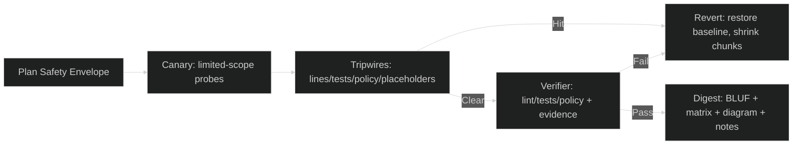

# Mission Intent — Clarification Pass 2 (TEMP)

created_at: 2025-10-29T14:05:00Z
mission_id: gem21_gpt5_attempt3_2025-10-29
status: pass2-draft
owner: TTao
orchestrator: Swarmlord of Webs (C2 facade)
linked_doc: ./clarification_pass1_2025-10-29.md

---

## Scope of this pass
Lock constraints, tooling/network policy, safety envelope (canary/tripwire/revert), anti-truncation targets, and blockers/privacy so we can proceed to Pass 3 and then draft today’s mission_intent.yml.

---

## Constraints (proposed)
- Timebox: 30 minutes for the intent phase (minimal babysitting/manual interventions).
- Sequencing: Today finalize mission_intent.yml only; next draft SSOT Gen21 (GPT5 attempt 3); then regenerate Swarmlord Kilo mode v20.
- Lineage: ≥95% reuse of Gen19 where applicable; purge hallucinations and truncation.
- Output discipline: Every mission produces BLUF, operating_mode, tradeoff_matrix, diagram_stub, safety summary, and blockers in the digest.
- Blackbox rule: No hidden assumptions—record blocked_capabilities and objective evidence in blackboard JSONL.

---

## Tooling and network policy (proposed)
- Allowed: Real tools/services, not simulated ones; actively use as needed
  - Internet access (read/download dependencies, docs, examples)
  - MCP servers
  - VS Code extensions
  - Package managers (pip/uv/npm/etc.)
- Guardrails:
  - No credentials stored in repo; use environment/secret managers when needed
  - Respect license/compliance of dependencies (no forbidden IP)
  - Cache/lock versions where possible for reproducibility (requirements.txt, lockfiles)
- Evidence: Tool actions should produce verifiable artifacts or logs referenced in blackboard entries.

---

## Safety envelope (proposed)

### Canary
- Start with limited-scope probes:
  - Small reads/writes and line_count checks
  - Dry-run/lint before full generation when available
  - Per-file chunk sizes ≤200 lines per write

### Tripwires
- Any of the following triggers a FAIL and regeneration or rollback:
  - line_count < 0.9 × target for any planned chunk or final artifact
  - Placeholder markers present (e.g., "TODO", "…", "omitted")
  - Lint/tests/policy checks fail (where applicable)
  - Claims without evidence_refs in blackboard entries

### Revert Plan
- Restore last known good artifact (or Gen19 baseline when applicable)
- Reduce chunk size and retry (e.g., from 200 lines → 100 lines)
- Narrow scope (e.g., regenerate subsection only)
- Log regen_flag and chunk_id in blackboard for traceability

---

## Anti-truncation targets (proposed)
- SSOT Gen21 line target: minimum 1000 lines (preferred window 1000–1400).
- Chunked drafting: ≤200 lines per write; verify len(content.splitlines()) after each write.
- Verification loop: up to 5 tries per section; then escalate as NOT APPROVED.

---

## Blockers and privacy bounds (proposed)
- Blocked capabilities to record:
  - Missing permissions/credentials
  - Denied network egress
  - Tool/extension install failures
- Privacy/risk bounds:
  - No secrets in logs or repo files
  - No personal data ingestion without explicit approval
  - Respect repository boundaries unless explicitly authorized to cross-repo

---

## Decisions to confirm (check all that apply)
- [ ] Sequencing: Today mission_intent → Next SSOT Gen21 → Then Swarmlord v20
- [ ] Timezone: Use UTC (Z-suffix) for all timestamps
- [ ] SSOT line target: minimum 300 lines (300–400 preferred)
- [ ] Tooling/network: actively use real tools/services (internet, MCP, extensions)
- [ ] Safety envelope: adopt Canary/Tripwire/Revert as defined above
- [ ] Blockers/privacy: adopt bounds as defined above

---

## Safety diagram (readable)

---

## Next
- On your confirmation, I will proceed to Clarification Pass 3 (workflow mapping & verification specifics), then draft `mission_intent_2025-10-29.yml` for your approval.
