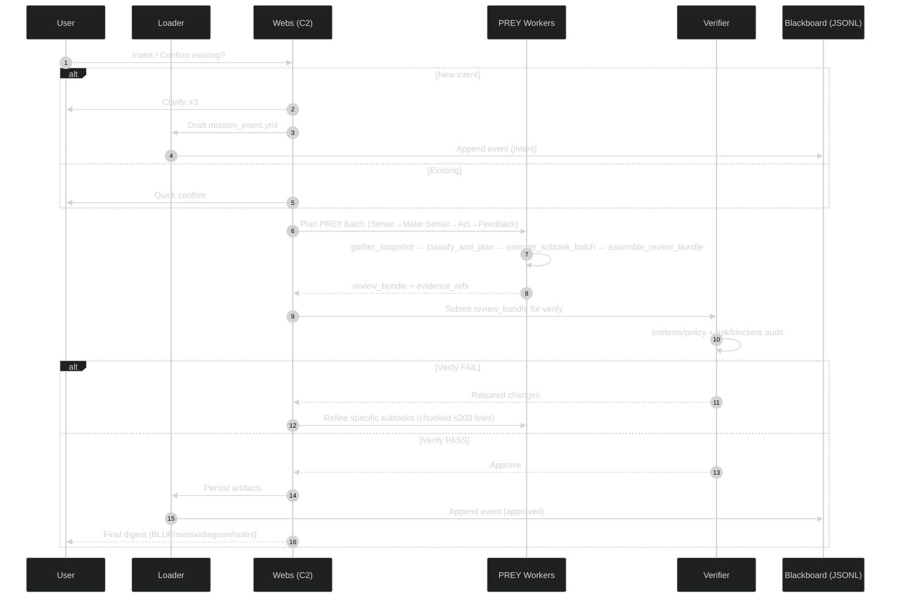

# Mission Intent — Clarification Pass 3 (TEMP)

created_at: 2025-10-29T14:12:00Z
mission_id: gem21_gpt5_attempt3_2025-10-29
status: pass3-draft
owner: TTao
orchestrator: Swarmlord of Webs (C2 facade)
linked_docs:
  - ./clarification_pass1_2025-10-29.md
  - ./clarification_pass2_2025-10-29.md

---

## BLUF
- Workflow lock: User → Loader → Webs (C2) → PREY workers → Verifier → Blackboard → Webs → User digest.
- PREY maps to JADC2: gather_snapshot = Sense; classify_and_plan = Make Sense; execute_subtask_batch = Act; assemble_review_bundle = Feedback.
- Verifier is independent: runs lint/tests/policy/evidence checks; no edits; pass/fail only.
- Output contract: Every mission produces BLUF, operating_mode, tradeoff_matrix, diagram_stub, safety summary, blockers.
- SSOT Gen21 target: 1000+ lines (chunked ≤200 lines; verify per chunk; max 5 loops/section).

---

## Matrix (roles × gates)
| Lane | Key actions | Outputs | Pass/Fail gate |
|------|-------------|---------|----------------|
| User | Give/confirm intent; approve digest | intent text; approvals | Existing intent? If yes, skip clarify×3 |
| Loader | Env snapshot hooks; persist writes | file diffs, logs | n/a |
| Webs (C2) | Clarify×3 if new; draft mission_intent.yml; plan PREY; assemble review bundle; final digest | mission_intent.yml; react_receipt; review_bundle; digest | Requires Verifier PASS before digest |
| PREY workers | gather_snapshot → classify_and_plan → execute_subtask_batch → assemble_review_bundle | work_packages; review_bundle | Must include evidence_refs; no placeholders |
| Verifier (independent) | Lint/tests/policy; risk/blockers audit; pass/fail only | verify_report | FAIL → refine; PASS → proceed |
| Blackboard | Append-only events with chunk/evidence refs | JSONL entries | History immutable |

---

## Diagram

---

## Notes
- PREY↔JADC2 mapping enforced in planning and logs; each stage must cite evidence_refs.
- Verify cannot edit; only pass/fail with remediation list. Any placeholder (“TODO”, “...”) = FAIL.
- Anti-truncation: SSOT ≥1000 lines total; per-write ≤200 lines; verify len() each chunk; ≤5 loops/section.
- Tooling: Real tools/services allowed (internet, MCP, extensions); record artifacts/logs; respect secrets/licensing.

---

## Decisions to confirm (check all that apply)
- [ ] Adopt this workflow lock (lanes and order)
- [ ] Enforce mandatory Verify PASS before digest
- [ ] Enforce evidence_refs in all worker outputs and blackboard entries
- [ ] Keep SSOT Gen21 at ≥1000 lines with chunking ≤200 lines
- [ ] Proceed to draft mission_intent_2025-10-29.yml using Pass 1–3

---

## Next
- On confirmation, I’ll draft `mission_intent_2025-10-29.yml` for your approval (no code yet), then stage the plan to generate SSOT Gen21 (1000+ lines) and Swarmlord v20 afterward.
