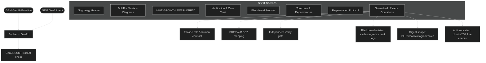

# Mission Intent — Clarification Pass 4 (TEMP)

created_at: 2025-10-29T14:20:00Z
mission_id: gem21_gpt5_attempt3_2025-10-29
status: pass4-draft
owner: TTao
orchestrator: Swarmlord of Webs (C2 facade)
linked_docs:
  - ./clarification_pass1_2025-10-29.md
  - ./clarification_pass2_2025-10-29.md
  - ./clarification_pass3_2025-10-29.md

---

## BLUF
- Today’s intent: Produce a binding mission_intent.yml that directs creation of a new Gen21 SSOT (1000+ lines) integrating Swarmlord of Webs operations as a first-class section, using Gen19 as base and honoring Gen1 lineage.
- Objective: Cold-start capable SSOT (docs-as-code) that brings Swarmlord online and regenerates HFO with ≤3 manual steps; independent Verify must pass before any digest to human.
- Safety: Chunked generation (≤200 lines/write), tripwires (line_count, placeholders, lint/tests/policy), revert to last good or Gen19 baseline.
- Tooling: Actively use real tools/services (internet, MCP servers, VS Code extensions, package managers); record evidence_refs in blackboard.

---

## Matrix — Requirements and acceptance
| Dimension | Requirement | Acceptance criteria |
|---|---|---|
| SSOT scope | New Gen21, 1000+ lines | ≥1000 lines total; no placeholders; sections complete |
| Swarmlord integration | Dedicated section in SSOT detailing operations | Covers: role/facade, PREY↔JADC2, Verify gate, blackboard protocol, facade output shape, blocked_capabilities handling, anti-truncation |
| Lineage | Build from Gen19; preserve Gen1 intent | ≥95% structural/content lineage where applicable; explicit evolutions only |
| Cold start | Docs-as-code, repo-agnostic | ≤3 manual steps to bring Swarmlord online from SSOT guidance |
| Workflow | User→Loader→Webs→PREY→Verifier→Blackboard→Webs→User | Sequence diagram reflects gates; Verify PASS mandatory before digest |
| Tooling | Real tools/services allowed | Network/downloads permitted; no simulated tools; evidence in blackboard |
| Safety | Canary/Tripwire/Revert enforced | Chunk ≤200 lines; line_count ≥0.9×target per chunk; no “TODO/…”; revert plan documented |
| Outputs | Digest contract | BLUF, operating_mode, tradeoff_matrix, diagram_stub, safety summary, blockers |
| Verification | Independent, non-editing | Verify report must pass or return actionable fail list; no silent fixes |

---

## Diagram — Gen21 SSOT with Swarmlord integration

---

## Notes
- Swarmlord section content (proposed headings for SSOT):
  1) Identity & Facade Contract (only voice to human)
  2) PREY→JADC2 mapping and internal labels (gather_snapshot → assemble_review_bundle)
  3) Engage rules: delegate-only; workers return work_packages; no planner self-fixes
  4) Verify Gate: independent, pass/fail only; remediation loop; no bypass
  5) Blackboard Protocol: append-only JSONL, evidence_refs, chunk_id, regen_flag
  6) Safety Envelope: canary/tripwire/revert; line_count targets; placeholders forbidden
  7) Human-Facing Output: BLUF/operating_mode/tradeoff_matrix/diagram_stub/safety/blockers
  8) Blockers policy: record denied access, tool limits, privacy constraints
- Anti-truncation plan: SSOT drafted in chunks (≤200 lines) with per-chunk verification; escalate after ≤5 attempts/section.
- Cold-start posture: SSOT includes minimal setup and operational steps to bring Swarmlord online in ≤3 manual steps.

---

## Decisions to confirm
- [ ] Proceed to draft `mission_intent_2025-10-29.yml` with: SSOT ≥1000 lines, dedicated Swarmlord section, Gen19 base + Gen1 lineage.
- [ ] Use UTC (Z-suffix) timestamps in mission_intent.yml and blackboard.
- [ ] Enforce Verify PASS before any human-facing digest.
- [ ] Adopt chunk ≤200 lines, line_count tripwires, and revert plan as specified.
- [ ] Allow real tooling (internet/MCP/extensions) with evidence_refs logged.

---

## Next
- On confirmation: I will draft the mission_intent.yml for today reflecting Pass 1–4, then queue SSOT Gen21 drafting and Swarmlord v20 regeneration as subsequent phases.
