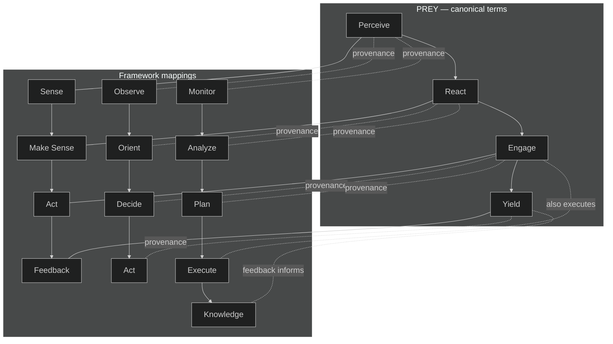

# Mission Intent — Clarification Pass 5 (TEMP)

created_at: 2025-10-29T14:28:00Z
mission_id: gem21_gpt5_attempt3_2025-10-29
status: pass5-draft
owner: TTao
orchestrator: Swarmlord of Webs (C2 facade, sole human interface once online)
linked_docs:
  - ./clarification_pass1_2025-10-29.md
  - ./clarification_pass2_2025-10-29.md
  - ./clarification_pass3_2025-10-29.md
  - ./clarification_pass4_2025-10-29.md
references:
  - hfo_gem/gen_19/original_gem.md (Gen19 baseline)
  - hfo_swarmlord_of_webs_kilo_code_mode/swarmlord-of-webs-export-v15.yaml (works; manual-heavy)
  - hfo_swarmlord_of_webs_kilo_code_mode/hallucination-swarmlord-of-webs-mode-v19-2025-10-29.yaml (hallucinated; do not use)

---

## BLUF
- Terminology lock: Use PREY (Perceive → React → Engage → Yield) as canonical; map to Sense/Make Sense/Act/Feedback and cite JADC2/OODA/MAPE-K for provenance.
- Interface contract: After Swarmlord comes online, you only talk to Swarmlord (no other modes). Swarmlord orchestrates all tactical/execution, runs independent Verify, and returns digest (BLUF/matrix/diagram/notes).
- Deliverable: New Gen21 SSOT (≥1000 lines) with a dedicated "Swarmlord of Webs Operations" section; real tools only, with evidence_refs and receipts.
- Pain update: Add new pain — "Too many manual touches + simulated fake tools that gaslight" — eliminate babysitting and mock tooling.

---

## Matrix — Key locks and lineage
| Topic | Decision/Requirement | Notes |
|---|---|---|
| Terminology | PREY terms (Perceive, React, Engage, Yield) | Map to Sense/Make Sense/Act/Feedback; aligns with JADC2, OODA, MAPE-K |
| Interface | Swarmlord = sole human interface after online | No direct worker/mode convo; manager-only facade |
| SSOT Gen21 | ≥1000 lines, repo-agnostic, docs-as-code | Cold-start → bring Swarmlord online ≤3 manual steps |
| Swarmlord section | Required in SSOT | Role, PREY mapping, Verify gate, blackboard, digest format, blockers, anti-truncation |
| Lineage | Build from Gen19; honor Gen1 | ≥95% reuse where applicable; explicit evolutions only |
| Tools | Real tools/services (internet, MCP, extensions) | No simulated tools; log evidence_refs in blackboard |
| Safety | Canary/Tripwire/Revert | Chunk ≤200 lines; line_count tripwires; revert to last good/Gen19 |
| Verify | Independent, non-editing | Must pass before digest; remediation loop allowed |
| Pain (new) | Too many manual touches + fake tools | Remove babysitting; forbid mock tooling |
| Time | Zulu (UTC) timestamps | For mission_intent.yml and blackboard |

---

## Diagram — PREY mapping to frameworks (terminology retained)

---

## Notes
- PREY is the language in SSOT and blackboard logs; mappings are cited for research provenance (JADC2, OODA, MAPE-K) but not used as primary labels.
- Swarmlord-only interface: Human-facing facade contract enforced; workers never address the human; Verify must pass before any digest.
- Gen19 baseline provides structure and content reuse; Gen1 documents original intent; v15 YAML is a reliable reference but manual-heavy; v19 YAML considered hallucinated and excluded from use.

---

## Decisions to confirm
- [ ] Adopt PREY as canonical terms with research mappings cited
- [ ] Affirm Swarmlord as sole human interface after online
- [ ] Affirm SSOT Gen21 ≥1000 lines with dedicated Swarmlord section
- [ ] Record new pain and forbid simulated tools; require evidence_refs receipts
- [ ] Use Z (UTC) timestamps everywhere
- [ ] Proceed to Pass 6 (final alignment) before mission_intent.yml draft
