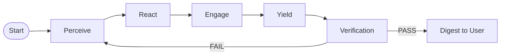
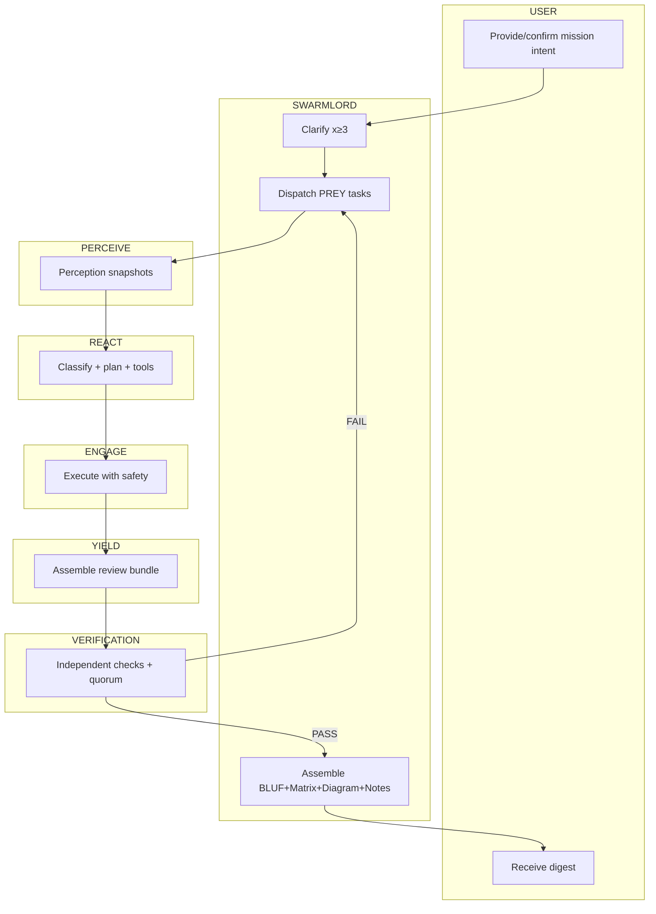
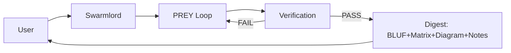

# Clarification Pass 2 — 2025-10-30

orchestrator: Swarmlord of Webs (sole human interface)

BLUF_bundle (standard for digests in this run):
- BLUF: 3–5 lines with decisive summary and current confidence.
- Matrix: Compact tradeoff/decision matrix aligned to Gen21 Ops.
- Diagram: At least one visual (state-action, swimlane, or user flow) per digest.
- Notes: Concise implementation notes, limits, and evidence_refs pointers.

- context_deltas_from_pass1:
- Maximize tool use: Actively incorporate the best available tools; discover and add tools during execution (with receipts and safety). Goal is end-to-end capability, not minimality.
- Digest format is BLUF: Bottom Line Up Front — then Diagram(s) and concise Notes.
- Verification focuses on reducing hallucination via quorum/grounding; we measure and report an estimated hallucination rate.
- PREY should operate as an anytime algorithm: you can stop at any time; each Yield is a coherent partial with Verify status.

interface_contract (unchanged):
- You talk only to the Swarmlord. Workers/agents never prompt you mid-loop.
- Minimum 3 clarification passes before creating the timestamped mission intent YAML SSOT.

preferred_digest_shape (BLUF + Matrix + Diagram + Notes):
- BLUF — 3-5 lines decisive summary and confidence.
- Matrix — tradeoff/decision table relevant to the pass.
- Diagram — at least one (state-action, swimlane, or user flow).
- Notes — concise implementation notes and limits; evidence_refs pointers.

prey_workflow (Gen21-aligned, simplified for first runs):
- Perceive
  - Build perception snapshots (files, configs, prior missions) and cite sources.
  - Ground to evidence: repository paths, hashes, metrics where possible.
- React
  - Classify domain/posture (e.g., Cynefin); choose minimal tools for the canary.
  - Propose quorum plan: how many independent agents/checks for cross-validation.
- Engage
  - Execute with safety criteria: tripwires, bounded writes, no babysitting.
  - Log material decisions and artifacts for Verify to inspect.
- Yield
  - Produce a minimal, verifiable payload (artifact/diff/metrics/structured summary).
  - Include a BLUF digest + diagram(s) + notes.

verify_gate (independent, hallucination control):
- Inputs: perception snapshot(s), execution artifacts, evidence_refs, and quorum votes.
- Checks:
  - Grounding: assertions trace to evidence; missing links flagged.
  - Consistency: Perceive/React/Engage/Yield agree; contradictions flagged.
  - Hallucination rate (est.): proportion of claims lacking evidence or contradicted by sources.
  - Quorum: require consensus threshold (e.g., >=2 of 3 agents/validators) for accept.
- Outcome:
  - PASS -> return to Swarmlord with BLUF digest.
  - FAIL -> rerun PREY (bounded by timeouts and max attempts recommended by Swarmlord) or stop with partials.

timeouts_and_anytime_behavior:
- Anytime algorithm: each Yield is independently digestible; you can interrupt after any Yield.
- Per-cycle limits: Swarmlord recommends a soft time budget per PREY loop and a max cycles/attempts for canary runs.
- If time budget lapses without PASS, Swarmlord returns best partial with BLUF and a plan to continue.

tooling_posture:
- Maximize tool coverage within safety: prefer real, battle-tested tools; add new tools proactively when they improve grounding or throughput.
- Discovery policy: Swarmlord may schedule tool discovery tasks; Verify ensures licenses/compliance; blackboard records versions/locks.
- Determinism preference: when comparable, prefer deterministic tools for reliable quorum; allow exploratory tools gated by Verify.

metrics_reporting:
- Hallucination rate (est.): X% (claims without evidence or contradicted).
- Quorum status: votes per check (e.g., 2/3 agree on key assertions).
- Verify summary: PASS/FAIL with reasons.
- Effort/time: cycles run, time per cycle, total elapsed.

acceptance_for_pass2:
- Approve BLUF + diagrams + notes as the standard digest format.
- Approve quorum-based verification and reporting of an estimated hallucination rate.
- Approve anytime algorithm behavior with Swarmlord-recommended per-cycle timeouts.
- Approve simple-first canary policy before expanding tooling.

preview_next (for Pass 3):

## Diagrams

### State–Action Graph (PREY lifecycle)

### Swimlane (Roles: USER, SWARMLORD, PERCEIVE, REACT, ENGAGE, YIELD, VERIFICATION)

### User Flow Diagram (USER → SWARMLORD → PREY → VERIFICATION → USER)

- Lock concrete success criteria (thresholds for quorum, initial time budgets, minimal agent set).
- Confirm mission intent YAML fields template and path, then authorize its creation.
- Enumerate the initial toolset and the discovery policy for adding tools during execution.
