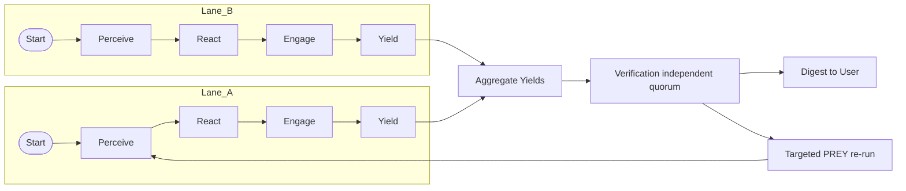
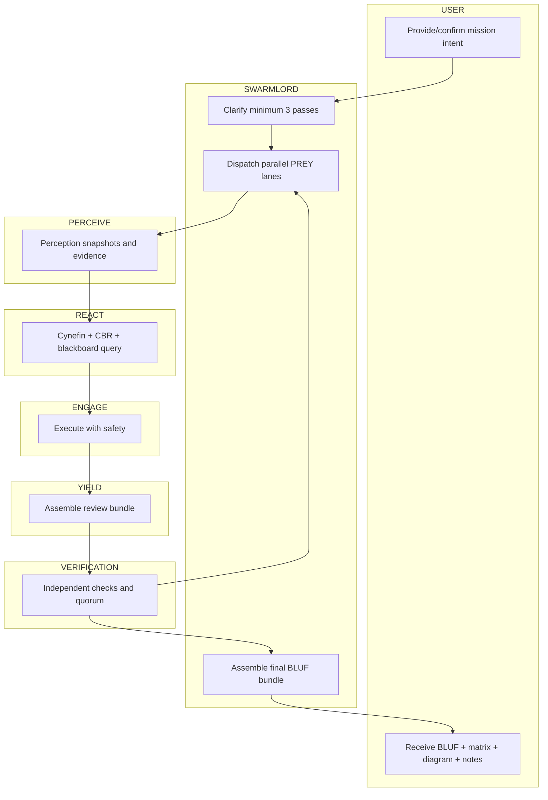
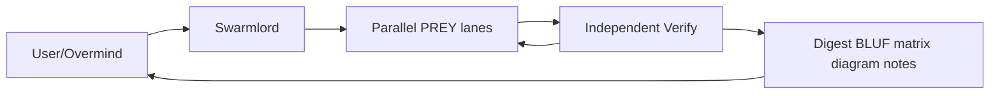

# Clarification Pass 3 — 2025-10-30

orchestrator: Swarmlord of Webs (sole human interface)

## BLUF
- Interface: You (USER/Overmind) provide mission intent; Swarmlord clarifies (≥3 passes), then runs the swarm and returns a verified payload digest. No worker prompts to you mid-loop.
- Roles: PREY maps to OBSIDIAN roles — Perceive=Observers, React=Bridgers, Engage=Shapers, Yield=Assimilators; Verify is Immunizers+Disruptors (blue/red) acting independently.
- Orchestration: Run multiple PREY lanes in parallel (each lane sequential P→R→E→Y). Aggregate multiple Yields, run quorum-based Verify, then Swarmlord assembles a BLUF bundle (BLUF + matrix + diagram + notes) and returns.
- Tooling: Maximize tool coverage (real, battle-tested). Allow proactive tool discovery with receipts; Verify controls compliance and safety.
- Receipts/Telemetry: Everything is auditable. Append blackboard JSONL receipts; optionally emit OpenTelemetry-style JSON/YAML traces.

---

## Interface contract (reaffirmed)
- Sole human interface: Swarmlord only. Workers never address the human.
- Clarifications: Minimum 3 passes before creating the timestamped mission intent YAML (SSOT for the run).
- Anytime behavior: Each Yield is independently digestible; Swarmlord can return partials on timeout or by request.

## Roles mapping (Gen21-aligned)
| Phase | Role (OBSIDIAN) | Responsibilities | Typical outputs |
|---|---|---|---|
| USER (Overmind) | Navigator partner | Provide mission intent; approve clarifications; receive digest | mission_intent; approvals |
| Swarmlord | Manager/Orchestrator | Decompose, delegate, enforce safety/verify, assemble digest | plans, receipts, final digest |
| Perceive | Observers | Sense codebase/repo/Internet; gather perception snapshots; cite evidence | perception_snapshots, evidence_refs |
| React | Bridgers (C2) | Make sense (Cynefin), case-based reasoning, query blackboard; produce reaction snapshot/plan | react_receipts, plans, tool selections |
| Engage | Shapers | Execute with safety (tripwires, bounded writes); produce artifacts | work_packages, diffs, metrics |
| Yield | Assimilators | Assemble review bundles from artifacts and evidence | review_bundles |
| Verify | Immunizers + Disruptors | Independent checks, adversarial probes, quorum voting | verify_reports, pass/fail + remediation |

Notes:
- Cynefin classification guides playbook choice in React; case-based reasoning uses prior receipts and blackboard history.
- Blackboard is append-only JSONL and the coordination backbone.

## PREY orchestration (parallel lanes)
- Multiple lanes run in parallel; each lane executes P→R→E→Y sequentially.
- Lanes produce Yields; an Aggregator collects Yields and prepares a combined bundle for Verify.
- Verify uses independent validators (at least two roles), then quorum.

### State–Action Graph (lanes + gate)


### Swimlane (USER, SWARMLORD, PERCEIVE, REACT, ENGAGE, YIELD, VERIFICATION)


### User flow (anytime)


## Verify gate (independent + quorum)
- Inputs: Perception snapshots, artifacts, review bundles, evidence_refs, lane metadata.
- Checks:
  - Grounding: Claims must trace to evidence (files/lines/hashes/metrics/URLs).
  - Consistency: P/R/E/Y internally consistent; cross-lane contradictions flagged.
  - Hallucination rate (est.): fraction of claims lacking evidence or contradicted by sources.
  - Quorum: Require consensus ≥2/3 across validators (e.g., Immunizer, Disruptor, optional third).
- Outcomes:
  - PASS → bundle to Swarmlord for final assembly → BLUF bundle to USER.
  - FAIL → targeted PREY re-run on failing lanes or specific phases; shrink scope if needed.

Proposed defaults (can be overridden in mission intent):
- Quorum threshold: 2 of 3 validators agree (or stronger).
- Hallucination rate target: ≤10% for PASS; 10–20% = caution (Swarmlord may return partials); >20% = FAIL.
- Time budgets: PREY lane soft limit 5 minutes per cycle; mission-level soft cap 30 minutes before returning best partial with plan.

## Receipts and telemetry (auditable)
- Blackboard JSONL (append-only) required for material actions:
  - Fields: mission_id, phase, summary, evidence_refs[], safety_envelope{}, blocked_capabilities[], timestamp Z, optional chunk_id, regen_flag.
- Optional OpenTelemetry-style JSON/YAML for traces:
  - trace_id, span_id, parent_span_id, name (phase), start_time, end_time, status, attributes{ role, lane_id, evidence_refs, quorum, hallucination_rate }.

Example (blackboard JSONL line):
```json
{"mission_id":"mi_2025-10-30","phase":"assemble_review_bundle","summary":"Lane A+B yields aggregated","evidence_refs":["path/to/artifact:10-90"],"safety_envelope":{"chunk_size_max":200},"timestamp":"2025-10-30T10:00:00Z","chunk_id":{"index":1,"total":1}}
```

## Digest specification (BLUF bundle)
- BLUF: 3–5 lines decisive summary + confidence.
- Matrix: tradeoffs/decisions relevant to this pass.
- Diagram(s): at least one (state-action, swimlane, or user flow).
- Notes: concise implementation notes, limits, evidence_refs pointers.
- Optional Gen21 extras: operating_mode, safety summary, blockers.

## Mission intent YAML (template proposal)
```yaml
mission_id: mi_2025-10-30
created_at: 2025-10-30T00:00:00Z
orchestrator: Swarmlord of Webs
interface:
  sole_human_interface: true
clarification_min_passes: 3
anytime_behavior: true
quorum:
  validators: [immunizer, disruptor, verifier_aux]
  threshold: 2  # of 3
verify:
  hallucination_rate_target: 0.10
  fail_over: rerun_prey_targeted
timeouts:
  prey_cycle_soft_minutes: 5
  mission_soft_minutes: 30
telemetry:
  blackboard_path: hfo_blackboard/obsidian_synapse_blackboard.jsonl
  emit_opentelemetry: true
  otel_format: json
safety:
  chunk_size_max: 200
  placeholder_ban: true
  revert_plan: true
tooling:
  posture: maximize
  discovery_allowed: true
  receipts_required: true
outputs:
  digest_shape: [BLUF, matrix, diagram, notes]
```

## Acceptance for Pass 3
- Approve roles mapping and parallel-lane orchestration.
- Approve quorum threshold (2/3), hallucination rate target (≤10%), and time budgets (5 min cycle, 30 min mission soft cap) as defaults.
- Approve BLUF bundle (BLUF + matrix + diagram + notes) as the digest contract.
- Approve mission intent YAML template (fields above) and authorize creation.

## Next step
- Upon approval, I will create `hfo_mission_intent/2025-10-30/mission_intent_2025-10-30.yml` with these defaults, then proceed to the PREY orchestration plan.
