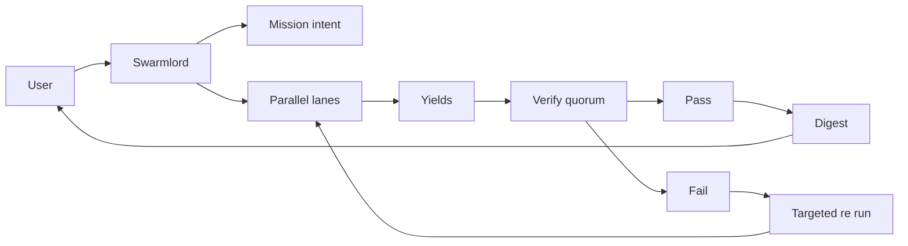
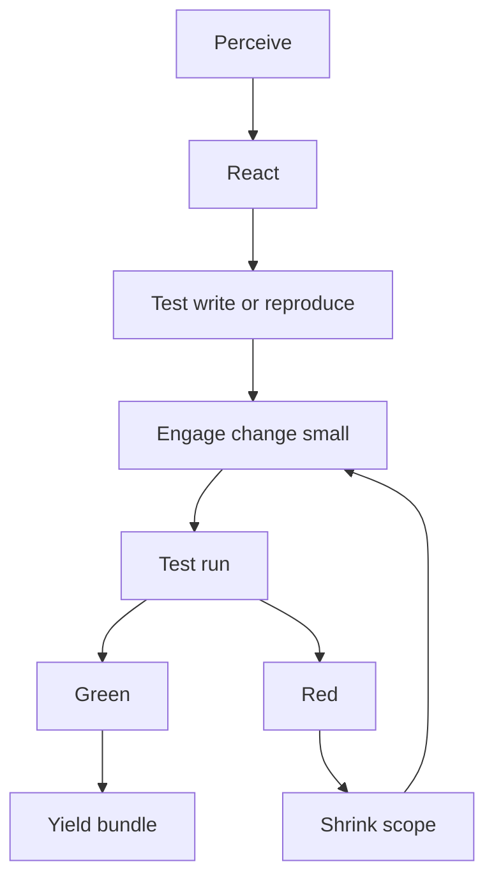
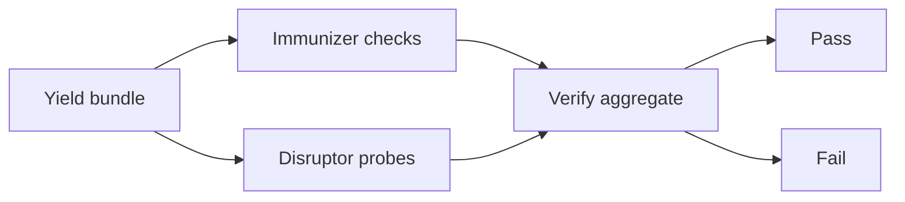
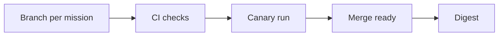
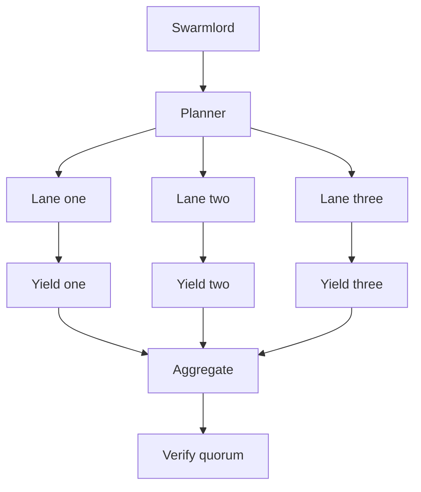
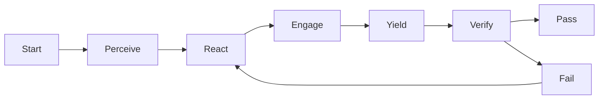
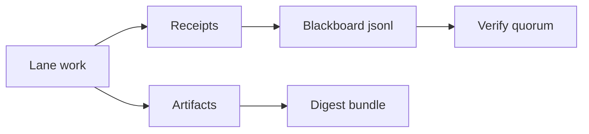
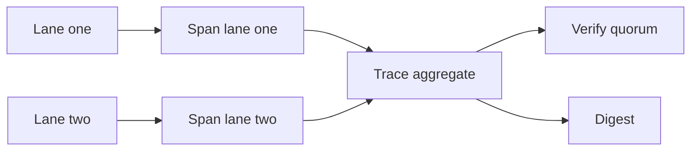

# Clarification Pass 5 — 2025-10-30

orchestrator: Swarmlord of Webs (sole human interface)

## BLUF
- Purpose: Single reference for end to end orchestration, ready to drive Crew AI now and adaptable to LangGraph later.
- Shape: Clear diagrams of the full flow, lane internals, verify quorum, GitOps, crew topology, and data artifacts.
- Defaults: Parser safe Mermaid, simple labels, no edge labels; fits success criteria from Pass 4 (autonomy, safety, TDD, quorum Verify).
- Contact policy: After mission intent is set, Swarmlord contacts only on digest, critical error, or timeout; manual touches mid loop are a code smell.
- Disruptor policy: At least one adversarial probe per lane cycle to avoid persistent green; defense in depth and immune system mindset.

---

## Matrix — role and artifact mapping (Crew AI and LangGraph)

| Concept | This repo | Crew AI construct | LangGraph concept | Evidence/artifacts |
|---|---|---|---|---|
| Orchestrator | Swarmlord | Manager agent / controller | Orchestrator node | mission_intent.yml, receipts |
| Lane | PREY lane | Crew task group / agent team | Subgraph of nodes | work_packages, yields |
| Perceive | Sense repo/net | Tool runner / researcher | Node: perceive | perception_snapshots |
| React | Make sense | Planner / reasoning agent | Node: react | react_receipts |
| Engage | Execute safely | Shaper / implementer | Node: engage | diffs, metrics |
| Yield | Review bundle | Assimilator | Node: yield | review_bundles |
| Verify | Immunizer + disruptor | Validators quorum | Gate subgraph | verify_reports |
| Safety | Canary, tripwires, revert | Guardrails / checkers | Policies / guards | safety_envelope |
| Evidence | Blackboard JSONL | Audit logger | Data sink node | blackboard.jsonl |

Notes:
- Keep lane nodes sequential P → R → E → Y; place Verify after aggregation.
- For LangGraph, edges define the control flow with simple condition back edges on FAIL.

## Diagram — end to end user to digest

## Diagram — lane internals with TDD and PREY

## Diagram — verify quorum with immunizer and disruptor

## Diagram — GitOps pipeline for missions

## Diagram — Crew AI topology for parallel lanes

## Diagram — LangGraph abstraction of a lane

## Diagram — data artifacts and blackboard

## Notes for building Crew AI and later LangGraph
- Roles and tools
  - Define agents for planner, perceiver, implementer, assimilator, immunizer, disruptor.
  - Bind real tools only; log receipts after material actions.
- Memory and evidence
  - Use blackboard JSONL as primary coordination memory; include evidence_refs.
- Guardrails
  - Enforce chunk limit, placeholder ban, canary first, measurable tripwires, and explicit reverts.
- Retries
  - Up to three targeted re runs per failing lane; shrink scope on each retry.
- Verification
  - Run quorum validators; disruptor always probes to avoid persistent green.
- GitOps
  - Branch per mission; CI checks; canary; merge only after Verify PASS.

## Pilot parameters and audit
- Lanes: 2 to start; expand after Validate.
- Time budgets: lane cycle 5 minutes soft; mission 30 minutes soft.
- Audit: enable OpenTelemetry audit for all lanes and verify steps.
- Contact policy: only digest, critical error, or timeout returns to user.

### Diagram — OpenTelemetry trace for lanes and verify

## Acceptance for Pass 5
- Approve this set of diagrams as the main reference for mission intent v5 and Crew AI implementation.
- Confirm Crew AI can be scaffolded from these nodes and edges immediately.

## Next step
- On approval, I will create `hfo_mission_intent/2025-10-30/mission_intent_2025-10-30.v5.yml` embedding these flows and defaults and begin a crew manifest for 2 to 4 lanes.
