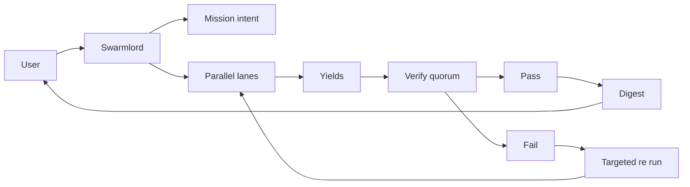
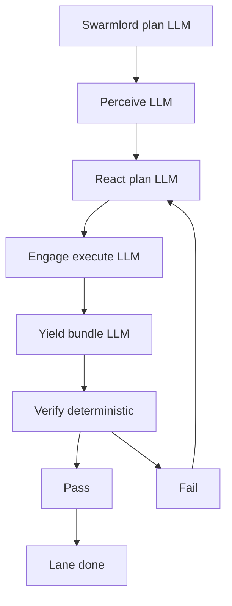
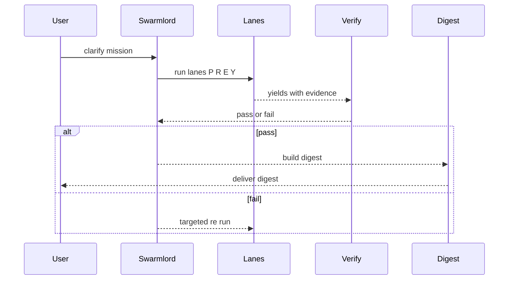
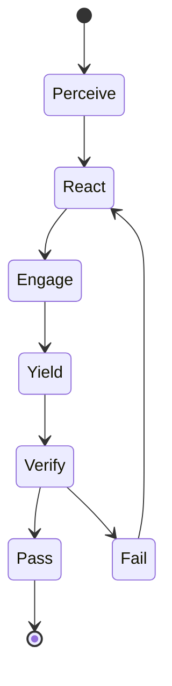
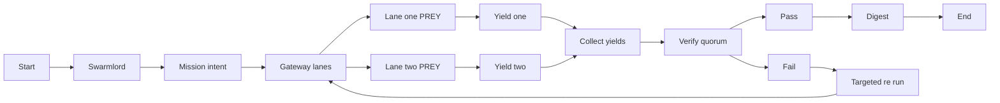
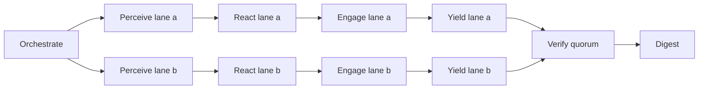
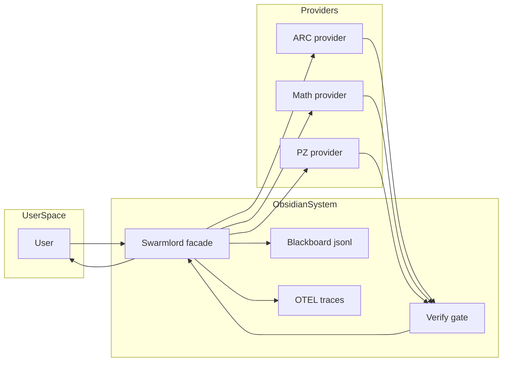

# Clarification Pass 1 — 2025-10-31

orchestrator: Swarmlord of Webs (sole human interface)

## BLUF
- Today’s focus: unify all evals under a single PREY workflow (Option A) with LLM at every stage and a deterministic Verify gate.
- User interaction model: you clarify with Swarmlord to set the mission intent, then receive only a verified Swarmlord digest.
- Safety and audit unchanged: chunk ≤ 200 lines, placeholder ban, receipts to blackboard, OTEL spans, quorum Verify before any digest.

## Objectives (Pass 1)
- Lock the E2E flow: USR → Swarmlord → Mission intent → Parallel lanes → Yields → Verify quorum → Pass/Fail → Digest back to user.
- Confirm LLM-per-stage orchestration: Orchestrate, Perceive, React, Engage, Yield, and Digest are LLM calls; Verify stays independent and deterministic (LLM may annotate, not decide).
- Confirm single-runner posture: ARC, simple math, and PettingZoo operate as provider adapters behind the same PREY workflow and artifacts.

## Flow diagram (parser-safe)

## Lane internals (LLM per PREY stage)

## Multi view diagrams (parser safe)

### UML sequence — user to digest

### UML statechart — lane lifecycle

### BPMN like flow — end to end

### DAG — run level dependencies

### C4 style context — simple

## Initial decisions (locked for this day)
- Single eval workflow, one entry point; providers: ARC | math | pz_simple_tag.
- LLM tiering: fast reasoning models for Orchestrate/Perceive/React/Yield/Digest; task-appropriate model for Engage.
- Default output tokens (max_tokens): 4000 per stage to avoid truncation; models may produce less.
- Budgets and backpressure: mission/lane/stage token caps; retry-on-empty once; remove response_format on retry if needed.
- Verify gate: independent, deterministic quorum; PASS required before digest.

## Inputs you may provide here
- Eval type and dataset parameters (e.g., ARC split/limit/seed; math prompts; PZ episodes/seed).
- llm_per_stage preferences (model hints, max_tokens, reasoning effort, timeouts).
- Lanes/concurrency and budget priorities (accuracy vs. cost vs. latency).
- Any compliance or safety constraints to enforce during Engage.

## Next step
- Proceed to Clarification Pass 2 and 3 (minimum) to refine eval/provider params and stage defaults.
- Mission intent will be created only after ≥ Pass 3 (target 5) to reduce churn and align with the SSOT policy.

## Evolution (provenance note)
- Seeded the unified PREY workflow with LLM per stage and deterministic Verify.
- Established user touchpoints (clarification, digest) and safety envelope.
- Sets the baseline for later passes to tune tokens, models, and orchestration; no breaking changes introduced here.
