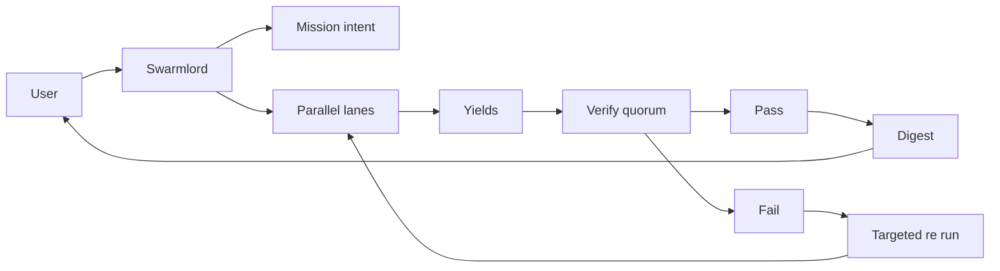

# Clarification Pass 2 — 2025-10-31

orchestrator: Swarmlord of Webs (sole human interface)

## BLUF
- Sanity focus: ARC evaluation as the single unified workflow, 50 items on the validation split.
- LLM at every PREY stage; Verify remains deterministic and independent.
- Defaults: cheaper and smarter models per stage; Engage uses OSS-120B unless overridden.
- Priorities: accuracy and cost now; speed later after orchestration is correct.
- Mission intent is deferred: do not create a mission intent until at least Clarification Pass 3 (target 5).

## Decisions today
- Eval provider: ARC (validation, limit=50, seed=42)
- LLM profile per stage: use default profile now; later add OpenEvolve/Thompson sampling to tune stage↔model.
  - Engage default model: openai/gpt-oss-120b
  - Non-Engage defaults: fast reasoning-capable models
  - Output token limit default: 4000 across stages (models can use less as needed)
- Concurrency: 10 lanes, max workers 10 (scale to 50/100/1000 later as budget allows)
- Schedule: hourly cadence (anytime behavior on); plan to move to 24/7 Swarmlord later
- Priorities: accuracy and cost first; speed later

## Guardrails and budgets (initial)
- Default output tokens (max_tokens): 4000 for all stages to avoid premature truncation; tune down after stability.
- Retries: 1 on empty content; remove response_format on retry if needed; record flags.
- Mission soft caps: tokens/time per hour (tune after first run); backpressure enabled.

## Flow confirmation

## Next
- Proceed to Clarification Pass 3 (and likely Pass 4–5) before creating any mission intent.
- On Pass 3, we will freeze stage defaults (models, 4k output tokens, retries) and finalize provider params for ARC 50 validation.
- After Pass ≥3 approval, we will author the mission intent and prepare for the first sanity run.

## Evolution (provenance note)
- Narrowed to ARC validation (limit 50) and set concurrency targets.
- Locked LLM at every stage and established transport resiliency.
- Prepares for Pass 3 to lock concrete per-stage defaults; maintains consistency with Pass 1 without introducing speculative steps.
