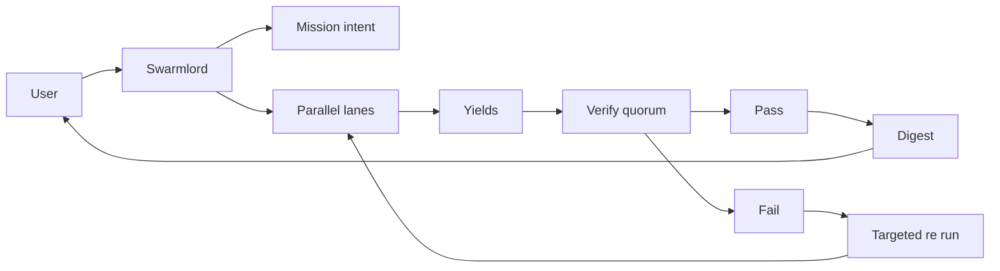

# Clarification Pass 3 — 2025-10-31

orchestrator: Swarmlord of Webs (sole human interface)

## BLUF
- Lock PREY stage defaults for today: max_tokens = 2000 at every stage (tunable), default model = openai/gpt-oss-120b for all stages.
- TDD is the primary operating mode: red → green → refactor per lane, minimal babysitting.
- Yield includes a deterministic lane-level validation of required artifacts and checks; run-level Verify quorum still aggregates yields across lanes.
- Safety envelope and audit unchanged: chunk ≤ 200 lines, placeholder ban, receipts to blackboard, OTEL spans, quorum Verify before any digest.

---

## Decisions locked (today)
- PREY stage defaults (uniform baseline now; tune later per stage):
  - max_tokens_per_stage: 2000
    - Tunable via mission intent and/or env (e.g., OPENROUTER_MAX_TOKENS=2000).
  - default_model_per_stage: openai/gpt-oss-120b
    - Applies to: Orchestrate, Perceive, React, Engage, Yield, Digest.
    - Verify stays deterministic and out-of-band (no LLM decides PASS/FAIL).
- Transport/resiliency (unchanged):
  - Retry once on empty content; on retry, drop response_format if provider rejects it; record flags in artifacts.
- Concurrency and scope (unchanged from Pass 2):
  - Lanes: 10; max workers: 10. Priorities: accuracy and cost first; speed later.
- Guardrails (unchanged):
  - Canary first, measurable tripwires (line_count, placeholder_scan, tests_green, policy_checks), explicit revert plan.
  - Append receipts to `hfo_blackboard/obsidian_synapse_blackboard.jsonl` for material actions.

## TDD as the lane discipline (red → green → refactor)
- Each lane follows: write/reproduce failing test → smallest change to pass → run tests/diagnostics → refactor if green.
- Minimal babysitting: workers do not prompt mid-loop; Swarmlord-only facade with digest/critical/timeout contact policy.
- Auto-retries: up to 3 targeted PREY re-runs per failing lane with shrink_scope_on_retry: true.

## Quorum and digest (JADC2 mosaic alignment)
- Doctrine: lanes are treated as JADC2 mosaic tiles that disperse (parallel PREY) and converge (quorum).
- Quorum: performed by Swarmlord for now (validators: immunizer, disruptor, verifier_aux; threshold 2/3). A dedicated quorum_officer role may be introduced later.
- Digest: built by Swarmlord and validated for format before delivery. Required elements: BLUF, matrix, diagrams (parser-safe), executive summary; include evidence_refs.

## Stage mapping (baseline)
- Orchestrate → model: openai/gpt-oss-120b, max_tokens: 2000
- Perceive → model: openai/gpt-oss-120b, max_tokens: 2000
- React → model: openai/gpt-oss-120b, max_tokens: 2000
- Engage → model: openai/gpt-oss-120b, max_tokens: 2000
- Yield → model: openai/gpt-oss-120b, max_tokens: 2000
- Digest → model: openai/gpt-oss-120b, max_tokens: 2000
- Yield includes deterministic lane-level validation of:
  - presence and integrity of perception_snapshot.yml, react_plan.yml, engage_report.yml
  - tests_green and tripwires status
  - evidence_refs completeness
- Verify (run-level) → deterministic quorum (immunizer + disruptor + verifier_aux), threshold 2/3, aggregating lane yields

## Flow confirmation (parser safe)

## Notes on tuning (later passes)
- Per-stage model overrides will be explored (e.g., faster reasoning-capable models for non-Engage) once baseline is stable.
- Token budgets can be raised or lowered per stage; 2000 is a safe default today to avoid truncation while controlling cost.

## Acceptance for Pass 3
- Approve max_tokens = 2000 for every PREY stage (tunable).
- Approve default model openai/gpt-oss-120b for all PREY stages and Digest.
- Confirm safety, receipts, OTEL remain unchanged.
- Approve Yield-with-validation (lane-level deterministic checks) and keep run-level Verify quorum aggregator.

## Next step
- With ≥ Pass 3 now satisfied for 2025-10-31, author the mission intent for this date referencing Pass 1–3 with TDD acceptance criteria and Yield validation checklist. Pass 4–5 can refine stage overrides and verification probes before scaling lanes.

## Evolution (provenance note)
- Locks concrete defaults: 2000 tokens per stage and openai/gpt-oss-120b across PREY and Digest.
- Elevates TDD and Yield-with-validation to lane-level requirements; maintains deterministic Verify.
- Sets the stage for example-driven Pass 4 and stigmergy/mesh quorum in Pass 5.
