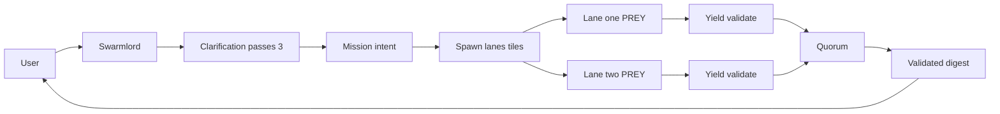
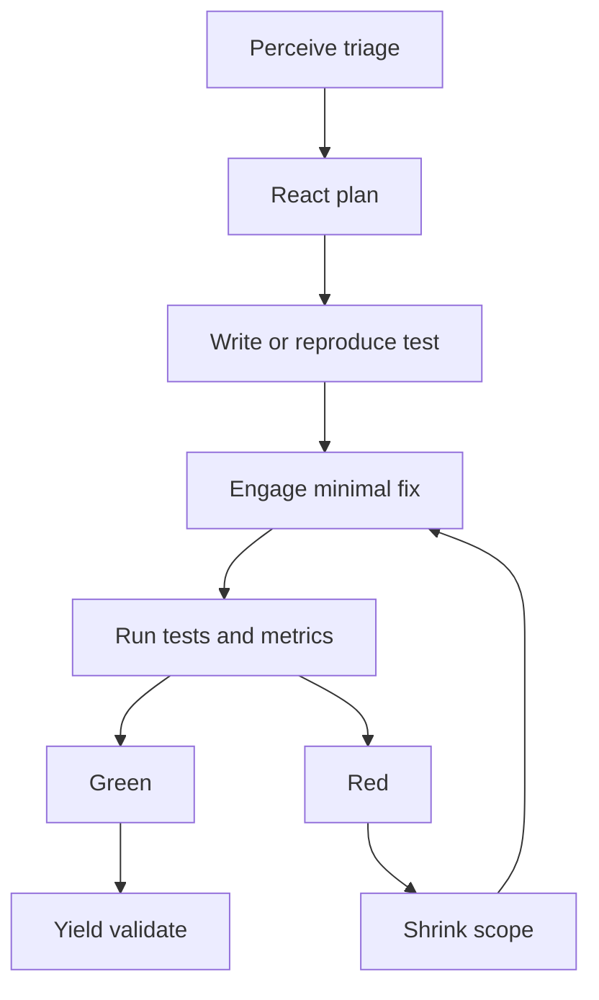

# Clarification Pass 4 — 2025-10-31 (Example scenario: Bug X)

orchestrator: Swarmlord of Webs (sole human interface)

## BLUF
- Art of War posture: fight 100–1000 simulated battles (lanes) before touching the real battlefield (main repo).
- Flow: Clarify → Mission intent → Parallel PREY lanes (tiles) → Yield-with-validation → Swarmlord quorum → Validated digest.
- TDD-first, safety envelope strict, minimal babysitting. LLM defaults today: openai/gpt-oss-120b, max_tokens=2000 per stage (tunable).

---

## Example scenario — Bug X
- Situation: A bug exists, suspected area known but not the exact location.
- Goal: Reproduce, isolate, propose minimal safe fixes, and rank options. No changes to main until digest approval.
- Actors: You (mission owner), Swarmlord (strategic C2), PREY lanes as JADC2 mosaic tiles.

## End to end workflow (parser safe)


## Lane internals (TDD and Yield validation)


## What Swarmlord does (quorum + digest)
- Quorum (today): performed_by = Swarmlord; validators = immunizer, disruptor, verifier_aux; threshold = 2/3.
- Procedure: collect lane yields → assert yield validated → aggregate votes → decide PASS/FAIL → rank options and surface common mistakes.
- Digest: validated for BLUF, matrix, diagrams (parser-safe), executive summary; include evidence_refs.

## Near-term vs. future lanes
- Near-term lanes: primarily text-mode analysis and planning; no writes beyond repo-under-test artifacts.
- Future: VM/container per lane for sandboxed execution and richer tooling; identical PREY artifacts and validation.

## Safety envelope and receipts
- Chunk ≤ 200 lines per write; placeholder ban; canary-first; measurable tripwires (line_count, placeholder_scan, tests_green, policy_checks); explicit revert plan.
- Append receipts to `hfo_blackboard/obsidian_synapse_blackboard.jsonl` with evidence_refs.

## TDD acceptance embedded (lane-level)
- Required: failing_test_reproduced_or_written; smallest_change_to_green; tests_run_with_metrics; refactor_if_green.
- Negative controls recommended to guard against reward hacking.
- Auto-retries: up to 3 targeted PREY re-runs per failing lane; shrink_scope_on_retry: true.

## Yield validation checklist (lane-level)
- perception_snapshot.yml exists (mission_id, lane, timestamp, safety, llm, paths, tdd_mode)
- react_plan.yml exists (cynefin_rationale, approach_plan, chunk_limit_lines, tripwires, acceptance_criteria)
- engage_report.yml exists (tests_green, tripwires_passed, evidence_refs_present; chunk_size respected; placeholder_ban clean; revert_plan documented)
- evidence_refs complete across artifacts; tests_green true; tripwires pass

## Example mission intent excerpt (Bug X)
```yaml
objective: reproduce and fix Bug X with minimal change
success_criteria:
  - tests_green: true
  - diffusion: low (minimal blast radius)
  - evidence_refs_complete: true
safety_criteria:
  - chunk_size_max: 200
  - placeholder_ban: true
  - revert_plan: required
lanes:
  count: 10  # tiles (tunable)
  auto_retries_max: 3
  shrink_scope_on_retry: true
llm_defaults:
  model: openai/gpt-oss-120b
  max_tokens_per_stage: 2000
```

## Acceptance for Pass 4 (example scenario)
- Approve this Bug X orchestration: TDD-first PREY, Yield-with-validation, Swarmlord quorum, validated digest.
- Approve near-term text-mode lanes and roadmap to VM-per-lane isolation.

## Next step
- Mint mission intent v1 for 2025-10-31 (references Pass 1–4). Run a small canary (2–4 lanes) before scaling.

## Evolution (provenance note)
- Operationalizes Pass 3 defaults with an example (Bug X) and enforces TDD and Yield validation in practice.
- Clarifies Swarmlord quorum and digest validation; prepares for stigmergy and mesh quorum in Pass 5.
