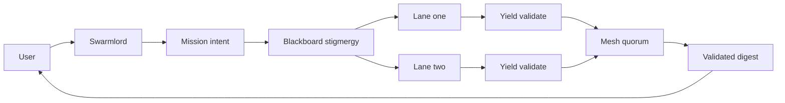

# Clarification Pass 5 — 2025-10-31 (Virtual stigmergy and mesh quorum)

orchestrator: Swarmlord of Webs (sole human interface)

## BLUF
- Coordination shifts to a virtual stigmergy layer on the blackboard; lanes self-organize via signals, not manual touches.
- Quorum runs over distributed meshes; Swarmlord performs quorum now, with a dedicated quorum role planned.
- Every artifact carries context, traceability, and audit fields (trace_id, parent_refs, evidence_hashes, context_notes).
- Runs in the background with an anytime algorithm; only user touchpoints are at clarification and digest.

---

## Virtual stigmergy contract (gen21)
- Substrate: blackboard JSONL (append only) as the stigmergy field.
- Signals:
  - qualitative: labels, intents, tags
  - quantitative: scores, metrics, counters
- Dynamics:
  - attraction: move toward high-quality signals
  - repulsion: avoid redundant or conflicting work
  - evaporation: signal decay via TTL (seconds)
  - diffusion: limited spread of useful signals across lanes
- Policy: coordination via blackboard only; no ad hoc lane-to-user prompts.

## Mesh quorum (disperse and converge)
- Today: quorum performed by Swarmlord; validators = immunizer, disruptor, verifier_aux; threshold 2 of 3.
- Mesh: yields feed a distributed vote and evidence pool; quorum aggregates validated yields only.
- Future: dedicated quorum_officer role; small-world or multi-mesh topologies.

## Artifact traceability and audit
- Required fields on all PREY artifacts:
  - trace_id (run scope)
  - parent_refs (upstream artifacts or receipts)
  - evidence_hashes (sha256 of key files or snippets)
  - context_notes (≥3 lines)
- Hashing: sha256; receipts include content hashes for audit.

## Background and anytime
- Scheduler: background; anytime algorithm to refine results over time.
- User contact: only at clarification phase and final digest.
- Visualization: emit topology and traces for later viewers (planned).

## Parser safe diagrams

## Acceptance for Pass 5
- Approve virtual stigmergy control with signals and dynamics.
- Approve mesh quorum with Swarmlord as performer now and quorum_officer planned.
- Approve artifact audit fields and background anytime posture.

## Next step
- Update mission intent v1 to include stigmergy configuration, mesh quorum details, visualization flags, and audit fields for all artifacts.

## Evolution (provenance note)
- Transitions coordination from manual touches to virtual stigmergy on the blackboard.
- Introduces mesh quorum and audit fields (trace_id, parent_refs, evidence_hashes) for end-to-end provenance.
- Completes the five-pass clarification set to support a mission intent referencing Pass 1–5.
