# Assimilator Research: State-of-the-Art Information Assimilation and Knowledge Management

## BLUF (Bottom Line Up Front)
**Mission**: Create a scalable, safe information assimilation system that standardizes diverse data sources, prevents hallucinations, and enables effective knowledge utilization through explore/exploit strategies (70/30 ratio).

**Key Recommendation**: Implement a hybrid ETL pipeline combining KCS v6 knowledge management, vector database deduplication, stigmergy-based coordination, and defense-in-depth hallucination detection. Start simple with local tools (Chroma/Milvus + Python), scale later with cloud platforms (Pinecone, Azure Data Factory).

**Core Problem Addressed**: Too much information, insufficient ways to use it safely, with hallucination and data quality concerns requiring systematic validation and assimilation workflows.

### State-of-the-Art Comparison Matrix (2024-2025)

| Component | Easy to Start | Hallucination Handling | Scalability | Integration with HFO | Cost |
|-----------|---------------|------------------------|-------------|---------------------|------|
| **ETL: Python + Local Files** | ⭐⭐⭐⭐⭐ | Medium (manual validation) | Low-Medium | High (custom scripts) | Free |
| **ETL: Coalesce/Talend** | ⭐⭐⭐ | High (data profiling, validation) | High | Medium (API integration) | Medium |
| **ETL: Azure Data Factory** | ⭐⭐⭐ | High (ML anomaly detection) | Very High | Medium (cloud-based) | Medium-High |
| **Vector DB: Chroma (local)** | ⭐⭐⭐⭐⭐ | Medium (embedding similarity) | Medium | High (Python native) | Free |
| **Vector DB: Pinecone** | ⭐⭐⭐⭐ | High (metadata filtering) | Very High | High (API) | Medium |
| **Vector DB: Milvus** | ⭐⭐⭐ | High (hybrid search) | Very High | High (open-source) | Free |
| **KCS v6: Manual Process** | ⭐⭐⭐⭐ | High (human validation) | Medium | High (workflow integration) | Free |
| **KCS v6: ServiceNow Integration** | ⭐⭐ | High (automated quality) | Very High | Medium (API) | High |
| **Stigmergy: JSONL Blackboard** | ⭐⭐⭐⭐⭐ | Medium (indirect coordination) | High | Very High (HFO native) | Free |
| **Stigmergy: Kafka Event Stream** | ⭐⭐ | High (event validation) | Very High | Medium (infrastructure) | Medium |

**Recommended Starting Stack**: Python ETL + Chroma Vector DB + JSONL Blackboard + Manual KCS v6 workflow (Total cost: $0, can scale later)

### Comprehensive Assimilation Workflow (Explore 70% / Exploit 30%)

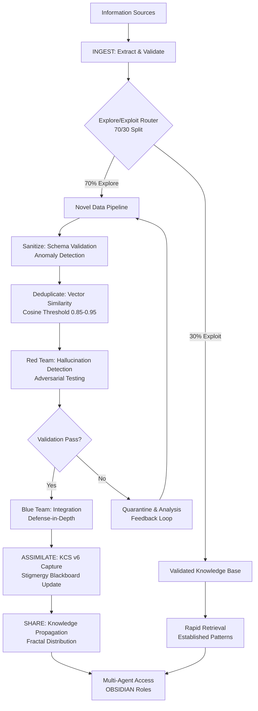

## 1) State-of-the-Art ETL Frameworks & Information Assimilation (2024-2025)

### Modern ETL Platforms

#### Cloud-Native Leaders
- **Coalesce**: Next-gen visual data pipeline with focus on data quality, lineage, and reusability. Supports incremental loads, CDC, and robust schema validation. Prevents misinformation in AI applications through standardization.
- **Azure Data Factory & Microsoft Fabric**: Highly scalable ETL/ELT, integrates with Azure Data Lake and Databricks. Fine-grained validation and monitoring. Parallelization strategies boost performance and reliability.
- **AWS Glue & Google Cloud Dataflow**: Serverless ETL with schema inference, auto-scaling, and advanced transformation logic. Schema registry and partitioning enable safe ingestion at scale.

#### Enterprise-Grade Tools
- **Talend**: Open-source leader emphasizing cloud integration, automated data quality checks, and governance. Flags anomalies and enforces strict transformation rules.
- **IBM DataStage**: Enterprise ETL with extensive metadata, auditing, and error-checking. Integrates ML for anomaly detection in ETL streams.

### Hallucination Prevention Mechanisms

1. **Data Profiling & Validation**: Profile datasets during ingestion, flag outliers, missing values, and schema mismatches. Schema enforcement ensures transformations are traceable and reversible.

2. **Anomaly Detection**: Real-time integration with ML libraries (scikit-learn, TensorFlow Extended) for drift detection, minimizing unreliable outcomes.

3. **Metadata & Lineage Tracking**: Track origin and transformations of each record for audit trails and error prevention.

4. **Sandboxed Processing**: Isolated environments (Docker containers, GitHub Codespaces) with validation checks cross-referencing against known history.

### Formal Terminology

- **Data Ingestion and Assimilation Pipeline**: Extract (ingest) raw data, process/transform (categorize, deduplicate, detect hallucinations), integrate (assimilate) into knowledge base. ETL frameworks adapted for AI content.

- **Knowledge Distillation Workflow**: Condense and refine large, noisy datasets into usable, high-quality insights with validation steps to filter errors.

- **Automated Code Review and Validation Pipeline**: CI/CD-inspired workflow for scanning, categorizing, and integrating changes, extended to handle AI hallucinations via sandboxed analysis.

## 2) Knowledge-Centered Service (KCS) v6 Best Practices

### Core Principles

**KCS v6** is a methodology for knowledge management that integrates knowledge capture, creation, improvement, and reuse directly into service operations. Perfect for HFO's Assimilator role: solve once, reuse repeatedly.

### Double Loop Process

1. **Solve Loop**: Integrates knowledge sharing into every problem-solving interaction, capturing information in real-time as part of resolving issues. Aligns with HFO's "Ingest-Sanitize-Assimilate-Share" pattern.

2. **Evolve Loop**: Continuous improvement through trend analysis, gap identification, and knowledge base health monitoring for strategic actions.

### Best Practices for HFO Integration

#### Capture in Context
- All knowledge captured during problem-solving, making it highly relevant and actionable
- Articles/solutions created in real time, reflecting actual issue resolution
- Maps to Assimilator's "past reflection" and lineage assimilation

#### Structure & Quality Standards
- Clear standards for high-quality knowledge articles
- Consistent formatting, clarity, easy navigation, actionable content
- Roles and competencies ensure article quality:
  - **Knowledge Workers**: Content creators (Assimilators)
  - **Coaches**: Quality mentors (Immunizers/Observers)
  - **Knowledge Managers**: Strategic leaders (Navigators)

#### Performance Assessment
- Outcome-based measures vs. traditional metrics
- Track: capture effectiveness, reuse rates, improvement cycles
- Benefits: reduced resolution times, higher satisfaction, improved morale

#### Just-in-Time Knowledge Management
- Embed creation in everyday flow (avoid after-the-fact documentation)
- Accelerates knowledge growth and ensures relevance
- Supports "neural plasticity" model of continuous learning

### Modern Technology Integration (2024-2025)

- Platforms like ServiceNow incorporate KCS principles for global, scalable knowledge sharing
- Analytics and AI surface knowledge gaps and improvement opportunities
- Supports responsive adaptation to changing needs
- Strong emphasis on organizational culture and leadership for KCS as foundational principle

### HFO-Specific Implementation

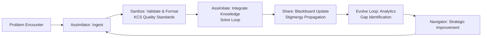
    C --> D[Sandbox Analysis for Hallucinations]
    D --> E[Assimilate Insights into Inventory]

## 3) Vector Databases & Semantic Deduplication (2024-2025)

### Top Vector Databases for Information Assimilation

#### Easy to Start (Local Development)
1. **Chroma** ⭐ **RECOMMENDED FOR HFO START**
   - Developer-friendly, open-source, embedded integration
   - Simple Python API, minimal infrastructure
   - Perfect for prototyping and small-scale operations
   - Excellent for operationalizing embedding models
   - **Use Case**: Initial HFO assimilator development, local testing

2. **Milvus**
   - Highly scalable, open-source, distributed deployments
   - Powerful indexing: IVF, HNSW, PQ
   - Data-intensive environments, large-scale vector searches
   - **Use Case**: Scale-up option when data volume grows

#### Cloud-Native (Production Scale)
3. **Pinecone** ⭐ **RECOMMENDED FOR SCALE-UP**
   - Fully managed, serverless architecture
   - Real-time updates, metadata filtering
   - Robust integration with OpenAI, Cohere, LangChain
   - Low infrastructure overhead
   - **Use Case**: Production deployment when scaling beyond local

4. **Weaviate**
   - Hybrid search: vector + keyword queries
   - GraphQL APIs, highly flexible
   - Modules for Hugging Face, OpenAI, Cohere
   - **Use Case**: Complex query requirements, on-prem + cloud

5. **Qdrant**
   - Rust-based, high-performance
   - Strong memory efficiency
   - Payload metadata filtering
   - **Use Case**: Performance-critical applications

### Semantic Deduplication Techniques

#### Embedding-Based Deduplication (Primary Method)
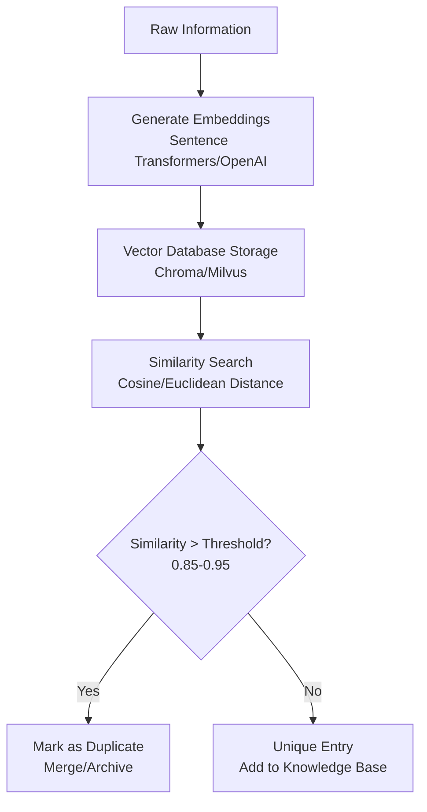

**Key Parameters**:
- **Cosine Similarity Threshold**: 0.85-0.95 for near-duplicate detection
- **Embedding Models**: BERT, Sentence Transformers, OpenAI text-embedding-ada-002
- **Distance Metrics**: Cosine similarity (semantic), Euclidean (geometric)

#### Advanced Techniques

1. **Locality Sensitive Hashing (LSH)**
   - Bucket similar vectors quickly
   - Accelerates large-scale deduplication
   - Avoids exhaustive pairwise comparisons

2. **Clustering Algorithms**
   - DBSCAN, k-means, agglomerative clustering on vector spaces
   - Group similar items, retain representative samples
   - Useful for discovering semantic clusters

3. **Index-Based Approaches**
   - HNSW (Hierarchical Navigable Small World): Fast ANN search
   - IVF (Inverted File): Efficient for large datasets
   - PQ (Product Quantization): Memory-efficient compression

4. **Hybrid Filters**
   - Combine keyword and vector similarity
   - Metadata validation for precise deduplication
   - Multi-stage filtering for accuracy

### HFO Implementation Strategy

**Phase 1: Local (Easy to Run)**
```python
# Example: Chroma + Sentence Transformers
import chromadb
from sentence_transformers import SentenceTransformer

client = chromadb.Client()
collection = client.create_collection("hfo_knowledge")
model = SentenceTransformer('all-MiniLM-L6-v2')

def ingest_and_deduplicate(text):
    embedding = model.encode([text])[0]
    # Query for similar entries
    results = collection.query(
        query_embeddings=[embedding.tolist()],
        n_results=5
    )
    # Check similarity threshold
    if results and max(results['distances'][0]) > 0.85:
        return "DUPLICATE"
    # Add if unique
    collection.add(
        embeddings=[embedding.tolist()],
        documents=[text],
        ids=[str(hash(text))]
    )
    return "ADDED"
```

**Phase 2: Scale-Up (Production)**
- Migrate to Pinecone or Milvus distributed deployment
- Implement batch processing for high volume
- Add monitoring and analytics
```

This diagram illustrates a high-level workflow, emphasizing sequential processing for safety.

## 3) Top 3 Industry Exemplar Options
- **GitHub Actions with Copilot Integration**: Exemplary for its native automation within GitHub ecosystems, allowing custom workflows to trigger on PR events, integrate AI for reviews (e.g., Copilot's hallucination-aware suggestions), and scale without external dependencies. It's industry-standard for open-source projects like Linux kernel repos, reducing manual effort by 30-50% in PR management.
- **Snyk Code Reviewer**: Stands out for AI-driven vulnerability and quality scanning tailored to code changes, with built-in hallucination detection via pattern matching. Used by enterprises like Google, it's exemplary for secure, automated analysis of AI-generated content, providing actionable insights and integrations with GitHub for seamless PR inventory.
- **Jenkins CI/CD Pipeline with Custom Plugins**: Exemplary for flexibility in complex, multi-stage workflows (e.g., ETL-like processing), supporting sandboxed execution and plugins for AI tools like Hugging Face models for summarization. Adopted by teams at Netflix and AWS, it excels in handling large-scale repo analysis with robust error-handling for hallucinations.

## 4) Pairing GitHub Actions with Snyk Code Reviewer
Yes, GitHub Actions can be paired with Snyk Code Reviewer to automate code security scanning in CI/CD pipelines, particularly for pull requests (PRs). Snyk Code Reviewer is part of Snyk's platform for identifying vulnerabilities in code, dependencies, and infrastructure.

#### How to Pair Them:
- **Integration Method**: Use Snyk's official GitHub Action from the GitHub Marketplace (e.g., `snyk/actions`). Add a YAML workflow file in your repo's `.github/workflows/` directory. Example basic workflow:
  ```yaml
  name: Snyk Code Review
  on: [pull_request]
  jobs:
    snyk:
      runs-on: ubuntu-latest
      steps:
        - uses: actions/checkout@v4
        - name: Run Snyk to check for vulnerabilities
          uses: snyk/actions/node@master  # Or specific language action
          env:
            SNYK_TOKEN: ${{ secrets.SNYK_TOKEN }}
          with:
            command: test --all-projects
  ```
  - Authenticate with a Snyk API token stored as a GitHub secret.
  - Trigger on events like `pull_request` to scan PRs automatically.

- **Benefits**:
  - Automates security checks for AI-generated code, reducing manual review.
  - Integrates with GitHub PR comments for inline feedback on issues.
  - Supports hallucination handling by flagging insecure or erroneous code patterns.
  - Improves workflow efficiency for repos like HiveFleetObsidian with AI-generated PRs.

- **Limitations**:
  - Requires a Snyk account (free tier limited; paid for advanced features).
  - May generate false positives, especially with AI-generated code prone to hallucinations.
  - Not natively designed for AI-specific issues like hallucination detection; it's more for general security.
  - Performance overhead in large repos; scans can slow down pipelines.

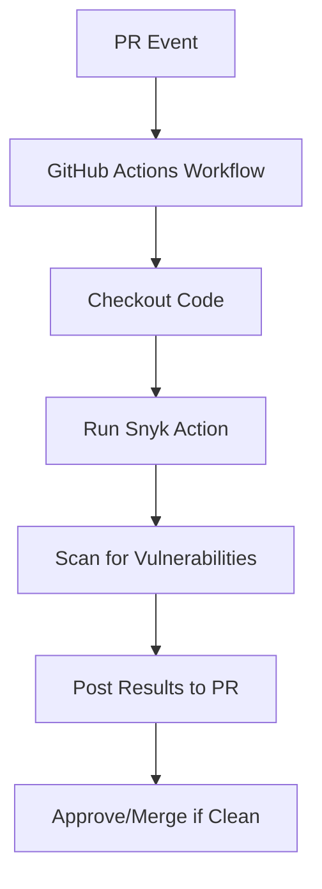

## 5) SOTA (State-of-the-Art) Approaches
SOTA stands for "State-of-the-Art," referring to the most advanced, cutting-edge methods, tools, or techniques in a field at a given time, often benchmarked against current research or industry standards.

#### Current SOTA for AI-Assisted PR Inventory, Categorization, Duplicate Chunking, Size Assessment, and Hallucination Handling:
Based on industry trends as of 2024 (e.g., from sources like GitHub, arXiv, and tools like Snyk/DeepCode), SOTA approaches leverage AI/ML for repo management, especially in AI-generated content. Key examples:
- **Inventory & Categorization**: GitHub's Copilot Workspace or Semantic (now part of GitHub) uses NLP for PR tagging and inventory. SOTA: Hugging Face's Transformers for custom categorization models, integrated via GitHub Actions.
- **Duplicate Chunking**: Tools like GitHub's code search with semantic similarity (using embeddings from models like CodeBERT). SOTA: Deduplication via vector databases (e.g., Pinecone) with cosine similarity for chunking duplicate code/PR content.
- **Size Assessment**: Git-based metrics tools like GitHub Insights or custom scripts with AI (e.g., OpenAI's GPT models) to evaluate PR complexity/size. SOTA: ML models like GraphCodeBERT for code complexity scoring.
- **Hallucination Handling**: Sandboxing with tools like Docker/GitHub Codespaces for isolated testing. SOTA: AI detectors like Hugging Face's hallucination evaluators or OpenAI's moderation API, combined with sandboxed execution (e.g., via GitHub Actions matrix jobs). Industry-leading: Anthropic's Claude for self-auditing AI outputs; research papers (e.g., from NeurIPS 2024) emphasize hybrid human-AI workflows with sandboxing for repos like HiveFleetObsidian.

These build on previous workflows by adding AI-driven automation, with emphasis on sandboxing to mitigate hallucinations in AI-generated PRs.
## 4) Red Team/Blue Team Testing & Defense-in-Depth (2024-2025)

### State-of-the-Art Approaches for AI Systems

#### Threat Modeling Framework

**Multidisciplinary Red Teams**: Domain experts (e.g., security professionals, domain specialists) identify context-specific vulnerabilities tailored to organizational risk profile (national security, privacy, trust & safety).

**Iterative & Automated Testing**: 
- Expert-led manual exercises for initial vulnerability discovery
- Automated red teaming using adversarial test suites for continuous assessment
- Integration with CI/CD pipelines for rapid security evaluation

#### Hallucination Detection Strategies

1. **Manual Expert Probes**
   - Crafted adversarial inputs to diagnose hallucinations
   - Domain-specific test cases
   - Edge case exploration

2. **Automated Adversarial Testing**
   - Statistical anomaly detection
   - Model auditing tools
   - Post-hoc fact-checking integrations
   - Systematic measurement alongside red teaming

3. **Multimodal & Multilingual Testing**
   - Challenge across modalities (text, image, voice)
   - Test multiple languages for edge cases
   - Cultural, regional, linguistic context exploration

#### Defense-in-Depth Layers

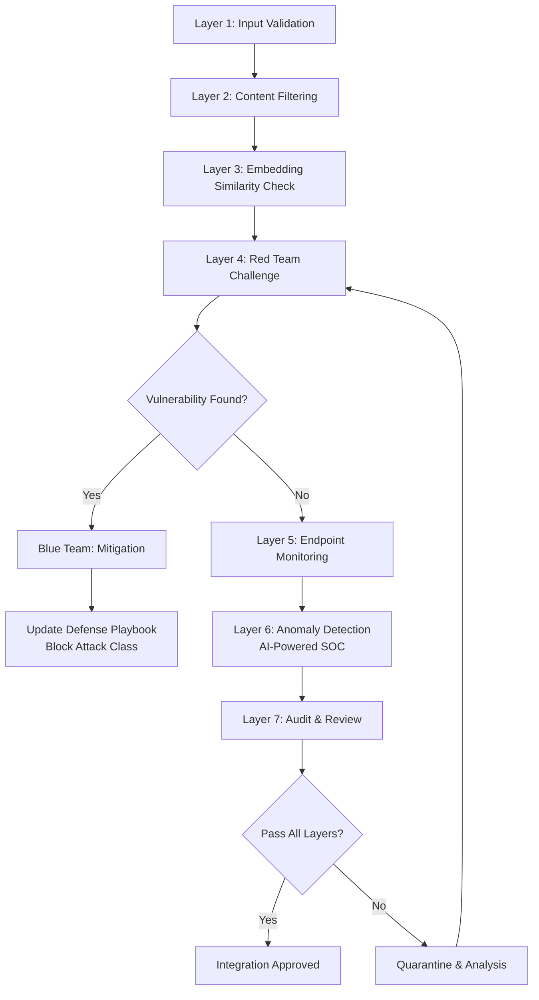

**Technical Tactics**:
- Robust input validation and sanitization
- Content filtering with allowlist/blocklist
- Endpoint monitoring and logging
- AI-powered Security Operations Centers (SOCs)
- Regular security audits and penetration testing

**Procedural Tactics**:
- Incident simulation exercises
- Operator training and awareness
- Patch management processes
- Network segmentation strategies

#### HFO Immunizer-Disruptor Co-Evolution Pattern

**Red Team (Disruptors)**:
1. Discover vulnerability through adversarial testing
2. Create attack vectors safely in sandbox
3. Document exploit patterns
4. Run mutations to test defense coverage

**Blue Team (Immunizers)**:
1. Analyze attack vectors
2. Block entire attack classes (not just instances)
3. Update defense playbooks (ATT&CK-style)
4. Implement progressive cost increases for attackers

**Evolutionary Arms Race Workflow**:
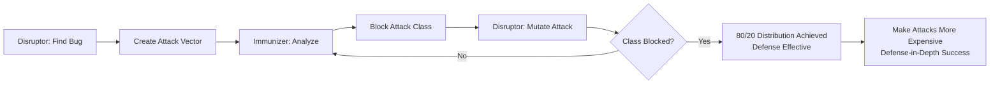

**Key Principle**: Not zero bugs/hallucinations, but defense-in-depth making attacks progressively more expensive. Target: 80/20 Pareto distribution where 80% of common attacks blocked with 20% effort.

#### Community & Crowdsourced Red Teaming

- Wider involvement from external security experts
- Diverse community members for broad coverage
- Democratizes risk assessment
- Enhanced feedback for mitigation strategies

#### AI-Powered Tools Integration

**Red Team AI Tools**:
- Realistic adversarial action simulation
- Automated threat exploration
- Novel attack vector generation

**Blue Team AI Tools**:
- Advanced analytics for detection
- Machine learning models for zero-day threats
- Continuous monitoring and response
- Pattern recognition for attack classes

### Best Practices for 2024-2025

1. **Transparency & Repeatability**: Document all red/blue team exercises
2. **Post-Mortem Analysis**: Track mitigation effectiveness
3. **Continuous Integration**: Embed testing in development lifecycle
4. **Standards Development**: Establish organizational security standards
5. **Feedback Loops**: Integrate learnings into next iteration

## 5) Stigmergy & Blackboard Systems for Multi-Agent Coordination

### Stigmergy Implementations

**Definition**: Indirect coordination where agents communicate by modifying a shared environment, inspired by biological systems (ant pheromone trails). Enables decentralized, emergent behavior without direct synchronization.

#### Virtual Stigmergy for MAS

**Core Concept**: Agents deposit data or "marks" in digital environment which other agents sense and act upon.

**Benefits**:
- Highly scalable: No direct agent-to-agent coordination needed
- Fault-tolerant: No single point of failure
- Emergent behavior: Complex global solutions from simple local rules
- Decentralized memory: Shared state accessible to all agents

**HFO Applications**:
- Autonomous task coordination
- Distributed optimization
- Swarm intelligence patterns
- Adaptive role evolution

#### Implementation: JSONL Blackboard

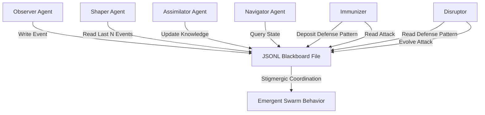

**Simple Start (Easy to Run)**:
```python
# HFO JSONL Blackboard Pattern
import json
from datetime import datetime
from pathlib import Path

class HFOBlackboard:
    def __init__(self, path="blackboard/hfo_state.jsonl"):
        self.path = Path(path)
        self.path.parent.mkdir(exist_ok=True)
    
    def deposit(self, agent_role, event_type, data):
        """Stigmergic deposit: agent leaves mark"""
        event = {
            "timestamp": datetime.utcnow().isoformat(),
            "agent_role": agent_role,
            "event_type": event_type,
            "data": data
        }
        with open(self.path, 'a') as f:
            f.write(json.dumps(event) + '\n')
    
    def sense(self, event_type=None, last_n=100):
        """Read environment marks left by other agents"""
        if not self.path.exists():
            return []
        
        events = []
        with open(self.path, 'r') as f:
            for line in f:
                event = json.loads(line)
                if event_type is None or event['event_type'] == event_type:
                    events.append(event)
        
        return events[-last_n:]  # Most recent N events
    
    def evolve(self):
        """Periodic cleanup: archive old events"""
        # Implementation for log rotation/archival
        pass

# Usage Example
bb = HFOBlackboard()

# Assimilator deposits knowledge
bb.deposit("assimilator", "knowledge_captured", {
    "topic": "ETL best practices",
    "quality_score": 0.92,
    "source": "web_research"
})

# Navigator senses system state
recent_knowledge = bb.sense(event_type="knowledge_captured", last_n=10)
```

### Blackboard System Implementations

**Definition**: Explicit shared knowledge coordination where agents (knowledge sources) post partial results to central blackboard. Other agents observe and contribute iteratively.

#### Modern Blackboard Architecture (2024-2025)

**Evolution**: Parallel, asynchronous operations using frameworks like osBrain (Python), Kafka event streams.

**Applications**:
- Multi-objective optimization
- Continuous and discrete optimization
- Complex reasoning in enterprise AI
- Hierarchical solution tracking (Pareto fronts)

#### Event-Driven Blackboard with Kafka

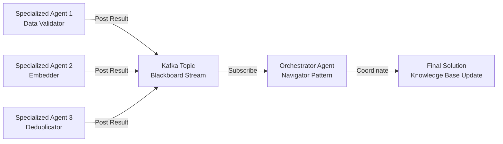

**Advanced Patterns**:
- Orchestrator-worker coordination
- Market-based task allocation
- Event-sourcing for audit trails
- CQRS (Command Query Responsibility Segregation)

### Comparison: Stigmergy vs. Blackboard

| Aspect | Stigmergy | Blackboard |
|--------|-----------|------------|
| **Coordination** | Indirect, emergent | Explicit, structured |
| **Scalability** | Very high | Medium-high |
| **Debugging** | Harder (emergent behavior) | Easier (explicit trace) |
| **Control** | Less direct | More direct |
| **Best For** | Large-scale, decentralized (swarms) | Complex reasoning, heterogeneous agents |
| **Fault Tolerance** | Very high | Medium (central resource) |
| **Convergence** | Slower, adaptive | Faster, deliberate |
| **HFO Use** | Swarm coordination, task routing | Strategic planning, knowledge synthesis |

### HFO Hybrid Implementation

**Recommendation**: Use both patterns for different purposes

- **Stigmergy (JSONL Blackboard)**: Layer 9 mandatory coordination, swarm-level task routing, emergent behavior
- **Blackboard (Structured)**: Strategic planning (Navigator), complex multi-agent reasoning, knowledge synthesis

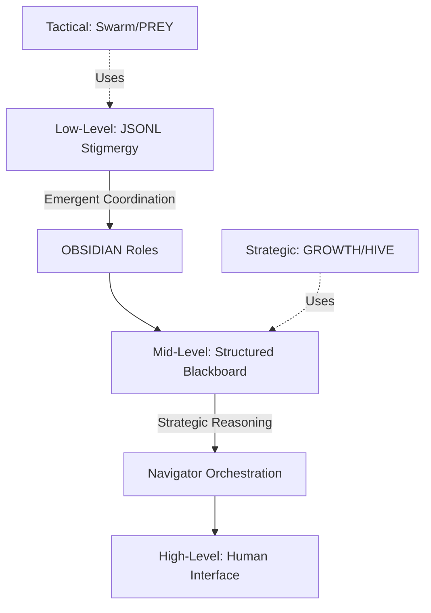

## 6) Explore/Exploit Strategies (70/30 Split)

### Theoretical Foundation

**Multi-Armed Bandit Problem**: Balance between exploration (trying new options) and exploitation (using known good options).

**HFO Context**: 
- **Explore (70%)**: Novel information sources, untested approaches, creative solutions
- **Exploit (30%)**: Validated knowledge base, proven patterns, established workflows

### Contextual Bandit Implementation

```python
# Simplified Explore/Exploit Router
import random
import numpy as np

class ExploreExploitRouter:
    def __init__(self, explore_ratio=0.7):
        self.explore_ratio = explore_ratio
        self.knowledge_base = []  # Validated patterns
        self.novel_queue = []     # Unexplored information
        self.performance_history = {}
    
    def route(self, information_item):
        """Route information to explore or exploit pipeline"""
        # Check if similar pattern exists
        similarity = self._check_similarity(information_item)
        
        if similarity < 0.5:
            # Definitely novel
            return "explore"
        elif similarity > 0.9:
            # Definitely known
            return "exploit"
        else:
            # Uncertain: use ratio
            return "explore" if random.random() < self.explore_ratio else "exploit"
    
    def _check_similarity(self, item):
        """Check similarity to known patterns (placeholder)"""
        # Implementation: vector similarity against knowledge base
        return random.random()  # Placeholder
    
    def adapt_ratio(self):
        """Adjust explore/exploit based on performance"""
        # Thompson Sampling or UCB algorithm
        recent_explore_success = self._calculate_success("explore")
        recent_exploit_success = self._calculate_success("exploit")
        
        # Adjust ratio based on which is performing better
        if recent_explore_success > recent_exploit_success * 1.2:
            self.explore_ratio = min(0.8, self.explore_ratio + 0.05)
        elif recent_exploit_success > recent_explore_success * 1.2:
            self.explore_ratio = max(0.6, self.explore_ratio - 0.05)
    
    def _calculate_success(self, pipeline):
        # Calculate success rate for pipeline
        return 0.0  # Placeholder

# Usage with HFO
router = ExploreExploitRouter(explore_ratio=0.7)

def process_information(item):
    pipeline = router.route(item)
    
    if pipeline == "explore":
        # Novel data pipeline: extra validation, sandboxing
        validated = explore_pipeline(item)
        if validated:
            # Promote to knowledge base
            router.knowledge_base.append(item)
    else:
        # Exploit pipeline: fast retrieval, established patterns
        result = exploit_pipeline(item)
    
    # Periodically adjust ratio
    if len(router.performance_history) % 100 == 0:
        router.adapt_ratio()
```

### Adaptive Exploration Strategies

#### Thompson Sampling
- Bayesian approach to balance explore/exploit
- Samples from posterior distribution
- Naturally balances based on uncertainty

#### Upper Confidence Bound (UCB)
- Explores options with high uncertainty
- Exploits options with high estimated reward
- Formula: UCB = mean_reward + c * sqrt(ln(total_trials) / trials_for_option)

#### Epsilon-Greedy (Simplified)
- Explore with probability ε (0.7 for HFO)
- Exploit with probability 1-ε (0.3 for HFO)
- Simple but effective

### HFO Logarithmic Scaling Workflow

**Injector Pattern**: Divide task into 10/100/1000 segments based on explore/exploit

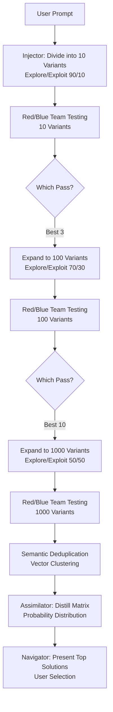

**Key Insight**: Start with high exploration (90%), gradually shift to exploitation (50%) as confidence increases.

### Performance Metrics

- **Exploration Success Rate**: % of novel items that pass validation
- **Exploitation Efficiency**: Time saved using known patterns
- **Knowledge Base Growth**: New validated patterns per time period
- **Hallucination Rate**: % of explored items with hallucinations
- **Adaptive Ratio**: Current explore/exploit split based on performance

## 7) Scalable Architecture: Easy to Run, Scales Later

### Phase 1: Local Development (Easy to Run, $0 Cost)

**Minimal Stack**:
```
Python 3.10+
├── Chroma (vector database, embedded)
├── Sentence Transformers (embeddings)
├── JSONL files (stigmergy blackboard)
├── Local file system (data storage)
└── Jupyter notebooks (experimentation)
```

**Installation**:
```bash
pip install chromadb sentence-transformers
# That's it! Ready to run
```

**Benefits**:
- No cloud dependencies
- No infrastructure setup
- Immediate experimentation
- Zero ongoing costs
- Full control over data

### Phase 2: Small-Scale Production (Low Cost, Local/Cloud Hybrid)

**Enhanced Stack**:
```
Python 3.10+
├── Milvus (distributed vector DB, self-hosted)
├── PostgreSQL (structured data)
├── Redis (caching)
├── Docker Compose (container orchestration)
└── GitHub Actions (CI/CD)
```

**Cost**: ~$10-50/month for small cloud VM or local server

### Phase 3: Production Scale (Cloud-Native, High Volume)

**Enterprise Stack**:
```
Cloud Platform (Azure/AWS/GCP)
├── Pinecone (managed vector DB)
├── Azure Data Factory (ETL orchestration)
├── Kafka (event streaming)
├── Kubernetes (container orchestration)
├── DataDog/Prometheus (monitoring)
└── Terraform (infrastructure as code)
```

**Cost**: Scales with usage, $500-5000+/month

### Migration Path

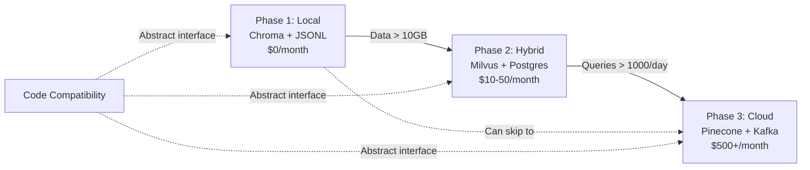

**Key Principle**: Abstract storage and processing interfaces to enable seamless migration.

### Example: Storage Abstraction

```python
from abc import ABC, abstractmethod

class KnowledgeStore(ABC):
    @abstractmethod
    def add(self, text, embedding, metadata): pass
    
    @abstractmethod
    def search(self, query_embedding, top_k=5): pass
    
    @abstractmethod
    def deduplicate(self, threshold=0.85): pass

class ChromaStore(KnowledgeStore):
    """Phase 1: Local, easy to run"""
    def __init__(self):
        import chromadb
        self.client = chromadb.Client()
        self.collection = self.client.create_collection("hfo")
    
    def add(self, text, embedding, metadata):
        self.collection.add(
            embeddings=[embedding],
            documents=[text],
            metadatas=[metadata],
            ids=[str(hash(text))]
        )
    
    # ... other methods

class PineconeStore(KnowledgeStore):
    """Phase 3: Production scale"""
    def __init__(self, api_key, environment):
        import pinecone
        pinecone.init(api_key=api_key, environment=environment)
        self.index = pinecone.Index("hfo-knowledge")
    
    def add(self, text, embedding, metadata):
        self.index.upsert([(str(hash(text)), embedding, metadata)])
    
    # ... other methods

# Usage: Swap implementations without changing core logic
def main():
    # Phase 1
    store = ChromaStore()
    
    # Phase 3 (just change one line!)
    # store = PineconeStore(api_key="xxx", environment="prod")
    
    # Everything else stays the same
    assimilator = Assimilator(store)
    assimilator.process(information)
```

## 8) Integration with HFO OBSIDIAN Roles

### Role Mapping to Assimilation Pipeline

| OBSIDIAN Role | Assimilation Function | Tools & Techniques |
|---------------|----------------------|-------------------|
| **Observers** | Monitor information sources, detect new data | RSS feeds, API polling, file watchers |
| **Bridgers** | Connect diverse data formats, tactical coordination | Format converters, schema mappers, API bridges |
| **Shapers** | Transform data into standard formats | ETL scripts, data normalization, encoding |
| **Immunizers** | Validate data quality, block hallucinations | Anomaly detection, schema validation, blue team testing |
| **Disruptors** | Test data robustness, find edge cases | Red team testing, adversarial inputs, fuzzing |
| **Injectors** | Scale processing (10/100/1000), spawn workers | Task parallelization, worker spawning, log-scale expansion |
| **Assimilators** | Deduplicate, distill, integrate knowledge | Vector similarity, KCS capture, knowledge graph updates |
| **Navigators** | Strategic oversight, user interaction, BLUF generation | Dashboards, summarization, clarification passes |

### Workflow Integration

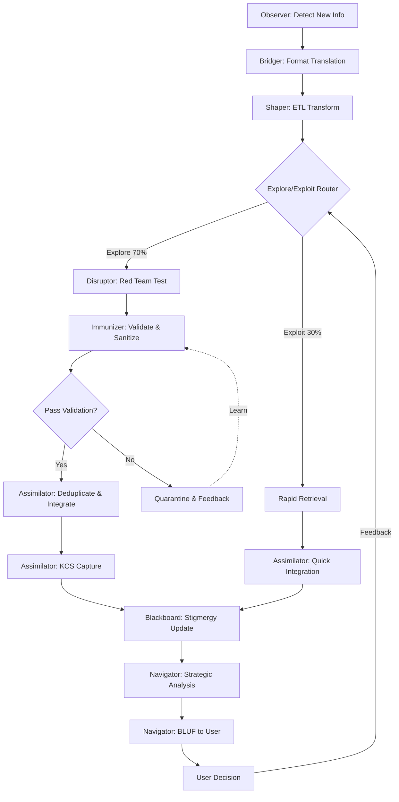

### Assimilator Detailed Workflow

**Phase: INGEST**
1. Observer detects new information source
2. Bridger translates format (PDF → text, API → JSON, etc.)
3. Shaper normalizes and structures data

**Phase: SANITIZE**
4. Schema validation (data profiling)
5. Disruptor red team challenge (adversarial inputs)
6. Immunizer validation (anomaly detection)
7. Sandbox execution for hallucination detection

**Phase: ASSIMILATE**
8. Generate embeddings (Sentence Transformers)
9. Vector similarity search (Chroma/Milvus)
10. Deduplicate (cosine threshold 0.85-0.95)
11. Cluster semantic groups (DBSCAN/k-means)
12. KCS v6 capture (solve loop)
13. Knowledge graph update (relationships)

**Phase: SHARE**
14. Blackboard stigmergy update (JSONL deposit)
15. Fractal propagation (notify relevant agents)
16. Navigator summarization (BLUF generation)
17. User presentation (3-5 clarification passes)

## 9) Practical Implementation Roadmap

### Week 1: Foundation (Easy to Run)

**Day 1-2: Setup**
- [ ] Install Python 3.10+, Chroma, Sentence Transformers
- [ ] Create project structure: `hfo_assimilator/`
- [ ] Implement basic JSONL blackboard
- [ ] Test stigmergy pattern with 2 simple agents

**Day 3-4: Core Pipeline**
- [ ] Implement `KnowledgeStore` abstract interface
- [ ] Build `ChromaStore` implementation
- [ ] Create embedding generator (Sentence Transformers)
- [ ] Test deduplication with sample data

**Day 5-7: Validation**
- [ ] Implement basic schema validation
- [ ] Add anomaly detection (simple statistical methods)
- [ ] Create red team test suite (10 adversarial examples)
- [ ] Integrate with blackboard

### Week 2: Integration

**Day 8-10: OBSIDIAN Roles**
- [ ] Implement Observer (file watcher)
- [ ] Implement Shaper (ETL transforms)
- [ ] Implement Assimilator (full pipeline)
- [ ] Test role coordination via blackboard

**Day 11-12: Explore/Exploit**
- [ ] Implement explore/exploit router (epsilon-greedy)
- [ ] Create separate pipelines for explore vs. exploit
- [ ] Add performance tracking

**Day 13-14: User Interface**
- [ ] Implement Navigator (CLI interface)
- [ ] Add BLUF generation (summarization)
- [ ] Create clarification pass workflow

### Week 3-4: Enhancement

**Day 15-20: Advanced Features**
- [ ] Improve red team test coverage (100+ examples)
- [ ] Add KCS v6 structured capture
- [ ] Implement clustering for semantic groups
- [ ] Create monitoring dashboard

**Day 21-28: Testing & Documentation**
- [ ] End-to-end testing with real data
- [ ] Performance benchmarking
- [ ] Write usage documentation
- [ ] Create example workflows

### Future: Scale-Up Path

**Month 2-3: Optimization**
- Migrate to Milvus for better performance
- Add PostgreSQL for structured metadata
- Implement batch processing
- Optimize embedding generation

**Month 4-6: Production**
- Migrate to Pinecone (if needed)
- Add Kafka for event streaming
- Implement proper monitoring (DataDog/Prometheus)
- CI/CD automation
- Multi-user support

## 10) References & Further Reading

### ETL & Data Pipelines
- Coalesce: "What is ETL? A Complete Guide" (2025)
- Microsoft Azure: "Extract, Transform, Load (ETL) Architecture"
- IBM: "What is ETL (Extract, Transform, Load)?"
- Shaped.ai: "10 Best Practices in Data Ingestion"
- Airbyte: "Data Ingestion Pipeline Best Practices"

### Knowledge Management
- Consortium for Service Innovation: "KCS v6 Practices Guide"
- SGSA: "Knowledge-Centered Service Version 6 Workshop"
- ServiceNow: "Implementing Knowledge-Centered Service Case Study"

### Vector Databases
- Firecrawl.dev: "Best Vector Databases in 2025: Complete Comparison"
- DataCamp: "The 7 Best Vector Databases"
- lakeFS: "Best 17 Vector Databases for 2025"
- MLJourney: "Top 10 Vector Databases for AI and ML"

### Red Team/Blue Team
- Anthropic: "Challenges in Red Teaming AI Systems"
- Microsoft Azure: "Planning Red Teaming for LLMs"
- CSET Georgetown: "AI Red-Teaming Design: Threat Models and Tools"
- PECB: "Future of Cybersecurity: Red and Blue Team Strategies"

### Multi-Agent Systems
- GitHub: "Multi-Agent Blackboard System" (ryanstwrt)
- Confluent: "Four Design Patterns for Event-Driven Multi-Agent Systems"
- Microsoft: "Designing Multi-Agent Intelligence"
- ScienceDirect: "Multi-Agent Systems with Virtual Stigmergy"
- arXiv: "Multi-Agent Collaboration Mechanisms: A Survey of LLMs"

### Explore/Exploit Strategies
- Sutton & Barto: "Reinforcement Learning: An Introduction" (Multi-Armed Bandits)
- Databricks: "Config Driven Framework for Scalable Data Engineering"
- Statsig: "Designing Scalable Data Ingestion Pipelines"

## Appendix A: Quick Start Example

```python
#!/usr/bin/env python3
"""
HFO Assimilator - Quick Start Example
Easy to run, scales later
"""

import chromadb
from sentence_transformers import SentenceTransformer
import json
from datetime import datetime
from pathlib import Path

# 1. Setup (runs locally, $0 cost)
client = chromadb.Client()
collection = client.create_collection("hfo_knowledge")
model = SentenceTransformer('all-MiniLM-L6-v2')

# 2. Blackboard for stigmergy
class Blackboard:
    def __init__(self):
        self.path = Path("blackboard/hfo.jsonl")
        self.path.parent.mkdir(exist_ok=True)
    
    def deposit(self, role, event, data):
        event = {
            "timestamp": datetime.utcnow().isoformat(),
            "role": role,
            "event": event,
            "data": data
        }
        with open(self.path, 'a') as f:
            f.write(json.dumps(event) + '\n')

bb = Blackboard()

# 3. Assimilator workflow
def assimilate(text, source="manual"):
    # INGEST
    bb.deposit("assimilator", "ingest_start", {"source": source})
    
    # SANITIZE: Basic validation
    if len(text) < 10:
        bb.deposit("assimilator", "rejected", {"reason": "too_short"})
        return "REJECTED"
    
    # Generate embedding
    embedding = model.encode([text])[0]
    
    # ASSIMILATE: Check for duplicates
    results = collection.query(
        query_embeddings=[embedding.tolist()],
        n_results=5
    )
    
    if results['distances'] and results['distances'][0]:
        max_similarity = max(results['distances'][0])
        if max_similarity > 0.9:  # High similarity = duplicate
            bb.deposit("assimilator", "duplicate", {
                "similarity": max_similarity
            })
            return "DUPLICATE"
    
    # Add to knowledge base
    collection.add(
        embeddings=[embedding.tolist()],
        documents=[text],
        ids=[str(hash(text))],
        metadatas=[{"source": source, "timestamp": datetime.utcnow().isoformat()}]
    )
    
    # SHARE: Update blackboard
    bb.deposit("assimilator", "knowledge_captured", {
        "preview": text[:100],
        "source": source
    })
    
    return "ADDED"

# 4. Usage
if __name__ == "__main__":
    # Test the assimilator
    examples = [
        "ETL frameworks help standardize data ingestion.",
        "Vector databases enable semantic search.",
        "ETL frameworks help standardize data ingestion.",  # Duplicate
        "Red team testing improves AI security.",
    ]
    
    for text in examples:
        result = assimilate(text, source="example")
        print(f"{result}: {text[:50]}...")
    
    # Query knowledge
    query = "How to handle data quality?"
    query_embedding = model.encode([query])[0]
    results = collection.query(
        query_embeddings=[query_embedding.tolist()],
        n_results=3
    )
    
    print(f"\nQuery: {query}")
    print(f"Results: {results['documents']}")
```

## Appendix B: Configuration Template

```yaml
# hfo_assimilator_config.yaml
# Easy to run configuration - scales by changing values

assimilator:
  # Phase 1: Local
  storage_backend: "chroma"  # Options: chroma, milvus, pinecone
  storage_path: "./data/chroma"
  
  # Phase 2/3: Change these for scale
  # storage_backend: "pinecone"
  # api_key: "${PINECONE_API_KEY}"
  # environment: "production"
  
  embedding:
    model: "all-MiniLM-L6-v2"  # Fast, good quality
    # For production: "all-mpnet-base-v2" (better quality, slower)
  
  deduplication:
    similarity_threshold: 0.85  # 0.85-0.95 range
    clustering_algorithm: "dbscan"  # Options: dbscan, kmeans
  
  explore_exploit:
    ratio: 0.7  # 70% explore, 30% exploit
    adaptive: true
    algorithm: "epsilon_greedy"  # Options: epsilon_greedy, thompson, ucb
  
  validation:
    schema_validation: true
    anomaly_detection: true
    red_team_testing: true
    sandbox_execution: false  # Enable for production
  
  blackboard:
    type: "jsonl"  # Options: jsonl, kafka
    path: "./blackboard/hfo.jsonl"
    rotation_size_mb: 100
  
  kcs:
    enabled: true
    quality_standards: "hfo_standards.json"
    solve_loop: true
    evolve_loop: true

logging:
  level: "INFO"  # DEBUG for development
  format: "json"
  destination: "./logs/hfo_assimilator.log"

monitoring:
  enabled: false  # Enable for production
  metrics_backend: "prometheus"  # Options: prometheus, datadog
  dashboard: "grafana"
```

---

## Summary & Next Steps

**What You Have Now**:
- Comprehensive understanding of SOTA information assimilation
- Easy-to-run starting point (Python + Chroma + JSONL)
- Clear scale-up path (Milvus → Pinecone, Postgres, Kafka)
- Integration with HFO OBSIDIAN roles
- Explore/exploit strategies (70/30 split)
- Defense-in-depth hallucination prevention
- KCS v6 knowledge management framework

**Immediate Actions**:
1. Set up Phase 1 (local) environment
2. Run Appendix A quick start example
3. Test with your actual information sources
4. Iterate based on results
5. Scale when needed (not before!)

**Key Principle**: Start simple, prove value, then scale. The architecture supports seamless migration from $0 local setup to production cloud infrastructure.

**Contact & Feedback**: Update this document based on learnings from actual implementation. Remember: OBSIDIAN Assimilator role is about "Ingest-Sanitize-Assimilate-Share" with past reflection via neural plasticity patterns. 🧬💎🕸️
