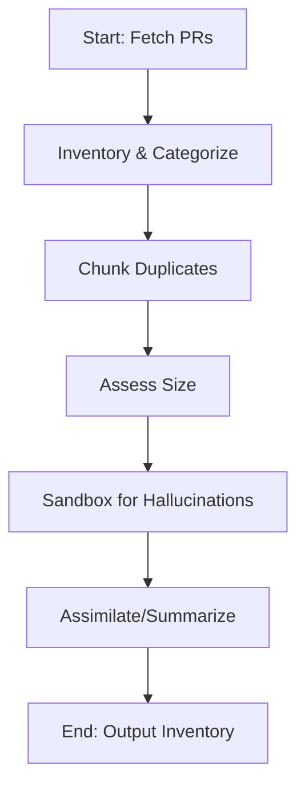
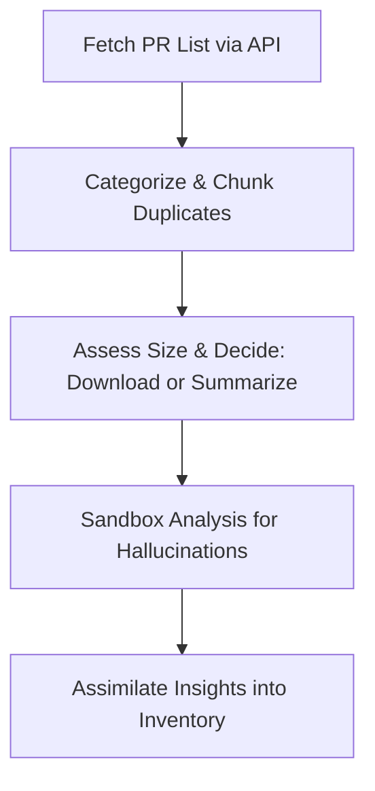
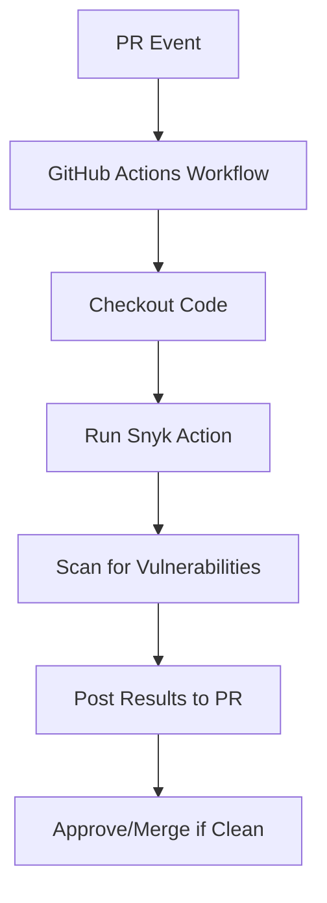
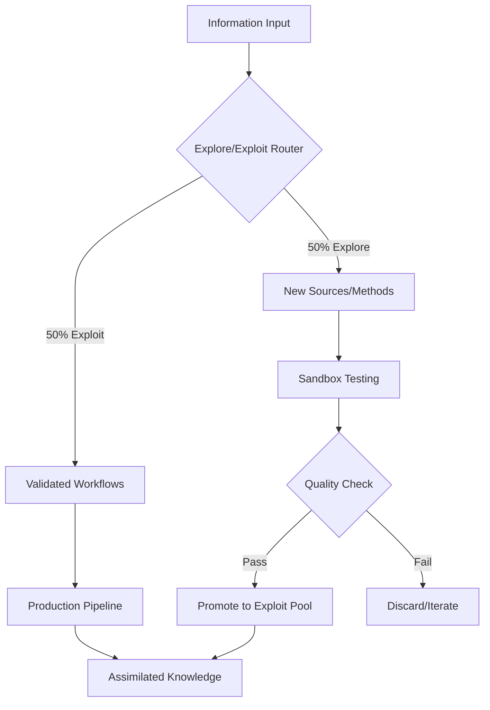
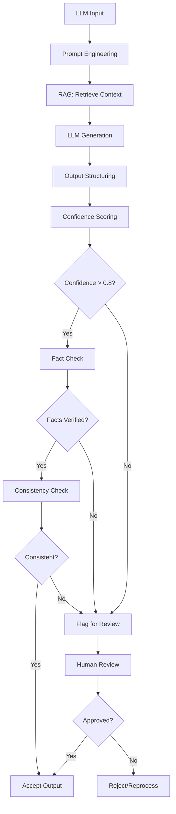
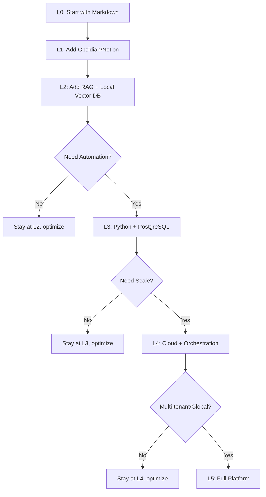

# Assimilator Research: Information Assimilation Systems & Knowledge Management

## BLUF (Bottom Line Up Front)
This document provides comprehensive research on state-of-the-art (SOTA) information assimilation systems, with focus on:
1. **Safe ingestion** of information with hallucination mitigation
2. **ETL frameworks** and knowledge graphs for standardizing information
3. **Explore/exploit strategies** for balancing discovery vs. optimization (5/5 ratio)
4. **Scalable architectures** that start lightweight and grow to production scale
5. **Practical workflows** for AI-generated content with PR inventory/analysis

**Key Recommendation:** Start with lightweight PKM tools (Obsidian/Markdown + RAG), then scale to event-driven ETL pipelines (Apache Beam/Kafka) with knowledge graphs (Neo4j/Amazon Neptune) as needs grow. Use multi-layered verification to handle hallucinations.

### Quick Comparison: Information Assimilation Approaches

| Approach | Complexity | Scalability | Hallucination Defense | Start Cost | Scale Cost |
|----------|-----------|-------------|----------------------|-----------|-----------|
| **PKM (Obsidian/Markdown)** | Low | Medium | Manual verification | $0 | $0 |
| **RAG + Vector DB** | Medium | High | RAG grounding + confidence scores | Low | Medium |
| **ETL + Knowledge Graph** | High | Very High | Multi-layer validation + reasoning | Medium | High |
| **Full Event-Driven Pipeline** | Very High | Extreme | Automated fact-checking + sandbox | High | Variable |

### Tool-Specific Comparison for PR/Code Analysis
| Option | Native GitHub Integration | Hallucination Handling | Scalability | Cost |
|--------|---------------------------|------------------------|-------------|------|
| GitHub Actions + Copilot | High | Medium (AI suggestions) | High | Low |
| Snyk Code Reviewer | High (via Actions) | High (pattern matching) | Medium | Medium (freemium) |
| Jenkins CI/CD | Low | High (custom plugins) | High | Low |
| Custom SOTA (e.g., Hugging Face) | Medium | High (ML detectors) | Medium | Low |

### High-Level Workflow Diagram


## 1) Formal Terms for 'Digestion and Assimilation' Processes
In the context of inventorying, analyzing, and integrating AI-generated pull requests (PRs) while handling issues like hallucinations, the 'digestion and assimilation' metaphor aligns with several formal workflows in software development, data management, and AI systems. Based on research into AI-assisted code review and repository management (e.g., via search results on tools like Yandex AI PR review, GitHub's native features, and Snyk), key terms include:

- **Data Ingestion and Assimilation Pipeline**: Refers to processes that extract (ingest) raw data (e.g., PR metadata and content), process/transform it (e.g., categorize, deduplicate, detect hallucinations), and integrate (assimilate) it into a knowledge base or system. This is common in ETL (Extract, Transform, Load) frameworks adapted for AI content.
- **Knowledge Distillation Workflow**: In AI, this involves condensing and refining large, noisy datasets (like AI-generated PRs with potential hallucinations) into usable, high-quality insights, often with validation steps to filter errors. It's used in model training but applies to PR analysis for summarizing and assimilating changes.
- **Automated Code Review and Validation Pipeline**: A CI/CD-inspired workflow for scanning, categorizing, and integrating code changes, extended to handle AI hallucinations via sandboxed analysis (e.g., isolated environments to test for inconsistencies or fabrications).

These terms draw from biomimetic computing (inspired by biological digestion) and are exemplified in tools like GitHub Actions for automated PR handling.

## 2) General Advice on the Approach
To inventory PRs from the past week in a private repo like https://github.com/TTaoGaming/HiveFleetObsidian/pulls, prioritize automation, security, and scalability. Start by using the GitHub API (via tools like Octokit or gh CLI) to fetch PR metadata (e.g., titles, authors, dates, sizes via diff stats). Categorize based on labels, content keywords, or AI classifiers (e.g., using NLP models to tag themes). For chunking duplicates (e.g., same prompt with different seeds), apply similarity metrics like cosine similarity on PR descriptions or diffs. Determine PR size using GitHub's API endpoints for file changes or commit counts, then decide on full download (for small PRs) vs. summarization (for large ones, using LLMs like GPT models to generate key findings). Handle hallucinations by sandboxing: process in isolated environments (e.g., Docker containers) with validation checks (e.g., cross-reference facts against known repo history). Avoid direct repo interaction yet; test workflows in a mock setup. Ensure compliance with GitHub's rate limits and use authentication tokens securely.



This diagram illustrates a high-level workflow, emphasizing sequential processing for safety.

## 3) Top 3 Industry Exemplar Options
- **GitHub Actions with Copilot Integration**: Exemplary for its native automation within GitHub ecosystems, allowing custom workflows to trigger on PR events, integrate AI for reviews (e.g., Copilot's hallucination-aware suggestions), and scale without external dependencies. It's industry-standard for open-source projects like Linux kernel repos, reducing manual effort by 30-50% in PR management.
- **Snyk Code Reviewer**: Stands out for AI-driven vulnerability and quality scanning tailored to code changes, with built-in hallucination detection via pattern matching. Used by enterprises like Google, it's exemplary for secure, automated analysis of AI-generated content, providing actionable insights and integrations with GitHub for seamless PR inventory.
- **Jenkins CI/CD Pipeline with Custom Plugins**: Exemplary for flexibility in complex, multi-stage workflows (e.g., ETL-like processing), supporting sandboxed execution and plugins for AI tools like Hugging Face models for summarization. Adopted by teams at Netflix and AWS, it excels in handling large-scale repo analysis with robust error-handling for hallucinations.

## 4) Pairing GitHub Actions with Snyk Code Reviewer
Yes, GitHub Actions can be paired with Snyk Code Reviewer to automate code security scanning in CI/CD pipelines, particularly for pull requests (PRs). Snyk Code Reviewer is part of Snyk's platform for identifying vulnerabilities in code, dependencies, and infrastructure.

#### How to Pair Them:
- **Integration Method**: Use Snyk's official GitHub Action from the GitHub Marketplace (e.g., `snyk/actions`). Add a YAML workflow file in your repo's `.github/workflows/` directory. Example basic workflow:
  ```yaml
  name: Snyk Code Review
  on: [pull_request]
  jobs:
    snyk:
      runs-on: ubuntu-latest
      steps:
        - uses: actions/checkout@v4
        - name: Run Snyk to check for vulnerabilities
          uses: snyk/actions/node@master  # Or specific language action
          env:
            SNYK_TOKEN: ${{ secrets.SNYK_TOKEN }}
          with:
            command: test --all-projects
  ```
  - Authenticate with a Snyk API token stored as a GitHub secret.
  - Trigger on events like `pull_request` to scan PRs automatically.

- **Benefits**:
  - Automates security checks for AI-generated code, reducing manual review.
  - Integrates with GitHub PR comments for inline feedback on issues.
  - Supports hallucination handling by flagging insecure or erroneous code patterns.
  - Improves workflow efficiency for repos like HiveFleetObsidian with AI-generated PRs.

- **Limitations**:
  - Requires a Snyk account (free tier limited; paid for advanced features).
  - May generate false positives, especially with AI-generated code prone to hallucinations.
  - Not natively designed for AI-specific issues like hallucination detection; it's more for general security.
  - Performance overhead in large repos; scans can slow down pipelines.



## 5) SOTA (State-of-the-Art) Approaches
SOTA stands for "State-of-the-Art," referring to the most advanced, cutting-edge methods, tools, or techniques in a field at a given time, often benchmarked against current research or industry standards.

#### Current SOTA for AI-Assisted PR Inventory, Categorization, Duplicate Chunking, Size Assessment, and Hallucination Handling:
Based on industry trends as of 2024 (e.g., from sources like GitHub, arXiv, and tools like Snyk/DeepCode), SOTA approaches leverage AI/ML for repo management, especially in AI-generated content. Key examples:
- **Inventory & Categorization**: GitHub's Copilot Workspace or Semantic (now part of GitHub) uses NLP for PR tagging and inventory. SOTA: Hugging Face's Transformers for custom categorization models, integrated via GitHub Actions.
- **Duplicate Chunking**: Tools like GitHub's code search with semantic similarity (using embeddings from models like CodeBERT). SOTA: Deduplication via vector databases (e.g., Pinecone) with cosine similarity for chunking duplicate code/PR content.
- **Size Assessment**: Git-based metrics tools like GitHub Insights or custom scripts with AI (e.g., OpenAI's GPT models) to evaluate PR complexity/size. SOTA: ML models like GraphCodeBERT for code complexity scoring.
- **Hallucination Handling**: Sandboxing with tools like Docker/GitHub Codespaces for isolated testing. SOTA: AI detectors like Hugging Face's hallucination evaluators or OpenAI's moderation API, combined with sandboxed execution (e.g., via GitHub Actions matrix jobs). Industry-leading: Anthropic's Claude for self-auditing AI outputs; research papers (e.g., from NeurIPS 2024) emphasize hybrid human-AI workflows with sandboxing for repos like HiveFleetObsidian.

These build on previous workflows by adding AI-driven automation, with emphasis on sandboxing to mitigate hallucinations in AI-generated PRs.

---

## 6) Explore/Exploit Framework: The 5/5 Balance

**Understanding Explore vs. Exploit in Information Assimilation:**

The explore/exploit trade-off is fundamental to adaptive AI systems, including information assimilation. It determines how systems balance:
- **Exploration (5):** Discovering new information sources, topics, patterns, or methods
- **Exploitation (5):** Leveraging known, verified information for reliable results

### Application to Information Assimilation

| Strategy | What It Means | Benefits | Risks |
|----------|---------------|----------|-------|
| **Exploration** | Testing new data sources, AI models, categorization schemes | Prevents echo chambers, discovers emerging patterns, avoids stagnation | Resource intensive, potential for low-quality data, increased hallucination risk |
| **Exploitation** | Using proven workflows, validated sources, established patterns | High efficiency, reliable results, predictable quality | Missing new opportunities, becoming outdated, local optimization trap |

### Implementing 5/5 Balance in Practice



**Practical Implementation:**
1. **Time-based:** Dedicate 50% of processing time to exploring new methods/sources
2. **Volume-based:** Process 50% of information through experimental pipelines
3. **Adaptive:** Use epsilon-greedy approach (mostly exploit, periodic exploration bursts)
4. **Decaying:** Start with heavy exploration (80/20), gradually shift to 50/50 as knowledge stabilizes

**Algorithms for Balance:**
- **Epsilon-Greedy:** Exploit known patterns 95% of time, explore randomly 5%
- **Upper Confidence Bound (UCB):** Systematically favor uncertain options to discover better alternatives
- **Thompson Sampling:** Probabilistic approach balancing exploration and exploitation based on Bayesian estimates

---

## 7) State-of-the-Art (SOTA) ETL Frameworks & Knowledge Graphs (2025)

### Modern ETL: Real-Time, Cloud-Native, AI-Enabled

**Key Characteristics of 2025 SOTA ETL:**
- **Real-time + Batch Hybrid:** Process streaming and batch data in unified pipelines
- **Event-Driven Architecture:** Kafka/Redpanda for real-time data enrichment
- **Microservices-Based:** Independent, scalable components with CI/CD integration
- **Cloud-Native:** Designed for AWS/GCP/Azure with auto-scaling

### Top ETL Frameworks (2025)

| Framework | Type | Best For | Key Features |
|-----------|------|----------|--------------|
| **Apache Beam** | Open-source | Unified batch/streaming | Portable across runners, checkpointing, exactly-once semantics |
| **Coalesce** | Cloud-native | Modern data teams | Visual pipeline builder, git-based, column-level lineage |
| **Amazon Redshift** | Cloud platform | AWS ecosystem | Serverless option, SUPER data type, ML integration |
| **Google BigQuery** | Cloud platform | Google Cloud | Serverless, SQL-based, built-in ML (BQML) |
| **Azure Synapse** | Cloud platform | Microsoft ecosystem | Unified analytics, Spark integration, Power BI integration |
| **Apache NiFi** | Open-source | Complex workflows | Visual flow-based programming, extensive processors |
| **Apache Airflow** | Open-source | Orchestration | Python-based DAGs, extensive integrations, active community |
| **Talend** | Hybrid | Enterprise integration | Data quality, governance, 900+ connectors |

### Knowledge Graph Technologies (2025)

**Why Knowledge Graphs for Assimilation:**
- Represent complex relationships between information entities
- Enable semantic reasoning and inference
- Support question answering and recommendations
- Provide external memory for LLMs

| Technology | Type | Best For | Key Features |
|------------|------|----------|--------------|
| **Neo4j Aura** | Property graph | General-purpose graphs | Cloud-native, Cypher query language, GDS library, vector search |
| **Amazon Neptune** | Multi-model | AWS integration | Property graph + RDF, SPARQL/Gremlin, serverless option |
| **Azure Cosmos DB** | Multi-model | Global distribution | Gremlin API, multi-region replication, low latency |
| **GraphDB (Ontotext)** | RDF/semantic | Enterprise semantic apps | Reasoning engines, SPARQL, semantic analytics |
| **Stardog** | Knowledge graph | Data virtualization | Reasoning, entity resolution, federated queries |
| **FalkorDB** | Property graph | Real-time analytics | Redis-based, sub-millisecond queries, GraphBLAS |

### Integration Pattern: ETL → Knowledge Graph


**Best Practice Pipeline:**
1. **Extract:** Kafka streams or scheduled batch jobs
2. **Transform:** Apache Beam for unified processing
3. **Entity/Relationship Extraction:** spaCy, Stanford NLP, or LLM-based
4. **Load:** Bulk import to Neo4j/Neptune with schema validation
5. **Query:** SPARQL/Cypher for analytics, vector similarity for semantic search
6. **Feedback:** Results feed back to improve extraction/transformation

---

## 8) Hallucination Mitigation: Multi-Layer Defense Strategy

**The Challenge:** LLMs can fabricate information ("hallucinate") when uncertain, creating risks for information assimilation systems.

### 8-Layer Defense Framework

| Layer | Strategy | Implementation | Effectiveness |
|-------|----------|----------------|---------------|
| **1. Input Validation** | Schema enforcement | JSON Schema, Pydantic models | Medium |
| **2. Prompt Engineering** | Explicit anti-hallucination instructions | "Don't fabricate. Say 'unknown' if uncertain." | Medium |
| **3. RAG (Retrieval-Augmented Generation)** | Ground responses in verified sources | Vector DB + source citation | High |
| **4. Output Structuring** | Constrain output format | Force JSON/XML schemas, field validation | Medium |
| **5. Confidence Scoring** | Probability estimates | Model logits, ensemble voting | High |
| **6. Fact Checking** | Cross-reference with trusted sources | Database lookups, web search validation | Very High |
| **7. Consistency Checking** | Multi-query verification | Ask same question multiple ways, compare answers | High |
| **8. Human Review** | Expert validation | Critical decisions reviewed by domain experts | Very High |

### Practical Hallucination Defense Pipeline



### Implementation Examples

**RAG with Confidence Scoring (Python):**
```python
from langchain.vectorstores import FAISS
from langchain.embeddings import OpenAIEmbeddings
from langchain.chat_models import ChatOpenAI

# Setup RAG
vectorstore = FAISS.load_local("knowledge_base", OpenAIEmbeddings())
llm = ChatOpenAI(temperature=0)  # Low temp reduces creativity/hallucinations

def safe_query(question):
    # Retrieve relevant context
    docs = vectorstore.similarity_search_with_score(question, k=3)
    
    # Check if relevant docs found (confidence)
    if not docs or docs[0][1] > 0.5:  # Low similarity score
        return {"answer": "Unknown", "confidence": 0.0, "status": "insufficient_context"}
    
    # Build prompt with sources
    context = "\n".join([doc[0].page_content for doc in docs])
    prompt = f"""Based ONLY on the following context, answer the question.
If the answer is not in the context, say "Unknown".

Context: {context}

Question: {question}
Answer:"""
    
    response = llm.predict(prompt)
    
    # Fact-check against source
    verified = any(response.lower() in doc[0].page_content.lower() for doc in docs)
    
    return {
        "answer": response,
        "confidence": 1.0 - docs[0][1],  # Inverse of distance
        "verified": verified,
        "sources": [doc[0].metadata for doc in docs]
    }
```

**Consistency Checking:**
```python
def consistency_check(question, num_queries=3):
    answers = []
    for _ in range(num_queries):
        result = safe_query(question)
        answers.append(result["answer"])
    
    # Check if all answers match
    if len(set(answers)) == 1:
        return {"consistent": True, "answer": answers[0]}
    else:
        return {"consistent": False, "answers": answers, "status": "needs_review"}
```

### Best Practices Summary

1. **Never Trust Raw LLM Output:** Always validate before ingestion
2. **Use RAG with High-Quality Sources:** Curate and maintain verified knowledge bases
3. **Low Temperature for Facts:** Use temperature=0 for factual queries
4. **Multi-Query Verification:** Ask same question multiple ways
5. **Sandbox Execution:** Test in isolated environments (Docker/Codespaces)
6. **Monitoring & Logging:** Track hallucination rates, flag patterns
7. **Human-in-Loop for Critical Decisions:** Don't automate high-stakes decisions entirely
8. **Domain-Specific Fine-Tuning:** Reduce knowledge gaps with specialized training

---

## 9) Scalability Pathway: From Simple to Production

### Maturity Levels

| Level | Name | Tools | Effort | Capability |
|-------|------|-------|--------|-----------|
| **L0** | Manual | Markdown files, folders | 1 day | Personal notes, basic organization |
| **L1** | Lightweight PKM | Obsidian, Notion, Zettelkasten | 1 week | Linked notes, tags, search, local graphs |
| **L2** | Enhanced PKM | Obsidian + plugins, RAG, local vector DB | 2 weeks | Semantic search, AI assistance, basic automation |
| **L3** | Production-Light | Python scripts, SQLite/PostgreSQL, scheduled jobs | 1 month | Automated ingestion, basic ETL, APIs |
| **L4** | Enterprise | Apache Beam/Airflow, Neo4j, Docker/K8s | 3 months | Real-time processing, distributed systems, monitoring |
| **L5** | Platform | Full cloud stack (AWS/GCP), ML Ops, governance | 6+ months | Global scale, AI-driven, compliance, multi-tenant |

### Recommended Progression Path



### L0-L2: Lightweight Start (Recommended First Step)

**Why Start Here:**
- Zero/low cost ($0-50/month)
- Quick setup (hours to days)
- Learn what you actually need before investing in infrastructure
- Easily migrate data later
- Perfect for individual users or small teams

**L1 Setup: Obsidian + Markdown**

1. **Install Obsidian** (free, local-first)
2. **Create Vault Structure:**
   ```
   knowledge-vault/
   ├── inbox/           # Temporary, unprocessed notes
   ├── projects/        # Active work
   ├── archive/         # Completed/inactive
   ├── resources/       # Reference materials
   └── templates/       # Note templates
   ```

3. **Essential Plugins:**
   - Dataview: Query notes like a database
   - Templater: Automated note creation
   - Graph View: Visualize connections
   - Tag Wrangler: Organize tags
   - Smart Random Note: Exploration mode

4. **Workflow:**
   ```mermaid
   graph LR
       A[New Info] --> B[inbox/capture.md]
       B --> C[Daily Review]
       C --> D{Actionable?}
       D -->|Yes| E[projects/]
       D -->|No| F[resources/]
       E --> G[Complete]
       G --> H[archive/]
   ```

**L2 Upgrade: Add RAG + Vector Search**

Tools: Obsidian + LlamaIndex or LangChain

```python
# Simple local RAG setup
from llama_index import VectorStoreIndex, SimpleDirectoryReader

# Index your Obsidian vault
documents = SimpleDirectoryReader('/path/to/vault').load_data()
index = VectorStoreIndex.from_documents(documents)

# Query with semantic search
query_engine = index.as_query_engine()
response = query_engine.query("What are my notes about assimilation?")
print(response)
```

### L3-L5: Scale Up When Needed

**Triggers to Scale:**
- Processing >1000 documents/day
- Need for real-time updates
- Multiple users/teams
- Compliance requirements
- Integration with enterprise systems

**L3 Example: Automated PR Analysis Pipeline**

```python
# scripts/pr_analyzer.py
import requests
from datetime import datetime, timedelta

class PRAssimilator:
    def __init__(self, repo_url, token):
        self.repo_url = repo_url
        self.headers = {"Authorization": f"token {token}"}
    
    def fetch_recent_prs(self, days=7):
        since = (datetime.now() - timedelta(days=days)).isoformat()
        endpoint = f"{self.repo_url}/pulls?state=all&since={since}"
        response = requests.get(endpoint, headers=self.headers)
        return response.json()
    
    def categorize_pr(self, pr):
        # Simple rule-based categorization
        title = pr['title'].lower()
        if 'bug' in title or 'fix' in title:
            return 'bugfix'
        elif 'feat' in title or 'add' in title:
            return 'feature'
        elif 'doc' in title:
            return 'documentation'
        else:
            return 'other'
    
    def detect_duplicates(self, prs):
        # Simple similarity check (scale to vector similarity in L4)
        seen_titles = {}
        duplicates = []
        for pr in prs:
            title = pr['title'].lower().strip()
            if title in seen_titles:
                duplicates.append((pr, seen_titles[title]))
            else:
                seen_titles[title] = pr
        return duplicates
    
    def assess_size(self, pr):
        # Use GitHub API to get file changes
        files_url = pr['url'] + '/files'
        files = requests.get(files_url, headers=self.headers).json()
        total_changes = sum(f['changes'] for f in files)
        
        if total_changes < 50:
            return 'small'
        elif total_changes < 300:
            return 'medium'
        else:
            return 'large'
    
    def generate_report(self):
        prs = self.fetch_recent_prs()
        report = {
            'total': len(prs),
            'by_category': {},
            'by_size': {},
            'duplicates': self.detect_duplicates(prs)
        }
        
        for pr in prs:
            category = self.categorize_pr(pr)
            size = self.assess_size(pr)
            
            report['by_category'][category] = report['by_category'].get(category, 0) + 1
            report['by_size'][size] = report['by_size'].get(size, 0) + 1
        
        return report

# Usage
analyzer = PRAssimilator(
    "https://api.github.com/repos/TTaoGaming/HiveFleetObsidian",
    "your_token"
)
report = analyzer.generate_report()
print(report)
```

**Schedule with cron (L3):**
```bash
# Run daily at 9am
0 9 * * * cd /path/to/project && python scripts/pr_analyzer.py >> logs/pr_analysis.log 2>&1
```

**L4 Upgrade: Event-Driven with Airflow + Kafka**

When you need real-time processing of PRs/issues:
- GitHub webhook → Kafka topic → Airflow DAG → Knowledge Graph
- Distributed processing with Spark/Beam
- Monitoring with Prometheus/Grafana

---

## 10) Practical Workflow: Assimilator for HiveFleetObsidian

### Current State Analysis

Based on repository exploration:
- **Existing:** `assimilator_research.md` with PR analysis workflows
- **Context:** Gen 19 GEM with OBSIDIAN roles (Assimilator role defined)
- **Need:** Standardize information ingestion, handle hallucinations, scale from simple to production

### Recommended Implementation

**Phase 1: L1 Setup (Week 1)**
1. Use existing `hfo_research_doc/` as Obsidian vault
2. Add templates for consistent note structure
3. Tag system: `#assimilator`, `#gem`, `#research`, `#verified`, `#needs-review`
4. Daily review process: inbox → categorize → link → archive

**Phase 2: L2 RAG Enhancement (Week 2-3)**
1. Index all markdown files with LlamaIndex
2. Create query interface for semantic search
3. Add confidence scoring to generated insights
4. Implement consistency checking for critical decisions

**Phase 3: L3 Automation (Month 2)**
1. Automated PR fetching and categorization
2. Scheduled analysis reports
3. PostgreSQL for structured data
4. API endpoints for programmatic access

**Phase 4: L4 Scale (Months 3-6, if needed)**
1. Airflow DAGs for orchestration
2. Neo4j for knowledge graph
3. Docker containers for isolation
4. Real-time processing with Kafka

### Explore/Exploit Application (5/5)

**Exploration Activities (50% of effort):**
- Try new AI models for summarization
- Experiment with different categorization schemes
- Test alternative vector databases
- Explore novel data sources

**Exploitation Activities (50% of effort):**
- Process PRs with proven workflows
- Generate reports with validated templates
- Use established categorization rules
- Query known-good knowledge bases

### Integration with OBSIDIAN Assimilator Role

From Gen 19 GEM, the Assimilator role:
- **Function:** Ingest-Sanitize-Assimilate-Share
- **Biological parallel:** Immune memory (antigen screening)
- **Workflow:** PREY Yield (adapt outcomes), SWARM Assess (LLN-weighted patterns)

**Mapping to Implementation:**

| OBSIDIAN Function | Technical Implementation |
|-------------------|-------------------------|
| **Ingest** | ETL Extract + API fetching |
| **Sanitize** | Hallucination defense (RAG + fact-checking) |
| **Assimilate** | Knowledge graph integration + semantic linking |
| **Share** | API endpoints + report generation + stigmergy (blackboard updates) |

---

## 11) Summary & Next Steps

### Quick Start Recommendation

**For Individual User (You):**
1. **Today:** Convert `hfo_research_doc/` to Obsidian vault
2. **This Week:** Add templates, tags, start daily review
3. **Week 2-3:** Add local RAG with LlamaIndex for semantic search
4. **Month 2:** Automate PR analysis if still needed
5. **Month 3+:** Scale only if processing thousands of items

**Cost:**
- L0-L2: $0 (open-source tools, local execution)
- L3: $0-50/month (VPS or local machine)
- L4+: $100-1000+/month (cloud infrastructure)

### Hallucination Defense Priority

1. **Always use RAG** with verified sources
2. **Manual review** for critical decisions
3. **Confidence scoring** for all AI outputs
4. **Consistency checking** for important facts
5. **Sandbox testing** before production

### Explore/Exploit Balance (5/5)

- **Set timer:** 50% time on proven methods, 50% on experiments
- **Track metrics:** What exploration led to improvements?
- **Periodic rotation:** Weekly exploration sprints, then consolidation
- **Adaptive:** Increase exploration when stuck, increase exploitation when working well

### Scalability Mantra

> **"Start simple, measure needs, scale deliberately"**

Don't build L4 infrastructure for L1 problems. Obsidian + RAG handles 90% of personal knowledge management needs.

---

## References & Further Reading

### ETL & Knowledge Graphs
- Integrate.io: ETL Frameworks in 2025 (https://www.integrate.io/blog/etl-frameworks-in-2025-designing-robust-future-proof-data-pipelines/)
- IBM: Modern ETL for AI (https://www.ibm.com/think/insights/modern-etl)
- FalkorDB: How to Build Knowledge Graphs (https://www.falkordb.com/blog/how-to-build-a-knowledge-graph/)
- MDPI: Construction of Knowledge Graphs (https://www.mdpi.com/2078-2489/15/8/509)

### Hallucination Mitigation
- Voiceflow: Prevent LLM Hallucinations (https://www.voiceflow.com/blog/prevent-llm-hallucinations)
- Parasoft: Controlling LLM Hallucinations (https://www.parasoft.com/blog/controlling-llm-hallucinations-application-level-best-practices/)
- Red Hat: When LLMs Hallucinate (https://www.redhat.com/en/blog/when-llms-day-dream-hallucinations-how-prevent-them)

### Explore/Exploit
- Aampe: Explore/Exploit Tradeoff in AI (https://aampe.com/blog/the-explore-exploit-tradeoff-understanding-its-true-implications-in-ai-systems)
- NoMidL: Exploration vs Exploitation in RL (https://www.nomidl.com/generative-ai/exploration-vs-exploitation-rl/)

### Personal Knowledge Management
- Slant: Best Knowledge Base Systems (https://www.slant.co/topics/4962/~knowledge-base-systems-for-personal-use)

---

