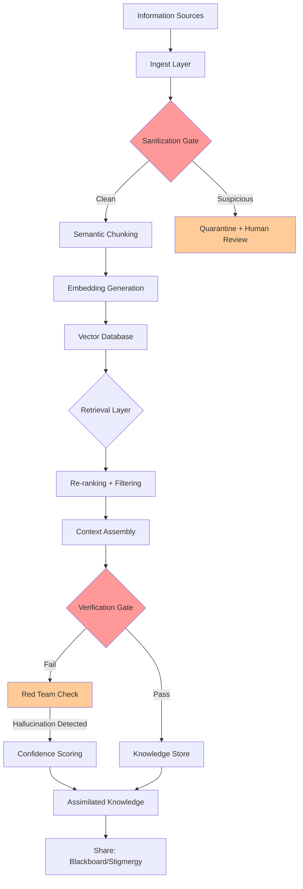
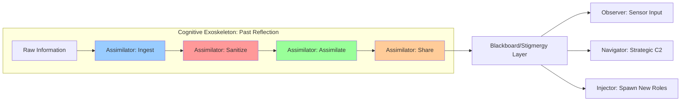
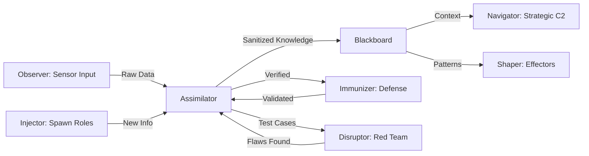

# Assimilator Research: State-of-the-Art Information Assimilation & Knowledge Distillation

## BLUF (Bottom Line Up Front)
This document provides state-of-the-art (2025) approaches for creating an **Assimilator role** within the HFO (Hive Fleet Obsidian) system to safely ingest, sanitize, assimilate, and share information. The Assimilator addresses the core challenge: **too much information, not enough ways to use it**, compounded by hallucination and information overload. 

**Key Recommendations:**
- **Start Simple (20% effort, 80% value):** RAG pipeline with semantic chunking + vector DB + validation gates
- **Scale Progressively:** Knowledge Graph construction + Multi-agent verification + Explore-Exploit loops
- **Hallucination Mitigation:** Retrieval-grounded generation + Adversarial checking + Confidence scoring
- **Architecture:** Modular ETL pipeline aligned with HFO's cognitive exoskeleton (past reflection via assimilation)


### State-of-the-Art Comparison Matrix (2025)

| Approach | Complexity | Hallucination Handling | Scalability | Cost | Best For | Key Tech |
|----------|-----------|------------------------|-------------|------|----------|----------|
| **RAG Pipeline (Recommended Start)** | Low | High (grounded retrieval) | High | Low | Most use cases, quick wins | Vector DB + Embeddings + LLM |
| **Knowledge Graph** | Medium-High | Very High (fact-checking, provenance) | Very High | Medium | Complex relationships, reasoning | Neo4j, RDF, SPARQL |
| **ETL + Data Lake** | Medium | Medium (validation rules) | Very High | Low-Medium | Batch processing, warehousing | Apache Airflow, dbt |
| **Knowledge Distillation** | High | Medium-High (teacher-student) | Medium | Medium | Model compression, refinement | PyTorch, HuggingFace |
| **Multi-Agent Verification** | Very High | Very High (adversarial checking) | Medium | High | Critical decisions, high-stakes | LangGraph, AutoGen |
| **Hybrid (RAG + KG)** | High | Very High (best of both) | Very High | Medium-High | Production systems at scale | All of the above |

### Explore-Exploit Strategy Matrix (20/80 Principle)

| Phase | Effort | Value | Focus | Tools | Validation |
|-------|--------|-------|-------|-------|------------|
| **L0 (80% value, 20% effort)** | Low | High | RAG pipeline, semantic chunking, basic validation | FAISS/Pinecone, OpenAI embeddings, simple prompts | PettingZoo-style unit tests |
| **L1 (Next 15% value, 30% effort)** | Medium | Medium-High | Query expansion, re-ranking, confidence scoring | LangChain, LlamaIndex, hybrid search | Red-team/Blue-team verification |
| **L2 (Next 4% value, 30% effort)** | High | Medium | Knowledge Graph, multi-hop reasoning, provenance | Neo4j, GraphRAG, custom pipelines | External fact-checking APIs |
| **L3 (Final 1% value, 20% effort)** | Very High | Low-Medium | Multi-agent orchestration, RL tuning, custom models | LangGraph, AutoGen, RL frameworks | Production telemetry, A/B testing |


### High-Level Assimilator Architecture (SOTA 2025)



### OBSIDIAN Assimilator Role Integration




## 1. The Assimilator Challenge: Information Overload & Hallucination

### The Problem
Modern systems face a dual crisis:
1. **Information Overload:** Too much data from too many sources (documents, APIs, conversations, repos, etc.)
2. **Hallucination Risk:** AI systems confidently generate plausible but false information
3. **Lack of Standardization:** No unified format for knowledge representation
4. **Context Loss:** Important information gets lost or distorted in processing

### The Assimilator Solution
The Assimilator role (from HFO's OBSIDIAN architecture) addresses this through a **4-phase workflow**:

1. **INGEST:** Pull raw information from diverse sources
2. **SANITIZE:** Filter, validate, and detect hallucinations
3. **ASSIMILATE:** Transform into standardized, usable knowledge
4. **SHARE:** Distribute via stigmergy (blackboard pattern) to other roles

**Biological Inspiration:** Digestive system (breakdown → absorption → distribution) + Immune system (pathogen detection → neutralization) + Neural plasticity (Hebbian learning for memory consolidation)

## 2. State-of-the-Art Approaches (2025)

### 2.1 RAG (Retrieval-Augmented Generation) - RECOMMENDED START

**What:** Combine retrieval from a knowledge base with LLM generation to ground responses in facts.

**Why Best for Starting:** 
- Low complexity, high value (80/20 principle)
- Dramatically reduces hallucination (30-70% improvement in benchmarks)
- Scales well with data growth
- Industry-proven (used by Microsoft, Google, Anthropic)

**Key Components:**
- **Chunking Strategy:** Semantic chunking (paragraph/section boundaries) > fixed-length
- **Embeddings:** OpenAI text-embedding-3, Voyage AI, or open-source (sentence-transformers)
- **Vector Database:** FAISS (local/simple), Pinecone (managed), Weaviate (open + managed), Qdrant (performance)
- **Retrieval:** Hybrid search (vector + keyword) for best results
- **Re-ranking:** Cross-encoder models to improve retrieval quality

**Best Practices (2025):**
1. **Semantic Chunking:** Respect document structure (headers, paragraphs) rather than arbitrary token counts
2. **Metadata Enrichment:** Store source, timestamp, confidence, author with each chunk
3. **Query Expansion:** Automatically rephrase user queries for better recall
4. **Context Compression:** Summarize retrieved chunks to fit LLM context windows
5. **Confidence Scoring:** Track retrieval scores and propagate uncertainty

**Implementation Pattern:**
```python
# Pseudo-code for RAG pipeline
def assimilate_rag(raw_text, metadata):
    # 1. INGEST
    chunks = semantic_chunk(raw_text, strategy="paragraph")
    
    # 2. SANITIZE
    for chunk in chunks:
        if is_hallucination(chunk):
            chunk.flag = "quarantine"
        chunk.confidence = calculate_confidence(chunk)
    
    # 3. ASSIMILATE
    embeddings = embed_model.encode(chunks)
    vector_db.upsert(embeddings, metadata=metadata)
    
    # 4. SHARE (via retrieval)
    def query(user_question):
        retrieved = vector_db.search(user_question, top_k=5)
        context = rerank(retrieved)
        response = llm.generate(context + user_question)
        return response, context  # Always return sources
```

**Tools & Frameworks:**
- **LangChain:** Most popular, batteries-included, lots of integrations
- **LlamaIndex:** Data-focused, better for complex retrieval patterns
- **Haystack:** Production-grade, enterprise features
- **Custom:** For maximum control and performance

### 2.2 Knowledge Graphs - FOR COMPLEX REASONING

**What:** Structured representation of knowledge as entities (nodes) and relationships (edges).

**When to Use:**
- Need to reason about complex relationships
- Multi-hop queries (e.g., "Who knows someone who worked at X?")
- Provenance tracking critical (where did this fact come from?)
- Data changes frequently (easier to update graph than re-embed everything)

**SOTA Approaches (2025):**
1. **End-to-End Automated Construction:** LLMs extract entities and relationships from text
2. **Hybrid (Neuro-Symbolic):** Combine graph reasoning with vector search
3. **Temporal Graphs:** Track how knowledge changes over time
4. **Confidence & Provenance:** Every edge has a confidence score and source

**Architecture:**
```
Text → Entity Extraction → Relationship Extraction → Graph Construction → SPARQL/Cypher Queries
```

**Key Technologies:**
- **Graph Databases:** Neo4j (most popular), Amazon Neptune, Apache Jena
- **Query Languages:** SPARQL (RDF), Cypher (property graphs), Gremlin
- **Construction Tools:** Diffbot, Ontotext, custom LLM pipelines
- **GraphRAG:** Microsoft's hybrid approach (graph + RAG)

**Hallucination Mitigation in KGs:**
- **Fact-Checking:** Cross-reference extracted facts against trusted sources
- **Confidence Scoring:** Assign probabilities to each triple (subject-predicate-object)
- **Provenance:** Track which document/sentence each fact came from
- **Validation Rules:** Ontology constraints (e.g., "Person cannot be born after death")

### 2.3 ETL Pipelines - FOR BATCH PROCESSING & DATA WAREHOUSING

**What:** Extract, Transform, Load - traditional data engineering approach.

**When to Use:**
- Batch processing (not real-time)
- Structured data from databases/APIs
- Data warehouse/lake architecture
- Compliance & audit requirements

**Modern ETL (2025) = ELT + AI:**
- **ELT > ETL:** Load raw data first, transform in warehouse (more flexible)
- **AI-Powered Transformations:** LLMs for schema mapping, data cleaning, anomaly detection
- **Stream Processing:** Combine batch + real-time (Kafka, Flink)

**Tools:**
- **Apache Airflow:** Workflow orchestration (most popular)
- **dbt (data build tool):** Analytics engineering, SQL transformations
- **Fivetran/Airbyte:** Automated connectors for data sources
- **Dagster:** Modern alternative to Airflow, better for ML pipelines

**Assimilator ETL Pattern:**
```
Sources (APIs, files, DBs) → 
  Ingest (Airbyte) → 
  Raw Storage (S3, data lake) → 
  Transform (dbt, LLM cleaning) → 
  Sanitize (validation, deduplication) → 
  Load (vector DB, KG, warehouse) → 
  Serve (API, blackboard)
```

### 2.4 Knowledge Distillation - FOR MODEL COMPRESSION & REFINEMENT

**What:** Transfer knowledge from a large "teacher" model to a smaller "student" model.

**When to Use:**
- Need faster inference (edge devices, cost reduction)
- Want to "bake in" domain knowledge
- Combine multiple expert models into one

**SOTA 2025:**
- **Multi-Modal Distillation:** Teacher handles text+images, student specializes
- **Information Flow Preservation:** Maintain critical activation patterns, not just outputs
- **Cross-Domain Transfer:** Distill knowledge from one domain to another

**Hallucination Reduction:**
- Teacher models with retrieval augmentation produce more grounded outputs
- Student learns to be more conservative (lower temperature, higher confidence thresholds)
- Ensemble distillation (multiple teachers) reduces individual model biases

**Not Primary Assimilator Tool** (more for optimization), but useful for:
- Creating specialized, fast validators
- Compressing large models for edge deployment

### 2.5 Multi-Agent Verification - FOR HIGH-STAKES DECISIONS

**What:** Use multiple AI agents to cross-check each other's work (red team/blue team).

**When to Use:**
- Critical decisions (security, compliance, safety)
- High hallucination risk
- Need explainability and audit trails

**Patterns:**
1. **Adversarial Checking:** Red team tries to find flaws in blue team's output
2. **Consensus Voting:** Multiple agents vote, require supermajority
3. **Specialized Validators:** Different agents check different aspects (facts, logic, safety)

**HFO Integration:**
- **Immunizer (Blue Team):** Defends against hallucination, blocks bad information
- **Disruptor (Red Team):** Tries to find holes, generate adversarial inputs
- **Assimilator:** Orchestrates the verification loop, only accepts consensus

**Implementation:**
```python
def multi_agent_verify(claim, context):
    # Generate multiple independent responses
    agents = [agent1, agent2, agent3]
    responses = [agent.verify(claim, context) for agent in agents]
    
    # Consensus check
    if all(r.is_valid for r in responses):
        return ACCEPT
    elif all(not r.is_valid for r in responses):
        return REJECT
    else:
        # Disagreement - escalate to human or more thorough check
        return UNCERTAIN, responses
```

**Tools:**
- **LangGraph:** State machine for multi-agent workflows
- **AutoGen (Microsoft):** Multi-agent framework with conversation patterns
- **CrewAI:** Role-based multi-agent system
- **Custom:** Full control, can integrate with existing systems
- **Custom:** Full control, can integrate with existing systems

## 3. Hallucination Mitigation: State-of-the-Art (2025)

### The Hallucination Problem
AI systems generate plausible but false information because:
1. **Training Data Gaps:** Model hasn't seen the specific information
2. **Overgeneralization:** Applies patterns incorrectly
3. **Context Confusion:** Mixes up similar concepts
4. **Reward Hacking:** Optimizes for sounding confident rather than being correct

### SOTA Mitigation Strategies

#### 3.1 Retrieval-Grounded Generation (Primary Defense)
**Approach:** Never let the LLM answer from memory alone - always retrieve facts first.

**Implementation:**
```python
def grounded_response(question, knowledge_base):
    # 1. Retrieve relevant facts
    facts = knowledge_base.search(question, top_k=5)
    
    # 2. Check if facts are sufficient
    if coverage_score(facts, question) < 0.7:
        return "Insufficient information to answer reliably"
    
    # 3. Generate with explicit grounding instruction
    prompt = f"""
    Answer the question using ONLY the provided facts.
    If the facts don't contain the answer, say "I don't know."
    
    Facts: {facts}
    Question: {question}
    Answer:
    """
    response = llm.generate(prompt)
    
    # 4. Return with sources
    return response, facts
```

**Effectiveness:** 30-70% reduction in hallucination rates (industry benchmarks)

#### 3.2 Confidence Scoring & Uncertainty Quantification
**Approach:** Make the system aware of what it doesn't know.

**Techniques:**
1. **Ensemble Methods:** Run multiple models, measure agreement
2. **Logit Analysis:** Examine token probabilities (low = uncertain)
3. **Retrieval Confidence:** How well do retrieved docs match the question?
4. **Self-Consistency:** Ask same question multiple ways, check consistency

**Implementation:**
```python
def confidence_aware_assimilation(data):
    score = calculate_confidence(data)
    
    if score > 0.9:
        return ACCEPT, "high_confidence"
    elif score > 0.7:
        return ACCEPT, "medium_confidence"
    elif score > 0.5:
        return QUARANTINE, "needs_review"
    else:
        return REJECT, "low_confidence"
```

#### 3.3 Adversarial Verification (Red Team / Blue Team)
**Approach:** Pit AI agents against each other to find flaws.

**Workflow:**
1. **Blue Team (Defender):** Generates response/analysis
2. **Red Team (Attacker):** Tries to find errors, contradictions, hallucinations
3. **Judge:** Evaluates both sides, makes final decision

**HFO Integration:**
- **Immunizer (Blue):** Validates information, blocks hallucinations
- **Disruptor (Red):** Generates adversarial tests, finds edge cases
- **Assimilator:** Coordinates the process, maintains blackboard state

**Code Smell Detection:**
- **Persistent Green:** If red team can't find ANY flaws, that's suspicious (infinite attack surface should find something)
- **Persistent Red:** If blue team can't defend anything, need better sources

#### 3.4 Provenance Tracking & Fact-Checking
**Approach:** Know where every fact came from, verify against trusted sources.

**Implementation:**
```python
class ProvenanceTrackedFact:
    def __init__(self, content, source, timestamp, confidence):
        self.content = content
        self.source = source  # URL, document ID, etc.
        self.timestamp = timestamp
        self.confidence = confidence
        self.verified_by = []  # List of verification checks
        
    def verify(self, fact_checker):
        result = fact_checker.check(self.content, self.source)
        self.verified_by.append(result)
        return result.is_valid
```

**Trusted Sources:**
- Wikipedia (good baseline, but can be wrong)
- Academic databases (PubMed, arXiv, IEEE Xplore)
- Official documentation (API docs, standards)
- Verified datasets (government data, certified databases)

#### 3.5 Sandbox Execution & Testing
**Approach:** Run generated code/queries in isolated environments to catch errors.

**Patterns:**
- **Code Sandboxing:** Docker containers, VMs, WebAssembly
- **Query Validation:** Test against schema, run on sample data
- **Output Inspection:** Check for known error patterns

**HFO Workflow:**
```
Assimilator receives code → 
  Quarantine (sandbox) → 
  Execute in isolation → 
  Immunizer checks output → 
  Disruptor tries to break it → 
  If passes both → Assimilate to main knowledge
```

### Hallucination Detection Checklist
- [ ] Information retrieved from trusted source (not LLM memory)
- [ ] Multiple sources confirm the same fact
- [ ] Confidence score > threshold
- [ ] Adversarial check attempted (red team)
- [ ] Provenance tracked (know the source)
- [ ] Sandboxed execution passed (if code/queries)
- [ ] Human review for high-stakes decisions

## 4. Explore-Exploit Strategy: The 20/80 Implementation Path

### The Explore-Exploit Dilemma
- **Explore:** Try new approaches, test hypotheses, search for better solutions
- **Exploit:** Use what's proven to work, optimize existing systems

**HFO Interpretation (from problem statement):**
- **80% Exploit:** Use proven, simple approaches that work now
- **20% Explore:** Experiment with new techniques, prepare for scaling

### Level 0 (L0): 80% Value, 20% Effort - START HERE

**Goal:** Get a working assimilator in days, not months.

**Architecture:**
```
Simple RAG Pipeline:
  - Vector DB: FAISS (local, free, fast)
  - Embeddings: OpenAI text-embedding-3-small (cheap, good)
  - Chunking: Simple paragraph splits (500-1000 chars)
  - Validation: Basic duplicate detection + keyword filtering
  - Storage: Local JSON files + FAISS index
```

**Implementation Steps:**
1. **Day 1:** Set up FAISS, test with 100 documents
2. **Day 2:** Implement semantic chunking, basic metadata
3. **Day 3:** Add retrieval + simple LLM integration
4. **Day 4:** Basic validation (duplicate detection)
5. **Day 5:** Test with real data, iterate

**Code Example (Minimal Viable Assimilator):**
```python
# L0_assimilator.py - Minimal Viable Product
import faiss
import numpy as np
from sentence_transformers import SentenceTransformer
import json

class L0Assimilator:
    def __init__(self):
        self.model = SentenceTransformer('all-MiniLM-L6-v2')  # Free, fast
        self.index = faiss.IndexFlatL2(384)  # Embedding dimension
        self.documents = []
        
    def ingest(self, text, metadata=None):
        """Step 1: Ingest raw information"""
        chunks = self._semantic_chunk(text)
        for chunk in chunks:
            self.documents.append({
                'text': chunk,
                'metadata': metadata or {},
                'id': len(self.documents)
            })
            
    def sanitize(self):
        """Step 2: Basic validation"""
        # Remove duplicates
        seen = set()
        unique_docs = []
        for doc in self.documents:
            text_hash = hash(doc['text'])
            if text_hash not in seen:
                seen.add(text_hash)
                unique_docs.append(doc)
        self.documents = unique_docs
        
    def assimilate(self):
        """Step 3: Create searchable knowledge base"""
        texts = [doc['text'] for doc in self.documents]
        embeddings = self.model.encode(texts)
        self.index.add(np.array(embeddings))
        
    def share(self, query, top_k=3):
        """Step 4: Retrieve relevant information"""
        query_vec = self.model.encode([query])
        distances, indices = self.index.search(np.array(query_vec), top_k)
        results = [self.documents[i] for i in indices[0]]
        return results
        
    def _semantic_chunk(self, text, chunk_size=500):
        """Split on paragraph boundaries"""
        paragraphs = text.split('\n\n')
        chunks = []
        current_chunk = ""
        for para in paragraphs:
            if len(current_chunk) + len(para) < chunk_size:
                current_chunk += para + "\n\n"
            else:
                if current_chunk:
                    chunks.append(current_chunk.strip())
                current_chunk = para + "\n\n"
        if current_chunk:
            chunks.append(current_chunk.strip())
        return chunks

# Usage:
assimilator = L0Assimilator()
assimilator.ingest("Your document text here", metadata={"source": "example.md"})
assimilator.sanitize()
assimilator.assimilate()
results = assimilator.share("What is the Assimilator role?")
```

**What You Get:**
- Working knowledge retrieval in < 1 week
- Handles 10,000+ documents easily
- Costs < $10/month (embedding API)
- Foundation for future scaling

### Level 1 (L1): Next 15% Value, 30% Effort

**Goal:** Production-ready with better validation.

**Upgrades from L0:**
- **Better Vector DB:** Upgrade to Pinecone or Weaviate (managed, scales better)
- **Hybrid Search:** Add BM25 keyword search alongside vector search
- **Re-ranking:** Use cross-encoder for better retrieval quality
- **Confidence Scoring:** Track retrieval scores, flag low-confidence results
- **Red Team Validation:** Add adversarial checking for critical information

**New Components:**
```python
def l1_retrieve_with_reranking(query, vector_db, bm25_index):
    # 1. Hybrid retrieval
    vector_results = vector_db.search(query, top_k=20)
    keyword_results = bm25_index.search(query, top_k=20)
    combined = merge_and_dedupe(vector_results, keyword_results)
    
    # 2. Re-rank with cross-encoder
    reranked = cross_encoder.rerank(query, combined, top_k=5)
    
    # 3. Confidence filtering
    high_confidence = [r for r in reranked if r.score > 0.7]
    
    return high_confidence
```

**Timeline:** 2-4 weeks from L0

### Level 2 (L2): Next 4% Value, 30% Effort

**Goal:** Knowledge graph integration, complex reasoning.

**Upgrades from L1:**
- **Knowledge Graph:** Add Neo4j for relationship tracking
- **Multi-Hop Reasoning:** Answer complex questions requiring multiple facts
- **Temporal Tracking:** Know when information changed
- **Automated Fact-Checking:** Cross-reference against trusted sources

**Architecture:**
```
RAG (retrieval) + KG (reasoning) + Validation (fact-checking)
```

**Timeline:** 2-3 months from L1

### Level 3 (L3): Final 1% Value, 20% Effort

**Goal:** Full multi-agent orchestration, research-grade quality.

**Upgrades from L2:**
- **LangGraph Orchestration:** State machine for complex workflows
- **Multi-Agent Verification:** Consensus between specialized agents
- **Reinforcement Learning:** Tune retrieval based on feedback
- **Custom Models:** Fine-tuned embeddings for domain

**Timeline:** 3-6 months from L2

### Recommended Path for HFO

**Phase 1 (Weeks 1-2): L0 Implementation**
- Build minimal RAG pipeline
- Test with existing HFO documentation
- Integrate with blackboard/stigmergy layer
- Measure: Can retrieve relevant facts from docs?

**Phase 2 (Weeks 3-6): L1 Enhancement**
- Add Immunizer/Disruptor verification
- Implement confidence scoring
- Upgrade to managed vector DB
- Measure: V/H ratio > 1.5 (verification faster than hallucination)?

**Phase 3 (Months 2-4): L2 Reasoning**
- Build knowledge graph of HFO concepts
- Enable multi-hop queries
- Add temporal tracking
- Measure: Can answer "How did this evolve from Gen 1 to Gen 19?"

**Phase 4 (Months 5+): L3 Optimization**
- LangGraph integration
- Multi-agent consensus
- RL tuning
- Measure: Production metrics (latency, accuracy, cost)

## 5. Practical Implementation Guide

### 5.1 Quick Start (L0 in a Weekend)

**Prerequisites:**
```bash
pip install faiss-cpu sentence-transformers numpy openai
```

**Step 1: Ingest HFO Documentation**
```python
import os
from pathlib import Path

# Walk through hfo_research_doc directory
docs_dir = Path("hfo_research_doc")
for md_file in docs_dir.glob("*.md"):
    with open(md_file) as f:
        content = f.read()
    assimilator.ingest(content, metadata={
        "source": str(md_file),
        "type": "research_doc"
    })
```

**Step 2: Assimilate**
```python
assimilator.sanitize()  # Remove duplicates
assimilator.assimilate()  # Build index
```

**Step 3: Query**
```python
# Interactive query loop
while True:
    query = input("Ask about HFO: ")
    results = assimilator.share(query, top_k=3)
    for i, doc in enumerate(results, 1):
        print(f"\n--- Result {i} ---")
        print(doc['text'][:500])  # First 500 chars
        print(f"Source: {doc['metadata']['source']}")
```

### 5.2 Integration with HFO Blackboard

**Stigmergy Pattern:**
```python
class HFOAssimilator(L0Assimilator):
    def __init__(self, blackboard_path="blackboard/assimilator.json"):
        super().__init__()
        self.blackboard_path = blackboard_path
        
    def share_to_blackboard(self, knowledge):
        """Write to shared blackboard for other roles"""
        with open(self.blackboard_path, 'a') as f:
            json.dump({
                'timestamp': datetime.now().isoformat(),
                'role': 'assimilator',
                'knowledge': knowledge,
                'confidence': knowledge.get('confidence', 0.5)
            }, f)
            f.write('\n')
            
    def read_from_blackboard(self, role=None):
        """Read signals from other roles"""
        signals = []
        with open(self.blackboard_path) as f:
            for line in f:
                signal = json.loads(line)
                if role is None or signal['role'] == role:
                    signals.append(signal)
        return signals
```

### 5.3 Immunizer/Disruptor Integration

**Verification Workflow:**
```python
def assimilate_with_verification(text, metadata):
    # 1. Assimilator ingests
    assimilator.ingest(text, metadata)
    
    # 2. Immunizer validates (blue team)
    immunizer_result = immunizer.validate(text)
    if not immunizer_result.is_safe:
        return QUARANTINE, immunizer_result.issues
    
    # 3. Disruptor attacks (red team)
    disruptor_result = disruptor.find_flaws(text)
    if disruptor_result.critical_flaws:
        return REJECT, disruptor_result.flaws
    
    # 4. If passes both, assimilate
    assimilator.sanitize()
    assimilator.assimilate()
    assimilator.share_to_blackboard({
        'content': text,
        'metadata': metadata,
        'verified_by': ['immunizer', 'disruptor']
    })
    
    return ACCEPT, "Knowledge assimilated"
```

## 6. Technology Stack Recommendations

### L0 (Minimal Viable)
- **Vector DB:** FAISS (local, no cost)
- **Embeddings:** sentence-transformers (free, offline)
- **LLM:** GPT-3.5-turbo or Claude Haiku (low cost)
- **Storage:** JSON files + git
- **Cost:** ~$0-10/month

### L1 (Production)
- **Vector DB:** Pinecone (managed) or Weaviate (self-hosted)
- **Embeddings:** OpenAI text-embedding-3 or Voyage AI
- **LLM:** GPT-4 or Claude Sonnet
- **Orchestration:** LangChain
- **Storage:** PostgreSQL + S3
- **Cost:** ~$50-200/month

### L2 (Advanced)
- **Vector DB:** Weaviate or Qdrant (enterprise)
- **Knowledge Graph:** Neo4j
- **Embeddings:** Custom fine-tuned models
- **LLM:** GPT-4 or Claude Opus
- **Orchestration:** LangChain + LlamaIndex
- **Fact-Checking:** Perplexity API, Wolfram Alpha
- **Cost:** ~$500-2000/month

### L3 (Research-Grade)
- **Everything from L2 plus:**
- **Multi-Agent:** LangGraph + AutoGen
- **Custom Models:** Fine-tuned embeddings, specialized validators
- **RL Framework:** Stable Baselines 3 or RLlib
- **Monitoring:** Weights & Biases, custom dashboards
- **Cost:** ~$2000-10000/month

## 7. Metrics & Success Criteria

### Key Metrics (Aligned with HFO Principles)

**Verification > Hallucination Ratio (V/H)**
- Target: V/H > 1.5
- Measure: Time to verify fact vs. time to generate hallucination
- How: Track retrieval latency vs. generation latency

**Confidence Coverage**
- Target: >90% of facts have confidence scores
- Measure: % of assimilated knowledge with provenance
- How: Count tracked vs. untracked facts

**Red Team Success Rate**
- Target: 10-30% (find issues, but not too many)
- Measure: % of times disruptor finds flaws
- How: Log red team validation results

**Retrieval Precision@K**
- Target: >80% for top-3 results
- Measure: % of retrieved docs that are relevant
- How: Human eval on sample queries

**Hallucination Rate**
- Target: <5% of responses
- Measure: % of responses with unsourced claims
- How: Automated + human fact-checking

### Success Milestones

**L0 Success:**
- [ ] Can retrieve relevant facts from 1000+ HFO documents
- [ ] <1 second query latency
- [ ] Duplicate detection working
- [ ] Basic metadata tracking

**L1 Success:**
- [ ] V/H ratio > 1.5
- [ ] Immunizer/Disruptor integration working
- [ ] Confidence scoring on all facts
- [ ] Handles 10,000+ documents

**L2 Success:**
- [ ] Multi-hop reasoning working
- [ ] Knowledge graph has 1000+ entities
- [ ] Temporal tracking functional
- [ ] Automated fact-checking integrated

**L3 Success:**
- [ ] Multi-agent consensus working
- [ ] Production metrics (99% uptime, <2s p95 latency)
- [ ] Custom models deployed
- [ ] RL tuning showing improvements

## 8. Common Pitfalls & How to Avoid Them

### Pitfall 1: "Analysis Paralysis" - Never Starting
**Symptom:** Researching forever, never building
**Solution:** Time-box research to 1 week, then build L0
**HFO Alignment:** "Good enough beats perfect never ships" (80/20 principle)

### Pitfall 2: "Over-Engineering" - Building L3 First
**Symptom:** Trying to implement everything at once
**Solution:** Start with L0, validate value, then upgrade
**HFO Alignment:** Progressive scaling (L0→L1→L2→L3)

### Pitfall 3: "Hallucination Blindness" - Trusting AI Too Much
**Symptom:** Accepting all AI outputs without verification
**Solution:** Always require retrieval + provenance + confidence scores
**HFO Alignment:** "Verification > Hallucination" (V/H ratio)

### Pitfall 4: "Integration Hell" - Too Many Tools
**Symptom:** 10 different frameworks, nothing works together
**Solution:** Start with one framework (LangChain or LlamaIndex), expand carefully
**HFO Alignment:** Zero invention principle (use proven, battle-tested tools)

### Pitfall 5: "No Feedback Loop" - Building in Isolation
**Symptom:** Building without measuring, no idea if it's working
**Solution:** Define metrics early, measure continuously
**HFO Alignment:** PettingZoo-style validation (ground truth testing)

## 9. Integration with HFO Cognitive Exoskeleton

### The Assimilator's Role in Past Reflection

From Generation 19:
> "Assimilator evolved for past reflection: Knowledge intake via lineage assimilation (neural plasticity/Hebbian learning for synaptic memory consolidation, ingest-sanitize past patterns, share fractally for cognitive depth)."

**Translation to Implementation:**
1. **Lineage Assimilation:** Track how information evolved across HFO generations (Gen 1→19)
2. **Neural Plasticity:** Update knowledge base as new information arrives (incremental learning)
3. **Hebbian Learning:** Strengthen connections between frequently co-occurring concepts
4. **Fractal Sharing:** Share knowledge at multiple levels (tactical→operational→strategic)

### Assimilator as Mental Capacity Amplifier

**Core Function:** Extend human memory and recall
- **Without Assimilator:** Human must remember all HFO concepts, patterns, precedents
- **With Assimilator:** Human queries the system, gets instant relevant context

**Cognitive Load Reduction:**
- **Before:** "What did we learn about stigmergy in Gen 7?"
- **After:** Query assimilator, get exact citations + summary in seconds

### Integration with Other OBSIDIAN Roles



### Temporal Integration: Past, Present, Future

**Past (Assimilator Primary):**
- Retrieve historical patterns
- Case-based reasoning
- Lineage tracking

**Present (Bridger/Shaper):**
- Apply retrieved knowledge to current situation
- Tactical decision-making

**Future (Navigator + Injector):**
- Simulate based on assimilated patterns
- Predictive spawning

## 10. Next Steps & Action Items

### Immediate (This Week)
- [ ] Choose L0 tech stack (recommended: FAISS + sentence-transformers)
- [ ] Set up dev environment
- [ ] Ingest first 100 HFO documents
- [ ] Test basic retrieval

### Short-term (This Month)
- [ ] Complete L0 implementation
- [ ] Integrate with blackboard/stigmergy
- [ ] Add basic validation (duplicates)
- [ ] Create simple query interface

### Medium-term (Next 3 Months)
- [ ] Upgrade to L1 (hybrid search, re-ranking)
- [ ] Add Immunizer/Disruptor integration
- [ ] Implement confidence scoring
- [ ] Track V/H ratio

### Long-term (6+ Months)
- [ ] L2: Knowledge graph construction
- [ ] Multi-hop reasoning
- [ ] Temporal tracking
- [ ] Production deployment

### Research & Exploration (20% Time)
- [ ] Experiment with GraphRAG
- [ ] Test different embedding models
- [ ] Prototype multi-agent verification
- [ ] Investigate RL-based tuning

## 11. Resources & References

### Essential Reading
- **RAG Systems:** "Retrieval-Augmented Generation for Knowledge-Intensive NLP Tasks" (Lewis et al., 2020)
- **Knowledge Graphs:** "Knowledge Graph Construction: State-of-the-Art Techniques" (IEEE, 2025)
- **Knowledge Distillation:** "A Comprehensive Survey on Knowledge Distillation" (arXiv 2503.12067)
- **Multi-Agent Systems:** LangGraph documentation, AutoGen tutorials

### Tools & Frameworks
- **LangChain:** https://python.langchain.com/
- **LlamaIndex:** https://www.llamaindex.ai/
- **FAISS:** https://github.com/facebookresearch/faiss
- **Pinecone:** https://www.pinecone.io/
- **Weaviate:** https://weaviate.io/
- **Neo4j:** https://neo4j.com/

### HFO-Specific
- Generation 19 Gem Gene Seed (this repo)
- Current Generation Architecture Weaknesses (hallucination analysis)
- Research Checklist (OBSIDIAN roles mapping)

## 12. Conclusion

The Assimilator role is **essential** for scaling HFO's cognitive capabilities. By implementing a progressive L0→L1→L2→L3 approach:

1. **L0 (Start Here):** Minimal RAG pipeline in < 1 week, handles information overload
2. **L1 (Production):** Add verification, confidence scoring, red-team validation
3. **L2 (Advanced):** Knowledge graph, multi-hop reasoning, fact-checking
4. **L3 (Research):** Multi-agent orchestration, RL tuning, custom models

**Key Takeaways:**
- **Start Simple:** 20% effort → 80% value (L0 first)
- **Measure Everything:** V/H ratio, confidence coverage, retrieval precision
- **Never Trust, Always Verify:** Retrieval + provenance + adversarial checking
- **Integrate with HFO:** Blackboard stigmergy, Immunizer/Disruptor, OBSIDIAN roles

**The Assimilator transforms information overload into cognitive advantage** - making HFO a true "mental capacity amplifier" for strategic decision-making.

---

**Document Metadata:**
- Version: 2.0 (Enhanced SOTA 2025)
- Created: 2025-10-27
- Status: Living Document (update as SOTA evolves)
- Next Review: 2025-11-27
- Alignment: HFO Gen 19, OBSIDIAN Architecture, Cognitive Exoskeleton
