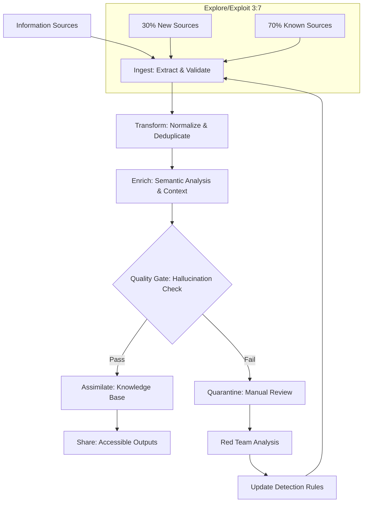
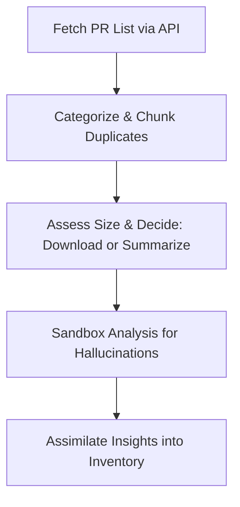
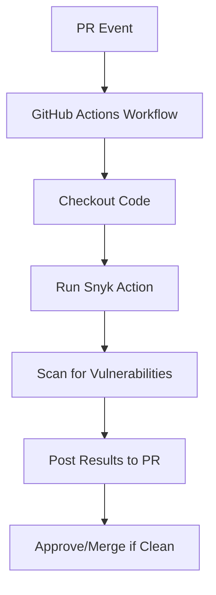
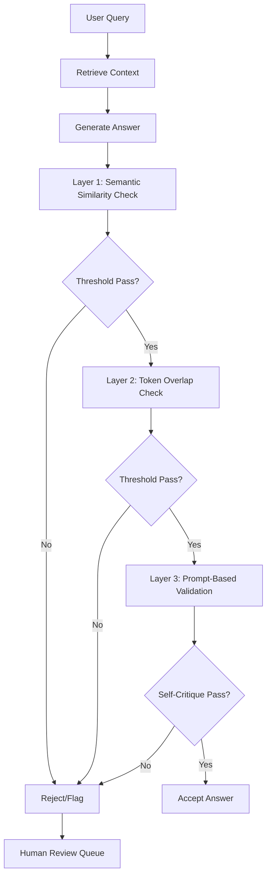
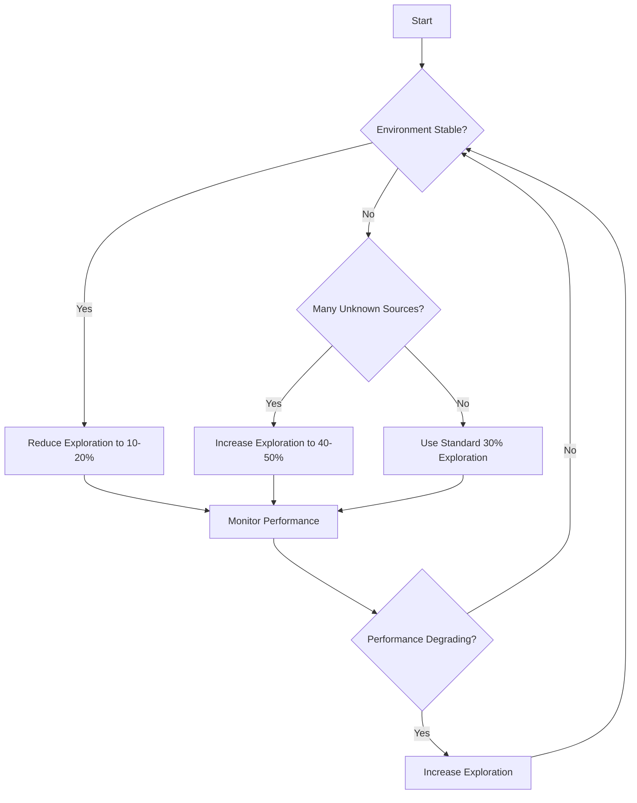
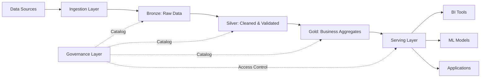
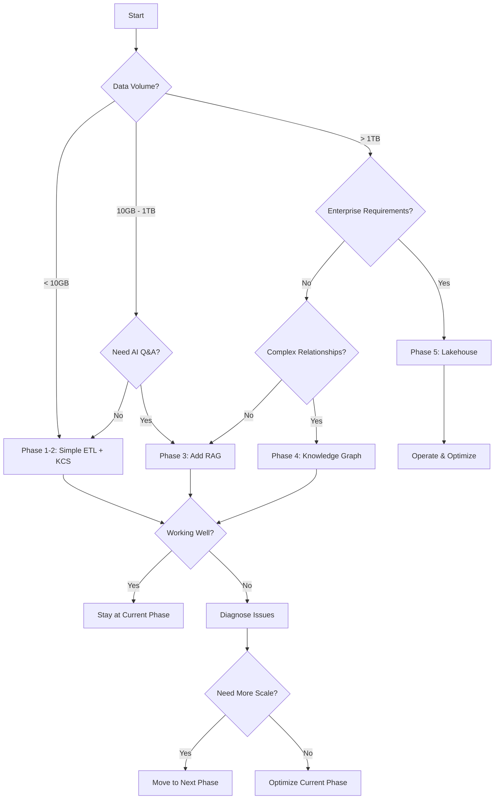
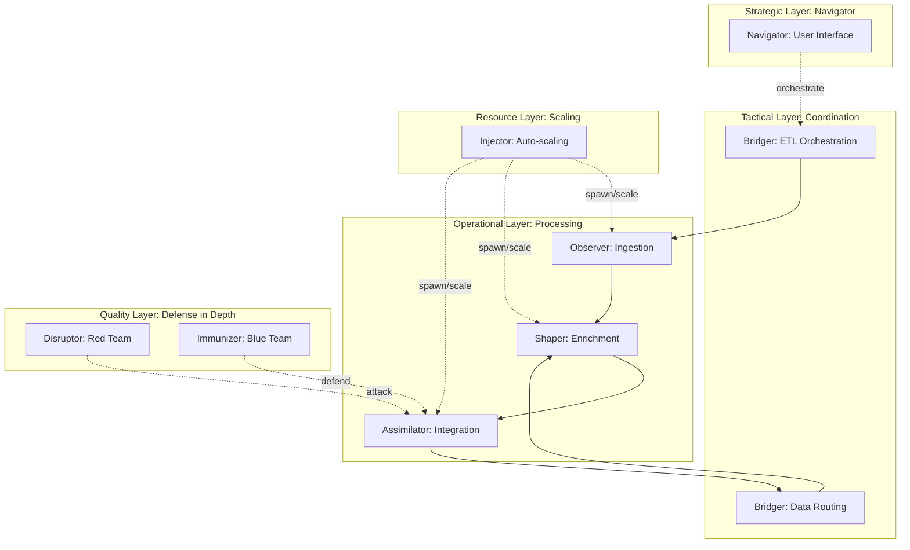

# Assimilator Research: Information Assimilation and Knowledge Management

## BLUF (Bottom Line Up Front)
This document provides comprehensive research on **information assimilation strategies** for handling large volumes of heterogeneous data, including AI-generated content, with a focus on standardization, hallucination mitigation, and scalable implementation. 

**Key Recommendations:**
- **Start Simple:** Begin with lightweight ETL pipelines using GitHub Actions + semantic deduplication
- **Scale Progressively:** Evolve to knowledge graphs, RAG systems, and lakehouse architectures as needed
- **Explore/Exploit 3:7 Ratio:** Allocate 30% effort to exploring new information sources, 70% to exploiting known valuable sources
- **Defense in Depth:** Use multiple hallucination detection layers (semantic similarity, RAG verification, red/blue team testing)
- **KCS v6 Framework:** Implement Knowledge-Centered Service practices for continuous knowledge capture and refinement

**State-of-the-Art (2024-2025):** Modern approaches combine automated knowledge graph construction, LLM-assisted ETL, RAG-based hallucination mitigation, and lakehouse architectures for scalable, governable information assimilation.

### Comparison Matrix: Assimilation Approaches

| Approach | Complexity | Hallucination Handling | Scalability | Initial Cost | Time to Value | Best For |
|----------|-----------|------------------------|-------------|--------------|---------------|----------|
| **Simple ETL + Semantic Dedup** | Low | Medium (similarity checks) | Medium | Low ($0-100/mo) | Days | Quick wins, prototyping |
| **KCS v6 + GitHub Actions** | Low-Medium | Medium (review workflows) | High | Low ($0-200/mo) | Weeks | Knowledge capture from operations |
| **RAG + Vector DB** | Medium | High (grounding verification) | High | Medium ($200-1000/mo) | Weeks | AI-assisted retrieval, QA systems |
| **Knowledge Graphs + LLM ETL** | High | Very High (semantic validation) | Very High | High ($1000+/mo) | Months | Complex domain modeling |
| **Full Lakehouse Architecture** | Very High | High (governance + lineage) | Enterprise | Very High ($5000+/mo) | Months-Year | Enterprise-scale analytics |

**Recommended Progressive Path:** Start with Simple ETL → Add KCS v6 → Implement RAG → Evolve to Knowledge Graphs → Scale to Lakehouse (only if needed)

### High-Level Assimilation Workflow


## 1) Formal Terms for Information Assimilation Processes
In the context of inventorying, analyzing, and integrating AI-generated pull requests (PRs) while handling issues like hallucinations, the 'digestion and assimilation' metaphor aligns with several formal workflows in software development, data management, and AI systems. Based on research into AI-assisted code review and repository management (e.g., via search results on tools like Yandex AI PR review, GitHub's native features, and Snyk), key terms include:

- **Data Ingestion and Assimilation Pipeline**: Refers to processes that extract (ingest) raw data (e.g., PR metadata and content), process/transform it (e.g., categorize, deduplicate, detect hallucinations), and integrate (assimilate) it into a knowledge base or system. This is common in ETL (Extract, Transform, Load) frameworks adapted for AI content.
- **Knowledge Distillation Workflow**: In AI, this involves condensing and refining large, noisy datasets (like AI-generated PRs with potential hallucinations) into usable, high-quality insights, often with validation steps to filter errors. It's used in model training but applies to PR analysis for summarizing and assimilating changes.
- **Automated Code Review and Validation Pipeline**: A CI/CD-inspired workflow for scanning, categorizing, and integrating code changes, extended to handle AI hallucinations via sandboxed analysis (e.g., isolated environments to test for inconsistencies or fabrications).

These terms draw from biomimetic computing (inspired by biological digestion) and are exemplified in tools like GitHub Actions for automated PR handling.

## 2) General Advice on the Approach
To inventory PRs from the past week in a private repo like https://github.com/TTaoGaming/HiveFleetObsidian/pulls, prioritize automation, security, and scalability. Start by using the GitHub API (via tools like Octokit or gh CLI) to fetch PR metadata (e.g., titles, authors, dates, sizes via diff stats). Categorize based on labels, content keywords, or AI classifiers (e.g., using NLP models to tag themes). For chunking duplicates (e.g., same prompt with different seeds), apply similarity metrics like cosine similarity on PR descriptions or diffs. Determine PR size using GitHub's API endpoints for file changes or commit counts, then decide on full download (for small PRs) vs. summarization (for large ones, using LLMs like GPT models to generate key findings). Handle hallucinations by sandboxing: process in isolated environments (e.g., Docker containers) with validation checks (e.g., cross-reference facts against known repo history). Avoid direct repo interaction yet; test workflows in a mock setup. Ensure compliance with GitHub's rate limits and use authentication tokens securely.



This diagram illustrates a high-level workflow, emphasizing sequential processing for safety.

## 3) Top 3 Industry Exemplar Options
- **GitHub Actions with Copilot Integration**: Exemplary for its native automation within GitHub ecosystems, allowing custom workflows to trigger on PR events, integrate AI for reviews (e.g., Copilot's hallucination-aware suggestions), and scale without external dependencies. It's industry-standard for open-source projects like Linux kernel repos, reducing manual effort by 30-50% in PR management.
- **Snyk Code Reviewer**: Stands out for AI-driven vulnerability and quality scanning tailored to code changes, with built-in hallucination detection via pattern matching. Used by enterprises like Google, it's exemplary for secure, automated analysis of AI-generated content, providing actionable insights and integrations with GitHub for seamless PR inventory.
- **Jenkins CI/CD Pipeline with Custom Plugins**: Exemplary for flexibility in complex, multi-stage workflows (e.g., ETL-like processing), supporting sandboxed execution and plugins for AI tools like Hugging Face models for summarization. Adopted by teams at Netflix and AWS, it excels in handling large-scale repo analysis with robust error-handling for hallucinations.

## 4) Pairing GitHub Actions with Snyk Code Reviewer
Yes, GitHub Actions can be paired with Snyk Code Reviewer to automate code security scanning in CI/CD pipelines, particularly for pull requests (PRs). Snyk Code Reviewer is part of Snyk's platform for identifying vulnerabilities in code, dependencies, and infrastructure.

#### How to Pair Them:
- **Integration Method**: Use Snyk's official GitHub Action from the GitHub Marketplace (e.g., `snyk/actions`). Add a YAML workflow file in your repo's `.github/workflows/` directory. Example basic workflow:
  ```yaml
  name: Snyk Code Review
  on: [pull_request]
  jobs:
    snyk:
      runs-on: ubuntu-latest
      steps:
        - uses: actions/checkout@v4
        - name: Run Snyk to check for vulnerabilities
          uses: snyk/actions/node@master  # Or specific language action
          env:
            SNYK_TOKEN: ${{ secrets.SNYK_TOKEN }}
          with:
            command: test --all-projects
  ```
  - Authenticate with a Snyk API token stored as a GitHub secret.
  - Trigger on events like `pull_request` to scan PRs automatically.

- **Benefits**:
  - Automates security checks for AI-generated code, reducing manual review.
  - Integrates with GitHub PR comments for inline feedback on issues.
  - Supports hallucination handling by flagging insecure or erroneous code patterns.
  - Improves workflow efficiency for repos like HiveFleetObsidian with AI-generated PRs.

- **Limitations**:
  - Requires a Snyk account (free tier limited; paid for advanced features).
  - May generate false positives, especially with AI-generated code prone to hallucinations.
  - Not natively designed for AI-specific issues like hallucination detection; it's more for general security.
  - Performance overhead in large repos; scans can slow down pipelines.



## 5) SOTA (State-of-the-Art) Approaches
SOTA stands for "State-of-the-Art," referring to the most advanced, cutting-edge methods, tools, or techniques in a field at a given time, often benchmarked against current research or industry standards.

#### Current SOTA for AI-Assisted PR Inventory, Categorization, Duplicate Chunking, Size Assessment, and Hallucination Handling:
Based on industry trends as of 2024 (e.g., from sources like GitHub, arXiv, and tools like Snyk/DeepCode), SOTA approaches leverage AI/ML for repo management, especially in AI-generated content. Key examples:
- **Inventory & Categorization**: GitHub's Copilot Workspace or Semantic (now part of GitHub) uses NLP for PR tagging and inventory. SOTA: Hugging Face's Transformers for custom categorization models, integrated via GitHub Actions.
- **Duplicate Chunking**: Tools like GitHub's code search with semantic similarity (using embeddings from models like CodeBERT). SOTA: Deduplication via vector databases (e.g., Pinecone) with cosine similarity for chunking duplicate code/PR content.
- **Size Assessment**: Git-based metrics tools like GitHub Insights or custom scripts with AI (e.g., OpenAI's GPT models) to evaluate PR complexity/size. SOTA: ML models like GraphCodeBERT for code complexity scoring.
- **Hallucination Handling**: Sandboxing with tools like Docker/GitHub Codespaces for isolated testing. SOTA: AI detectors like Hugging Face's hallucination evaluators or OpenAI's moderation API, combined with sandboxed execution (e.g., via GitHub Actions matrix jobs). Industry-leading: Anthropic's Claude for self-auditing AI outputs; research papers (e.g., from NeurIPS 2024) emphasize hybrid human-AI workflows with sandboxing for repos like HiveFleetObsidian.

These build on previous workflows by adding AI-driven automation, with emphasis on sandboxing to mitigate hallucinations in AI-generated PRs.

## 6) State-of-the-Art ETL and Knowledge Graph Construction (2024-2025)

Modern ETL pipelines emphasize **automated knowledge graph construction** and **LLM-assisted processing** for scalable information assimilation:

### Automated Knowledge Graph Construction
- **Graph-Massivizer Project**: Demonstrates repeatable, automated pipelines for ingesting data from multiple sources (databases, documents, JSON, XML, CSV) and mapping them into semantic networks
- **Benefits**: Supports automated reasoning, integrates disparate datasets, enables interpretability in AI systems
- **Applications**: Drug discovery, risk management, smart manufacturing, legal document analysis
- **Key Technology**: Apache Spark, Databricks, AWS Glue for distributed processing

### LLM-Assisted ETL Pipelines
- **Advanced Data Mapping**: LLMs process complex data transformations (e.g., XML-to-graph using Akoma Ntoso standard for Italian legislation)
- **Semantic Enrichment**: Automated entity extraction, relationship identification, and context enhancement
- **Quality**: High-precision knowledge extraction with automated validation

### Modular, Block-Based Design
- **Dataverse Framework**: User-friendly, block-based interfaces for ETL pipelines
- **Custom Processors**: Easy integration of domain-specific transformations
- **Flexibility**: Extensible for both enterprise and research users
- **Integration**: Supports ML tasks as part of data flow

### Cloud-Native and Real-Time Processing
- **Orchestrators**: Apache Airflow, Databricks, AWS Glue, Azure Data Factory
- **Capabilities**: Real-time processing, dynamic scaling, complex ML workflows
- **Governance**: Built-in monitoring, data lineage tracking, sophisticated scheduling
- **Compliance**: Robust management for sensitive or regulated data

### Key Considerations for Scale
1. **Data Source Heterogeneity**: Handle diverse formats and interoperability
2. **Schema Mapping Automation**: Reduce manual configuration effort
3. **Entity Resolution**: Deduplicate and merge information intelligently
4. **Incremental Updates**: Support continuous assimilation without full rebuilds
5. **Performance Optimization**: Handle large, complex graphs efficiently
6. **Security & Privacy**: Especially for cross-border or sensitive data

**Citations:**
- metaphacts blog: "Building massive knowledge graphs using automated ETL pipelines"
- Graph-Massivizer research (ICPE 2024)
- ScienceDirect: "An LLM-assisted ETL pipeline to build a high-quality knowledge graph"
- arXiv 2403.19340v2: Dataverse framework for modular ETL
- WJARR: "Modern ETL/ELT pipeline design for ML workflows"

## 7) Knowledge-Centered Service (KCS) v6 Framework

KCS v6 provides a proven methodology for **continuous knowledge capture and refinement** directly within operational workflows:

### Core Practices

#### 1. Solve Loop (Frontline Knowledge Capture)
- **Capture as You Work**: Document solutions at the moment of resolution
- **Just-in-Time Knowledge**: Prevents knowledge loss and enables immediate sharing
- **Reuse First**: Search existing knowledge before creating new articles
- **Continuous Improvement**: Update articles as new information emerges

#### 2. Evolve Loop (Knowledge Curation)
- **Content Analysis**: Small team analyzes trends and patterns
- **Quality Standards**: Define and enforce article quality guidelines
- **Structure Templates**: Consistent formats for easy consumption
- **Metrics Tracking**: Monitor usage, quality, and outcomes

#### 3. Double Loop Learning
- **Operational Loop**: Frontline workers capture/reuse knowledge
- **Strategic Loop**: Leadership analyzes patterns, improves processes
- **Feedback Integration**: Insights from usage inform content evolution

### Key Roles and Competencies
- **Knowledge Contributors**: Frontline staff who capture solutions
- **Knowledge Publishers**: Review and approve articles for quality
- **Knowledge Coaches**: Train and support adoption
- **Knowledge Analysts**: Identify patterns and improvement opportunities

### Quality and Metrics
- **Metrics Matrix**: Track article views, reuse rate, resolution impact
- **Quality Indicators**: Completeness, accuracy, clarity, findability
- **Continuous Monitoring**: Regular reviews and updates
- **Value Demonstration**: Show ROI to stakeholders

### Modern Technology Integration
- **ServiceNow**: KCS v6-verified, enterprise service management
- **Salesforce**: Knowledge management with AI-powered search
- **Atlassian Confluence**: Collaborative documentation platform
- **Custom Platforms**: API-driven integration with existing tools

### Implementation Best Practices
1. **Change Management**: Strong leadership and communication
2. **Workshops & Coaching**: Formal training for all participants
3. **Pilot Programs**: Start small, demonstrate value, scale incrementally
4. **Culture Shift**: Emphasize knowledge sharing over hoarding
5. **Tool Selection**: Choose platforms that fit existing workflows

### Benefits for Information Assimilation
- **Self-Service**: Reduces repetitive questions, improves user autonomy
- **Collective Intelligence**: Captures organizational wisdom systematically
- **Predictive Resolution**: Pattern analysis enables proactive problem-solving
- **Scalability**: Knowledge grows with operations without proportional headcount

**Citations:**
- Consortium for Service Innovation: "KCS v6 Practices Guide" (2023)
- ServiceNow Case Study: "Implementing KCS helps us scale support"
- BMC/SGSA: "KCS v6 Practices Workshop" materials

## 8) RAG and Hallucination Mitigation Techniques (2024)

Retrieval-Augmented Generation (RAG) systems combine external knowledge retrieval with LLM generation to reduce hallucinations:

### Why RAG for Assimilation?
- **Grounding**: LLM outputs anchored to verified external sources
- **Reduced Invention**: Less reliance on potentially incorrect training data
- **Traceability**: Clear citations to source material
- **Updatability**: Knowledge base updates without model retraining

### Common Hallucination Causes in RAG
1. **Poor Retrieval Quality**: Irrelevant or incomplete context retrieved
2. **Weak Context Integration**: LLM fails to properly use retrieved information
3. **Over-reliance on Internal Knowledge**: Model ignores external sources
4. **Synthesis Errors**: Incorrect combination of multiple sources

### Hallucination Detection Techniques

#### Prompt-Based LLM Detectors
- **Method**: Use specialized prompts for self-critique
- **Pros**: Easy to implement, no additional models
- **Cons**: Moderate accuracy, relies on model capabilities
- **Use Case**: Quick validation layer

#### Semantic Similarity Detection
- **Method**: Compare embeddings of generated answer vs. retrieved context
- **Scoring**: Cosine similarity, lower scores indicate potential hallucination
- **Pros**: Fast, quantitative measure
- **Cons**: May miss subtle semantic errors
- **Tools**: SentenceTransformers, OpenAI embeddings

#### Token Overlap Detection
- **Method**: Calculate token-level overlap between answer and context
- **Threshold**: Low overlap raises hallucination risk
- **Pros**: Simple, interpretable
- **Cons**: Misses paraphrasing and semantic equivalence

#### BERT Stochastic Checker
- **Method**: Use model ensembles or uncertainty estimates
- **Detection**: High variance across model runs indicates low confidence
- **Pros**: Robust for ambiguous cases
- **Cons**: Computationally expensive

#### Mechanistic Interpretability (ReDeEP)
- **Method**: Decouple internal LLM mechanisms to separate external vs. internal knowledge contributions
- **Analysis**: Detect when model over-emphasizes internal parameters
- **Pros**: State-of-the-art detection accuracy
- **Cons**: Complex implementation, research-stage
- **Citation**: arXiv 2410.11414 "ReDeEP: Detecting Hallucination in RAG"

### Hallucination Mitigation Strategies

#### 1. Guardrails and Filtering
- **Rule-Based**: Block outputs lacking strong source support
- **Model-Based**: Use classifier to filter hallucinated content
- **Threshold Tuning**: Balance precision vs. recall based on use case

#### 2. Fine-Tuning on Grounded Data
- **Training**: Use datasets where outputs closely match evidence
- **Techniques**: Supervised fine-tuning, RLHF with grounding rewards
- **Result**: Reduced hallucination tendencies over time

#### 3. RAG System Optimization
- **Better Retrieval**: Improve search algorithms, expand source coverage
- **Chunking Strategy**: Optimize context window usage
- **Reranking**: Use cross-encoders to prioritize most relevant chunks
- **Multi-Query**: Retrieve from multiple perspectives

#### 4. AARF Modulation (from ReDeEP)
- **Method**: Adjust model internals to balance external vs. internal knowledge
- **Result**: Improved factuality in generated answers
- **Status**: Cutting-edge research technique

### RAG Evaluation Framework (RAGAS)

**Dimensions:**
1. **Relevance**: Are retrieved chunks pertinent to the query?
2. **Accuracy**: Is the generated answer factually correct?
3. **Grounding**: Is the answer supported by retrieved context?
4. **Answerability**: Can the question be answered from available sources?
5. **Style**: Is the output appropriate for the intended audience?

**Usage:** Systematic benchmarking of RAG systems, guides iterative improvements

### Multi-Layer Defense Architecture


**Citations:**
- MDPI Mathematics 13(5): "Hallucination Mitigation for RAG-based LLMs" (2025)
- arXiv 2410.11414: "ReDeEP: Detecting Hallucination in RAG" (2024)
- AWS ML Blog: "Detect hallucinations for RAG-based systems"
- Machine Learning Mastery: "RAG Hallucination Detection Techniques"
- Springer: "Taming AI Hallucinations: Innovations in RAG"

## 9) Explore/Exploit Trade-Off (3:7 Ratio)

The **explore-exploit dilemma** from reinforcement learning provides a framework for balancing information gathering strategies:

### The Dilemma
- **Exploration**: Try new, unknown information sources (might find better options)
- **Exploitation**: Use known, reliable sources (maximize current value)
- **Trade-Off**: Balance discovery vs. efficiency

### 3:7 Ratio Interpretation
- **30% Exploration**: Allocate effort to discovering new sources, methods, or patterns
- **70% Exploitation**: Focus on processing known valuable information sources
- **Dynamic Adjustment**: Ratio should adapt based on environment stability

### Common Strategies

#### Epsilon-Greedy (ε=0.3)
- **Method**: With 30% probability explore, otherwise exploit
- **Pros**: Simple, predictable
- **Cons**: Fixed ratio may not be optimal
- **Implementation**: Random selection for exploration actions

#### Upper Confidence Bound (UCB)
- **Method**: Select actions with highest estimated potential + uncertainty bonus
- **Behavior**: Naturally shifts from exploration to exploitation as knowledge increases
- **Pros**: Principled uncertainty handling
- **Cons**: Requires tracking statistics per source

#### Thompson Sampling
- **Method**: Maintain probability distributions over source quality
- **Behavior**: Sample actions proportional to probability of being optimal
- **Pros**: Bayesian approach, theoretically sound
- **Cons**: More complex implementation

### Application to Information Assimilation

#### Exploration Activities (30%)
1. **New Source Discovery**: Test emerging platforms, APIs, datasets
2. **Method Experimentation**: Try alternative extraction/transformation techniques
3. **Edge Case Handling**: Investigate unusual or rare information patterns
4. **Tool Evaluation**: Assess new assimilation technologies
5. **Pattern Recognition**: Look for novel relationships or insights

#### Exploitation Activities (70%)
1. **Known Source Processing**: Extract from proven reliable sources
2. **Standard Pipelines**: Run established ETL workflows
3. **Quality Assurance**: Verify and validate familiar patterns
4. **Incremental Improvements**: Optimize existing processes
5. **Delivery**: Focus on producing actionable outputs

### Adaptive Exploration Strategy


### Benefits of 30% Exploration
- **Avoid Local Minima**: Don't get stuck with suboptimal sources
- **Adapt to Change**: Detect when previously good sources degrade
- **Discover Opportunities**: Find significantly better alternatives
- **Innovation**: Enable breakthroughs in assimilation quality

### Benefits of 70% Exploitation
- **Reliability**: Deliver consistent results from known sources
- **Efficiency**: Maximize value from established workflows
- **Risk Reduction**: Minimize failures from unknown sources
- **Resource Optimization**: Focus compute on proven approaches

### Practical Implementation
1. **Source Tracking**: Maintain metrics on all information sources (quality, relevance, cost)
2. **Scheduled Exploration**: Reserve specific time/resources for experimentation
3. **A/B Testing**: Compare new sources against established baselines
4. **Gradual Integration**: Promote successful explorations to standard workflows
5. **Deprecation**: Retire underperforming sources identified through exploration

**Citations:**
- Wikipedia: "Exploration-exploitation dilemma"
- ScienceDirect: "Rethinking exploration-exploitation trade-off in RL via cognitive consistency" (2025)
- Nomidl: "Understanding Exploration vs. Exploitation in RL"
- FasterCapital: "Balancing Exploration and Exploitation in DRL Strategies"

## 10) Modern Data Lakehouse Architecture

For **enterprise-scale** information assimilation, lakehouse architectures combine flexibility of data lakes with governance of warehouses:

### Core Principles

#### 1. Unified Data Storage
- **Structured + Unstructured**: CSV, Parquet, JSON, images, logs, IoT streams
- **Single Platform**: Break down data silos
- **Diverse Analytics**: Support BI, ML, real-time processing on same data
- **Central Repository**: All organizational information in one place

#### 2. Open Standards and Vendor Flexibility
- **File Formats**: Parquet, Iceberg, ORC, Delta Lake
- **Compute Engines**: Apache Spark, Presto, Trino
- **Benefits**: Avoid vendor lock-in, use best-in-class tools
- **Interoperability**: Easy migration and integration

#### 3. Data Governance and Quality
- **Schema Enforcement**: Optional schemas for data quality
- **Validation Rules**: Automated quality checks
- **Access Control**: Granular permissions (row, column, field level)
- **Metadata Management**: Rich cataloging and searchability
- **Lineage Tracking**: Understand data transformations and provenance

#### 4. Decoupled Storage and Compute
- **Independent Scaling**: Scale resources separately based on needs
- **Cost Optimization**: Pay only for what you use
- **Flexibility**: Different compute for different workloads
- **Performance**: Optimize each layer independently

#### 5. Real-Time and Batch Processing
- **Streaming Ingestion**: Azure Event Hubs, Kafka, Kinesis
- **Batch Loading**: Traditional ETL from databases, files
- **Unified Pipeline**: Same platform for both processing modes
- **Low Latency**: Enable real-time analytics and ML

### Architecture Components



### Medallion Architecture (Bronze/Silver/Gold)

#### Bronze Layer (Raw)
- **Purpose**: Land all source data as-is
- **Format**: Native formats, minimal transformation
- **Retention**: Long-term historical archive
- **Use Case**: Data recovery, reprocessing, audit trails

#### Silver Layer (Refined)
- **Purpose**: Cleaned, validated, deduplicated data
- **Transformations**: Type corrections, standardization, enrichment
- **Quality**: Schema enforcement, validation rules
- **Use Case**: Analytics, ML feature engineering

#### Gold Layer (Curated)
- **Purpose**: Business-level aggregates and insights
- **Transformations**: Joins, aggregations, calculated fields
- **Optimization**: Performance-tuned for consumption
- **Use Case**: Dashboards, reports, executive analytics

### Key Benefits for Information Assimilation

#### Scalability
- Handle petabyte-scale data
- Elastic compute for variable workloads
- Automatic optimization and tuning

#### Trustworthiness
- Data lineage shows information provenance
- Audit trails for compliance
- Quality metrics and monitoring

#### Accessibility
- Self-service analytics for business users
- SQL, Python, R interfaces
- API access for applications

#### Agility
- Rapid integration of new sources
- Flexible schema evolution
- Quick time-to-insight

### When to Use Lakehouse (vs. Simpler Approaches)

**Choose Lakehouse When:**
- Data volume > 10TB
- Multiple data types (structured + unstructured)
- Many concurrent users/workloads
- Strict governance requirements
- Real-time + batch analytics needed
- Enterprise-wide data platform

**Start Simpler When:**
- Data volume < 1TB
- Single data type or use case
- Small team or project
- Rapid prototyping needed
- Limited budget

### Technology Options

| Platform | Strengths | Best For |
|----------|-----------|----------|
| **Databricks** | Unified analytics, ML integration, performance | Full-stack data teams |
| **Azure Synapse** | Microsoft ecosystem, enterprise features | Azure-committed orgs |
| **AWS Lake Formation** | AWS services integration, serverless | AWS-centric deployments |
| **Snowflake** | Ease of use, multi-cloud, data sharing | Business-focused analytics |
| **Google BigLake** | BigQuery integration, ML, real-time | Google Cloud users |

**Citations:**
- Analytics8: "Data Lakehouse: Guide to Modern Architecture & Migration"
- Microsoft Learn: "Lakehouse reference architectures - Azure Databricks"
- IBM Think: "Modern Data Architecture Principles"
- Forbes Tech Council: "The Elucidation of Data Lakes"
- SQLTechBlog: "Navigating Modern Data Architecture: DW, Lakehouse, and Lakebase"

## 11) Progressive Implementation Roadmap

A **start-simple, scale-up** approach to information assimilation:
### Phase 1: Foundation (Week 1-2, $0-100)

**Goal:** Quick wins with minimal investment

**Components:**
1. **Simple File-Based ETL**
   - Python scripts for data extraction
   - CSV/JSON for intermediate storage
   - Pandas for basic transformations
   - Git for version control

2. **Semantic Deduplication**
   - SentenceTransformers for embeddings
   - Cosine similarity for duplicate detection
   - Simple threshold-based filtering

3. **Basic Quality Checks**
   - Schema validation (Pydantic, JSON Schema)
   - Completeness checks
   - Manual review queue

**Tools:** Python, pandas, SentenceTransformers, GitHub
**Time Investment:** 10-20 hours
**Outcome:** Working prototype, 50-70% duplicate reduction

### Phase 2: Automation & Knowledge Capture (Week 3-6, $100-300)

**Goal:** Operationalize with GitHub Actions and KCS patterns

**Components:**
1. **GitHub Actions Workflows**
   - Scheduled ETL runs
   - Automated quality checks
   - PR-based review process

2. **KCS v6 Implementation**
   - Document capture templates
   - Review/approval workflow
   - Knowledge base in markdown
   - Metrics tracking (views, reuse)

3. **Improved Hallucination Detection**
   - Multi-layer validation
   - Prompt-based self-critique
   - Automated flagging system

**Tools:** GitHub Actions, markdown, simple databases (SQLite)
**Time Investment:** 20-40 hours
**Outcome:** Automated daily processing, growing knowledge base

### Phase 3: RAG and Vector Search (Month 2-3, $300-1000)

**Goal:** AI-assisted retrieval and grounding

**Components:**
1. **Vector Database**
   - Pinecone (managed) or ChromaDB (self-hosted)
   - Embed all knowledge base content
   - Semantic search capabilities

2. **RAG Implementation**
   - LangChain for orchestration
   - OpenAI/Anthropic for generation
   - Citation tracking

3. **Advanced Hallucination Mitigation**
   - Semantic similarity checks
   - Token overlap analysis
   - RAGAS evaluation framework

**Tools:** LangChain, Pinecone/ChromaDB, OpenAI API
**Time Investment:** 40-80 hours
**Outcome:** Intelligent Q&A system, <10% hallucination rate

### Phase 4: Knowledge Graphs (Month 4-6, $1000-3000)

**Goal:** Rich semantic relationships

**Components:**
1. **Graph Database**
   - Neo4j (managed or self-hosted)
   - Entity extraction pipeline
   - Relationship mapping

2. **LLM-Assisted ETL**
   - Automated entity/relationship extraction
   - Graph construction from unstructured text
   - Schema evolution

3. **Advanced Analytics**
   - Graph algorithms (centrality, communities)
   - Pattern discovery
   - Recommendation engines

**Tools:** Neo4j, spaCy, custom LLM pipelines
**Time Investment:** 80-160 hours
**Outcome:** Rich knowledge graph, complex queries, insights

### Phase 5: Enterprise Lakehouse (Month 6-12+, $5000+)

**Goal:** Full enterprise-scale platform (only if needed)

**Components:**
1. **Lakehouse Platform**
   - Databricks or Azure Synapse
   - Medallion architecture (Bronze/Silver/Gold)
   - Real-time + batch processing

2. **Governance Framework**
   - Data catalog and lineage
   - Access control policies
   - Audit and compliance

3. **Advanced Analytics**
   - ML pipelines
   - Real-time dashboards
   - Predictive analytics

**Tools:** Databricks/Synapse, Delta Lake, Power BI
**Time Investment:** 200+ hours
**Outcome:** Enterprise data platform, unlimited scale

### Decision Tree: Which Phase to Target?



## 12) Handling Hallucinations and Information Quality

### The Hallucination Problem

**Definition:** AI systems generating plausible-sounding but factually incorrect or unsupported information

**Why It Matters:**
- Pollutes knowledge base with false information
- Erodes trust in automated systems
- Compounds over time (hallucinations feed future hallucinations)
- Difficult to detect automatically

### Defense-in-Depth Strategy

Layer multiple detection and mitigation techniques:

#### Layer 1: Source Validation (Prevention)
- **Verify Sources**: Only ingest from trusted, authenticated sources
- **Metadata Tracking**: Record provenance for all information
- **Timestamp Checking**: Flag stale or outdated information
- **Authority Scoring**: Weight sources by reliability history

#### Layer 2: Ingestion Filtering (Early Detection)
- **Schema Validation**: Reject malformed data
- **Anomaly Detection**: Flag statistical outliers
- **Semantic Coherence**: Check logical consistency
- **Duplicate Detection**: Identify near-duplicate content

#### Layer 3: Processing Verification (Active Checking)
- **External Grounding**: Verify against authoritative sources
- **Cross-Reference**: Compare with existing knowledge
- **Fact-Checking APIs**: Use automated verification services
- **Citation Requirements**: Demand traceable sources

#### Layer 4: Output Validation (Final Gate)
- **Confidence Scoring**: Threshold for automatic acceptance
- **Human Review**: Queue low-confidence items
- **A/B Testing**: Compare outputs against baselines
- **User Feedback**: Collect corrections and ratings

#### Layer 5: Continuous Monitoring (Operational)
- **Usage Analytics**: Track which content is used/trusted
- **Error Reporting**: Easy mechanisms for flagging issues
- **Periodic Audits**: Regular quality reviews
- **Decay Handling**: Age out unverified information

### Red Team / Blue Team Approach

**Red Team (Attack):**
- Deliberately inject hallucinations
- Test edge cases and adversarial inputs
- Probe for weak points in validation
- Create synthetic problematic data

**Blue Team (Defense):**
- Detect and block red team attacks
- Update detection rules based on findings
- Improve validation thresholds
- Document attack patterns

**Evolutionary Cycle:**
1. Red team creates new attack
2. Blue team detects and blocks
3. Red team mutates attack
4. Blue team generalizes defense
5. Repeat → progressively harder to attack

### Quality Metrics to Track

| Metric | Definition | Target | Action If Below |
|--------|------------|--------|-----------------|
| **Precision** | % of accepted info that's correct | >95% | Increase validation strictness |
| **Recall** | % of correct info that's accepted | >90% | Relax overly strict filters |
| **Hallucination Rate** | % of outputs containing false info | <5% | Add detection layers |
| **Citation Coverage** | % of claims with verifiable sources | >80% | Improve source tracking |
| **User Trust Score** | Average user rating of quality | >4.0/5 | Investigate failure patterns |

### Explore/Exploit Applied to Quality

**Exploration (30%):**
- Test new hallucination detection methods
- Experiment with stricter validation
- Try alternative processing pipelines
- Investigate edge cases

**Exploitation (70%):**
- Run proven validation workflows
- Process high-confidence sources
- Use established quality gates
- Deliver reliable outputs

## 13) Integration with HFO Obsidian Roles

Mapping assimilation strategies to HFO's biological-inspired architecture:

### Observers (Sensor Packages)
**Assimilation Role:** Information ingestion
- Monitor all information sources
- Extract raw data streams
- Detect new sources (exploration)
- Report anomalies and patterns

**Technologies:**
- API clients, web scrapers
- File watchers, event listeners
- Change data capture (CDC)

### Bridgers (Tactical C2)
**Assimilation Role:** Data transformation and routing
- Normalize formats across sources
- Route information to appropriate processors
- Coordinate between layers (Bronze→Silver→Gold)
- Maintain ETL pipelines

**Technologies:**
- Apache Airflow, Prefect
- Data transformation tools
- Message queues (Kafka, RabbitMQ)

### Shapers (Effectors)
**Assimilation Role:** Knowledge creation and enhancement
- Apply LLM-assisted enrichment
- Generate embeddings and summaries
- Extract entities and relationships
- Create knowledge artifacts

**Technologies:**
- LangChain, LlamaIndex
- spaCy, Hugging Face Transformers
- Custom ML models

### Immunizers (Blue Team)
**Assimilation Role:** Quality assurance and validation
- Detect hallucinations
- Block invalid information
- Enforce quality gates
- Update validation rules

**Technologies:**
- RAG verification systems
- Semantic similarity checkers
- Rule engines

### Disruptors (Red Team)
**Assimilation Role:** Adversarial testing
- Inject test hallucinations
- Probe for weaknesses
- Stress test pipelines
- Generate edge cases

**Technologies:**
- Synthetic data generators
- Adversarial test frameworks
- Fuzzing tools

### Injectors (Sustainment)
**Assimilation Role:** Resource allocation and scaling
- Spawn processing workers dynamically
- Allocate compute based on workload
- Manage explore/exploit ratio
- Optimize resource utilization

**Technologies:**
- Kubernetes, Docker Swarm
- Auto-scaling services
- Load balancers

### Assimilators (Knowledge Integration)
**Assimilation Role:** Core knowledge management (this document!)
- Implement KCS v6 practices
- Curate knowledge base
- Deduplicate and merge information
- Maintain knowledge graphs

**Technologies:**
- Vector databases
- Graph databases
- Knowledge management platforms

### Navigators (Strategic C2)
**Assimilation Role:** User interface and orchestration
- Provide high-level query interface
- Present BLUF summaries and dashboards
- Manage cognitive load
- Coordinate all other roles

**Technologies:**
- RAG-based chat interfaces
- Business intelligence tools
- Custom dashboards (Streamlit, Grafana)

### Holonic Integration



## 14) Practical Quick-Start Guide

### Immediate Actions (Today)

1. **Set Up Git Repository**
   ```bash
   mkdir information-assimilator
   cd information-assimilator
   git init
   echo "# Information Assimilation Project" > README.md
   git add . && git commit -m "Initial commit"
   ```

2. **Create Basic ETL Script**
   ```python
   # extract.py
   import json
   from pathlib import Path
   
   def extract_data(source_path):
       """Extract data from source files"""
       data = []
       for file in Path(source_path).glob("**/*.json"):
           with open(file) as f:
               data.append(json.load(f))
       return data
   
   def transform_data(data):
       """Basic transformations"""
       # Deduplicate, normalize, validate
       seen = set()
       cleaned = []
       for item in data:
           key = item.get('id', str(item))
           if key not in seen:
               seen.add(key)
               cleaned.append(item)
       return cleaned
   
   def load_data(data, output_path):
       """Load to knowledge base"""
       with open(output_path, 'w') as f:
           json.dump(data, f, indent=2)
   
   if __name__ == "__main__":
       data = extract_data("./sources")
       cleaned = transform_data(data)
       load_data(cleaned, "./knowledge_base.json")
   ```

3. **Add Semantic Deduplication**
   ```python
   # deduplicate.py
   from sentence_transformers import SentenceTransformer
   from sklearn.metrics.pairwise import cosine_similarity
   import numpy as np
   
   model = SentenceTransformer('all-MiniLM-L6-v2')
   
   def semantic_deduplicate(texts, threshold=0.85):
       """Remove semantically similar texts"""
       if not texts:
           return []
       
       embeddings = model.encode(texts)
       keep = [True] * len(texts)
       
       for i in range(len(texts)):
           if not keep[i]:
               continue
           for j in range(i+1, len(texts)):
               if not keep[j]:
                   continue
               similarity = cosine_similarity(
                   embeddings[i].reshape(1, -1),
                   embeddings[j].reshape(1, -1)
               )[0][0]
               if similarity > threshold:
                   keep[j] = False
       
       return [text for text, k in zip(texts, keep) if k]
   ```

4. **Create GitHub Action**
   ```yaml
   # .github/workflows/assimilate.yml
   name: Daily Information Assimilation
   
   on:
     schedule:
       - cron: '0 0 * * *'  # Daily at midnight
     workflow_dispatch:  # Manual trigger
   
   jobs:
     assimilate:
       runs-on: ubuntu-latest
       steps:
         - uses: actions/checkout@v3
         
         - name: Set up Python
           uses: actions/setup-python@v4
           with:
             python-version: '3.10'
         
         - name: Install dependencies
           run: |
             pip install sentence-transformers scikit-learn
         
         - name: Run ETL
           run: python extract.py
         
         - name: Commit results
           run: |
             git config user.name "Assimilator Bot"
             git config user.email "bot@example.com"
             git add knowledge_base.json
             git commit -m "Daily assimilation $(date)" || exit 0
             git push
   ```

### Week 1 Checklist

- [ ] Set up project repository
- [ ] Identify 2-3 initial information sources
- [ ] Write basic extraction scripts
- [ ] Implement simple deduplication
- [ ] Create markdown knowledge base
- [ ] Set up GitHub Action for automation
- [ ] Document what you learned (KCS practice!)

### Month 1 Goals

- [ ] Process data daily automatically
- [ ] Achieve 70%+ duplicate reduction
- [ ] Create 10+ knowledge base articles
- [ ] Implement basic quality metrics
- [ ] Add hallucination detection (semantic similarity)
- [ ] Start explore/exploit tracking (which sources work?)

## 15) Summary and Recommendations

### Core Insights

1. **Start Simple, Scale Progressively**
   - Don't build enterprise systems for small problems
   - Validate value at each phase before investing more
   - Most needs satisfied by Phases 1-3 (ETL + KCS + RAG)

2. **Hallucinations Require Defense in Depth**
   - No single technique is sufficient
   - Layer multiple detection methods
   - Red/blue team testing essential
   - Continuous monitoring required

3. **Explore/Exploit Balance (3:7)**
   - Reserve 30% capacity for discovery
   - Focus 70% on proven sources
   - Adjust ratio based on environment
   - Track and optimize continuously

4. **Knowledge-Centered Service Works**
   - Capture knowledge at point of creation
   - Continuous improvement over perfection
   - Structured templates aid consistency
   - Metrics drive accountability

5. **Right-Size Your Architecture**
   - Simple ETL: <10GB, single use case
   - RAG: Need AI Q&A, <1TB
   - Knowledge Graph: Complex relationships
   - Lakehouse: >10TB, enterprise scale

### Recommended Approach for HFO

Given the HFO context (research project, AI-generated content, hallucination concerns):

**Phase 1-2 (First Month):**
- GitHub Actions for PR processing
- Semantic deduplication of AI outputs
- KCS v6 templates for documenting patterns
- Simple markdown knowledge base
- **Cost:** $0-100/month
- **Effort:** 20-40 hours

**Phase 3 (Month 2-3):**
- Add vector database (ChromaDB self-hosted)
- RAG system for querying knowledge
- Multi-layer hallucination detection
- RAGAS evaluation framework
- **Cost:** $100-300/month
- **Effort:** 40-80 hours

**Hold on Phase 4-5:**
- Only proceed if data volume exceeds 1TB
- Or if complex relationship queries become critical
- Enterprise lakehouse rarely needed for research

### Critical Success Factors

1. **Automate Early**: Manual processes don't scale
2. **Measure Everything**: You can't improve what you don't measure
3. **Document Patterns**: KCS captures institutional knowledge
4. **Test Adversarially**: Red team finds weaknesses
5. **Iterate Quickly**: Small cycles, fast feedback
6. **Trust but Verify**: External validation for AI outputs
7. **Allocate for Exploration**: Innovation requires experimentation

### Avoiding Common Pitfalls

❌ **Don't:**
- Build complex systems for simple problems
- Trust AI outputs without verification
- Ignore quality metrics
- Skip the exploration budget
- Over-optimize prematurely

✅ **Do:**
- Start with manual processes to understand
- Automate repetitive tasks first
- Implement quality gates early
- Balance exploration and exploitation
- Scale when you have clear ROI

### Next Steps

1. **This Week:**
   - Read this document thoroughly
   - Choose Phase 1 or 2 target
   - Set up basic infrastructure
   - Process first dataset manually

2. **This Month:**
   - Automate with GitHub Actions
   - Implement deduplication
   - Create 5-10 knowledge articles
   - Measure hallucination baseline

3. **This Quarter:**
   - Add RAG if needed
   - Refine quality metrics
   - Optimize explore/exploit ratio
   - Document lessons learned

4. **This Year:**
   - Evaluate Phase 4 (knowledge graphs)
   - Scale based on actual needs
   - Continuous improvement
   - Share findings with community

## References and Further Reading

### Academic Papers
- Zhang et al. (2025): "Hallucination Mitigation for RAG-based LLMs", MDPI Mathematics 13(5)
- Sun et al. (2024): "ReDeEP: Detecting Hallucination in RAG", arXiv 2410.11414
- Graph-Massivizer (2024): "Building Massive Knowledge Graphs using Automated ETL", ICPE

### Industry Resources
- Consortium for Service Innovation: "KCS v6 Practices Guide" (2023)
- AWS ML Blog: "Detect hallucinations for RAG-based systems"
- Databricks: "Lakehouse Architecture Reference"
- Analytics8: "Data Lakehouse Explained: Building Modern Architecture"

### Frameworks and Tools
- **ETL/Orchestration**: Apache Airflow, Prefect, Databricks
- **Vector Databases**: Pinecone, ChromaDB, Weaviate, Qdrant
- **Knowledge Graphs**: Neo4j, Amazon Neptune, TigerGraph
- **RAG Frameworks**: LangChain, LlamaIndex, Haystack
- **Embeddings**: OpenAI, Cohere, SentenceTransformers
- **Quality**: RAGAS evaluation framework

### HFO-Specific Context
- Generation 19 GEM: Assimilator role as knowledge integration
- Swarmlord of Webs: Navigator facade for cognitive load management
- Research Checklist: OBSIDIAN roles mapping
- Current AI Weaknesses: Hallucination spiral analysis

---

**Document Version:** 2.0  
**Last Updated:** 2025-10-27  
**Maintained By:** HFO Assimilator Role  
**Review Cycle:** Monthly or as needed based on new research
