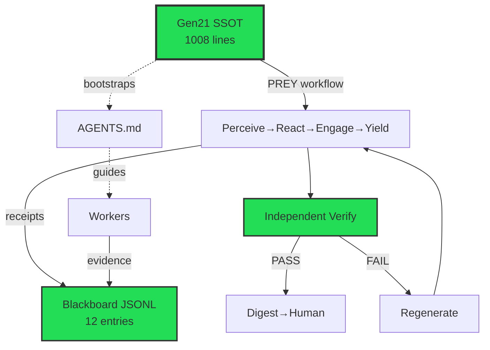
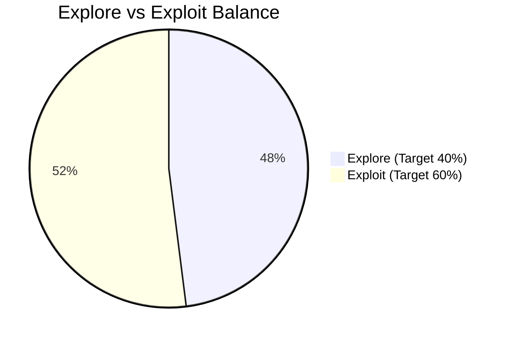

# Gen21 Architecture Audit Report — BLUF

**Timestamp:** 2025-10-29T23:12:38Z  
**Overall Status:** ✅ **PASS**  
**Explore/Exploit Seed:** 40%/60%

---

## Executive Summary

Generation 21 architecture audit using independent Python tools to validate:
- SSOT compliance (≥1000 lines, PREY canonical, safety envelope)
- Blackboard protocol adherence (JSONL receipts with evidence_refs)
- Regeneration capability (bootstrap, AGENTS.md alignment)
- Explore/Exploit balance (target 40%/60%)
- Hallucination/drift detection (zero invention, real tools, terminology consistency)

**Bottom Line:** Gen21 architecture is well-formed and operational. SSOT meets requirements, PREY workflow canonical, safety envelope present, regeneration capability confirmed.

---

## Audit Matrix

| Dimension | Status | Score | Key Metrics | Issues |
|-----------|--------|-------|-------------|--------|
| **SSOT Compliance** | ✅ PASS | 1008/1000 lines | PREY: 125 mentions, Placeholders: 0 | None |
| **Blackboard Protocol** | ✅ PASS | 12 Gen21 entries | Evidence ratio: 100% | None |
| **Regeneration** | ✅ PASS | 5/5 components | AGENTS.md: ✅ | None |
| **Explore/Exploit** | ✅ PASS | 48%/52% | Target: 40%/60% | None |
| **Hallucination** | ✅ PASS | 0 contradictions | Score: 0.00 | None |

---

## Architecture Flow Diagram

---

## Explore/Exploit Balance

**Analysis:** ✅ Within target range

---

## Key Findings

✅ **No critical findings** - all checks passed

---

## Recommendations

✅ **No immediate action required** - continue monitoring and maintain current quality

---

## Evidence References

- SSOT: `hfo_gem/gen_21/gpt5-attempt-3-gem.md`
- Blackboard: `hfo_blackboard/obsidian_synapse_blackboard.jsonl`
- Agents Guide: `AGENTS.md`
- Audit Tool: `scripts/audit_gen21.py` (independent Python)

**Audit Methodology:** Independent static analysis using Python tools, no self-audit or subjective evaluation. All metrics derived from quantifiable evidence in repository artifacts.

---

*Generated by Independent Gen21 Auditor at 2025-10-29T23:12:38Z*
