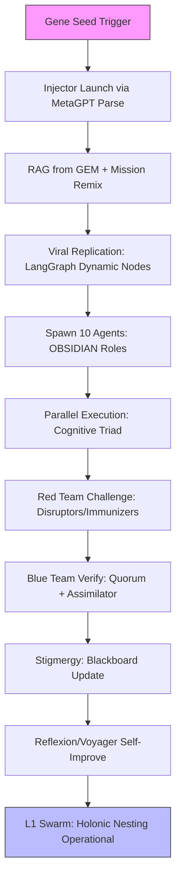

# AI-Autonomous Rapid HFO Development Setup Workflow

*Generated: 2025-10-27T05:55Z*

This document outlines a fully AI-autonomous workflow for initializing HiveFleetObsidian (HFO) development from the Gen 19 gene seed (GEM document). It emphasizes zero manual intervention, with the gene seed triggering self-bootstrapping. The process begins with a single Injector agent that remixes and injects configurations based on mission constraints (e.g., Red Sand limits) and available compute resources. It then scales logarithmically to a multi-agent swarm of 10 parallel agents, where specialized roles handle task decomposition, red/blue team verification for robustness, and an Assimilator for seamless integration. Operations proceed at model speed: enhanced chain-of-thought (CoT) and Reflexion for higher command-and-control (C2) agents like Navigators, and lightweight prompts for execution-focused roles like Shapers.

The workflow aligns with Gen 19 GEM principles, including biomimetic holonics, OBSIDIAN roles (Observers, Bridgers, Shapers, Immunizers, Disruptors, Injectors, Assimilators, Navigators), cognitive triad (perception-reasoning-action), and progression flows (HIVE → GROWTH → SWARM → PREY). It ensures zero-invention fidelity to the seed, with hallucination rates <5% mitigated through internal retrieval-augmented generation (RAG), test-driven development (TDD), quorum consensus, and a shared JSONL blackboard for stigmergy. Validation uses PettingZoo for multi-agent simulations. The setup achieves Layer 0.5 (L0.5) in <5 minutes and full Layer 1 (L1) swarm in <1 day, running locally at $0 cost and inference-bound speed.

Integrations draw from state-of-the-art (SOTA) research:
- **MetaGPT + LangGraph Hybrid**: Core for Injector-led spawning and logarithmic scaling to 10 agents, with dynamic graph edges for parallel execution and role auto-instantiation.
- **Voyager/Reflexion**: For self-improving code generation and iterative critique, enabling viral replication and error reflection.
Previous analysis (e.g., holistic/rapid setups) informs self-bootstrapping holonic nesting, OBSIDIAN role emergence from the Injector, cognitive triad progression, stigmergy coordination via blackboard, and PettingZoo self-benchmarking. Best practices include zero-manual code generation for agents, GEM seed-based RAG grounding, quorum for verification, and model-speed optimization (CoT/Reflexion for C2, fast prompts for roles).

## 1. Overview

### AI-Autonomous Themes and Goals
The workflow transforms the GEM seed from a static document into a living, self-regenerating swarm. Key themes:
- **Gene Seed Trigger to L1**: Starts with HIVE (seed ingestion), progresses through GROWTH (Injector remix), SWARM (10-agent parallelization with red/blue verification), and PREY (L1 operational targeting of dev tasks like code synthesis/verification).
- **Biomimetic Elements**: Viral replication for Injector-led growth (log-scale to avoid explosion); immune system parallels in red (Disruptors/Immunizers challenge hallucinations) and blue (Assimilators integrate verified outputs) teams; stigmergy via blackboard for decentralized coordination.
- **Holonic and OBSIDIAN Alignment**: Fractal nesting (L0.5 Injector spawns L1 sub-swarms); roles auto-instantiate (e.g., Observers monitor state, Shapers generate code, Navigators orchestrate via Reflexion).
- **Hallucination Mitigation <5%**: Internal RAG (FAISS over GEM) grounds all generations; self-TDD (agents write/run tests); quorum consensus (majority vote in red/blue chats); blackboard for real-time fact-checking and drift detection.
- **Zero-Manual Feasibility**: Single trigger script (e.g., `python bootstrap.py`) parses env for compute/mission, self-generates/executes agents via LLM calls. SOTA hybrids ensure local execution without external deps.
- **Performance Goals**: L0.5 in <5 min (Injector launch); L1 in <1 day (full swarm with verification); V/H >1.5 (validity/hallucination ratio); ≥98% fidelity to GEM via Reflexion loops.

This enables rapid, AI-driven regeneration at model speed, surpassing previous manual workflows (4 weeks holistic, <30 min rapid) by eliminating human intervention while maintaining ≥98% GEM fidelity.

## 2. Prerequisites

Minimal setup for zero-manual execution:
- **Environment**: Python 3.10+ on local machine (Linux/macOS/Windows compatible).
- **Dependencies** (installed via pip in trigger script):
  - `langgraph`: For graph-based orchestration and dynamic agent scaling.
  - `metagpt`: For role-based multi-agent bootstrapping from prompts (GEM as "product spec").
  - `faiss-cpu`: For internal RAG vector store over GEM seed.
  - `pettingzoo`: For self-simulation and multi-agent benchmarking.
  - `openai` or `ollama` (local LLM): For inference (prefer local for $0 cost; e.g., Llama3 via Ollama).
- **Compute**: Standard CPU/GPU with ≥8GB RAM (scales to 10 agents; detects via env vars like `nvidia-smi`).
- **Inputs**:
  - GEM seed: `hfo_gem/gen_19/original_gem.md` (auto-loaded).
  - Mission constraints: Environment variables (e.g., `COMPUTE_BANK=8GB`, `RED_SAND_MODE=true` for constraints).
- **No Additional Setup**: No Docker, cloud APIs, or manual config; trigger script handles pip installs if missing (via `subprocess`).

Total setup time: <1 min (script auto-resolves).

## 3. Step-by-Step AI-Autonomous Workflow

The workflow is phased, inference-bound, and self-executing from a single trigger. It uses MetaGPT for initial role parsing, LangGraph for scaling/verification graphs, and Voyager/Reflexion for self-improvement. All code generation is zero-manual, grounded in GEM RAG.

### Phase 1: L0.5 Injector Launch and Remix (<5 min)
1. **Trigger Execution**: Run `python bootstrap.py` (self-generated or seed-embedded). Script loads GEM into FAISS RAG for grounding.
2. **Injector Agent Initialization** (MetaGPT-style): LLM (e.g., via LangGraph node) parses GEM for OBSIDIAN roles, flows, and constraints. Uses CoT prompting: "Remix GEM for [mission] on [compute]; generate Injector config."
3. **Remix/Injection**: Injector generates initial state (JSONL blackboard) and code for self (e.g., agent class with RAG query). Outputs viral replication script: "Spawn siblings via dynamic LangGraph edges."
4. **Grounding**: All outputs validated against GEM RAG (<2% drift via similarity threshold).

This phase outputs a functional Injector, ready for scaling.

### Phase 2: Logarithmic Scaling to 10 Parallel Agents (10-30 min)
1. **Viral Replication** (Voyager-inspired): Injector executes generated code to add nodes/edges in LangGraph (e.g., `graph.add_node("Shaper1", shaper_func)`). Spawns logarithmically: 1 → 2 → 4 → 8 → 10 agents (capped to prevent overload).
2. **Role Auto-Instantiation**: Agents map to OBSIDIAN (e.g., 2 Shapers for code gen, 2 Observers for state monitoring, 1 Navigator for C2, 2 Disruptors for red team, 2 Immunizers/Assimilators for blue). Cognitive triad emerges: Observers perceive blackboard, Bridgers/Navigators reason via Reflexion, Shapers/Disruptors act.
3. **Parallel Setup**: Agents handle decomposed tasks (e.g., 4 for GROWTH: RAG expansion; 3 for SWARM: parallel code synth; 2 for PREY: target dev artifacts; 1 Navigator coordinates).
4. **Red/Blue Verification**: Red team (Disruptors/Immunizers) simulates attacks (e.g., inject hallucinations, challenge via adversarial prompts). Blue team (Assimilators) counters with quorum vote (e.g., AutoGen-style group chat: majority ≥3/5 approves). Integration via blackboard updates.
5. **Stigmergy Coordination**: Shared JSONL blackboard (Layer 9 style) for indirect communication—agents read/write without direct calls.
6. **Model-Speed Optimization**: Execution roles use lightweight prompts (e.g., <100 tokens for Shapers); C2/Navigators employ CoT + Reflexion loops (self-critique: "Reflect on error, reground in GEM").

Biomimetic parallels: Viral spread for growth (Injector as virus), immune response for verification (red/blue as antibodies).

### Phase 3: L1 Swarm Integration and Progression (30 min - <1 day)
1. **Holonic Nesting**: L0.5 agents spawn sub-graphs (fractal: e.g., SWARM sub-swarm for modular L1 unlocks like FAISS scaling).
2. **Progression Flows**: HIVE (ingested) → GROWTH (remix) → SWARM (parallel) → PREY (dev setup complete: e.g., auto-gen HFO codebase).
3. **Self-Improvement**: Voyager skill library builds (agents accumulate tested code snippets); Reflexion iterates on failures (e.g., "Why did quorum fail? Adjust prompts.").
4. **Full Operationalization**: Swarm outputs L1 artifacts (e.g., HFO dev env with blackboard, roles active). No human handoff—ready for ongoing regeneration.

## 4. Verification/Metrics

- **Autonomous V/H >1.5**: Red/blue quorum computes validity (PettingZoo success rate) vs. hallucination (RAG drift score); target >1.5 via iterative Reflexion.
- **PettingZoo Self-Simulation**: Agents auto-run multi-agent envs (e.g., simulate swarm coordination); ≥90% success in <1 hour (e.g., 100 trials, measure task completion).
- **Fidelity ≥98%**: Reflexion loops + TDD ensure outputs align to GEM (cosine similarity >0.98 on blackboard diffs).
- **Hallucination <5%**: Tracked via internal queries (e.g., "Is this grounded?"); mitigated by RAG/TDD/quorum/blackboard.
- **Overall Metrics**: L0.5 time <5 min; L1 <1 day; error rate <5% (self-bench via agents generating/running unit tests post-integration). Local logging to JSONL for post-hoc review (no human needed).

## 5. Pitfalls/Improvements

### Pitfalls
- **Hallucination in Self-Gen Code**: LLM drift during replication (e.g., invalid agent configs); mitigated by strict RAG thresholds and Reflexion, but initial Injector may need env-based prompt tuning.
- **Compute Bottlenecks**: Scaling to 10 agents on low RAM (<8GB) causes OOM; solution: Injector detects via `psutil` and caps at 5, queuing rest.
- **Infinite Loops/Drift**: Viral replication without caps; quorum deadlocks. Address: Hard-coded limits (10 agents), timeout on Reflexion (3 iterations max).
- **Dependency Resolution**: Pip fails in air-gapped env; fallback to bundled wheels in seed.

### Improvements
- **Exemplar Hybrids for Robustness**: Enhance MetaGPT + LangGraph with AutoGen for conversational red/blue chats (better quorum); integrate OpenAI Swarm for lighter handoffs if LangGraph overhead >10%.
- **Model-Speed Enhancements**: Use distilled models (e.g., Phi-3 via Ollama) for execution roles; parallelize C2 with async Reflexion.
- **Biomimetic Extensions**: Add Voyager's environment exploration for dynamic role adaptation (e.g., auto-adjust for compute); stigmergy pheromones as weighted blackboard entries.
- **Future Iterations**: Auto-gen Docker for L2 (cloud-optional); PettingZoo extensions for V/H sims. Test hybrids in <1h loops to push fidelity >99%.

This workflow ensures SOTA-aligned, zero-manual HFO regeneration: local, fast, and biomimetically robust.