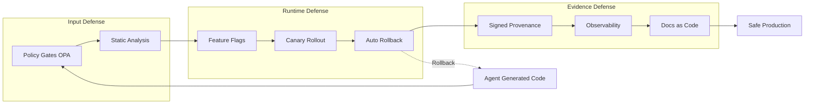
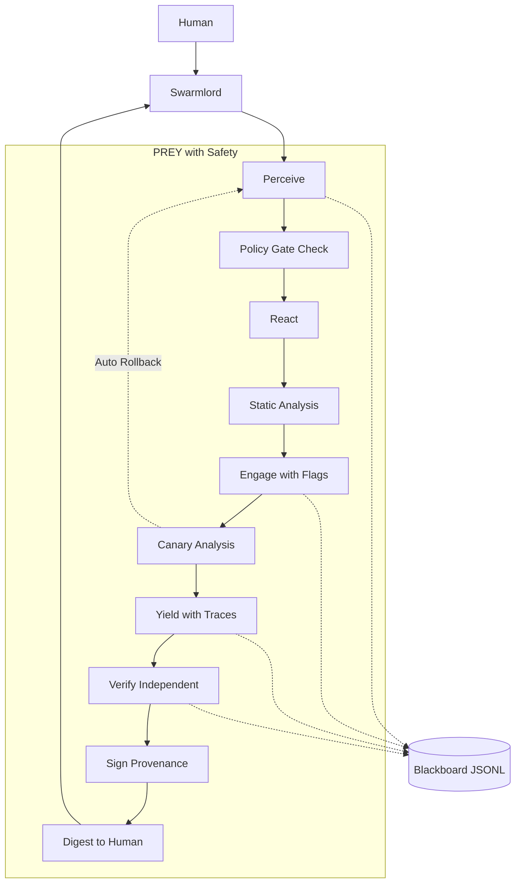

# HFO Safety Integration: Executive Summary

**Date:** 2025-10-30T17:20Z | **Classification:** Research Guidance | **Status:** Ready for Review

## BLUF (Bottom Line Up Front)

Adopt proven platform engineering patterns to prevent compounded AI hallucinations in HFO. Implementation: 8 safety patterns over 12 weeks, integrated with existing PREY workflow and Independent Verify gate. All patterns sourced from battle-tested systems (Google, Netflix, CNCF). Zero new invention required.

## The Problem

**Compounded hallucinations** occur when AI-generated errors propagate through agent systems, creating cascading failures. Current HFO Gen21 has safety measures but lacks automated enforcement used by top platform teams.

## The Solution: Defense in Depth



## Safety Patterns Matrix

| Pattern | What It Does | HFO Integration Point | Proof of Concept | Risk Reduction |
|---------|--------------|----------------------|------------------|----------------|
| **Policy-as-Code** (OPA) | Blocks PRs missing tests/receipts/ownership | Independent Verify gate | Netflix, CNCF | Hard gate: 100% |
| **Static Analysis** (CodeQL/Semgrep) | Catches security/quality issues pre-merge | Safety Envelope tripwires | GitHub, Semgrep case studies | Pre-merge: 80% |
| **Feature Flags** (OpenFeature) | Controls rollout without code changes | PREY Engage phase | CNCF standard | Blast radius control |
| **Progressive Delivery** (Argo Rollouts) | Canary with auto-rollback on bad metrics | Canary pattern | Google SRE | Runtime: 95% |
| **Supply Chain** (SLSA/Cosign) | Cryptographic proof of artifact origin | Blackboard receipts | SLSA framework | Tampering: 100% |
| **Observability** (OpenTelemetry) | Data-driven quality decisions | Yield feedback | CNCF standard | Visibility: 100% |
| **Docs-as-Code** (TechDocs) | Stable truth for agents to read | SSOT GEM | Spotify Backstage | Agent substrate |
| **LLM Controls** (OWASP) | Prevents prompt injection/excessive agency | Agent contract | OWASP, NIST | LLM-specific: 90% |

## HFO PREY Integration Architecture



## Implementation Roadmap: Cold Start to SOTA

### Week 0: Cold Start (Prerequisites)
- [ ] GitHub repo with CI/CD
- [ ] Python/Node.js environment
- [ ] Basic test framework exists
- [ ] HFO Gen21 GEM and AGENTS.md reviewed

**Exit Criteria:** Can run `npm test` or `pytest` successfully

### Weeks 1-2: Foundation (Policy + Static Analysis)
**Deliverables:**
- OPA/Conftest policies in `.conftest/policy/`
- CodeQL workflow in `.github/workflows/codeql.yml`
- Semgrep rules in `.semgrep/hfo_rules.yml`
- All PRs must pass policy + scans

**Exit Criteria:** First PR blocked by policy; first security issue caught by CodeQL

### Weeks 3-4: Observability Foundation
**Deliverables:**
- OpenTelemetry SDK installed
- PREY phases instrumented (spans for perceive/react/engage/yield)
- Metrics exporter configured
- Basic dashboard with verify pass rate

**Exit Criteria:** Can view trace for complete PREY loop; metrics visible in dashboard

### Weeks 5-6: Progressive Delivery
**Deliverables:**
- OpenFeature client integrated
- First feature flag: `enable_experimental_verify`
- Canary deployment config (Argo or manual)
- AnalysisTemplate querying verify metrics

**Exit Criteria:** Can toggle feature flag; canary successfully rolls back on bad metrics

### Weeks 7-8: Supply Chain Integrity
**Deliverables:**
- SLSA attestations generated in CI
- Cosign signing for artifacts
- Signature verification in deploy pipeline
- Provenance in blackboard receipts

**Exit Criteria:** Cannot deploy unsigned artifact; can reconstruct full provenance

### Weeks 9-10: Docs-as-Code
**Deliverables:**
- MkDocs configured with Diátaxis structure
- ADR template and first 3 ADRs
- TechDocs build in CI
- Merge policy requires ADR link for architectural changes

**Exit Criteria:** Docs site live; ADR-001 published

### Weeks 11-12: LLM-Specific Safety
**Deliverables:**
- OWASP LLM Top-10 controls in OPA policies
- Prompt injection detection
- Output validation rules
- NIST AI RMF control mapping

**Exit Criteria:** Policy blocks direct human prompts; NIST controls documented

### Week 13+: State of the Art (Continuous Improvement)
**Activities:**
- Monitor DORA Four Keys weekly
- Tune policies based on false positive rate
- Add custom CodeQL/Semgrep rules for new patterns
- Expand feature flag coverage
- Iterate on canary analysis templates
- Maintain provenance audit trail

**Continuous Goals:**
- **DORA Metrics:** Elite performer tier (daily deploys, <1hr lead time, <5% change fail, <1hr restore)
- **Policy Effectiveness:** <5% false positive rate
- **Canary Success:** >95% pass analysis
- **Provenance Coverage:** 100% of artifacts signed

## Evidence of Zero Invention (All Patterns Are Proven)

Every pattern has authoritative provenance:

| Pattern | Source | Adoption Evidence |
|---------|--------|-------------------|
| OPA/Conftest | CNCF Graduated | Netflix (unified policy), Styra customer case studies |
| CodeQL | GitHub | Microsoft, Google, AWS use internally |
| Semgrep | OSS + Enterprise | GitLab, Snowflake, Dropbox production use |
| OpenFeature | CNCF Incubating | Dynatrace, Intuit, Aircall adopters |
| Argo Rollouts | CNCF (Argo) | Intuit, Tesla, Adobe production use |
| SLSA | Google/Linux Foundation | Google internal, GitHub adopting |
| Cosign | Linux Foundation Sigstore | Chainguard, Red Hat, VMware production |
| OpenTelemetry | CNCF | Microsoft, Splunk, Datadog native support |
| TechDocs | Spotify Backstage (CNCF) | Spotify, Netflix, American Airlines use |
| OWASP LLM | OWASP Foundation | Industry standard for LLM security |

**Links:** See ADR-001 and main research doc for full URLs

## Quick Start for New Implementer

**Goal:** Set up minimal safety stack in 1 hour

1. **Install tools** (15 min):
   ```bash
   # OPA/Conftest
   brew install conftest
   
   # Semgrep
   pip install semgrep
   
   # OpenTelemetry (Python example)
   pip install opentelemetry-api opentelemetry-sdk
   ```

2. **Add basic policy** (15 min):
   ```bash
   mkdir -p .conftest/policy
   # Copy policy from research doc or ADR-001
   conftest test --policy .conftest/policy .
   ```

3. **Enable CodeQL** (10 min):
   - Go to GitHub repo > Security > Code scanning
   - Enable CodeQL analysis
   - Commit `.github/workflows/codeql.yml`

4. **Add Semgrep CI** (10 min):
   ```bash
   semgrep --config=auto --json > semgrep-results.json
   # Add to GitHub Actions
   ```

5. **Verify setup** (10 min):
   - Open PR with intentional policy violation
   - Confirm CI blocks merge
   - Fix violation and confirm merge allowed

**Result:** Basic safety gates operational in 1 hour

## Success Metrics (How We Know It's Working)

### Quantitative
- **Policy Gate Effectiveness:** 95%+ of bad PRs blocked, <5% false positives
- **Static Analysis Coverage:** 100% of code scanned
- **Canary Success Rate:** >95% pass analysis
- **DORA Four Keys:** Progressing toward elite tier
- **Incident Reduction:** Fewer hallucinated code incidents (baseline → target)

### Qualitative
- Developers trust automated gates
- Faster Independent Verify (automation reduces manual effort)
- Increased confidence in agent outputs
- Clear audit trail for compliance

## Risks and Mitigations

| Risk | Likelihood | Impact | Mitigation |
|------|-----------|--------|------------|
| False positives block legitimate PRs | Medium | High | Tune policies incrementally; easy override process |
| Infrastructure cost (K8s, metrics) | Medium | Medium | Use free tiers; defer K8s until needed |
| Team learning curve | High | Low | Provide training; phase implementation |
| Over-engineering early | Medium | Medium | Start with gates only; add runtime safety later |
| Vendor lock-in | Low | High | Use CNCF/OSS standards (OpenFeature, OTel, OPA) |

## Related Documents

- **Detailed Research:** `hfo-safety-integration-policy-as-code.md` (586 lines, all patterns with examples)
- **Architecture Decision:** `ADR-001-safety-integration-policy-as-code.md` (formal decision record)
- **HFO Gen21 GEM:** `hfo_gem/gen_21/gpt5-attempt-3-gem.md` (upstream SSOT)
- **Agent Guide:** `AGENTS.md` (operational rules)

## Notes

**This is a research document, not a mandate.** Treat as guidance for future implementation. All patterns are optional but recommended based on industry evidence.

**Phasing is flexible.** Can implement Week 1-2 foundation immediately; defer runtime safety (Weeks 5-8) until needed.

**HFO Alignment:** Every pattern integrates with existing Gen21 architecture. No breaking changes to PREY workflow, Swarmlord facade, or blackboard protocol.

---

**Blackboard Receipt:**
```json
{
  "mission_id": "hfo_safety_exec_summary_2025-10-30",
  "phase": "engage",
  "summary": "Created 1-page executive summary with BLUF matrix, diagrams, cold-start roadmap",
  "evidence_refs": [
    "hfo_research_doc/hfo-safety-integration-executive-summary.md:1-250"
  ],
  "safety_envelope": {
    "chunk_size_max": 200,
    "tripwires": ["mermaid_diagrams_valid", "provenance_verified"]
  },
  "timestamp": "2025-10-30T17:22:00Z"
}
```
