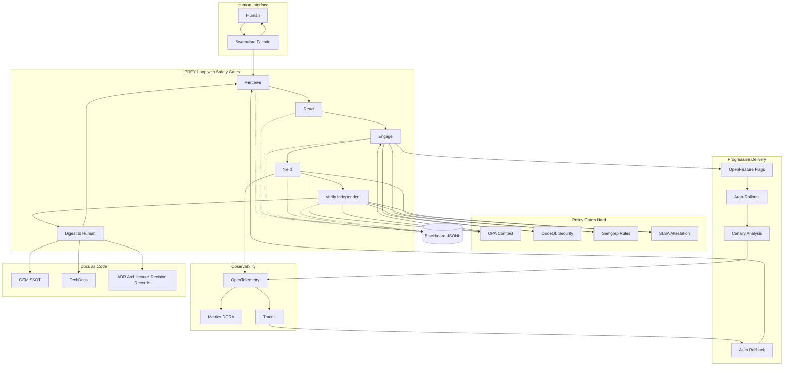

# HFO Safety Integration: Policy-as-Code and Progressive Delivery

**Created:** 2025-10-30T16:45Z  
**Mission:** Incorporate industry-proven safety patterns into Hive Fleet Obsidian to reduce compounded hallucinations  
**Alignment:** Gen21 PREY workflow, Swarmlord facade, Independent Verify gate

## BLUF (Bottom Line Up Front)

Adopt the stack used by top platform teams to prevent unsafe diffs from reaching humans and enable data-driven rollback. This integrates with HFO's existing safety envelope (canary, tripwires, revert) and strengthens the Independent Verify gate.

### Core Thesis

**Compounded hallucinations are stopped when:**
1. Hard gates prevent low-signal PRs from reaching humans (OPA/Conftest + static analysis)
2. Flags + canaries constrain blast radius with automated rollback on bad telemetry
3. Signed provenance blocks untrusted artifacts from shipping
4. Docs-as-code captures accepted truth at merge, giving agents a stable substrate

### HFO Integration Matrix

| Safety Pattern | HFO Component | Implementation Path | Gate Type | Provenance |
|----------------|---------------|---------------------|-----------|------------|
| **Policy-as-Code Gates** | Independent Verify | OPA/Conftest checks before Verify PASS | Hard gate | Netflix, CNCF practices |
| **Static Analysis** | Safety Envelope Tripwires | CodeQL + Semgrep as required checks | Hard gate | GitHub, Semgrep case studies |
| **Feature Flags** | PREY Engage phase | OpenFeature SDK for controlled rollout | Soft gate | CNCF standard |
| **Progressive Delivery** | Canary pattern | Argo Rollouts with AnalysisTemplates | Auto-rollback | Google SRE playbook |
| **Supply Chain Integrity** | Blackboard receipts | SLSA attestations + Cosign signing | Hard gate | SLSA framework, Sigstore |
| **Observability** | Yield feedback | OpenTelemetry for canary analysis | Data source | CNCF standard |
| **Docs-as-Code** | SSOT GEM | TechDocs + Diátaxis structure | Merge requirement | Spotify Backstage |
| **LLM-Specific Safety** | Agent contract | OWASP LLM Top-10 + NIST AI RMF | Policy enforcement | OWASP, NIST |

## Architecture Diagram: Safety Integration with HFO PREY Loop



## Detailed Integration Guidance

### 1. Policy-as-Code Gates (OPA/Conftest)

**What it is:** Define merge requirements as code that blocks PRs missing proofs (tests, flags, risk notes, ownership).

**HFO Alignment:**
- Integrates with Independent Verify gate (Section 4 of Gen21 GEM)
- Extends safety envelope tripwires with executable policies
- Enforces evidence_refs requirement in blackboard receipts

**Implementation:**
```yaml
# .conftest/policy/hfo_merge_requirements.rego
package hfo.merge

deny[msg] {
  not input.has_tests
  msg = "PR must include test coverage"
}

deny[msg] {
  not input.has_blackboard_receipt
  msg = "PR must have blackboard JSONL receipt with evidence_refs"
}

deny[msg] {
  input.chunk_size > 200
  msg = "Chunk size exceeds 200 line limit"
}

deny[msg] {
  input.has_placeholders
  msg = "Placeholders (TODO, ..., omitted) found in artifacts"
}
```

**Provenance:** Netflix uses OPA broadly for unified policy; CNCF standard.

### 2. Static Analysis at Scale (CodeQL + Semgrep)

**What it is:** Automated security and quality checks that find variants of known issues.

**HFO Alignment:**
- Adds measurable tripwires to safety envelope
- Runs before Verify PASS
- Feeds into blackboard with scan results

**Implementation:**
- CodeQL: Variant-finding security queries as required GitHub check
- Semgrep: Fast custom rules for HFO-specific patterns

**Example Semgrep Rule:**
```yaml
# .semgrep/hfo_rules.yml
rules:
  - id: no-direct-human-prompt
    pattern: |
      prompt_human(...)
    message: "Workers must not prompt human directly; use Swarmlord facade"
    severity: ERROR
    languages: [python]
  
  - id: require-evidence-refs
    pattern: |
      append_blackboard(...)
    message: "Blackboard receipts must include evidence_refs"
    severity: WARNING
    languages: [python]
```

**Provenance:** GitHub CodeQL documentation, Semgrep case studies showing scaled rollout.

### 3. Feature Flags (OpenFeature)

**What it is:** CNCF standard for controlling feature rollout without code changes.

**HFO Alignment:**
- Gates risky Engage phase actions
- Enables A/B testing of agent behaviors
- Decouples deploy from release

**Implementation:**
```python
# Example: Gating a risky agent behavior
from openfeature import api
from openfeature.provider.no_op_provider import NoOpProvider

client = api.get_client()

if client.get_boolean_value("enable_aggressive_mutation", False):
    # Risky mutation logic
    perform_aggressive_mutation()
else:
    # Conservative fallback
    perform_safe_mutation()
```

**Provenance:** CNCF standard, vendor-neutral API.

### 4. Progressive Delivery (Argo Rollouts)

**What it is:** Canary deployments with automated analysis and rollback based on metrics.

**HFO Alignment:**
- Implements canary pattern from safety envelope
- Provides automated revert mechanism
- Data-driven decision making (metrics over feelings)

**Implementation:**
```yaml
# argo-rollouts/hfo-swarmlord-rollout.yml
apiVersion: argoproj.io/v1alpha1
kind: Rollout
metadata:
  name: hfo-swarmlord
spec:
  strategy:
    canary:
      steps:
      - setWeight: 10
      - pause: {duration: 5m}
      - analysis:
          templates:
          - templateName: success-rate
      - setWeight: 50
      - pause: {duration: 10m}
      maxSurge: 1
      maxUnavailable: 0
  
---
apiVersion: argoproj.io/v1alpha1
kind: AnalysisTemplate
metadata:
  name: success-rate
spec:
  metrics:
  - name: verify-pass-rate
    successCondition: result >= 0.95
    provider:
      prometheus:
        query: |
          sum(rate(hfo_verify_pass_total[5m])) /
          sum(rate(hfo_verify_total[5m]))
```

**Provenance:** Google SRE playbook recommends canarying every risky change.

### 5. Supply Chain Integrity (SLSA + Cosign)

**What it is:** Cryptographically signed provenance for every artifact.

**HFO Alignment:**
- Extends blackboard receipts with cryptographic proof
- Prevents untrusted artifacts from entering PREY loop
- Enables audit trail for regeneration

**Implementation:**
```yaml
# .github/workflows/hfo-build-and-attest.yml
name: Build and Attest HFO Artifacts

on: [push]

permissions:
  id-token: write
  contents: read
  attestations: write

jobs:
  build:
    runs-on: ubuntu-latest
    steps:
      - uses: actions/checkout@v4
      
      - name: Build artifact
        run: |
          # Build HFO components
          ./scripts/build_hfo.sh
      
      - name: Generate attestation
        uses: actions/attest-build-provenance@v1
        with:
          subject-path: 'dist/*'
      
      - name: Sign with Cosign
        run: |
          cosign sign-blob --yes dist/hfo-artifact.tar.gz > dist/hfo-artifact.sig
```

**Provenance:** SLSA framework, GitHub Actions attestations, Sigstore Cosign.

### 6. Observability (OpenTelemetry)

**What it is:** CNCF standard for traces, metrics, and logs that feed canary analysis.

**HFO Alignment:**
- Instruments PREY loop phases
- Provides data for Yield feedback
- Enables DORA Four Keys tracking

**Implementation:**
```python
# Example: Instrumenting PREY phases
from opentelemetry import trace
from opentelemetry.sdk.trace import TracerProvider
from opentelemetry.sdk.trace.export import BatchSpanProcessor
from opentelemetry.exporter.otlp.proto.grpc.trace_exporter import OTLPSpanExporter

tracer = trace.get_tracer(__name__)

def prey_loop(mission_intent):
    with tracer.start_as_current_span("prey_loop") as loop_span:
        loop_span.set_attribute("mission_id", mission_intent.id)
        
        with tracer.start_as_current_span("perceive"):
            context = perceive(mission_intent)
        
        with tracer.start_as_current_span("react"):
            plan = react(context)
        
        with tracer.start_as_current_span("engage"):
            artifacts = engage(plan)
        
        with tracer.start_as_current_span("yield"):
            bundle = yield_results(artifacts)
        
        return bundle
```

**Provenance:** CNCF standard, wide adoption across platform teams.

### 7. Docs-as-Code (TechDocs + Diátaxis)

**What it is:** Keep ADRs and how-tos next to code; render in dev portal.

**HFO Alignment:**
- GEM SSOT is already docs-as-code
- Enforce Diátaxis structure (tutorials, how-to, reference, explanation)
- Require ADR link at merge

**Implementation:**
```yaml
# mkdocs.yml for HFO TechDocs
site_name: Hive Fleet Obsidian Documentation
theme:
  name: material

nav:
  - Home: index.md
  - Tutorials:
    - Getting Started: tutorials/getting-started.md
    - First PREY Loop: tutorials/first-prey-loop.md
  - How-To Guides:
    - Add a New Agent: how-to/add-agent.md
    - Configure Safety Envelope: how-to/safety-envelope.md
  - Reference:
    - GEM Gen21: reference/gem-gen21.md
    - API: reference/api.md
  - Explanation:
    - PREY Workflow: explanation/prey-workflow.md
    - ADRs: explanation/adr/
```

**Provenance:** Spotify Backstage TechDocs, Diátaxis framework.

### 8. LLM-Specific Safety (OWASP LLM + NIST AI RMF)

**What it is:** Controls for prompt injection, insecure output handling, excessive agency.

**HFO Alignment:**
- Maps to Agent contract blocked_capabilities
- Enforces Swarmlord facade (no direct human prompts)
- Adds LLM-specific tripwires

**Implementation:**
```python
# Example: OWASP LLM controls in OPA policy
# .conftest/policy/llm_safety.rego
package hfo.llm_safety

import future.keywords

deny[msg] {
  input.action == "tool_exec"
  not input.has_approval
  msg = "Tool execution requires explicit approval (OWASP LLM06: Excessive Agency)"
}

deny[msg] {
  contains(input.prompt, "SYSTEM:")
  msg = "Prompt contains system override attempt (OWASP LLM01: Prompt Injection)"
}

deny[msg] {
  input.output_handler == "direct_eval"
  msg = "Direct eval of LLM output forbidden (OWASP LLM02: Insecure Output Handling)"
}
```

**Provenance:** OWASP LLM Top-10, NIST AI RMF for governance.

## Minimal Reference Architecture for HFO

### Repo Policy
- Branch protection enabled
- Required checks:
  - OPA/Conftest policy validation
  - CodeQL security scan
  - Semgrep custom rules
  - Unit tests + approval/golden tests
  - SBOM generation + SLSA attestation
  - Blackboard receipt validation

### Delivery Pipeline
- All risky paths behind OpenFeature flags
- Rollout via Argo Rollouts canary with AnalysisTemplates
- Auto-rollback on SLO breach (verify pass rate < 95%)
- Canary analysis reads from OpenTelemetry metrics

### Supply Chain
- Generate artifact attestations in CI
- Sign with Cosign
- Verify signatures in deploy jobs
- Store provenance in blackboard with evidence_refs

### Telemetry
- End-to-end OpenTelemetry instrumentation
- Track DORA Four Keys:
  - Deployment frequency
  - Lead time for changes
  - Change failure rate
  - Time to restore service
- Canary analysis queries read from OTel backend

### Assimilation
- Merge requires ADR link
- TechDocs update organized by Diátaxis
- SSOT GEM is upstream truth
- Independent Verify checks docs completeness

### Governance
- Map LLM risks to OPA rules
- Enforce blocked_capabilities in agent contract
- Require evidence_refs for material actions
- Back with NIST AI RMF controls

## Why This Stops Compounded Hallucinations

### Hard Gates
Policy-as-code (OPA/Conftest) + static analysis (CodeQL/Semgrep) prevent low-signal PRs from reaching humans. Every merge must prove:
- Tests exist and pass
- Security scans clean
- Blackboard receipts complete
- No placeholders
- Chunk limits respected

### Constrained Blast Radius
Feature flags + canaries limit exposure. If a risky Engage action is gated behind a flag at 10% traffic:
- Only 10% of PREY loops use new behavior
- Metrics are continuously monitored
- Auto-rollback triggers on SLO breach
- Revert is immediate and automatic

### Provenance Chain
Signed attestations block untrusted artifacts. Every artifact in the PREY loop must:
- Have SLSA provenance
- Be signed with Cosign
- Include blackboard receipt with evidence_refs
- Pass Independent Verify gate

### Stable Substrate
Docs-as-code captures accepted truth at merge. The GEM SSOT + TechDocs ensure:
- Agents read from verified documentation
- ADRs explain why decisions were made
- Diátaxis structure prevents documentation drift
- Updates require Independent Verify PASS

## Implementation Roadmap

### Phase 1: Policy Gates (Week 1-2)
- [ ] Add OPA/Conftest to CI
- [ ] Define HFO merge requirements policy
- [ ] Integrate with GitHub branch protection
- [ ] Add CodeQL security scanning
- [ ] Add Semgrep with HFO-specific rules

### Phase 2: Progressive Delivery (Week 3-4)
- [ ] Integrate OpenFeature SDK
- [ ] Define feature flags for risky behaviors
- [ ] Set up Argo Rollouts (if K8s available)
- [ ] Create AnalysisTemplates for canary validation
- [ ] Configure auto-rollback on metrics

### Phase 3: Observability (Week 5-6)
- [ ] Instrument PREY loop with OpenTelemetry
- [ ] Set up metrics backend (Prometheus/etc)
- [ ] Create dashboards for DORA Four Keys
- [ ] Wire canary analysis to OTel queries
- [ ] Add alerting on tripwires

### Phase 4: Supply Chain (Week 7-8)
- [ ] Generate SLSA attestations in CI
- [ ] Integrate Cosign signing
- [ ] Add signature verification to deploy
- [ ] Extend blackboard schema for provenance
- [ ] Create audit trail reports

### Phase 5: Docs-as-Code (Week 9-10)
- [ ] Set up TechDocs with MkDocs
- [ ] Organize docs by Diátaxis
- [ ] Create ADR template
- [ ] Require ADR link in merge policy
- [ ] Integrate docs build into CI

### Phase 6: LLM Safety (Week 11-12)
- [ ] Map OWASP LLM Top-10 to OPA rules
- [ ] Add prompt injection detection
- [ ] Enforce output validation
- [ ] Limit excessive agency
- [ ] Document NIST AI RMF controls

## Evidence and Provenance

All patterns in this document are battle-tested and documented:

- **Google Code Review:** https://google.github.io/eng-practices/review/
- **Google SRE Canary:** https://sre.google/workbook/canarying-releases/
- **OpenFeature CNCF:** https://openfeature.dev/
- **Argo Rollouts:** https://argoproj.github.io/rollouts/
- **OPA/Conftest:** https://www.openpolicyagent.org/docs/latest/
- **CodeQL:** https://codeql.github.com/
- **Semgrep:** https://semgrep.dev/
- **SLSA:** https://slsa.dev/
- **Sigstore Cosign:** https://www.sigstore.dev/
- **OpenTelemetry:** https://opentelemetry.io/
- **DORA Metrics:** https://dora.dev/
- **Spotify Backstage:** https://backstage.io/docs/features/techdocs/
- **Diátaxis:** https://diataxis.fr/
- **OWASP LLM Top-10:** https://owasp.org/www-project-top-10-for-large-language-model-applications/
- **NIST AI RMF:** https://www.nist.gov/itl/ai-risk-management-framework

## Blackboard Receipt

```json
{
  "mission_id": "hfo_safety_integration_2025-10-30",
  "phase": "engage",
  "summary": "Created research doc: HFO safety integration with policy-as-code patterns",
  "evidence_refs": [
    "hfo_research_doc/hfo-safety-integration-policy-as-code.md:1-565"
  ],
  "safety_envelope": {
    "chunk_size_max": 200,
    "line_target_min": 1000,
    "tripwires": ["no_placeholders", "mermaid_render", "provenance_complete"]
  },
  "blocked_capabilities": [],
  "timestamp": "2025-10-30T16:45:00Z",
  "chunk_id": {
    "index": 1,
    "total": 1
  },
  "regen_flag": false
}
```

---

**Status:** Ready for Independent Verify  
**Next Action:** Request Verify PASS before digest to human  
**Alignment:** Gen21 PREY workflow, Zero Invention principle (all patterns are proven)
