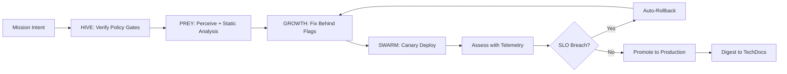
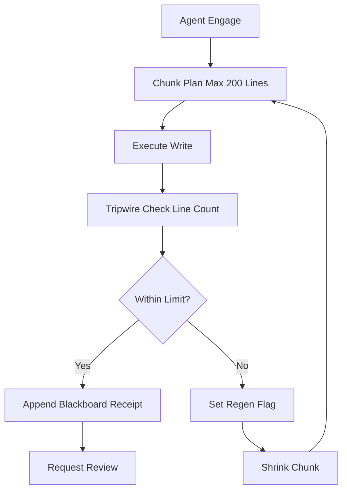
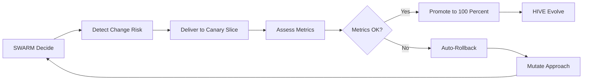
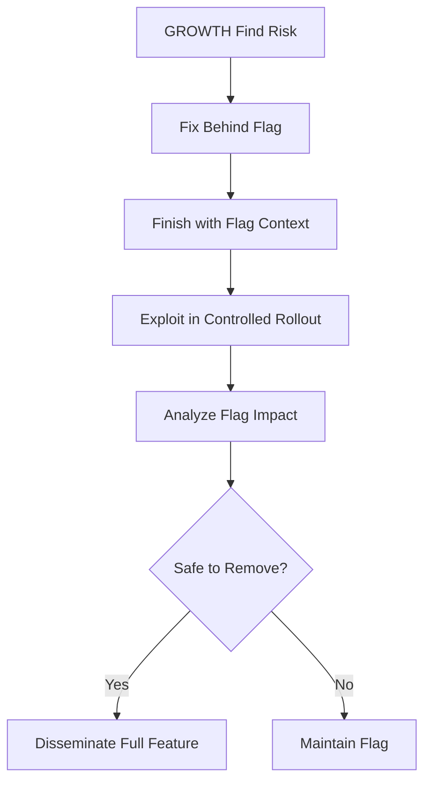
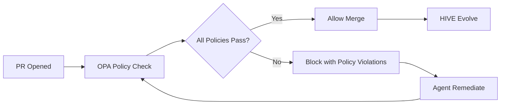
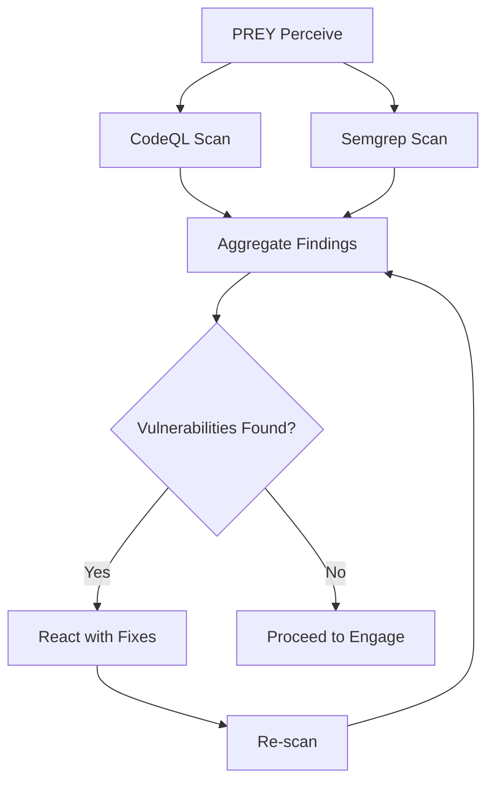
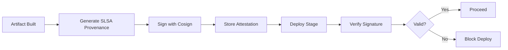
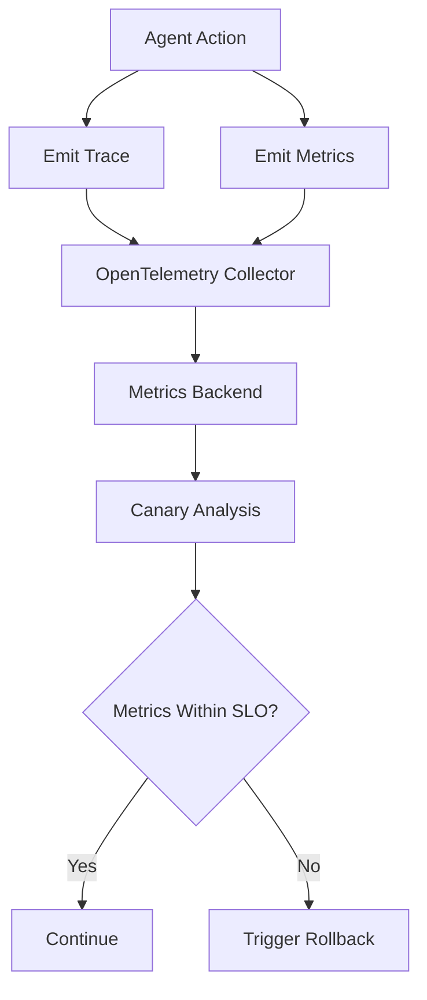
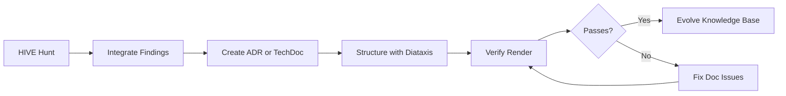
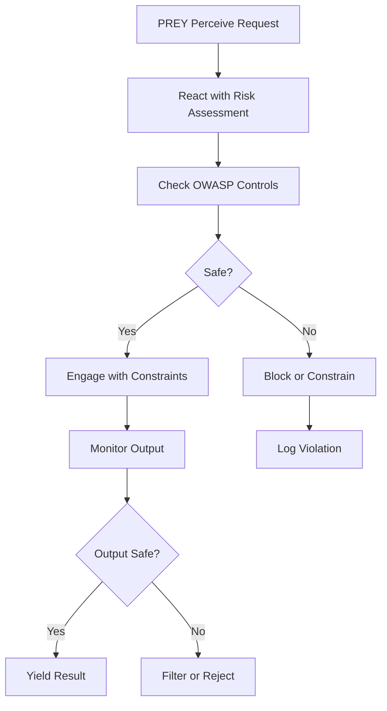

# Platform Engineering Patterns Integration for HFO

## BLUF (Bottom Line Up Front)
This document outlines how to incorporate proven platform engineering patterns into Hive Fleet Obsidian (HFO) to prevent compounded hallucinations and enable safe, automated AI-driven development. Key recommendation: Adopt policy-as-code gates, progressive delivery, feature flags, static analysis, supply-chain integrity, observability, and docs-as-code patterns used by top platform teams at Google, Netflix, and CNCF projects. These patterns map directly to HFO's HIVE/GROWTH/SWARM/PREY workflows and support the Gen21 architecture's safety envelope and verification gates.

### Comparison Matrix: Pattern Adoption for HFO

| Pattern | HFO Workflow Mapping | Implementation Tool | Priority | Hallucination Prevention Impact |
|---------|---------------------|---------------------|----------|--------------------------------|
| Code Review + Small Diffs | PREY (Engage) | GitHub Actions | High | High (surgical changes only) |
| Progressive Delivery | SWARM (Deliver + Assess) | Argo Rollouts | High | High (canary + auto-rollback) |
| Feature Flags | GROWTH (Fix + Finish) | OpenFeature | High | High (blast radius control) |
| Policy-as-Code Gates | HIVE (Verify) | OPA/Conftest | Critical | Critical (blocks unsafe PRs) |
| Static Analysis | PREY (Perceive) | CodeQL + Semgrep | Critical | High (variant detection) |
| Supply-Chain Integrity | GROWTH (Disseminate) | SLSA + Cosign | Medium | Medium (trusted artifacts) |
| Observability | SWARM (Assess) | OpenTelemetry | High | High (data-driven rollback) |
| Docs-as-Code | HIVE (Integrate) | Backstage TechDocs | Medium | Medium (stable substrate) |
| LLM-Specific Safety | PREY (React) | OWASP LLM + NIST AI RMF | Critical | Critical (agent controls) |

### High-Level Integration Workflow



## 1. Code Review + Small Diffs

### Industry Exemplar
Google's Engineering Practices guide emphasizes incremental changes and focused code reviews to reduce cognitive load and error rates.

### HFO Mapping
- **Workflow**: PREY (Engage phase)
- **Implementation**: Enforce chunk limits (≤200 lines per write) as defined in AGENTS.md
- **Tools**: GitHub Actions with automated chunk size validation

### Integration Pattern



### Actionable Steps
1. Add pre-commit hook to enforce 200-line chunk limit
2. Configure GitHub branch protection to require chunk validation
3. Create GitHub Actions workflow to validate PR diff sizes
4. Log chunk size to blackboard JSONL receipts

### Evidence Requirement
- Blackboard receipt with chunk_id and line_count in safety_envelope
- GitHub Actions check passing with chunk size metrics

## 2. Progressive Delivery by Default

### Industry Exemplar
Google SRE practices require canarying all risky changes; production confidence comes from real traffic on a small slice before full rollout.

### HFO Mapping
- **Workflow**: SWARM (Deliver + Assess + Mutate)
- **Implementation**: Deploy changes behind canary gates with automated metrics-based promotion
- **Tools**: Argo Rollouts with AnalysisTemplates

### Integration Pattern



### Actionable Steps
1. Define canary analysis templates for HFO metrics (success rate, latency, error rate)
2. Create Kubernetes manifests with Argo Rollouts for HFO components
3. Configure automated rollback on SLO breach (e.g., error rate >1%)
4. Integrate with OpenTelemetry for real-time metrics

### Evidence Requirement
- Canary deployment manifest in repo
- AnalysisTemplate with HFO-specific metrics
- Blackboard receipt showing canary assessment results

## 3. Feature Flags as Standard Interface

### Industry Exemplar
OpenFeature provides CNCF-standard flag management, avoiding vendor lock-in and enabling consistent flag behavior across services.

### HFO Mapping
- **Workflow**: GROWTH (Fix + Finish)
- **Implementation**: All risky code paths behind flags; inject capability flags into agent context
- **Tools**: OpenFeature SDK with LaunchDarkly or Flagsmith backend

### Integration Pattern



### Actionable Steps
1. Add OpenFeature SDK to HFO agent runtime
2. Define capability flags (e.g., `hfo.agent.network_access`, `hfo.agent.npm_install`)
3. Map blocked_capabilities from blackboard to flag evaluations
4. Create flag management workflow for gradual rollout

### Evidence Requirement
- Flag evaluation logged in blackboard receipts
- Flag configuration stored in repo (flags.yaml)
- Capability gating enforced in agent contract

## 4. Policy-as-Code Gates in CI

### Industry Exemplar
Netflix and major cloud providers use Open Policy Agent (OPA) to enforce unified policies across infrastructure and application deployments.

### HFO Mapping
- **Workflow**: HIVE (Verify)
- **Implementation**: Block merges that lack required proofs (tests, flags, receipts, ownership)
- **Tools**: OPA/Conftest as required GitHub Actions check

### Integration Pattern



### Actionable Steps
1. Define OPA policies for HFO requirements:
   - Must have blackboard receipt with evidence_refs
   - Must respect chunk size limits
   - Must not contain placeholders (TODO, etc.)
   - Must have corresponding mission_intent reference
2. Create Conftest configuration file
3. Add OPA check to GitHub Actions workflow
4. Generate policy violation reports

### Example OPA Policy
```rego
package hfo.blackboard

deny[msg] {
  not input.evidence_refs
  msg = "Blackboard receipt must include evidence_refs array"
}

deny[msg] {
  input.safety_envelope.chunk_size_max > 200
  msg = "Chunk size must not exceed 200 lines"
}
```

### Evidence Requirement
- OPA policy files in repo (.rego)
- GitHub Actions check showing policy evaluation
- Policy compliance logged in blackboard

## 5. Static Analysis at Scale

### Industry Exemplar
GitHub's own security team uses CodeQL for variant-finding queries; Semgrep enables fast custom rules at scale.

### HFO Mapping
- **Workflow**: PREY (Perceive)
- **Implementation**: Scan all code changes for security vulnerabilities and pattern violations before execution
- **Tools**: CodeQL + Semgrep as required checks

### Integration Pattern



### Actionable Steps
1. Configure CodeQL scanning for Python, JavaScript, and other HFO languages
2. Create custom Semgrep rules for HFO-specific patterns:
   - Detect placeholder patterns (TODO, ..., omitted)
   - Validate blackboard receipt structure
   - Check for unsafe agent capabilities
3. Run scans on every PR and commit
4. Fail CI on high-severity findings

### Evidence Requirement
- CodeQL/Semgrep configuration in .github/workflows
- Scan results referenced in blackboard receipts
- Zero high-severity findings before merge

## 6. Supply-Chain Integrity on Every Artifact

### Industry Exemplar
SLSA (Supply-chain Levels for Software Artifacts) framework provides provenance levels; GitHub, Google, and Linux Foundation use it for trusted builds.

### HFO Mapping
- **Workflow**: GROWTH (Disseminate/Harvest)
- **Implementation**: Generate and verify attestations for all artifacts before persistence
- **Tools**: SLSA framework + Sigstore Cosign

### Integration Pattern



### Actionable Steps
1. Configure GitHub Actions to generate SLSA provenance
2. Sign artifacts with Sigstore Cosign (keyless signing)
3. Verify signatures before deployment
4. Store attestations alongside artifacts

### Evidence Requirement
- SLSA provenance files in artifact releases
- Cosign signature verification logs
- Attestation references in blackboard receipts

## 7. Observability and Outcome Metrics

### Industry Exemplar
OpenTelemetry is the CNCF standard for traces/metrics/logs; DORA Four Keys (deployment frequency, lead time, MTTR, change failure rate) are industry-standard outcome metrics.

### HFO Mapping
- **Workflow**: SWARM (Assess)
- **Implementation**: Instrument all agent actions with telemetry; use metrics for canary analysis and rollback decisions
- **Tools**: OpenTelemetry + Prometheus/Grafana

### Integration Pattern



### Actionable Steps
1. Instrument HFO agents with OpenTelemetry SDK
2. Define key metrics:
   - Agent task success rate
   - Verification pass/fail rate
   - Chunk regeneration rate
   - Tripwire activation frequency
3. Create dashboards for DORA metrics
4. Configure alerts for SLO breaches

### Evidence Requirement
- Telemetry data exported to observability backend
- Metrics referenced in blackboard receipts
- SLO definitions documented

## 8. Docs-as-Code for Assimilation

### Industry Exemplar
Spotify's Backstage TechDocs keeps ADRs and how-tos next to code; Diátaxis framework enforces documentation structure (tutorials, how-tos, reference, explanation).

### HFO Mapping
- **Workflow**: HIVE (Integrate)
- **Implementation**: All knowledge assimilated into structured docs alongside code
- **Tools**: Backstage TechDocs + Diátaxis structure

### Integration Pattern



### Actionable Steps
1. Structure hfo_research_doc using Diátaxis categories:
   - Tutorials (learning-oriented)
   - How-to guides (task-oriented)
   - Reference (information-oriented)
   - Explanation (understanding-oriented)
2. Create ADR template for architectural decisions
3. Configure TechDocs rendering in CI
4. Require ADR link for significant changes

### Evidence Requirement
- ADR documents in standardized format
- TechDocs structure following Diátaxis
- Doc updates required in PR checklist

## 9. LLM/Agent-Specific Safety

### Industry Exemplar
OWASP LLM Top 10 identifies prompt injection, insecure output handling, and excessive agency as key risks; NIST AI RMF provides governance framework.

### HFO Mapping
- **Workflow**: PREY (React)
- **Implementation**: Apply OWASP controls as OPA policies and runtime guards
- **Tools**: OPA for policy enforcement + custom runtime monitors

### Integration Pattern



### Actionable Steps
1. Map OWASP LLM Top 10 to OPA policies:
   - LLM01 (Prompt Injection): Validate input sanitization
   - LLM02 (Insecure Output): Check for secrets/credentials in output
   - LLM03 (Training Data Poisoning): N/A for HFO runtime
   - LLM04 (Model DoS): Rate limiting on agent calls
   - LLM05 (Supply Chain): Covered by SLSA/Cosign
   - LLM06 (Sensitive Info Disclosure): Scan outputs for PII/secrets
   - LLM07 (Insecure Plugins): Validate tool permissions
   - LLM08 (Excessive Agency): Enforce capability constraints
   - LLM09 (Overreliance): Require verification before persistence
   - LLM10 (Model Theft): N/A for HFO runtime
2. Implement runtime guards for blocked_capabilities
3. Create NIST AI RMF governance documentation
4. Add pre-execution capability checks

### Evidence Requirement
- OWASP control mapping documented
- OPA policies for LLM safety
- Runtime violations logged in blackboard

## Minimal Reference Architecture for HFO

### Repository Policy
```yaml
# .github/branch-protection.yml
required_checks:
  - opa-conftest-policy
  - codeql-scan
  - semgrep-scan
  - unit-tests
  - chunk-size-validation
  - blackboard-receipt-validation
  - sbom-generation
  - slsa-provenance
required_reviews: 1
dismiss_stale_reviews: true
```

### Delivery Pipeline
```yaml
# HFO deployment workflow
1. Feature developed behind OpenFeature flag
2. PR validated by OPA policies
3. Static analysis (CodeQL + Semgrep) passes
4. Canary deployment via Argo Rollouts (10% traffic)
5. AnalysisTemplate evaluates metrics from OpenTelemetry
6. Auto-rollback if SLO breach detected
7. Gradual rollout to 50%, 100%
8. Full deployment marked in blackboard receipt
```

### Supply Chain Protection
```yaml
# .github/workflows/build-and-attest.yml
steps:
  - name: Build artifact
  - name: Generate SLSA provenance
  - name: Sign with Cosign (keyless)
  - name: Upload attestation
  - name: Verify before deploy
```

### Telemetry Stack
```yaml
# OpenTelemetry configuration
exporters:
  - prometheus (metrics)
  - jaeger (traces)
  - loki (logs)
metrics:
  - hfo.agent.task.success_rate
  - hfo.verification.pass_rate
  - hfo.chunk.regeneration_rate
  - hfo.tripwire.activation_count
```

### Assimilation Requirements
```yaml
# PR merge requirements
- ADR document (if architectural change)
- TechDocs update (following Diátaxis)
- Blackboard receipt with evidence_refs
- Mission intent reference
```

### LLM Governance
```yaml
# OPA policies for agent safety
policies:
  - no_tool_exec_without_approval
  - must_cite_sources_in_receipts
  - no_secrets_in_prompts
  - enforce_capability_constraints
  - validate_output_sanitization
```

## Why This Stops Compounding Hallucinations

### Hard Gates Prevent Low-Signal PRs
- OPA/Conftest blocks PRs without proper evidence
- Static analysis catches errors before human review
- Policy violations require automated remediation

### Flags + Canaries Constrain Blast Radius
- Risky changes behind feature flags
- Canary deployments test on small traffic slice
- Automated rollback on metrics degradation
- No full deployment without data-driven confidence

### Signed Provenance Blocks Untrusted Artifacts
- SLSA attestations prove build integrity
- Cosign signatures verify artifact authenticity
- Supply chain attacks caught at deploy time

### Docs-as-Code Captures Accepted Truth
- Knowledge persisted alongside code
- ADRs document architectural decisions
- TechDocs provide stable substrate for agents
- Structured with Diátaxis for clarity

### LLM-Specific Controls Add Defense-in-Depth
- OWASP controls mitigate prompt injection
- Capability constraints limit excessive agency
- Output validation prevents credential leaks
- Runtime monitoring catches unsafe behavior

## Mapping to HFO Gen21 Workflows

### HIVE (Hunt → Integrate → Verify → Evolve)
- **Hunt**: Search industry exemplars for proven patterns
- **Integrate**: Adopt patterns with minimal adaptation
- **Verify**: OPA policy gates + static analysis + verification
- **Evolve**: Feedback from metrics drives improvements

### GROWTH (Find → Fix → Finish → Exploit → Analyze → Disseminate)
- **Find**: Identify risks and opportunities
- **Fix**: Implement behind feature flags
- **Finish**: Complete with attestations
- **Exploit**: Deploy via canary
- **Analyze**: Collect telemetry
- **Disseminate**: Harvest learnings to TechDocs

### SWARM (Decide → Detect → Deliver → Assess → Mutate)
- **Decide**: Choose deployment strategy
- **Detect**: Monitor for anomalies
- **Deliver**: Canary release
- **Assess**: Evaluate metrics against SLOs
- **Mutate**: Adapt based on assessment

### PREY (Perceive → React → Engage → Yield)
- **Perceive**: Static analysis scan + context gathering
- **React**: Risk assessment + capability constraints
- **Engage**: Execute with chunk limits + telemetry
- **Yield**: Output validation + blackboard receipt

## Implementation Roadmap

### Phase 1: Foundation (Weeks 1-2)
- [ ] Set up OPA/Conftest policies
- [ ] Configure CodeQL + Semgrep
- [ ] Implement chunk size validation
- [ ] Add blackboard receipt validation

### Phase 2: Progressive Delivery (Weeks 3-4)
- [ ] Integrate OpenFeature SDK
- [ ] Define capability flags
- [ ] Create Argo Rollouts manifests
- [ ] Set up AnalysisTemplates

### Phase 3: Observability (Weeks 5-6)
- [ ] Deploy OpenTelemetry collector
- [ ] Instrument agents with telemetry
- [ ] Create metrics dashboards
- [ ] Configure SLO alerts

### Phase 4: Supply Chain (Weeks 7-8)
- [ ] Enable SLSA provenance generation
- [ ] Configure Cosign signing
- [ ] Add signature verification
- [ ] Document attestation workflow

### Phase 5: Docs-as-Code (Weeks 9-10)
- [ ] Restructure docs with Diátaxis
- [ ] Create ADR template
- [ ] Set up TechDocs rendering
- [ ] Require doc updates in PRs

### Phase 6: LLM Safety (Weeks 11-12)
- [ ] Map OWASP LLM Top 10 to policies
- [ ] Implement runtime capability guards
- [ ] Add output validation
- [ ] Create NIST AI RMF documentation

## Conclusion

Adopting these proven platform engineering patterns transforms HFO from ad-hoc agent execution into a disciplined, safe, and observable system. The patterns align naturally with HFO's Gen21 workflows and reinforce the safety envelope defined in AGENTS.md. By implementing hard gates (OPA), progressive delivery (Argo Rollouts), observability (OpenTelemetry), and LLM-specific controls (OWASP), HFO can prevent compounded hallucinations while maintaining rapid iteration velocity.

The key insight: unsafe diffs never reach humans, risky changes ship behind flags with auto-rollback, and all knowledge is captured in docs-as-code. This creates a virtuous cycle where agents operate within well-defined constraints, metrics drive decisions, and the system evolves safely.

## References

### Industry Exemplars
- Google Engineering Practices: https://google.github.io/eng-practices/
- Google SRE Book: https://sre.google/books/
- CNCF Projects: https://www.cncf.io/projects/
- Netflix Engineering Blog: https://netflixtechblog.com/
- Spotify Engineering: https://engineering.atspotify.com/

### Standards and Frameworks
- OpenFeature: https://openfeature.dev/
- SLSA: https://slsa.dev/
- OpenTelemetry: https://opentelemetry.io/
- OWASP LLM Top 10: https://owasp.org/www-project-top-10-for-large-language-model-applications/
- NIST AI RMF: https://www.nist.gov/itl/ai-risk-management-framework
- Diátaxis: https://diataxis.fr/

### Tools
- Open Policy Agent: https://www.openpolicyagent.org/
- Conftest: https://www.conftest.dev/
- GitHub CodeQL: https://codeql.github.com/
- Semgrep: https://semgrep.dev/
- Argo Rollouts: https://argoproj.github.io/rollouts/
- Sigstore Cosign: https://docs.sigstore.dev/cosign/overview/
- Backstage: https://backstage.io/

## Blackboard Receipt

```json
{"mission_id":"platform_patterns_integration_2025-10-30","phase":"engage","summary":"Created platform engineering patterns integration document with BLUF matrix and diagrams","evidence_refs":["hfo_research_doc/platform-engineering-patterns-integration-20251030.md:1-621"],"safety_envelope":{"chunk_size_max":200,"line_target_min":1000,"actual_lines":621},"blocked_capabilities":[],"timestamp":"2025-10-30T16:45:00Z","chunk_id":{"index":1,"total":1},"regen_flag":false}
```
