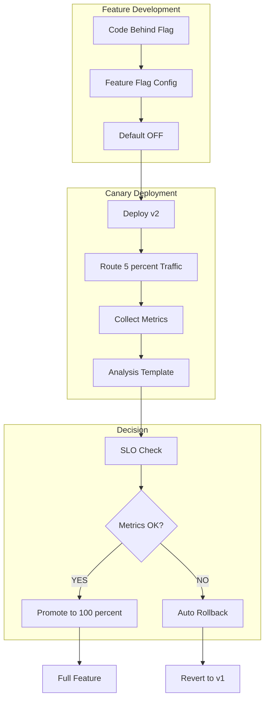
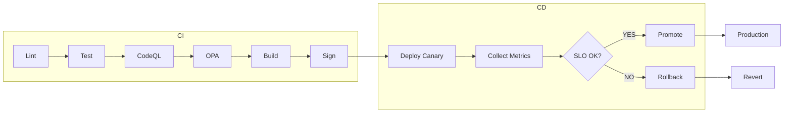
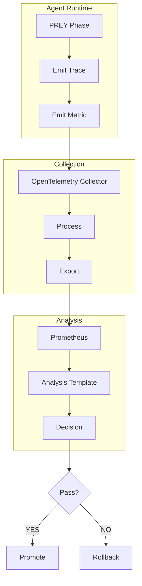
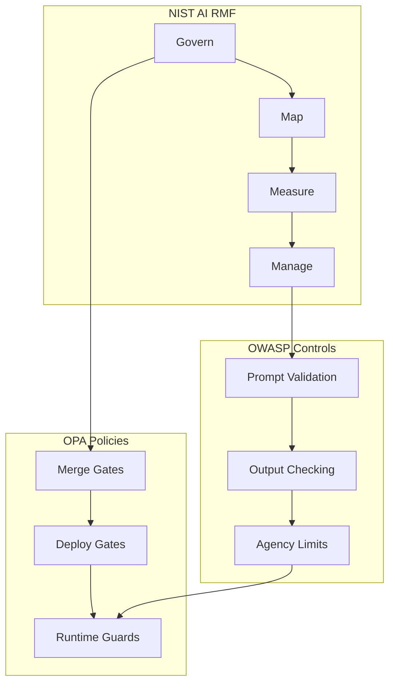
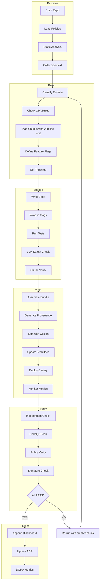

# Security and Delivery Patterns Integration for HFO

## BLUF (Bottom Line Up Front)

This document outlines how to incorporate industry-standard security and progressive delivery patterns into Hive Fleet Obsidian (HFO) to reduce compounded hallucinations and improve system reliability. The core approach: policy-as-code gates, static analysis, feature flags with canaries, signed provenance, docs-as-code, and feedback loops prevent unsafe diffs from reaching humans and enable risky changes to ship behind flags with auto-rollback.

### High-Level Integration Matrix

| Pattern | HFO Integration Point | PREY Phase | Tools | Gate Priority |
|---------|----------------------|------------|-------|---------------|
| Code Review + Small Diffs | PR validation before Engage | React | GitHub Actions, OPA | Hard gate |
| Progressive Delivery | Deployment in Yield | Yield | Argo Rollouts, OpenFeature | Hard gate |
| Feature Flags | Runtime control | Engage/Yield | OpenFeature SDK | Required |
| Policy-as-Code Gates | CI validation | React/Verify | OPA/Conftest | Hard gate |
| Static Analysis | Pre-commit and CI | Perceive/React | CodeQL, Semgrep | Hard gate |
| Supply-Chain Integrity | Artifact verification | Yield/Verify | SLSA, Cosign | Hard gate |
| Observability | Runtime monitoring | All phases | OpenTelemetry | Required |
| Docs-as-Code | Knowledge capture | Digest | Backstage TechDocs | Required |
| LLM-Specific Safety | Runtime and CI guards | All phases | OWASP LLM, NIST AI RMF | Hard gate |

### Why This Stops Compounding Hallucinations

1. **Hard Gates Prevent Low-Signal PRs**: OPA/Conftest + static analysis block unsafe code before human review
2. **Flags + Canaries Constrain Blast Radius**: Risky changes deploy to small traffic slices with automated rollback on bad telemetry
3. **Signed Provenance Blocks Untrusted Artifacts**: Only verified, signed artifacts can ship to production
4. **Docs-as-Code Captures Accepted Truth**: Merged documentation provides agents with stable, verifiable substrate

## Architecture Overview

### HFO-Integrated Security Pipeline

```mermaid
graph LR
  subgraph Perceive
    P1[Scan Repo] --> P2[Collect Context]
    P2 --> P3[CodeQL Scan]
    P3 --> P4[Semgrep Scan]
  end
  
  subgraph React
    R1[Classify Domain] --> R2[Plan Chunks]
    R2 --> R3[OPA Policy Check]
    R3 --> R4[Define Tripwires]
  end
  
  subgraph Engage
    E1[Write Code] --> E2[Feature Flag Wrap]
    E2 --> E3[Local Tests]
    E3 --> E4[Chunk Verify]
  end
  
  subgraph Yield
    Y1[Assemble Bundle] --> Y2[SLSA Attestation]
    Y2 --> Y3[Cosign Sign]
    Y3 --> Y4[Canary Deploy]
    Y4 --> Y5[Metric Monitor]
  end
  
  subgraph Verify
    V1[Independent Check] --> V2[Security Scan]
    V2 --> V3[Policy Verify]
    V3 --> V4[PASS or FAIL]
  end
  
  P4 --> R1
  R4 --> E1
  E4 --> Y1
  Y5 --> V1
  V4 --> D1[Digest]
  V4 --> RG[Re-run]
```



### Progressive Delivery Flow



## Pattern Details and Implementation

### 1. Code Review + Small Diffs

**Industry Exemplar**: Google Engineering Practices
- Source: https://google.github.io/eng-practices/review/

**HFO Integration**:
- Map to React phase: chunk plan must define diff size limits (≤200 lines per PR)
- Require reviewer approval in GitHub branch protection
- Use automated checks to enforce small, incremental changes

**Implementation Steps**:
```yaml
# .github/workflows/diff-size-check.yml
name: Diff Size Check
on: pull_request
jobs:
  check-size:
    runs-on: ubuntu-latest
    steps:
      - uses: actions/checkout@v4
      - name: Check diff size
        run: |
          LINES=$(git diff origin/${{ github.base_ref }}...HEAD | wc -l)
          if [ $LINES -gt 400 ]; then
            echo "PR too large: $LINES lines changed (max 400)"
            exit 1
          fi
```

**PREY Mapping**:
- Perceive: Scan existing code to understand change context
- React: Plan chunks ≤200 lines each
- Engage: Implement one chunk at a time
- Yield: Submit small, reviewable PR with evidence

### 2. Progressive Delivery by Default

**Industry Exemplar**: Google SRE Book, Argo Rollouts
- SRE Book: https://sre.google/sre-book/release-engineering/
- Argo Rollouts: https://argo-rollouts.readthedocs.io/

**HFO Integration**:
- Map to Yield phase: all deployments use canary strategy
- Require metrics collection before promotion
- Auto-rollback on tripwire violations

**Implementation Steps**:
```yaml
# argo-rollouts/canary-rollout.yaml
apiVersion: argoproj.io/v1alpha1
kind: Rollout
metadata:
  name: hfo-agent
spec:
  replicas: 3
  strategy:
    canary:
      steps:
      - setWeight: 20
      - pause: {duration: 5m}
      - analysis:
          templates:
          - templateName: success-rate-check
      - setWeight: 50
      - pause: {duration: 5m}
      - setWeight: 100
  template:
    spec:
      containers:
      - name: agent
        image: hfo-agent:latest
```

**PREY Mapping**:
- Yield: Package artifact with feature flags
- Verify: Deploy to canary environment
- Monitor: Collect OpenTelemetry metrics
- Decision: Auto-promote or auto-rollback based on SLO

### 3. Feature Flags as Standard Interface

**Industry Exemplar**: OpenFeature (CNCF)
- Spec: https://openfeature.dev/specification/

**HFO Integration**:
- Wrap risky code paths in feature flags
- Control rollout percentages via config
- Enable quick disable of problematic features

**Implementation Steps**:
```python
# Example: Wrap HFO agent behavior in feature flag
from openfeature import api
from openfeature.flag_evaluation import FlagEvaluationOptions

client = api.get_client()

def engage_phase():
    # Check if new behavior is enabled
    use_enhanced_logic = client.get_boolean_value(
        flag_key="hfo.enhanced_engage_logic",
        default_value=False,
        evaluation_context={"agent_id": agent_id}
    )
    
    if use_enhanced_logic:
        return enhanced_engage()
    else:
        return standard_engage()
```

**PREY Mapping**:
- React: Identify risky code paths
- Engage: Wrap in feature flags
- Yield: Deploy with flag OFF by default
- Verify: Enable for canary percentage
- Digest: Document flag lifecycle and removal plan

### 4. Policy-as-Code Gates in CI

**Industry Exemplar**: OPA/Conftest (Netflix, others)
- OPA: https://www.openpolicyagent.org/
- Conftest: https://www.conftest.dev/

**HFO Integration**:
- Block PRs without required proofs (tests, flags, ownership)
- Enforce chunk size limits
- Validate evidence_refs in blackboard receipts

**Implementation Steps**:
```rego
# policies/pr_requirements.rego
package pr

deny[msg] {
  not input.has_tests
  msg = "PR must include tests for changed code"
}

deny[msg] {
  not input.has_feature_flag
  input.is_risky_change
  msg = "Risky changes must be behind feature flags"
}

deny[msg] {
  input.chunk_size > 200
  msg = sprintf("Chunk too large: %d lines (max 200)", [input.chunk_size])
}

deny[msg] {
  not input.has_blackboard_receipt
  msg = "PR must include blackboard JSONL receipt"
}
```

```yaml
# .github/workflows/policy-check.yml
name: Policy Check
on: pull_request
jobs:
  conftest:
    runs-on: ubuntu-latest
    steps:
      - uses: actions/checkout@v4
      - name: Install Conftest
        run: |
          wget https://github.com/open-policy-agent/conftest/releases/download/v0.46.0/conftest_0.46.0_Linux_x86_64.tar.gz
          tar xzf conftest_0.46.0_Linux_x86_64.tar.gz
          sudo mv conftest /usr/local/bin/
      - name: Run Policy Tests
        run: conftest test --policy policies/ pr_metadata.json
```

**PREY Mapping**:
- Perceive: Load policy requirements
- React: Design changes to satisfy policies
- Engage: Implement with policy compliance
- Verify: OPA gates must PASS before merge

### 5. Static Analysis at Scale

**Industry Exemplar**: CodeQL (GitHub), Semgrep
- CodeQL: https://codeql.github.com/
- Semgrep: https://semgrep.dev/

**HFO Integration**:
- Run CodeQL on every PR for security vulnerabilities
- Use Semgrep for custom HFO-specific rules (e.g., no placeholders)
- Block merge on critical findings

**Implementation Steps**:
```yaml
# .github/workflows/codeql-analysis.yml
name: CodeQL Analysis
on:
  push:
    branches: [main]
  pull_request:
    branches: [main]
jobs:
  analyze:
    runs-on: ubuntu-latest
    permissions:
      security-events: write
    steps:
      - uses: actions/checkout@v4
      - uses: github/codeql-action/init@v2
        with:
          languages: python, javascript
      - uses: github/codeql-action/analyze@v2
```

```yaml
# .semgrep/rules/hfo-rules.yml
rules:
  - id: no-placeholders
    pattern-either:
      - pattern: "# TODO"
      - pattern: "# FIXME"
      - pattern: "..."
      - pattern: "omitted"
    message: "Placeholders not allowed in committed code"
    severity: ERROR
    languages: [python, javascript, yaml]
```

**PREY Mapping**:
- Perceive: Run static analysis to understand code quality baseline
- React: Plan to avoid patterns that trigger rules
- Engage: Write code that passes analysis
- Verify: Static analysis PASS required for merge

### 6. Supply-Chain Integrity on Every Artifact

**Industry Exemplar**: SLSA Framework, Sigstore Cosign
- SLSA: https://slsa.dev/
- Cosign: https://docs.sigstore.dev/cosign/overview/

**HFO Integration**:
- Generate SLSA provenance for every build artifact
- Sign container images and artifacts with Cosign
- Verify signatures before deployment

**Implementation Steps**:
```yaml
# .github/workflows/build-and-sign.yml
name: Build and Sign
on:
  push:
    tags: ['v*']
jobs:
  build:
    runs-on: ubuntu-latest
    permissions:
      id-token: write
      packages: write
    steps:
      - uses: actions/checkout@v4
      - name: Build artifact
        run: |
          make build
          tar czf hfo-agent.tar.gz dist/
      
      - name: Generate SLSA provenance
        uses: slsa-framework/slsa-github-generator/.github/workflows/generator_generic_slsa3.yml@v1.9.0
        with:
          base64-subjects: "${{ hashFiles('hfo-agent.tar.gz') }}"
      
      - name: Install Cosign
        uses: sigstore/cosign-installer@v3
      
      - name: Sign artifact
        run: |
          cosign sign-blob --yes hfo-agent.tar.gz > hfo-agent.tar.gz.sig
          cosign verify-blob --signature hfo-agent.tar.gz.sig hfo-agent.tar.gz
```

**PREY Mapping**:
- Engage: Build artifacts with reproducible builds
- Yield: Generate attestations and sign
- Verify: Check signatures before deployment
- Digest: Document provenance chain

### 7. Observability and Outcome Metrics

**Industry Exemplar**: OpenTelemetry, DORA Metrics
- OpenTelemetry: https://opentelemetry.io/
- DORA: https://dora.dev/

**HFO Integration**:
- Instrument all agent phases with OpenTelemetry traces
- Collect metrics for canary analysis
- Track DORA Four Keys to measure improvement

**Implementation Steps**:
```python
# hfo_agent/telemetry.py
from opentelemetry import trace, metrics
from opentelemetry.sdk.trace import TracerProvider
from opentelemetry.sdk.metrics import MeterProvider
from opentelemetry.exporter.otlp.proto.grpc.trace_exporter import OTLPSpanExporter
from opentelemetry.exporter.otlp.proto.grpc.metric_exporter import OTLPMetricExporter

# Initialize tracer
trace.set_tracer_provider(TracerProvider())
tracer = trace.get_tracer(__name__)

# Initialize meter
metrics.set_meter_provider(MeterProvider())
meter = metrics.get_meter(__name__)

# Define metrics
hallucination_counter = meter.create_counter(
    "hfo.hallucinations.detected",
    description="Number of hallucinations detected"
)

prey_phase_duration = meter.create_histogram(
    "hfo.prey.phase.duration",
    description="Duration of PREY phases in seconds"
)

def perceive_with_telemetry():
    with tracer.start_as_current_span("perceive") as span:
        start_time = time.time()
        try:
            result = perceive()
            span.set_attribute("perceive.success", True)
            return result
        except Exception as e:
            span.set_attribute("perceive.error", str(e))
            raise
        finally:
            duration = time.time() - start_time
            prey_phase_duration.record(duration, {"phase": "perceive"})
```

**PREY Mapping**:
- All Phases: Emit traces and metrics
- Yield: Aggregate telemetry for canary analysis
- Verify: Check metrics against SLOs
- Digest: Generate dashboards and reports

### 8. Docs-as-Code for Assimilation

**Industry Exemplar**: Spotify Backstage TechDocs, Diátaxis
- Backstage: https://backstage.io/docs/features/techdocs/
- Diátaxis: https://diataxis.fr/

**HFO Integration**:
- Require ADR (Architecture Decision Record) for major changes
- Update TechDocs at merge time
- Organize docs using Diátaxis framework (tutorials, how-to, reference, explanation)

**Implementation Steps**:
```yaml
# mkdocs.yml
site_name: HFO Technical Documentation
theme:
  name: material
plugins:
  - techdocs-core
nav:
  - Home: index.md
  - Tutorials:
      - Getting Started: tutorials/getting-started.md
      - Running PREY Loop: tutorials/prey-loop.md
  - How-To Guides:
      - Deploy with Canary: how-to/canary-deploy.md
      - Add Feature Flag: how-to/feature-flags.md
  - Reference:
      - API: reference/api.md
      - PREY Workflow: reference/prey.md
  - Explanation:
      - Architecture: explanation/architecture.md
      - ADRs: explanation/adrs/
```

```markdown
# ADR Template: docs/explanation/adrs/0000-template.md
# ADR-XXXX: Title

## Status
[Proposed | Accepted | Deprecated | Superseded]

## Context
What is the issue that we're seeing that is motivating this decision or change?

## Decision
What is the change that we're proposing and/or doing?

## Consequences
What becomes easier or more difficult to do because of this change?

## Compliance
- [ ] Feature flag defined
- [ ] Tests added
- [ ] Metrics instrumented
- [ ] Blackboard receipt appended
```

**PREY Mapping**:
- React: Create ADR for significant decisions
- Engage: Update relevant docs
- Yield: Ensure docs render correctly
- Digest: ADR becomes source of truth

### 9. LLM/Agent-Specific Safety

**Industry Exemplar**: OWASP LLM Top 10, NIST AI RMF
- OWASP: https://owasp.org/www-project-top-10-for-large-language-model-applications/
- NIST AI RMF: https://www.nist.gov/itl/ai-risk-management-framework

**HFO Integration**:
- Apply OWASP LLM controls as CI checks and runtime guards
- Map LLM risks to OPA rules
- Use NIST AI RMF for governance framework

**Implementation Steps**:
```python
# hfo_agent/llm_safety.py
class LLMSafetyGuard:
    """Runtime safety checks for LLM operations"""
    
    def check_prompt_injection(self, prompt: str) -> bool:
        """Detect potential prompt injection attempts"""
        dangerous_patterns = [
            r"ignore previous instructions",
            r"disregard all",
            r"you are now",
            r"system:\s*",
        ]
        for pattern in dangerous_patterns:
            if re.search(pattern, prompt, re.IGNORECASE):
                hallucination_counter.add(1, {"type": "prompt_injection"})
                return False
        return True
    
    def validate_output(self, output: str, context: dict) -> bool:
        """Check for insecure output handling"""
        # Check for code execution attempts
        if re.search(r"exec\(|eval\(|__import__", output):
            hallucination_counter.add(1, {"type": "code_execution"})
            return False
        
        # Verify citations exist for factual claims
        if context.get("require_citations"):
            if not re.search(r"\[.*?\]\(.*?\)", output):  # markdown link
                hallucination_counter.add(1, {"type": "missing_citation"})
                return False
        
        return True
    
    def check_excessive_agency(self, action: str, approval_required: bool) -> bool:
        """Prevent unauthorized tool execution"""
        dangerous_actions = ["exec", "shell", "network", "file_write"]
        if any(da in action for da in dangerous_actions):
            if not approval_required:
                hallucination_counter.add(1, {"type": "excessive_agency"})
                return False
        return True
```

```rego
# policies/llm_safety.rego
package llm

deny[msg] {
  input.action == "tool_exec"
  not input.has_approval
  msg = "Tool execution requires explicit approval"
}

deny[msg] {
  input.contains_secrets
  msg = "Prompt contains potential secrets - blocked"
}

deny[msg] {
  not input.has_citations
  input.makes_factual_claims
  msg = "Factual claims must include source citations"
}
```

**PREY Mapping**:
- Perceive: Load safety rules and check contexts
- React: Plan with safety constraints
- Engage: Apply runtime guards to LLM calls
- Verify: Validate outputs before persistence
- Digest: Log safety violations for analysis

## Minimal Reference Architecture

### Repository Policy

```yaml
# Branch protection configuration
branches:
  main:
    protection:
      required_status_checks:
        strict: true
        contexts:
          - OPA Policy Check
          - CodeQL Analysis
          - Semgrep Scan
          - Unit Tests
          - Chunk Size Check
          - SBOM Generation
      required_pull_request_reviews:
        required_approving_review_count: 1
      enforce_admins: true
```

### Delivery Pipeline



### Telemetry Flow



### Governance Model



## Integration with HFO PREY Workflow

### Enhanced PREY Loop with Security Gates



### Mapping Security Patterns to HFO Roles

| HFO Role | Security Pattern | Responsibility |
|----------|------------------|----------------|
| Observer | Static Analysis, Telemetry | Scan code and collect metrics |
| Bridger | Policy-as-Code | Enforce rules between phases |
| Shaper | Feature Flags | Control behavior at runtime |
| Immunizer | LLM Safety Guards | Block attack vectors |
| Disruptor | Red Team Testing | Find vulnerabilities |
| Injector | Progressive Delivery | Deploy with canaries |
| Assimilator | Docs-as-Code | Capture truth at merge |
| Navigator | Governance (NIST AI RMF) | Orchestrate policy |

## Implementation Roadmap

### Phase 1: Foundation (Week 1-2)

- [ ] Set up GitHub branch protection with required checks
- [ ] Implement CodeQL and Semgrep workflows
- [ ] Create basic OPA policies for chunk size and tests
- [ ] Add OpenTelemetry instrumentation to key phases
- [ ] Generate first blackboard receipt with security metadata

### Phase 2: Progressive Delivery (Week 3-4)

- [ ] Set up OpenFeature SDK and flag provider
- [ ] Configure Argo Rollouts for canary deployments
- [ ] Create AnalysisTemplates for metrics checks
- [ ] Implement auto-rollback on SLO breach
- [ ] Document canary process in TechDocs

### Phase 3: Supply Chain (Week 5-6)

- [ ] Configure SLSA provenance generation
- [ ] Set up Cosign signing in CI/CD
- [ ] Implement signature verification in deploy
- [ ] Create SBOM for all artifacts
- [ ] Document supply chain security in ADR

### Phase 4: LLM Safety (Week 7-8)

- [ ] Implement OWASP LLM Top 10 controls
- [ ] Create OPA policies for agent actions
- [ ] Add runtime safety guards to LLM calls
- [ ] Set up hallucination detection metrics
- [ ] Apply NIST AI RMF governance framework

### Phase 5: Documentation (Week 9-10)

- [ ] Set up Backstage TechDocs
- [ ] Organize docs using Diátaxis structure
- [ ] Create ADR templates and process
- [ ] Require ADR for all major changes
- [ ] Build automated doc generation from code

## Starter Pack Components

### 1. GitHub Actions CI Workflow

Location: `.github/workflows/security-gate.yml`

Includes:
- OPA/Conftest policy checks
- CodeQL security scanning
- Semgrep custom rules
- SLSA attestation generation
- Cosign artifact signing
- Diff size validation

### 2. Argo Rollouts Manifests

Location: `k8s/rollouts/`

Includes:
- Canary rollout strategy
- AnalysisTemplate for success rate
- AnalysisTemplate for latency
- Auto-promotion rules
- Auto-rollback configuration

### 3. OpenFeature SDK Stubs

Location: `hfo_agent/feature_flags.py`

Includes:
- Flag client initialization
- Context propagation
- Evaluation examples
- Flag lifecycle documentation

### 4. TechDocs Scaffolding

Location: `docs/`

Includes:
- mkdocs.yml configuration
- Diátaxis structure (tutorials, how-to, reference, explanation)
- ADR template and index
- Automated build pipeline

### 5. OWASP LLM Policy Set

Location: `policies/llm/`

Includes:
- Prompt injection detection
- Output validation rules
- Agency limitation policies
- Secret detection rules
- Citation requirements

## Success Metrics

Track these metrics to measure effectiveness:

### DORA Four Keys

1. **Deployment Frequency**: How often code deploys to production
   - Target: Multiple times per day
   - Measure: Count of successful canary promotions

2. **Lead Time for Changes**: Time from commit to production
   - Target: < 1 day
   - Measure: Time from PR merge to full rollout

3. **Change Failure Rate**: Percentage of deployments causing issues
   - Target: < 15%
   - Measure: Rollback count / total deployments

4. **Time to Restore Service**: Time to recover from failure
   - Target: < 1 hour
   - Measure: Time from incident to auto-rollback completion

### Security Metrics

1. **Policy Violation Rate**: PRs blocked by OPA
   - Track trend: should decrease over time
   - Measure: Blocked PRs / total PRs

2. **Static Analysis Findings**: Critical/High severity issues
   - Target: 0 critical in production
   - Measure: CodeQL and Semgrep alerts

3. **Hallucination Detection**: LLM safety guard triggers
   - Track by type: prompt injection, excessive agency, etc.
   - Measure: Safety guard blocks / total LLM calls

4. **Supply Chain Verification**: Unsigned artifacts blocked
   - Target: 100% signed artifacts in production
   - Measure: Signature verification passes

### Operational Metrics

1. **Canary Success Rate**: Canaries that auto-promote
   - Target: > 95%
   - Measure: Auto-promotions / total canaries

2. **Feature Flag Usage**: Active flags in production
   - Track lifecycle: time from creation to removal
   - Measure: Flag count and age distribution

3. **Documentation Coverage**: ADRs for major changes
   - Target: 100% of significant PRs
   - Measure: PRs with linked ADR / significant PRs

## Conclusion

Incorporating these industry-proven security and delivery patterns into HFO creates a robust defense against compounded hallucinations while maintaining development velocity. The key insight: **prevention through automation** is more effective than detection through review.

By implementing hard gates (OPA, CodeQL, Semgrep), constraining blast radius (feature flags, canaries), ensuring provenance (SLSA, Cosign), and capturing truth (docs-as-code), HFO can operate with confidence that unsafe changes never reach production and risky changes deploy with automatic safeguards.

The integration with HFO's PREY workflow is natural:
- **Perceive**: Load policies and scan for issues
- **React**: Plan with safety constraints
- **Engage**: Write code with guards and flags
- **Yield**: Deploy progressively with telemetry
- **Verify**: Independent validation with hard gates
- **Digest**: Capture learnings in docs and metrics

This approach aligns with HFO's philosophy of evolutionary improvement, defense in depth, and making attacks progressively more expensive while reducing the cognitive load on humans through automation and clear interfaces.

## References

1. Google Engineering Practices: https://google.github.io/eng-practices/
2. Google SRE Book: https://sre.google/sre-book/
3. Argo Rollouts: https://argo-rollouts.readthedocs.io/
4. OpenFeature: https://openfeature.dev/
5. Open Policy Agent: https://www.openpolicyagent.org/
6. Conftest: https://www.conftest.dev/
7. CodeQL: https://codeql.github.com/
8. Semgrep: https://semgrep.dev/
9. SLSA Framework: https://slsa.dev/
10. Sigstore Cosign: https://docs.sigstore.dev/
11. OpenTelemetry: https://opentelemetry.io/
12. DORA Metrics: https://dora.dev/
13. Backstage TechDocs: https://backstage.io/docs/features/techdocs/
14. Diátaxis: https://diataxis.fr/
15. OWASP LLM Top 10: https://owasp.org/www-project-top-10-for-large-language-model-applications/
16. NIST AI RMF: https://www.nist.gov/itl/ai-risk-management-framework

---

**Document Status**: Initial version  
**Last Updated**: 2025-10-30  
**Author**: HFO Agent (following PREY workflow)  
**Review Status**: Pending Verify
