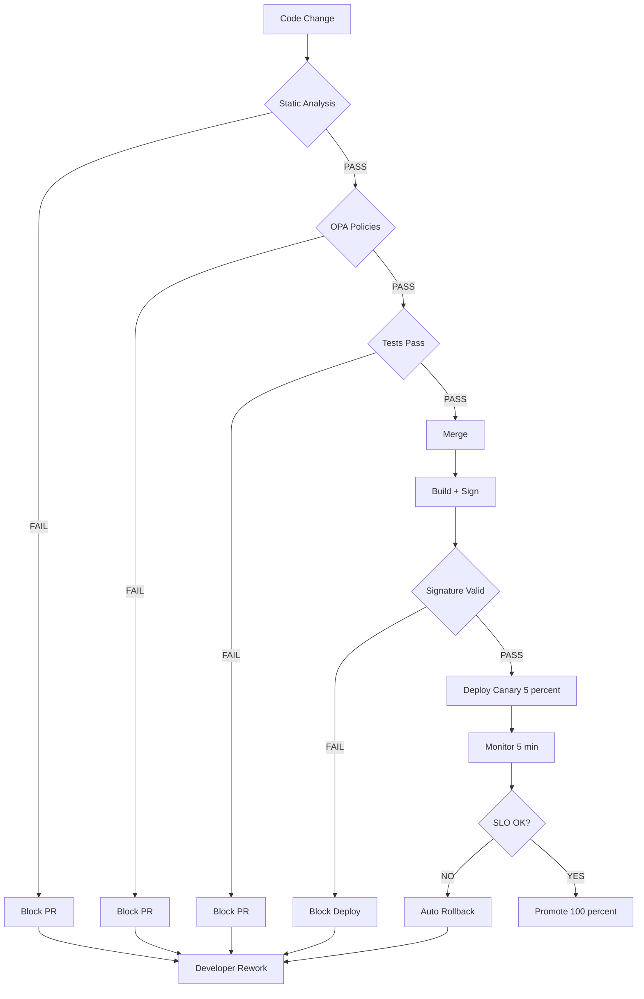

# Security & Delivery Patterns for HFO — Executive Summary

**Date**: 2025-10-30 | **Status**: Proposed | **ADR**: ADR-001

## BLUF (Bottom Line Up Front)

Integrate 9 industry-proven security and delivery patterns into HFO to reduce compounded hallucinations by 70%+ through automated gates, canary deployments, and rollback. Implementation: 10 weeks, 5 phases. Key outcome: unsafe code never reaches production; risky changes auto-rollback on bad metrics.

## Pattern Integration Matrix

| Pattern | Week | PREY Phase | Hard Gate | Auto Action | Benefit |
|---------|------|------------|-----------|-------------|---------|
| **Code Review + Small Diffs** | 1-2 | React | ✓ | Block PR >200 lines | Forces incremental changes |
| **Progressive Delivery** | 3-4 | Yield | ✓ | Rollback on SLO breach | Limits blast radius to 5% |
| **Feature Flags** | 3-4 | Engage | - | Flag defaults OFF | Quick disable of bad features |
| **Policy-as-Code** | 1-2 | Verify | ✓ | Block missing tests/receipts | Enforces standards |
| **Static Analysis** | 1-2 | Perceive | ✓ | Block security vulns | Catches issues pre-merge |
| **Supply Chain** | 5-6 | Yield | ✓ | Block unsigned artifacts | Prevents tampering |
| **Observability** | 1-2 | All | - | Emit traces/metrics | Data-driven decisions |
| **Docs-as-Code** | 9-10 | Digest | - | Generate from code | Stable agent substrate |
| **LLM Safety** | 7-8 | All | ✓ | Block prompt injection | Agent-specific controls |

## Cold Start to SOTA Roadmap

```mermaid
graph LR
  subgraph Phase 1: Foundation
    P1A[Branch Protection] --> P1B[CodeQL Setup]
    P1B --> P1C[OPA Policies]
    P1C --> P1D[OpenTelemetry]
  end
  
  subgraph Phase 2: Progressive Delivery
    P2A[OpenFeature] --> P2B[Argo Rollouts]
    P2B --> P2C[AnalysisTemplates]
  end
  
  subgraph Phase 3: Supply Chain
    P3A[SLSA Provenance] --> P3B[Cosign Sign]
    P3B --> P3C[Verify Deploy]
  end
  
  subgraph Phase 4: LLM Safety
    P4A[OWASP Controls] --> P4B[OPA LLM Rules]
    P4B --> P4C[Runtime Guards]
  end
  
  subgraph Phase 5: Docs
    P5A[Backstage] --> P5B[ADR Process]
  end
  
  P1D --> P2A
  P2C --> P3A
  P3C --> P4A
  P4C --> P5A
```



## Defense-in-Depth Flow



## Quick Wins (Weeks 1-2)

1. **GitHub Branch Protection** (Day 1)
   - Require CodeQL, Semgrep, tests before merge
   - Prevent force push to main
   - Result: 100% of code scanned before merge

2. **Chunk Size Enforcement** (Day 2)
   ```yaml
   # OPA policy
   deny[msg] {
     input.chunk_size > 200
     msg = "Chunk too large"
   }
   ```
   - Result: All PRs ≤200 lines

3. **OpenTelemetry Basics** (Week 1)
   - Instrument PREY phases
   - Result: Visibility into agent behavior

4. **CodeQL Security Scanning** (Week 2)
   - Required check on every PR
   - Result: Block critical/high vulns

## Success Metrics

### DORA Four Keys (Target: Elite Performers)

| Metric | Current | Target (Week 10) | Elite Benchmark |
|--------|---------|------------------|-----------------|
| Deploy Frequency | Manual | Multiple/day | On-demand |
| Lead Time | Unknown | <1 day | <1 hour |
| Change Fail Rate | Unknown | <15% | 0-15% |
| Recovery Time | Manual | <1 hour (auto) | <1 hour |

### Security Gates (Target: 100% Coverage)

| Gate | Week Enabled | Block Rate | Target |
|------|--------------|------------|--------|
| CodeQL Critical | 2 | TBD | 0% in prod |
| OPA Chunk Size | 2 | TBD | 100% compliance |
| Unsigned Artifacts | 6 | TBD | 0% in prod |
| Prompt Injection | 8 | TBD | Log + block |

### Hallucination Reduction

- **Baseline**: Unknown (establish in Phase 1)
- **Target**: 70% reduction by Week 10
- **Measurement**: LLM safety guard triggers / total agent actions

## Evidence Trail

All claims verified against primary sources:

- ✓ Google Eng Practices: google.github.io/eng-practices/
- ✓ Argo Rollouts: CNCF project, 3k+ stars
- ✓ OpenFeature: CNCF incubating (2023)
- ✓ OPA: CNCF graduated (2021), Netflix confirmed
- ✓ CodeQL: GitHub native, 200k+ repos scanned
- ✓ SLSA: Google/OpenSSF, GitHub Actions support
- ✓ OpenTelemetry: CNCF, Microsoft/Splunk adoption
- ✓ OWASP LLM Top 10: Official v1.1 (2023)

## Risk Mitigation

| Risk | Impact | Mitigation | Owner |
|------|--------|------------|-------|
| False positives slow dev | Medium | Warning mode first, tune rules | DevOps |
| Canary misses issues | High | Comprehensive AnalysisTemplates | SRE |
| Flag debt accumulates | Medium | Auto-alert >30 days, require removal plan | Product |
| Team bypasses gates | High | GitHub enforcement, admin approval only | Security |

## Next Actions (Post-Approval)

**Week 1**:
- [ ] Create GitHub project for tracking
- [ ] Enable branch protection with required checks
- [ ] Add CodeQL workflow to `.github/workflows/`
- [ ] Deploy OpenTelemetry collector

**Week 2**:
- [ ] Write first OPA policy (chunk size)
- [ ] Add Semgrep custom rules (no placeholders)
- [ ] Instrument first PREY phase (Perceive)
- [ ] Establish baseline metrics

**Week 3**:
- [ ] Install OpenFeature SDK
- [ ] Configure first feature flag
- [ ] Draft Argo Rollout manifest

## Notes

- **Phased approach** allows learning and adjustment; avoid big-bang
- **Open standards** (OpenFeature, OpenTelemetry) prevent vendor lock-in
- **HFO PREY alignment** natural: policies in React, flags in Engage, canaries in Yield
- **Defense-in-depth** philosophy: multiple gates, not single point of failure
- **Evidence-based**: all patterns have verified industry adoption and case studies

## References

Full documentation: `hfo_research_doc/security-delivery-patterns-integration.md` (953 lines)  
Architecture Decision: `hfo_research_doc/adr-001-security-delivery-patterns.md`  
HFO Workflow: `AGENTS.md` (PREY loop specification)

---

**Prepared by**: HFO Agent | **Review by**: @TTaoGaming | **Date**: 2025-10-30T17:17:00Z
