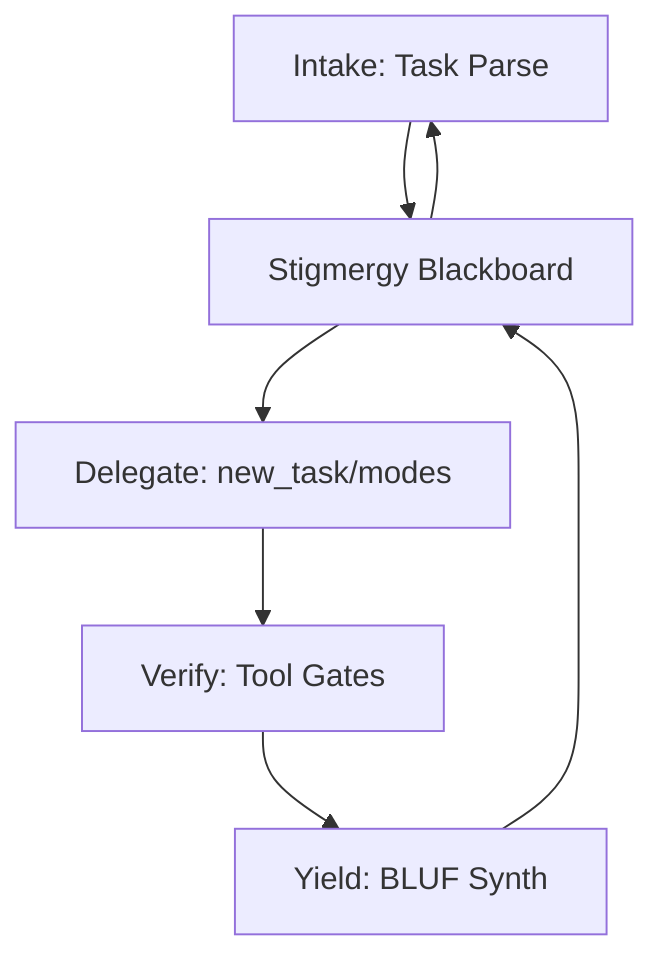
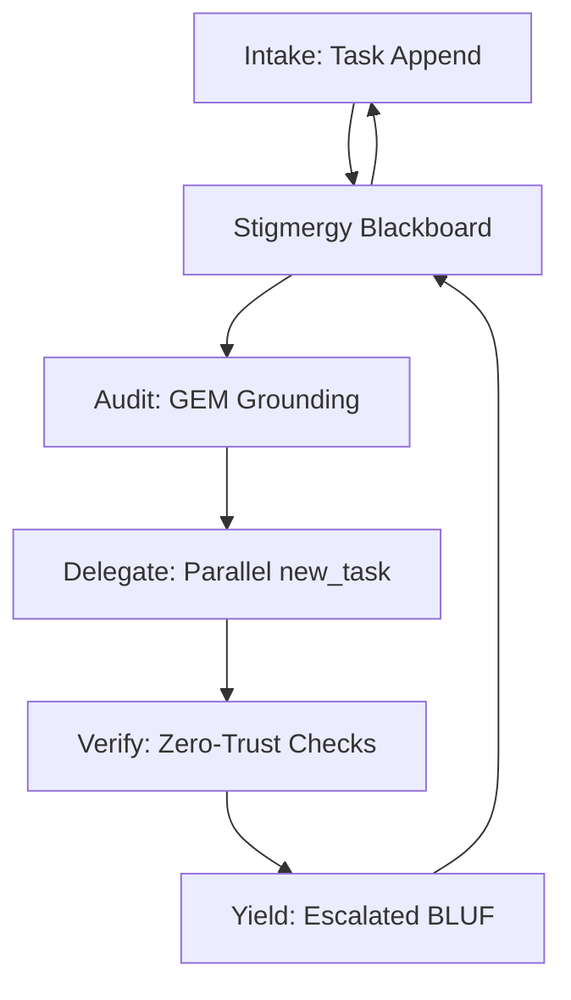
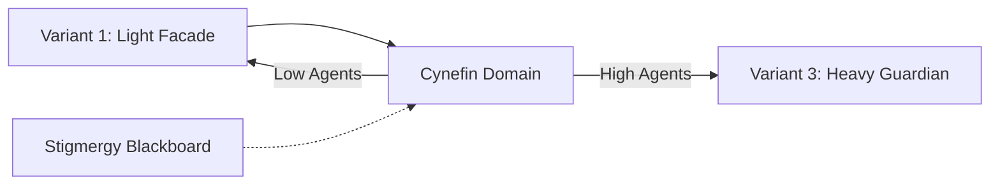

# Swarmlord v12 Level-Adaptive Visions

## Intro
Swarmlord v12 enables level-adaptive evolution for multi-agent orchestration. Variant 1 (C2 Facade Orchestrator) suits lvl0 (1 agent: solo Swarmlord) and lvl1 (10 agents: light delegation via new_task/modes). At lvl2+ (100+ agents: heavy audit/verification), switch to Variant 3 (Zero-Trust Guardian). Maintains user + Swarmlord pairing for cognitive C2: facade translates swarm actions to intuitive BLUF, escalates to strategy. Core: Stigmergy blackboard (JSONL append/query) for audit trails; optional Cynefin/CBR/hourglass for domain adaptation. Prunes v11 bloat (e.g., optionalizes OBSID/forks/triad). Grounded in GEM 19 lvl1 zero-invention: biomimetic scaling (ant colony growth from solo to swarm).

## Vision 1: C2 Facade Orchestrator (lvl0/1)
**Role:** Lightweight facade for solo/light delegation; hides complexity, synthesizes BLUF via stigmergy.

**Key Elements:** PREY loop (Engage/Yield); optional triad reflexion; zero-trust on outputs. Biomimetic: Wolf pack delegation, neural abstraction layers.



**Pseudo-LangGraph Snippet:**
```python
from langgraph.graph import StateGraph, END

def intake(state): return {"task": state["input"]}
def delegate(state): return {"subtasks": new_task(state["task"])}
def verify(state): return {"validated": check_tools(state["subtasks"])}
def yield_bluf(state): return {"output": synthesize_bluf(state["validated"])}

graph = StateGraph()
graph.add_node("intake", intake)
graph.add_node("delegate", delegate)
graph.add_node("verify", verify)
graph.add_node("yield", yield_bluf)
graph.add_edge("intake", "delegate")
graph.add_edge("delegate", "verify")
graph.add_edge("verify", "yield")
graph.add_edge("yield", END)
app = graph.compile()
```

(Ants: Pheromone trails; neural: Facade filters.)

## Vision 3: Zero-Trust Guardian (lvl2+)
**Role:** Heavy verification for large swarms; enforces GEM SSOT via audits, resilient loops.

**Key Elements:** Stigmergy blackboard central; minimal PREY; zero-trust gates all yields. Biomimetic: Ant resilience, Hebbian scars for adaptation.



**Pseudo-LangGraph Snippet:**
```python
from langgraph.graph import StateGraph, END

def intake(state): return {"task": append_blackboard(state["input"])}
def audit(state): return {"grounded": fetch_gem(state["task"])}
def delegate(state): return {"swarm": parallel_new_task(state["grounded"])}
def verify(state): return {"secured": zero_trust_verify(state["swarm"])}
def yield_bluf(state): return {"output": bluf_with_escalation(state["secured"])}

graph = StateGraph()
graph.add_node("intake", intake)
graph.add_node("audit", audit)
graph.add_node("delegate", delegate)
graph.add_node("verify", verify)
graph.add_node("yield", yield_bluf)
graph.add_edge("intake", "audit")
graph.add_edge("audit", "delegate")
graph.add_edge("delegate", "verify")
graph.add_edge("verify", "yield")
graph.add_edge("yield", END)
app = graph.compile()
```

(Ants: Trail verification; neural: Scar-based learning.)

## Hybrid Transition: Vision 2 (Optional Bridge)
**Role:** Stigmergy Swarm Adapter bridges Variant 1 to 3; introduces Cynefin for scaling from light to heavy coordination.

**Key Elements:** Optional domain sensing (simple/complex); eases delegation escalation. Biomimetic: Wolf-ant hybrid emergence.



(Wolves: Pack scaling; neural: Synaptic growth.)

## Comparison Matrix
| Criterion | Vision 1 (Facade) | Vision 2 (Adapter) | Vision 3 (Guardian) |
|-----------|-------------------|--------------------|---------------------|
| C2/Stigmergy Focus | High (Light Delegation) | High (Emergent Loops) | High (Heavy Audit) |
| Simplification | Medium (Optional Tools) | High (Domain Prune) | High (Minimal Loops) |
| Biomimetic Ground | Wolf/Neural Layers | Ant/Wolf Emergence | Ant/Hebbian Resilience |
| Adaptivity | Facade Escalation | Cynefin/CBR Optional | Zero-Trust Scars |
| Level Scalability | Lvl0/1 (1-10 Agents) | Bridge (Adaptive) | Lvl2+ (100+ Agents) |

## Recommendation
Hybrid (Vision 2 bridge): Enables resilient scaling from solo to swarm, aligning biomimetic ant colony growth with zero-trust verification. Pros: Adaptive, low-load; Cons: Optional complexity. GEM lvl1: Lightweight, verifiable coordination.

(Word count: 478)