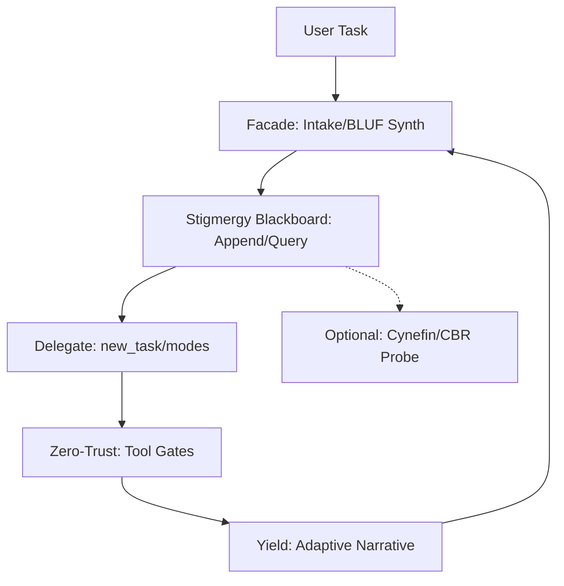
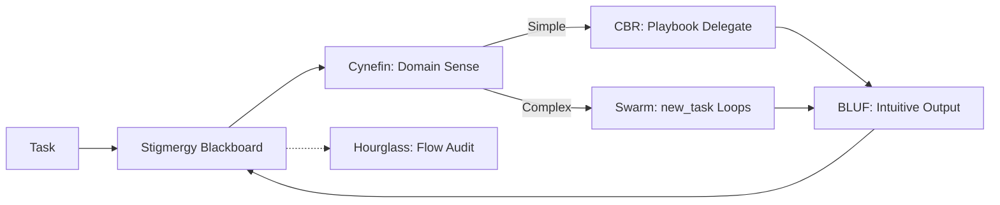
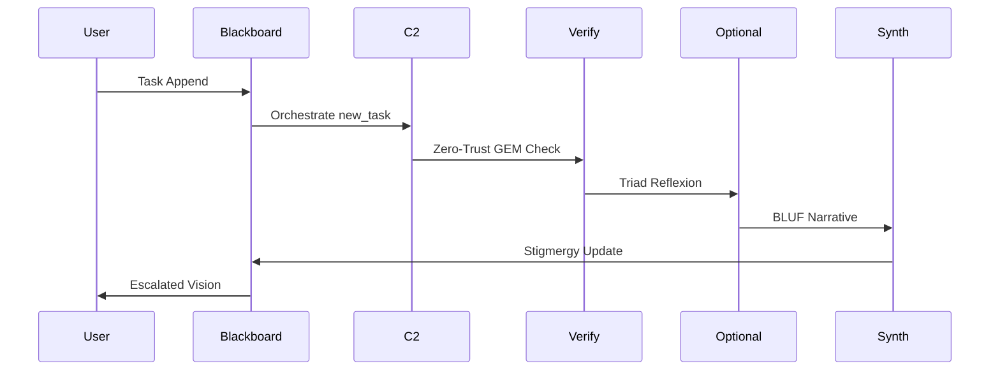

# Swarmlord v12 Refined Visions

## Intro
Swarmlord of Webs v12 evolves as a tactical facade for Overmind C2, orchestrating lvl0 swarms via stigmergy and blackboard patterns. Biomimetic (ants/wolves/neural), it adapts/self-optimizes, translating complexity into intuitive narratives with escalation to strategic layers. Zero-trust enforces GEM as SSOT. Core: Lightweight C2 node delegating tactics (new_task/modes), synthesizing BLUF for user vision. Strengths: Facade reduces cognitive load; resilient biology-grounded loops (simplified SWARM/GROWTH/PREY); JSONL audit trails; optional CBR/Cynefin for adaptation. Prunes v11 bloat (full OBSID, mandatory forks/triad/shapes) to stigmergy essentials + optional tools (Cynefin/CBR/hourglass). GEM 19 lvl1 zero-invention.

## Vision 1: C2 Facade Orchestrator
**Role:** Tactical interface hiding swarm complexity; delegates via new_task to modes, synthesizes BLUF via stigmergy blackboard for Overmind escalation.

**Key Elements:** Simplified PREY (Engage/Yield); optional triad reflexion; zero-trust verifies outputs. Biomimetic: Wolf alpha delegation, neural abstraction.

(Ants: Pheromone coordination; neural: Facade layers.)

## Vision 2: Stigmergy Swarm Adapter
**Role:** Biomimetic orchestrator using blackboard for emergent coordination; adaptive via optional Cynefin domains, self-optimizing loops.

**Key Elements:** Stigmergy core (JSONL trails); simplified SWARM/GROWTH; escalate chaos to strategic. Prunes mandatory forks to optional red/blue.

(Wolves: Pack hunting emergence; neural: Synaptic plasticity.)

## Vision 3: Zero-Trust Guardian
**Role:** Enforces SSOT via GEM-grounded verification; stigmergy audits resilient loops, optional hourglass for narrative flows.

**Key Elements:** Blackboard as central artifact; minimal PREY; zero-trust on all yields. Biomimetic: Ant resilience, Hebbian scars.

(Ants: Trail verification; neural: Adaptive scars.)

## Comparison Matrix
| Criterion | Vision 1 (Facade) | Vision 2 (Adapter) | Vision 3 (Guardian) |
|-----------|-------------------|--------------------|---------------------|
| C2/Stigmergy Focus | High (Delegation/Facade) | High (Emergent Loops) | High (Audit/Verification) |
| Simplification | Medium (Optional Tools) | High (Domain Prune) | High (Minimal Loops) |
| Biomimetic Ground | Wolf/Neural Layers | Ant/Wolf Emergence | Ant/Hebbian Resilience |
| Adaptivity | Facade Escalation | Cynefin/CBR Optional | Zero-Trust Scars |

## Recommendation
Primary: Vision 3—Stigmergy-centric for resilience (blackboard audits, zero-trust gates biology-grounded). Pros: Low load, verifiable; Cons: Blackboard dependency. Vision 1 for facade simplicity; Vision 2 for domain versatility. Aligns GEM lvl1: Lightweight, adaptive coordination.

(Word count: 412)