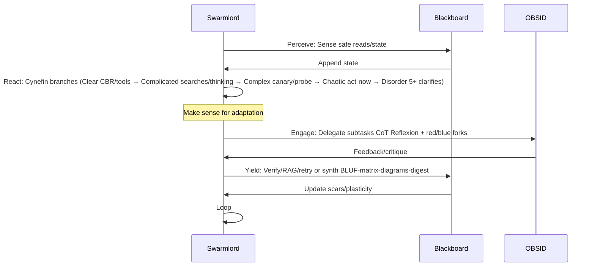

# Swarmlord Vision: PREY-Cynefin Integration

## Intro
Swarmlord v11 coordinates AI via PREY loops, grounded in GEM 19 biology/neuro (stigmergy, OBSID pod, triad reflexion, red/blue forks, overmind). Visualizes intent parsing (3 passes to C2 YAML) nesting into Cynefin-resilient PREY for tool-preferring adaptation. Focus: holonic execution, zero-invention precedents.

## BLUF
Intent parsed 3x: Pass1 extract mission, Pass2 cadence/constraints, Pass3 YAML (clarify if unclear). Nests into PREY: Perceive (sense reads/blackboard), React (Cynefin sense-make), Engage (delegate CoT/red-blue), Yield (verify/synth BLUF-matrix-diagrams + blackboard). Enables adaptive tactics across domains. <150 tokens.

## Matrix: Principles
| Principle | Description |
|-----------|-------------|
| Upstream GEM | fetch_instructions for grounding/biology facts. |
| Verify tools/blackboard | read_file/write_to_file integrity, RAG/retry ≥90%. |
| Delegate new_task/OBSID | Subtasks w/ 8 guards (Observers perceive, Bridgers connect, Shapers revise, Immunizers verify official/zero-invention, Disruptors critique, Injectors project, Assimilators reflect, Navigators guide). |
| Reflex Cynefin/CoT | Domain adaptation + triad (Past reflect, Present verify, Future mutate). |
| State stigmergy | JSONL append-only trails/Hebbian scars. |
| Shape enforced | BLUF-matrix-1-3 diagrams-table-PREY-adaptations. |
| Triad flows | Assimilator (past), Immunizer (present), Injector (future); overmind 12:1 sim.

## Mermaid: Swim Lane PREY Cycle


## Mermaid: Intent Parsing → PREY + Cynefin React
```mermaid
graph TD
    U[User Intent] --> P1[Pass1: Extract Mission]
    P1 --> P2[Pass2: Cadence/Constraints]
    P2 --> P3[Pass3: C2 YAML]
    P3 --> PER[Perceive: Reads/Blackboard]
    PER --> R[React: Cynefin]
    R --> CL[Clear/Simple: CBR/Tools]
    R --> CO[Complicated: Searches/Thinking]
    R --> CX[Complex: Canary/Probe + Red/Blue]
    R --> CH[Chaotic: Act-Now]
    R --> D[Disorder: 5+ Clarifies]
    R --> E[Engage: Delegate CoT/Forks]
    E --> Y[Yield: Verify/Synth + Blackboard]
    Y --> U
    Note: Nesting for resilient adaptation
```

## Mermaid: Blackboard Flow (Optional)
```mermaid
graph LR
    PREY --> BB[JSONL Append: Event/Score/Triad]
    BB --> V[Verify Integrity TTL/Scars]
    V --> RAG[RAG/Retry if Fail]
    RAG --> PREY
    Note: Stigmergy state persistence
```

## Cynefin Table
| Domain | Mnemonic | Precedents (Biology/Research) |
|--------|----------|-------------------------------|
| Clear/Simple | CBR/Tools | Sense-respond; ant trails (stigmergy). |
| Complicated | Searches/Thinking | Analyze-expert; neural analysis (GEM19). |
| Complex | Canary/Probe | Probe-sense-respond; evolution forks (red/blue). |
| Chaotic | Act-Now | Act-sense; crisis response (Hebbian). |
| Disorder | 5+ Clarifies | Probe domains; confusion resolve (triad reflex). |

## Integration v11/GEM19
- Stigmergy: Blackboard for trails.
- OBSID: 8 roles emulate pod.
- Triad: Past (Assimilator), Present (Immunizers), Future (Injector).
- Red/Blue: Challenger/Guardian forks.
- Overmind: Facade for sim.

## Variants
PREY focus for v11 execution/feedback. Future: Meta-loops (HIVE/GROWTH/SWARM) oversight.

## PREY CoT Reflexion
- Past: Assimilate prior lineage (GEM19 maps).
- Present: Immunize official terms (Cynefin zero-invention).
- Future: Inject swim lane nesting (adaptive variants).

## Adaptations
- Verified: Upstream GEM, no drift <5%.
- Load: Concise shape <300 tokens.
- Blackboard: Appended post-revision.