Running audits...
Generating report...
/home/runner/work/Hive-Fleet-Obsidian-2025/Hive-Fleet-Obsidian-2025/scripts/generate_audit_summary.py:346: DeprecationWarning: datetime.datetime.utcnow() is deprecated and scheduled for removal in a future version. Use timezone-aware objects to represent datetimes in UTC: datetime.datetime.now(datetime.UTC).
  output_path = REPO_ROOT / "temp" / f"gen21_audit_report_{datetime.utcnow().strftime('%Y%m%d_%H%M%S')}.md"
/home/runner/work/Hive-Fleet-Obsidian-2025/Hive-Fleet-Obsidian-2025/scripts/generate_audit_summary.py:88: DeprecationWarning: datetime.datetime.utcnow() is deprecated and scheduled for removal in a future version. Use timezone-aware objects to represent datetimes in UTC: datetime.datetime.now(datetime.UTC).
  **Audit Timestamp**: {datetime.utcnow().isoformat()}Z
Report saved to: /home/runner/work/Hive-Fleet-Obsidian-2025/Hive-Fleet-Obsidian-2025/temp/gen21_audit_report_20251029_231103.md

================================================================================
# Generation 21 Architecture Audit - BLUF

**Status**: 🟢 Overall Health: 90.7%

**Mission**: Independent audit of Gen21's ability to regenerate itself and validate architectural coherence with 8/2 explore/exploit ratio.

**Key Findings**:
- ✅ Gen21 SSOT meets ≥1000 line requirement (1008 lines)
- ✅ Self-regeneration capability: 100% complete specification
- ✅ Explore/Exploit support: 93% with 8/2 ratio validation
- ⚠️  Drift score: 9.1% (claims vs implementation)

**Recommendation**: Gen21 architecture is OPERATIONAL. Continue with confidence.

**Audit Timestamp**: 2025-10-29T23:11:03.111308Z
**Seed**: explore/exploit 8/2 ratio

## Audit Matrix

| Dimension | Score | Status | Evidence |
|-----------|-------|--------|----------|
| Architecture Integrity | 82% | 🟢 PASS | 9/11 checks |
| Self-Regeneration | 100% | 🟢 PASS | 9/9 tests |
| Explore/Exploit (8/2) | 93% | 🟢 PASS | 8/9 tests |
| Architectural Drift | 9% | 🟢 LOW | Claims vs Implementation |

## Architecture Health Diagrams

### Overall Health Breakdown

### Regeneration Capability

```mermaid
%%{init: {'theme':'dark'}}%%
graph LR
    A[Gen21 SSOT] -->|Bootstrap| B[Cold Start]
    B -->|PREY Loop| C[Self-Regenerate]
    C -->|Verify| D{Complete?}
    D -->|Yes| E[✅ 100% ]
    D -->|No| F[⚠️ Gaps]
    
    style E fill:#2d5016
    style F fill:#5d3a1a
```

### Explore/Exploit Balance (8/2 Ratio)

### PREY Loop Coverage

## Detailed Findings

### 1. Architecture Integrity

✅ All critical architecture checks passed.

**Warnings**:
- ⚠️  safety_envelope/chunk_size_limit: 
- ⚠️  drift_analysis/claim_vs_implementation: Drift score: 25.00%

### 2. Self-Regeneration Analysis

✅ All regeneration tests passed (9 tests).

### 3. Explore/Exploit Validation

**Issues**:
- ⚠️ exploration_metrics: Found 3/5 metric patterns

**8/2 Ratio Simulation**: Explore: 21.20% (target 20%), Exploit: 78.80% (target 80%)

## Recommendations

### 🟡 Medium Priority
1. **Review Warnings**: 2 warnings detected. May indicate future issues.

### ✅ Strengths
1. **Self-Regeneration**: Excellent specification completeness
2. **Explore/Exploit**: Strong support for 8/2 ratio and Quality Diversity

### Next Steps
1. Run this audit regularly to monitor drift
2. Update Gen21 SSOT based on findings
3. Validate fixes with independent verification
4. Document any architectural decisions that cause intentional drift

---

## Audit Methodology

This audit used independent Python tools to validate Gen21 against its own specifications:
- `audit_gen21.py`: Architecture integrity checks
- `test_gen21_regeneration.py`: Self-regeneration capability tests
- `test_explore_exploit.py`: Explore/Exploit 8/2 ratio validation

All tests run against the actual Gen21 SSOT document and blackboard, not self-reported metrics.

**Evidence**:
- Gen21 SSOT: `hfo_gem/gen_21/gpt5-attempt-3-gem.md`
- Blackboard: `hfo_blackboard/obsidian_synapse_blackboard.jsonl`
- AGENTS.md: `AGENTS.md`

